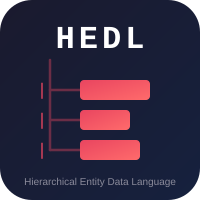
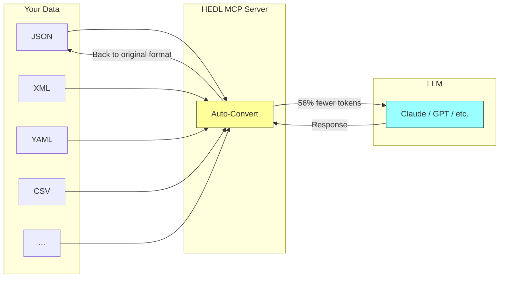

<p align="center">
  
</p>

<h1 align="center">HEDL</h1>

<p align="center">
  <strong>The Token-Efficient Data Format for LLM Applications</strong>
</p>

<p align="center">
  <em>Half the tokens. Same comprehension. Drop-in JSON replacement.</em>
</p>

<p align="center">
  <a href="https://crates.io/crates/hedl"></a>
  <a href="https://crates.io/crates/hedl"></a>
  <a href="https://docs.rs/hedl"></a>
  <a href="https://github.com/dweve-ai/hedl/actions"></a>
  <a href="LICENSE"></a>
</p>

<p align="center">
  <a href="#quickstart">Quickstart</a> •
  <a href="#why-hedl">Why HEDL</a> •
  <a href="#benchmarks">Benchmarks</a> •
  <a href="#documentation">Docs</a> •
  <a href="#ecosystem">Ecosystem</a>
</p>

---

## The Problem

You're building AI applications and sending structured data to LLMs. Like everyone else, you're probably using JSON.

But have you actually looked at what you're paying for?

```json
{"id": "u1", "name": "Alice", "email": "alice@company.com", "role": "admin"}
{"id": "u2", "name": "Bob", "email": "bob@company.com", "role": "user"}
{"id": "u3", "name": "Carol", "email": "carol@company.com", "role": "user"}
{"id": "u4", "name": "Dave", "email": "dave@company.com", "role": "user"}
{"id": "u5", "name": "Eve", "email": "eve@company.com", "role": "user"}
```

See those `"id":`, `"name":`, `"email":`, `"role":` strings? They show up five times. That's not your data. That's overhead. Pure waste.

At Claude's pricing ($3/million tokens), a 10,000-user dataset costs **$15 just in repeated key names**. Every single API call. The more records you have, the more you pay to say the same words over and over.

---

## The Solution

What if you could declare your structure once and then just send the data?

```yaml
%V:2.0
%NULL:~
%QUOTE:"
%S:User:[id, name, email, role]
---
users: @User
 |u1,Alice,alice@company.com,admin
 |u2,Bob,bob@company.com,user
 |u3,Carol,carol@company.com,user
 |u4,Dave,dave@company.com,user
 |u5,Eve,eve@company.com,user
```

**Same data. 56% fewer tokens.**

The schema declaration (`%S:`) lets you define your structure once, then send only the values. No repeated keys, no brackets, no quotes around simple strings.

This is HEDL: **H**ierarchical **E**ntity **D**ata **L**anguage. A data format designed from the ground up for the economics of LLM applications.



The MCP server handles everything automatically. Your AI agent sends JSON like it always did, the server converts to HEDL (saving you 56% on tokens), the LLM processes it, and responses come back in your original format. Zero code changes on your end.

---

## Quickstart

### Option 1: MCP Server (Recommended)

The fastest way to start saving tokens is the MCP server. Add HEDL to your AI agent with zero code changes.

```json
{
  "mcpServers": {
    "hedl": {
      "command": "hedl-mcp",
      "args": ["--auto-convert"]
    }
  }
}
```

That's literally it. Your agent now uses 56% fewer tokens automatically.

<p align="center">
  <a href="https://dweve-ai.github.io/hedl-playground/"><strong>Try the Live Demo</strong></a>  - Convert JSON to HEDL in your browser
</p>

### Option 2: CLI

If you want to experiment with HEDL from the command line, install the CLI:

```bash
cargo install hedl-cli

# Convert your existing JSON to HEDL
echo '{"users": [{"name": "Alice"}, {"name": "Bob"}]}' | hedl from-json

# Convert back to JSON when you need it
echo '%V:2.0
%NULL:~
%QUOTE:"
---
greeting: Hello, World!' | hedl to-json
```

### Option 3: Rust Library

For full control, use the library directly:

```bash
cargo add hedl
```

```rust
use hedl::{parse, to_json, from_json};

fn main() -> Result<(), Box<dyn std::error::Error>> {
    let doc = parse(r#"
%V:2.0
%NULL:~
%QUOTE:"
%S:User:[id,name,role]
---
users: @User
 |alice,Alice Smith,admin
 |bob,Bob Jones,user
"#)?;

    // Convert to JSON for APIs that need it
    let json = to_json(&doc)?;

    // Convert JSON to HEDL for your LLM prompts
    let hedl = from_json(&json_str)?;

    Ok(())
}
```

---

## Why HEDL

### "But will LLMs actually understand it?"

This was the first question we asked ourselves. We didn't assume the answer. We tested it.

We ran 571 structured data extraction questions across 7 real-world datasets, testing **Mistral Large**, **DeepSeek Chat**, and **NVIDIA GLM-4.7**. Real questions. Real data. Rigorous methodology.

| Format | Accuracy | Tokens/Question | Accuracy per 1K Tokens |
|--------|:--------:|:---------------:|:----------------------:|
| **HEDL** | **80.4%** | **6,912** | **0.12** |
| JSON | 70.1% | 15,697 | 0.05 |
| YAML | 69.8% | 13,535 | 0.05 |
| TOON | 68.2% | 7,320 | 0.09 |
| XML | 68.6% | 18,164 | 0.04 |
| CSV | 67.3% | 8,049 | 0.08 |

**HEDL delivers 2.4x more correct answers per token than JSON.**

HEDL wins on both accuracy (+10.3 percentage points over JSON) and efficiency (56% fewer tokens). At scale, this compounds dramatically: for the same budget, HEDL lets you send 2x the context while getting more correct answers.

CSV is efficient but falls apart on complex queries. YAML is nearly as verbose as JSON. XML is worst on both metrics. TOON is another token-efficient format, but HEDL beats it by +12.2 accuracy points with similar token usage.

HEDL is the only format that's both compact AND comprehensible to LLMs.

### The Token Economics

Here's what real benchmarks look like. Real data. Real savings.

| Dataset Type | JSON Tokens | HEDL Tokens | Savings |
|--------------|:-----------:|:-----------:|:-------:|
| Flat user records | 15,697 | 6,912 | **56.0%** |
| Product catalog | 15,623 | 6,842 | **56.2%** |
| Nested blog posts | 15,771 | 6,981 | **55.7%** |
| Order history | 15,698 | 6,912 | **56.0%** |
| Config files | 476 | 210 | **55.9%** |

**Average savings: 56%**

At scale, this adds up fast. A service processing 1 billion tokens monthly saves **$1,680/month** by switching from JSON to HEDL. Same data. Same comprehension. Half the cost.

### Beyond Token Savings

HEDL isn't just about compression. It's about building better AI applications.

**Schema Validation** catches malformed data before it hits your LLM:

```yaml
%S:Product:[sku, name, price]
---
products: @Product
 |ABC-123,Widget,29.99
 |DEF-456,Gadget,not_a_price   # Error caught at parse time
```

**Type-Safe References** let you link entities without duplicating data:

```yaml
users: @User
 |alice,Alice Smith,alice@company.com

orders: @Order
 |ord-001,@User:alice,2024-01-15,299.99
  #          ^^^^^^^^^^^^ validated at parse time
```

**List Literals** use `(...)` syntax for ordered sequences:

```hedl
%S:Article:[id,title,tags,score]
---
articles: @Article
 |art-1,Introduction to HEDL,(tutorial,beginner,data),4.5
 |art-2,Advanced Patterns,(advanced,optimization),4.8
 |art-3,No Tags,(),3.2
```

Lists use `(...)` for any scalar values (strings, references, etc.), distinct from tensors `[...]` which are for numeric data only.

**LSP Integration** gives you real-time validation and autocomplete in your editor: syntax highlighting, auto-completion (`@Us` → `@User:alice`), hover documentation, go-to-definition, and error squiggles before you even save the file.

### Headers and Metadata

Every HEDL document starts with headers:

```hedl
%V:2.0         # Version
%NULL:~        # Null character
%QUOTE:"       # Quote character
```

**Count Metadata** helps LLMs understand your data without scanning all rows:

```hedl
%V:2.0
%NULL:~
%QUOTE:"
%S:Order:[id,customer,status,total]
%C:Order.total=1247
%C:Order.status:delivered=892,shipped=234,pending=121
---
orders: @Order
 |o1,cust-001,delivered,99.99
  # ... 1246 more orders
```

**1-Space Indentation** keeps things clean:

```hedl
%V:2.0
%NULL:~
%QUOTE:"
---
root:
 child:         # Exactly 1 space
  grandchild:   # Exactly 1 space per level
```

---

## Benchmarks

### Performance (2026-02-02, release build)

| Operation | Latency (p50) | Size |
|-----------|:-------------:|:----:|
| Parsing | 37.1 µs | Tiny |
| Parsing | 396 µs | Small |
| Parsing | 12.1 ms | Medium |
| JSON Conversion | 10.0 µs | Tiny |
| JSON Conversion | 115 µs | Small |
| JSON Conversion | 1.10 ms | Medium |
| Validation | 23.7 µs | Small |
| Canonicalization | 83.5 µs | Tiny |
| Full Pipeline | 1.04 ms | Small |

### Scaling Characteristics

HEDL scales linearly: O(n) parsing, O(depth) for nesting. Median latencies stay under 15ms for all document sizes, and tails are predictable (p99 latencies available in benchmark baselines). For really large files, `hedl-stream` provides streaming support with bounded memory usage.

### Test Coverage

We take testing seriously: **10,000+ tests** across 19 crates. Unit tests, integration tests, property-based testing with proptest, and fuzz testing. Zero unsafe code in the core parser.

---

## Ecosystem

HEDL plays well with others. Use it alongside your existing tools.

### Format Conversion

| Format | Import | Export | Streaming | Use Case |
|--------|:------:|:------:|:---------:|----------|
| **JSON** | ✅ | ✅ | ✅ | REST APIs, web services |
| **YAML** | ✅ | ✅ |  - | Kubernetes, CI/CD configs |
| **XML** | ✅ | ✅ | ✅ | Enterprise systems, SOAP |
| **CSV** | ✅ | ✅ |  - | Spreadsheets, data analysis |
| **Parquet** | ✅ | ✅ |  - | Data lakes, analytics |
| **Neo4j Cypher** | ✅ | ✅ | ✅ | Graph databases |
| **TOON** | ✅ | ✅ |  - | Alternative token-efficient format |

### Tools & Integrations

| Tool | Package | Description |
|------|---------|-------------|
| **CLI** | `hedl-cli` | Convert, validate, lint, format from the terminal |
| **LSP** | `hedl-lsp` | Editor integration for VS Code, Neovim, Emacs, Helix |
| **MCP Server** | `hedl-mcp` | AI agent tools for Claude and other MCP-compatible systems |
| **WASM** | `hedl-wasm` | Use HEDL in browsers and Node.js |
| **FFI** | `hedl-ffi` | C/C++/Python bindings (5.1% overhead) |

### Language Support

**Rust** (native):
```rust
use hedl::{parse, to_json};
let doc = parse(hedl_text)?;
let json = to_json(&doc)?;
```

**Python/C/C++** (via FFI):
```c
#include "hedl.h"
HedlDocument* doc = NULL;
hedl_parse(hedl_text, -1, 1, &doc);
char* json = NULL;
hedl_to_json(doc, 0, &json);
```

**JavaScript/TypeScript** (via WASM):
```typescript
import init, { parse, toJson } from 'hedl-wasm';
await init();
const doc = parse(hedlText);
const json = toJson(doc);
```

---

## Documentation

| Resource | Description |
|----------|-------------|
| [**Language Specification**](SPEC.md) | Complete HEDL syntax reference |
| [**API Documentation**](https://docs.rs/hedl) | Rust API with examples |
| [**CLI Reference**](crates/hedl-cli/README.md) | All command-line options |
| [**FFI Guide**](crates/hedl-ffi/README.md) | C/C++/Python integration |
| [**WASM Guide**](crates/hedl-wasm/README.md) | Browser and Node.js usage |
| [**LSP Setup**](crates/hedl-lsp/README.md) | Editor configuration |
| [**MCP Server**](crates/hedl-mcp/README.md) | AI agent integration |


---

## Use Cases

### High-Volume AI Services

You're running a RAG pipeline where every query includes user context, document metadata, and relationship graphs. With JSON, you're burning tokens on repeated key names. Switch to HEDL and cut costs by 56% while maintaining comprehension. At 1M queries/month, that's **$1,680 saved**.

### Real-Time Data Pipelines

Your ETL processes streaming data from multiple sources. HEDL's streaming parser is 1.3-4.4x faster than full-document parsing. Convert to Neo4j Cypher at 1.7ms for 1,000 nodes. Export to Parquet for your data lake. The format adapts to your infrastructure.

### Configuration Management

Your service config spans environments with nested structures. HEDL's schema validation catches typos before deployment. Deterministic canonicalization makes diffs readable. The LSP gives you autocomplete while you edit.

### Knowledge Graphs

You're building a graph database from heterogeneous sources. HEDL's `@Type:id` references make entity resolution explicit. Reference resolution processes 70-1,900 refs/ms depending on graph density. Export directly to Neo4j Cypher.

---

## When Not to Use HEDL

**Ecosystem compatibility is critical.** JSON has decades of tooling. Every language has battle-tested JSON parsers. HEDL is newer. If you need maximum compatibility today, JSON is the safer choice.

**Your data is tiny.** If you're sending 100 tokens per request, the savings don't matter. HEDL shines at scale.

**Your team doesn't want to learn a new format.** HEDL is simple (5 minutes to learn the basics), but it's still new. If your team prefers sticking with JSON, that's a perfectly valid choice.

---

## Architecture

HEDL is 19 specialized crates, not a monolith. Use only what you need.

```
hedl                  # High-level API (start here)
├── hedl-core         # Parser, zero dependencies
├── hedl-stream       # Streaming parser for large files
├── hedl-json         # JSON conversion
├── hedl-yaml         # YAML conversion
├── hedl-xml          # XML conversion
├── hedl-csv          # CSV conversion
├── hedl-parquet      # Parquet conversion
├── hedl-neo4j        # Neo4j Cypher generation
├── hedl-toon         # TOON format conversion
├── hedl-c14n         # Deterministic formatting
├── hedl-lint         # Best-practice enforcement
├── hedl-cli          # Command-line interface
├── hedl-lsp          # Language server protocol
├── hedl-mcp          # Model Context Protocol server
├── hedl-ffi          # C ABI bindings
├── hedl-wasm         # WebAssembly
├── hedl-test         # Test utilities
└── hedl-bench        # Benchmarks
```

**Feature flags** let you include only what you need:

```toml
[dependencies]
# Minimal: just parsing
hedl = "2.0"

# With specific formats
hedl = { version = "2.0", features = ["json", "yaml"] }

# Everything
hedl = { version = "2.0", features = ["all-formats"] }
```

---

## Contributing

HEDL is open source under Apache 2.0. We welcome contributions.

<p align="center">
  <strong>If HEDL saves you tokens, give us a star to help others find it!</strong>
</p>

```bash
git clone https://github.com/dweve-ai/hedl.git
cd hedl
cargo build --all-features
cargo test --all-features
```

We'd especially love help with format converters (more languages, more formats), performance optimization (SIMD, zero-copy), language bindings (Dart, Ruby, Zig, Swift), LSP features (refactoring, code actions), and documentation.

Look for issues labeled [`good first issue`](https://github.com/dweve-ai/hedl/labels/good%20first%20issue) or [`help wanted`](https://github.com/dweve-ai/hedl/labels/help%20wanted).

**Join the community:**
- [GitHub Discussions](https://github.com/dweve-ai/hedl/discussions) for questions and ideas
- [Discord](https://discord.gg/dweve) for real-time chat

---

## FAQ

<details>
<summary><strong>Is HEDL well-tested?</strong></summary>

Yes. 10,000+ tests covering unit, integration, property-based, and fuzz testing. Zero unsafe code in the parser.
</details>

<details>
<summary><strong>What's the learning curve?</strong></summary>

About 5 minutes if you know JSON. The core syntax boils down to three things: `%S:Name:[col1,col2]` declares structure, `| val1, val2` writes a row, and `@Type:id` references another entity. That's 90% of what you'll ever need.
</details>

<details>
<summary><strong>Can I still use JSON?</strong></summary>

Absolutely. Convert to JSON anytime with `to_json()`. Use HEDL for storage and LLM prompts, JSON for APIs that require it. Bidirectional, lossless conversion.
</details>

<details>
<summary><strong>Why not MessagePack or Protobuf?</strong></summary>

They're binary formats: you can't read or edit them, and LLMs can't process them. HEDL is human-readable AND token-efficient. Different tools for different jobs.
</details>

<details>
<summary><strong>How does HEDL compare to YAML?</strong></summary>

YAML uses about the same number of tokens as JSON (sometimes more). It's readable but not efficient. HEDL achieves 56% token savings while remaining just as readable.
</details>

<details>
<summary><strong>How does HEDL compare to TOON?</strong></summary>

TOON is another token-efficient format. We benchmarked both extensively across Mistral Large, DeepSeek, and NVIDIA GLM-4.7 (571 questions, 7 datasets). HEDL beats TOON by +12.2 accuracy points (80.4% vs 68.2%) and uses 5.6% fewer tokens for nested/hierarchical data. HEDL also has better tooling: LSP, linter, schema validation, type-safe references.

TOON's minimalist syntax sacrifices structure for brevity. HEDL's explicit schemas (`%S:`) and typed references (`@User:id`) help LLMs understand your data better.
</details>

<details>
<summary><strong>What about streaming large files?</strong></summary>

`hedl-stream` provides a streaming parser that can handle multi-GB files with bounded memory. It's 1.3-4.4x faster than full-document parsing.
</details>


---

## License

**Apache License 2.0**

Copyright 2025 Dweve IP B.V. and contributors.

---

<p align="center">
  <a href="https://dweve.com">Homepage</a> •
  <a href="https://github.com/dweve-ai/hedl">GitHub</a> •
  <a href="https://crates.io/crates/hedl">Crates.io</a> •
  <a href="https://docs.rs/hedl">Docs</a> •
  <a href="https://github.com/dweve-ai/hedl/issues">Issues</a>
</p>

<p align="center">
  <strong>Built with Rust</strong> • <strong>Optimized for AI</strong> • <strong>European Infrastructure</strong>
</p>

<p align="center">
  <sub>Made by <a href="https://dweve.com">Dweve</a>  - Building the future of European AI</sub>
</p>
