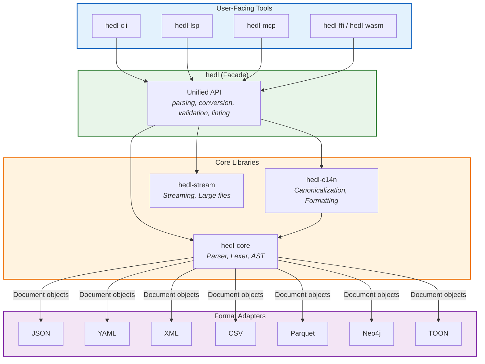
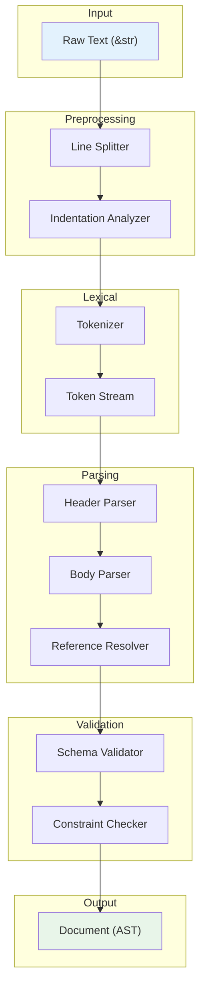

# HEDL Architecture Documentation

You're evaluating HEDL for a production system. You need to understand how it's built, where the complexity lives, what trade-offs were made, and whether it will scale to your needs.

This documentation is for you. We'll walk through the system design, show you the component relationships, explain the performance characteristics, and give you the technical depth to make an informed decision.

---

## The Big Picture

HEDL is not one monolithic library. It's a **workspace of 19 specialized crates**, each with a single responsibility. This modularity means you can use exactly what you need, and the crate boundaries enforce clean separation of concerns.



### Layer Responsibilities

| Layer | Crates | Responsibility |
|-------|--------|----------------|
| **Tools** | hedl-cli, hedl-lsp, hedl-mcp | User-facing applications |
| **Bindings** | hedl-ffi, hedl-wasm | Language interoperability |
| **Facade** | hedl | Unified public API |
| **Core** | hedl-core, hedl-c14n, hedl-stream | Parsing, formatting, streaming |
| **Formats** | hedl-json, hedl-yaml, etc. | Bidirectional format conversion |
| **Support** | hedl-lint, hedl-test, hedl-bench | Quality and testing |

---

## The Parsing Pipeline

When you call `hedl::parse()`, the input flows through a well-defined pipeline:



### Stage 1: Preprocessing

The input text is split into lines with indentation levels computed. This stage is **zero-copy**: it produces slices into the original input, not new allocations.

```rust
// Conceptually:
struct Line<'a> {
    content: &'a str,      // Slice into original input
    indent: usize,         // Computed indent level
    line_number: usize,    // For error reporting
}
```

**Why zero-copy?** For a 1MB document, avoiding string copies at this stage saves 1MB of allocations. The lexer and parser work with slices, deferring allocation until the final AST construction.

### Stage 2: Lexical Analysis

The tokenizer converts text into a stream of tokens:

| Token Type | Example | Notes |
|------------|---------|-------|
| `Key` | `name:` | Ends with colon |
| `String` | `hello`, `"quoted"` | Bare or quoted |
| `Integer` | `42`, `-10` | Parsed to i64 |
| `Float` | `3.14`, `1e-5` | Parsed to f64 |
| `Boolean` | `true`, `false` | |
| `Null` | `~` | Configurable symbol |
| `Reference` | `@User:alice` | Type + ID |
| `Pipe` | `\|` | Inline child marker |
| `Tensor` | `[1, 2, 3]` | Numeric arrays |

The tokenizer handles:
- **Quoted strings** with escape sequences
- **Scientific notation** for floats
- **Multi-line strings** (continuation with `\`)
- **Comments** (lines starting with `#`)

### Stage 3: Header Parsing

Headers define the document's metadata and schemas:

```hedl
%V:2.0                           # Version declaration
%NULL:~                          # Null symbol
%QUOTE:"                         # Quote character
%S:User:[id,name,email]        # Schema definition
%A:department:dept               # Alias definition
%C:User.count=1000               # Count metadata
```

The header parser builds:
- `version`: The HEDL format version
- `structs`: Map of schema names to column lists
- `aliases`: Map of alias names to targets
- `counts`: Metadata about collection sizes

**Headers must come before the body** (separated by `---`). This ensures schemas are available when parsing typed rows.

### Stage 4: Body Parsing

With schemas in hand, the body parser constructs the AST:

```rust
pub struct Document {
    pub version: String,
    pub null_symbol: char,
    pub quote_char: char,
    pub structs: HashMap<String, Vec<String>>,
    pub aliases: HashMap<String, String>,
    pub root: Item,
}

pub enum Item {
    Scalar(Value),
    Object(IndexMap<String, Item>),
    List(Vec<Item>),
}
```

**Key design decision**: We use `IndexMap` (from the `indexmap` crate) instead of `HashMap` for objects. This preserves insertion order, which matters for:
- Deterministic serialization
- Meaningful diffs
- Round-trip fidelity

### Stage 5: Reference Resolution

References like `@User:alice` are validated against defined entities:

```rust
pub struct Reference {
    pub type_name: Option<String>,  // "User" in @User:alice
    pub id: String,                  // "alice" in @User:alice
}
```

The resolver:
1. Collects all entity definitions (rows in typed lists)
2. Walks all references in the document
3. Validates that each reference target exists
4. Reports errors with line numbers for undefined references

### Stage 6: Validation

Final validation checks:
- Schema column counts match row values
- Type constraints are satisfied
- Required fields are present
- Circular references are detected

---

## Format Adapter Architecture

Each format adapter follows a consistent pattern:

```rust
// Conceptual interface (traits)
pub trait FromFormat {
    fn from_format(input: &str) -> Result<Document, HedlError>;
}

pub trait ToFormat {
    fn to_format(doc: &Document) -> Result<String, HedlError>;
}
```

### JSON Adapter (`hedl-json`)

**HEDL → JSON**: Straightforward mapping
- Objects become JSON objects
- Lists become JSON arrays
- Scalars map directly
- References serialize as strings or expanded objects (configurable)

**JSON → HEDL**: Requires schema inference
- Arrays of similar objects become typed lists
- Repeated keys suggest schema opportunities
- Nested objects become nested HEDL nodes

### YAML Adapter (`hedl-yaml`)

Uses the `serde_yaml` crate. Similar to JSON but:
- Preserves YAML's block vs flow style hints
- Handles YAML anchors/aliases (mapped to HEDL references)
- Multi-line strings handled via YAML's literal blocks

### XML Adapter (`hedl-xml`)

More complex due to XML's richer model:
- Elements become HEDL nodes
- Attributes become key-value pairs
- Text content becomes string values
- Namespaces are preserved as prefixes

### CSV Adapter (`hedl-csv`)

CSV maps naturally to HEDL's matrix lists:
- Header row becomes schema columns
- Data rows become inline children
- Type inference for integers, floats, booleans

### Neo4j Adapter (`hedl-neo4j`)

Generates Cypher statements:
- Entities become `CREATE` nodes
- References become `MATCH` + `CREATE` relationships
- Batch operations for performance

---

## Performance Architecture

### Memory Model

HEDL is designed for predictable memory usage:

| Phase | Memory Pattern |
|-------|----------------|
| Preprocessing | Zero-copy (slices into input) |
| Tokenization | Bounded buffer (configurable) |
| Parsing | Grows with document size |
| AST | ~2-3x input size |

**AST Overhead**: The final `Document` owns its strings. For a 1MB input, expect ~2-3MB of memory for the parsed document. This is intentional: owned strings are safer and simpler than lifetime-bounded references.

### Streaming for Large Files

For documents that don't fit in memory, `hedl-stream` provides:

```rust
use hedl_stream::StreamParser;

let parser = StreamParser::new(reader);
for event in parser {
    match event? {
        Event::StartObject(key) => { /* ... */ }
        Event::EndObject => { /* ... */ }
        Event::Scalar(key, value) => { /* ... */ }
        // ...
    }
}
```

Streaming trades random access for bounded memory. You can't "go back" to earlier parts of the document, but you can process multi-GB files with constant memory.

### Benchmarks

Current performance (Intel i7, release build):

| Operation | Tiny (<1KB) | Small (1-10KB) | Medium (10-100KB) |
|-----------|-------------|----------------|-------------------|
| Parse | 37 µs | 396 µs | 12 ms |
| To JSON | 10 µs | 115 µs | 1.1 ms |
| Validate | 24 µs | ~250 µs | ~2.5 ms |
| Canonicalize | 84 µs | ~850 µs | ~8.5 ms |

**Scaling**: Parsing is O(n) in document size. Validation is O(n + r) where r is reference count. Reference resolution uses a hash map, so lookups are O(1) amortized.

---

## Security Considerations

HEDL is designed to be safe against malicious input:

### Resource Limits

```rust
pub struct ParseOptions {
    pub max_depth: usize,           // Default: 128
    pub max_document_size: usize,   // Default: 100 MB
    pub max_string_length: usize,   // Default: 10 MB
    pub max_collection_size: usize, // Default: 1 million items
}
```

These limits prevent:
- **Stack overflow** from deeply nested documents
- **Memory exhaustion** from huge documents
- **Denial of service** from pathological inputs

### Input Validation

All input is validated before processing:
- UTF-8 validation on input strings
- Bounds checking on all array accesses
- No unsafe code in the core parser

### Fuzzing

The parser is continuously fuzz-tested. We've found and fixed:
- Edge cases in escape sequence handling
- Integer overflow in size calculations
- Infinite loops in malformed tensor syntax

---

## Extension Points

### Adding a New Format

To add support for a new format (e.g., MessagePack):

1. Create a new crate: `hedl-msgpack`
2. Implement `from_msgpack()` and `to_msgpack()`
3. Add feature flag to `hedl` facade
4. Add tests against conformance suite

The format adapter pattern ensures new formats don't affect existing code.

### Custom Validation Rules

Validation rules live in `hedl-core/src/validation/rules/`. To add a rule:

1. Implement the `ValidationRule` trait
2. Register in the rule registry
3. Add tests

### LSP Extensions

The LSP server (`hedl-lsp`) supports custom commands. To add functionality:

1. Define the command in `src/commands/`
2. Register in the command handler
3. Update LSP capabilities advertisement

---

## Documentation Map

### System Design

| Document | What you'll learn |
|----------|-------------------|
| [Data Flow](data-flow.md) | How data moves through the system |
| [Parsing Pipeline](parsing-pipeline.md) | Detailed parsing stages |
| [Module Dependencies](module-dependencies.md) | Crate dependency graph |
| [Performance](performance.md) | Benchmarks and optimization |

### Components

| Document | What you'll learn |
|----------|-------------------|
| [Lexer](components/lexer.md) | Tokenization internals |
| [Parser](components/parser.md) | Parsing algorithm |
| [Serializers](components/serializers.md) | Output generation |
| [Validator](components/validator.md) | Validation rules |
| [Format Adapters](components/format-adapters.md) | Conversion architecture |

### Diagrams

| Diagram | What it shows |
|---------|---------------|
| [System Overview](diagrams/system-overview.md) | High-level architecture |
| [Component Relationships](diagrams/component-relationships.md) | Crate dependencies |
| [Data Flow](diagrams/data-flow.md) | Processing pipeline |
| [Sequence Diagrams](diagrams/sequence-diagrams.md) | Operation sequences |

### System Design Details

| Document | What you'll learn |
|----------|-------------------|
| [Layered Architecture](system-design/layered-architecture.md) | Layer boundaries |
| [Module Structure](system-design/module-structure.md) | Code organization |
| [Plugin Architecture](system-design/plugin-architecture.md) | Extension patterns |
| [Dependency Injection](system-design/dependency-injection.md) | DI patterns used |

### Infrastructure

| Document | What you'll learn |
|----------|-------------------|
| [Build System](infrastructure/build-system.md) | Cargo configuration |
| [CI/CD](infrastructure/ci-cd.md) | GitHub Actions workflows |
| [Testing](infrastructure/testing.md) | Test infrastructure |
| [Benchmarking](infrastructure/benchmarking.md) | Performance measurement |

---

## Evaluating HEDL for Your System

Questions to consider:

**Does your use case benefit from token efficiency?**
HEDL's primary value is 56% token savings vs JSON. If you're not paying for tokens or dealing with context window limits, that benefit doesn't apply.

**Can your infrastructure run Rust binaries?**
The core is Rust. You can use FFI or WASM bindings, but the native experience is in Rust.

**Do you need streaming?**
For documents under ~100MB, the standard parser is fine. For larger, you'll want `hedl-stream`.

**What formats do you need?**
JSON is always available. Other formats (YAML, XML, CSV, Parquet, Neo4j) are feature-gated.

**Do you need editor integration?**
The LSP server provides VS Code, Neovim, and Emacs support out of the box.

---

<p align="center">
  <em>Architecture is about trade-offs. HEDL trades format familiarity for token efficiency.</em>
</p>
