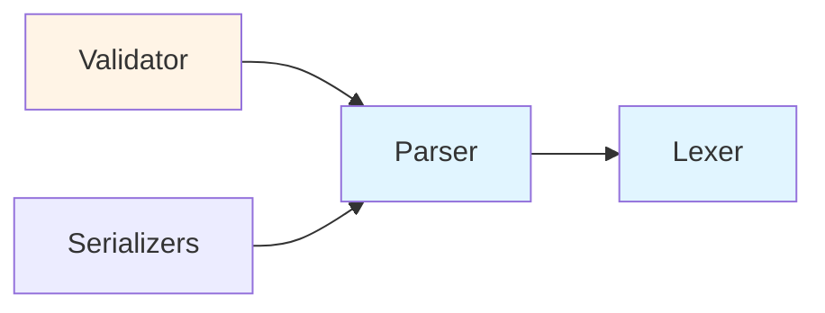

# Component Documentation

> Detailed component-level architecture documentation for HEDL

## Overview

This section provides in-depth documentation for each major component in the HEDL system. Components are cohesive units of functionality with well-defined interfaces and responsibilities.

## Component Catalog

### Core Components
- [Lexer](lexer.md) - Tokenization and lexical analysis
- [Parser](parser.md) - Syntax analysis and AST construction
- [Validator](validator.md) - Semantic validation and constraint checking

### Format Components
- [Serializers](serializers.md) - Format-specific serialization
- [Format Adapters](format-adapters.md) - Bidirectional format conversion

## Component Architecture Principles

### Single Responsibility

Each component has one clear purpose:
- **Lex Utilities**: Provide validation and parsing for individual tokens and rows
- **Parser**: Build AST from raw input using lex utilities
- **Validator**: Ensure semantic correctness (integrated into parsing phase)

### Clear Interfaces

Components communicate via well-defined internal functions and shared data structures:

```rust
// Lex utility (from hedl-core::lex)
pub fn parse_csv_row(row: &str) -> Result<Vec<CsvField>, LexError>;

// Main parser (from hedl-core)
pub fn parse(input: &[u8]) -> Result<Document, HedlError>;

// Traversal visitor (from hedl-core::traverse)
pub trait DocumentVisitor { ... }
```

### Minimal Dependencies

Components depend only on necessary abstractions:



## Component Lifecycle

### 1. Initialization

Components are initialized with configuration:

```rust
let options = ParseOptions::default();
let lexer = Lexer::new(&options);
let parser = Parser::new(&options);
let validator = Validator::new(&options);
```

### 2. Execution

Components execute their primary function:

```rust
// Tokenization
let tokens = lexer.tokenize(input)?;

// Parsing
let doc = parser.parse(&tokens)?;

// Validation
let report = validator.validate(&doc)?;
```

### 3. Cleanup

Components clean up resources:

```rust
// Arena allocation automatically freed
drop(doc);  // Frees all AST nodes
```

## Component Interaction Patterns

### Pipeline Pattern

Components form a processing pipeline:

```rust
pub struct ProcessingPipeline {
    lexer: Lexer,
    parser: Parser,
    validator: Validator,
}

impl ProcessingPipeline {
    pub fn process(&self, input: &str) -> Result<Document> {
        let tokens = self.lexer.tokenize(input)?;
        let doc = self.parser.parse(&tokens)?;
        self.validator.validate(&doc)?;
        Ok(doc)
    }
}
```

### Visitor Pattern

Components traverse AST with visitors:

```rust
pub trait Visitor {
    fn visit_node(&mut self, node: &Node) -> Result<()>;
    fn visit_value(&mut self, value: &Value) -> Result<()>;
}

// Validator implements visitor
impl Visitor for Validator {
    fn visit_node(&mut self, node: &Node) -> Result<()> {
        // Validate node
        self.check_node(node)?;

        // Visit children
        for child in node.children() {
            self.visit_node(child)?;
        }

        Ok(())
    }
}
```

### Observer Pattern

Components notify observers of events:

```rust
pub trait ParserObserver {
    fn on_node_parsed(&self, node: &Node);
    fn on_parse_complete(&self, doc: &Document);
}

pub struct Parser {
    observers: Vec<Box<dyn ParserObserver>>,
}

impl Parser {
    fn notify_node_parsed(&self, node: &Node) {
        for observer in &self.observers {
            observer.on_node_parsed(node);
        }
    }
}
```

## Performance Characteristics

### Lexer Component

- **Time Complexity**: O(n) where n = input length
- **Space Complexity**: O(t) where t = number of tokens
- **Optimization**: SIMD byte searching with `memchr`

### Parser Component

- **Time Complexity**: O(n) single-pass parsing
- **Space Complexity**: O(nodes) arena allocation
- **Optimization**: Efficient string handling (internal zero-copy, owned AST)

### Validator Component

- **Time Complexity**: O(nodes) tree traversal
- **Space Complexity**: O(depth) recursion stack
- **Optimization**: Early exit on first error

### Serializer Component

- **Time Complexity**: O(nodes) for traversal
- **Space Complexity**: O(output) for serialized string
- **Optimization**: String builder with pre-allocation

## Testing Strategy

### Unit Testing

Test each component independently:

```rust
#[cfg(test)]
mod lexer_tests {
    use super::*;

    #[test]
    fn test_tokenize_simple() {
        let lexer = Lexer::new(&ParseOptions::default());
        let tokens = lexer.tokenize("key: value").unwrap();
        assert_eq!(tokens.len(), 3);
    }
}
```

### Integration Testing

Test component interactions:

```rust
#[test]
fn test_lexer_parser_integration() {
    let lexer = Lexer::new(&ParseOptions::default());
    let parser = Parser::new(&ParseOptions::default());

    let tokens = lexer.tokenize("key: value").unwrap();
    let doc = parser.parse(&tokens).unwrap();

    assert_eq!(doc.nodes().len(), 1);
}
```

### Property Testing

Verify component invariants:

```rust
use proptest::prelude::*;

proptest! {
    #[test]
    fn test_lexer_parser_roundtrip(input in ".*") {
        if let Ok(tokens) = Lexer::new(&ParseOptions::default()).tokenize(&input) {
            if let Ok(doc) = Parser::new(&ParseOptions::default()).parse(&tokens) {
                // Roundtrip property: parse(tokenize(input)) should succeed
                assert!(doc.nodes().len() >= 0);
            }
        }
    }
}
```

## Component Documentation Standards

Each component document includes:

### 1. Purpose and Responsibility

Clear statement of what the component does.

### 2. Public Interface

Complete API documentation with examples.

### 3. Design Decisions

Rationale for key design choices.

### 4. Performance Characteristics

Complexity analysis and optimization notes.

### 5. Testing Strategy

How the component is tested.

### 6. Usage Examples

Concrete examples of component usage.

## Component Quality Metrics

### Code Coverage

Target: 90%+ line coverage for core components

### Cyclomatic Complexity

Target: < 10 per function for maintainability

### Documentation Coverage

Target: 100% for public APIs

### Performance Benchmarks

All components have dedicated benchmarks.

## Related Documentation

- [Lexer Component](lexer.md) - Lexer design details
- [Parser Component](parser.md) - Parser architecture
- [Validator Component](validator.md) - Validation logic
- [Serializers](serializers.md) - Serialization components
- [Parsing Pipeline](../parsing-pipeline.md) - End-to-end flow

---

*Last updated: 2026-01-06*
