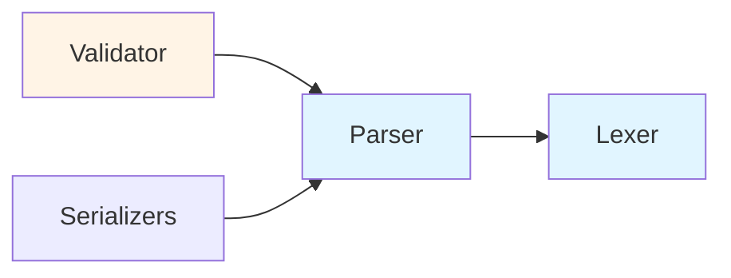

# Component Documentation

> Detailed component-level architecture documentation for HEDL

## Overview

This section provides in-depth documentation for each major component in the HEDL system. Components are cohesive units of functionality with well-defined interfaces and responsibilities.

## Component Catalog

### Core Components
- [Lexer](lexer.md) - Tokenization and lexical analysis
- [Parser](parser.md) - Syntax analysis and AST construction
- [Validator](validator.md) - Semantic validation and constraint checking

### Format Components
- [Serializers](serializers.md) - Format-specific serialization
- [Format Adapters](format-adapters.md) - Bidirectional format conversion

### IDE & Tool Components
- [LSP (Language Server Protocol)](lsp.md) - IDE integration with diagnostics, completion, and navigation
  - Completion with 7 context types
  - Hover information and documentation
  - Go to Definition and Find References (O(1) lookups)
  - Document and Workspace symbol search
  - Diagnostics with parse errors and linting
  - Rename refactoring with conflict detection
  - Performance optimizations: 200ms debouncing, caching, dirty tracking

## Component Architecture Principles

### Single Responsibility

Each component has one clear purpose:
- **Lex Utilities**: Provide validation and parsing for individual tokens and rows
- **Parser**: Build AST from raw input using lex utilities
- **Validator**: Ensure semantic correctness (integrated into parsing phase)

### Clear Interfaces

Components communicate via well-defined functions and shared data structures:

```rust
// Lex utilities (from hedl-core::lex)
pub fn parse_csv_row(row: &str) -> Result<Vec<CsvField>, LexError>;
pub fn parse_tensor(s: &str) -> Result<Tensor, LexError>;
pub fn calculate_indent(line: &str, line_num: u32) -> Result<Option<IndentInfo>, LexError>;

// Main parser (from hedl-core)
pub fn parse(input: &[u8]) -> Result<Document, HedlError>;
pub fn parse_with_limits(input: &[u8], options: ParseOptions) -> Result<Document, HedlError>;

// Traversal visitor (from hedl-core::traverse)
pub trait DocumentVisitor { ... }

// Reference resolution (from hedl-core::reference)
pub fn resolve_references(doc: &Document, mode: ReferenceMode) -> Result<(), HedlError>;
```

### Minimal Dependencies

Components depend only on necessary abstractions:


```mermaid
graph LR
    V[Validator] --> P[Parser]
    P --> L[Lexer]
    S[Serializers] --> P

    style L fill:#e1f5ff
    style P fill:#e1f5ff
    style V fill:#fff4e6
```

## Component Lifecycle

### 1. Initialization

Configure parsing behavior:

```rust
// Create parse options with default or custom settings
let options = ParseOptions::default();

// Or use builder for custom configuration
let options = ParseOptions::builder()
    .max_depth(100)
    .reference_mode(ReferenceMode::Strict)
    .build();

// Create limits if needed
let limits = Limits::default();
```

### 2. Execution

Components execute their primary function:

```rust
// Preprocessing
let preprocessed = preprocess(input, &limits)?;

// Parsing (includes header parsing, body parsing, and validation)
let doc = parse_with_limits(input, options)?;

// Reference resolution (post-parse validation)
resolve_references(&doc, reference_mode)?;
```

### 3. Cleanup

Components clean up resources:

```rust
// Arena allocation automatically freed
drop(doc);  // Frees all AST nodes
```

## Component Interaction Patterns

### Pipeline Pattern

HEDL parsing follows a unified pipeline pattern with integrated validation:

```rust
// Parse with default options (includes validation)
let doc = hedl_core::parse(input)?;

// Or with custom options
let opts = ParseOptions::builder()
    .max_nodes(100_000)
    .reference_mode(ReferenceMode::Lenient)
    .build();
let doc = hedl_core::parse_with_limits(input, opts)?;

// Reference resolution as optional post-processing
resolve_references(&doc, ReferenceMode::Strict)?;
```

### Visitor Pattern

The traversal system provides visitor implementations for AST traversal and transformation:

```rust
use hedl_core::traverse::{DocumentVisitor, VisitorContext};

// Define custom visitor
pub struct MyVisitor {
    // state
}

impl DocumentVisitor for MyVisitor {
    type Error = MyError;

    fn visit_item(&mut self, ctx: &VisitorContext, item: &Item) -> Result<(), Self::Error> {
        // Process item
        match item {
            Item::Scalar(value) => { /* handle scalar */ },
            Item::Object(map) => { /* handle object */ },
            Item::List(list) => { /* handle list */ },
        }
        Ok(())
    }
}

// Use visitor
let mut visitor = MyVisitor::new();
traverse(&doc, &mut visitor)?;
```

### Visitor Transformation Pattern

The visitor system supports transformations across the AST:

```rust
use hedl_core::visitor::{Visitor, transform};

// Define transformation visitor
pub struct TransformVisitor {
    // state
}

impl Visitor for TransformVisitor {
    fn visit_value(&mut self, value: &Value) -> Value {
        match value {
            Value::String(s) => Value::String(s.to_uppercase().into()),
            other => other.clone(),
        }
    }
}

// Apply transformation
let mut transformer = TransformVisitor::new();
let transformed_doc = transform(&doc, &mut transformer)?;
```

## Performance Characteristics

### Preprocessing

- **Time Complexity**: O(n) where n = input length
- **Space Complexity**: O(1) streaming (lazy iteration)
- **Optimization**: SIMD byte searching with `memchr` for comment detection

### Parsing

- **Time Complexity**: O(n) single-pass parsing
- **Space Complexity**: O(nodes) for AST allocation
- **Optimization**: BTreeMap for sorted key iteration, SmallVec for inline field storage

### Lexical Validation (On-Demand)

- **Time Complexity**: O(m) where m = token/line length
- **Space Complexity**: O(1) for most validations, O(f) for row parsing (f = field count)
- **Optimization**: Direct parsing without separate token stream, first-byte dispatch for value inference

### Reference Resolution

- **Time Complexity**: O(n + r) where n = nodes, r = references
- **Space Complexity**: O(n) for type registry
- **Optimization**: Inverted index for O(1) unqualified reference lookup

### Format Conversion

- **Time Complexity**: O(nodes) for traversal
- **Space Complexity**: O(output) for serialized data
- **Optimization**: Pre-allocated buffers, chunked I/O for large outputs

## Testing Strategy

### Unit Testing

Test parsing functionality:

```rust
#[cfg(test)]
mod parse_tests {
    use hedl_core::{parse, parse_with_limits, ParseOptions};

    #[test]
    fn test_parse_simple() {
        let input = b"key: value";
        let doc = parse(input).unwrap();

        assert_eq!(doc.root.len(), 1);
        assert!(doc.root.contains_key("key"));
    }

    #[test]
    fn test_parse_with_options() {
        let opts = ParseOptions::builder()
            .max_nodes(100)
            .build();
        let input = b"data: value";
        let doc = parse_with_limits(input, opts).unwrap();

        assert_eq!(doc.root.len(), 1);
    }
}
```

### Integration Testing

Test parsing with reference resolution and serialization:

```rust
#[test]
fn test_parse_with_references() {
    use hedl_core::{parse_with_limits, ParseOptions, ReferenceMode};

    let input = b"%V:2.0\n%S:User:[id,name]\n---\nusers:@User\n  |alice,Alice";
    let opts = ParseOptions::builder()
        .reference_mode(ReferenceMode::Strict)
        .build();

    let doc = parse_with_limits(input, opts).unwrap();
    assert_eq!(doc.version, (1, 0));
    assert!(doc.root.contains_key("users"));
}
```

### Property Testing

Verify parsing invariants:

```rust
use proptest::prelude::*;
use hedl_core::parse;

proptest! {
    #[test]
    fn test_parse_validity(input in ".*") {
        // Property: parsing should either succeed or fail gracefully
        match parse(input.as_bytes()) {
            Ok(doc) => {
                // If parse succeeds, document should be valid
                assert!(doc.version >= (0, 0));
                // Check that root is well-formed
                let _ = doc.root.len();
            },
            Err(_) => {
                // Errors should be recoverable
                // (no panics, no stack overflow)
            }
        }
    }
}
```

## Component Documentation Standards

Each component document includes:

### 1. Purpose and Responsibility

Clear statement of what the component does.

### 2. Public Interface

Complete API documentation with examples.

### 3. Design Decisions

Rationale for key design choices.

### 4. Performance Characteristics

Complexity analysis and optimization notes.

### 5. Testing Strategy

How the component is tested.

### 6. Usage Examples

Concrete examples of component usage.

## Component Quality Metrics

### Code Coverage

Target: 90%+ line coverage for core components

### Cyclomatic Complexity

Target: < 10 per function for maintainability

### Documentation Coverage

Target: 100% for public APIs

### Performance Benchmarks

All components have dedicated benchmarks.

## Related Documentation

- [Lexer Component](lexer.md) - Lexer design details
- [Parser Component](parser.md) - Parser architecture
- [Validator Component](validator.md) - Validation logic
- [Serializers](serializers.md) - Serialization components
- [LSP Component](lsp.md) - Language Server Protocol implementation
- [Parsing Pipeline](../parsing-pipeline.md) - End-to-end flow
- [LSP Message Flow Diagrams](../diagrams/lsp-message-flow.md) - Protocol sequence diagrams
- [LSP Implementation Guide](../../developer/guides/lsp-implementation.md) - Developer deep dive

---

