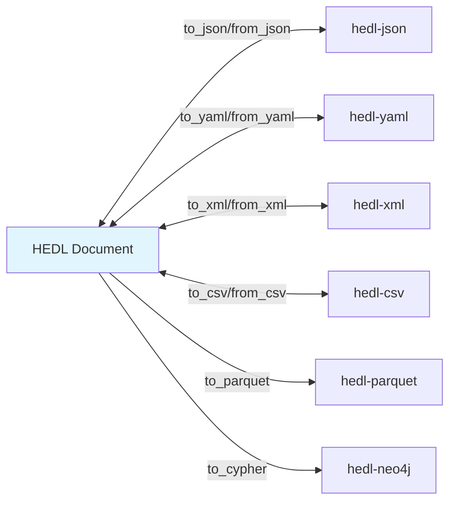

# Format Adapter Components

> Bidirectional format conversion architecture

## Overview

Format adapters provide bidirectional conversion between HEDL and external formats. Each format has its own dedicated crate with specialized conversion logic. The main `hedl` crate re-exports these converters when enabled via feature flags.

## Adapter Pattern



## Available Adapters

### Core Adapter (Always Available)

**hedl-json**: JSON bidirectional conversion
- Always available (no feature flag required)
- Full HEDL fidelity
- JSONPath queries
- JSON Schema generation
- Streaming support

```rust
use hedl_json::{to_json_value, from_json_value, ToJsonConfig, FromJsonConfig};

let doc = hedl::parse(input)?;
let json_value = to_json_value(&doc, &ToJsonConfig::default())?;
let json_str = serde_json::to_string(&json_value)?;

// Or use convenience functions
let json_str = hedl_json::to_json(&doc, &ToJsonConfig::default())?;
let doc_back = hedl_json::from_json(&json_str, &FromJsonConfig::default())?;
```

### Optional Adapters (Feature-Gated)

**hedl-yaml** (`yaml` feature):
```rust
use hedl::yaml::{to_yaml, from_yaml};

let yaml = to_yaml(&doc)?;
let doc = from_yaml(yaml_input)?;
```

**hedl-xml** (`xml` feature):
```rust
use hedl::xml::{to_xml, from_xml, XmlConfig};

let config = XmlConfig::default();
let xml = to_xml(&doc, &config)?;
let doc = from_xml(xml_input)?;
```

**hedl-csv** (`csv` feature):
```rust
use hedl::csv::{to_csv, from_csv, to_csv_list};

// Export matrix lists to CSV
let csv = to_csv_list(&doc, "users")?;  // Export "users" list
let doc = from_csv(csv_input)?;
```

**hedl-parquet** (`parquet` feature):
```rust
use hedl::parquet::to_parquet;
use std::fs::File;

// Export to Apache Parquet
let file = File::create("output.parquet")?;
to_parquet(&doc, file)?;
```

**hedl-neo4j** (`neo4j` feature):
```rust
use hedl::neo4j::{to_cypher, from_neo4j_records, Neo4jRecord};

// Generate Neo4j Cypher queries
let cypher = to_cypher(&doc)?;

// Import from Neo4j records
let doc = from_neo4j_records(records, &config)?;
```

## Configuration

### JSON Configuration

```rust
pub struct ToJsonConfig {
    /// Include HEDL metadata (__type__, __schema__)
    pub include_metadata: bool,
    /// Flatten matrix lists to plain arrays
    pub flatten_lists: bool,
    /// Include children as nested arrays
    pub include_children: bool,
}

impl Default for ToJsonConfig {
    fn default() -> Self {
        Self {
            include_metadata: false,
            flatten_lists: false,
            include_children: true,
        }
    }
}
```

### XML Configuration

```rust
pub struct XmlConfig {
    /// Root element name
    pub root_element: String,
    /// Pretty print with indentation
    pub pretty: bool,
    /// Include XML declaration
    pub include_declaration: bool,
}
```

## Usage Patterns

### Using Features in Cargo.toml

```toml
# Include only JSON (default)
hedl = "1.0"

# Include specific formats
hedl = { version = "1.0", features = ["yaml", "xml"] }

# Include all formats
hedl = { version = "1.0", features = ["all-formats"] }
```

### Runtime Format Detection

```rust
use hedl::{parse, Document};

fn convert_format(input: &[u8], from: &str, to: &str) -> Result<String> {
    let doc = match from {
        "hedl" => parse(input)?,
        "json" => hedl::json::from_json(std::str::from_utf8(input)?)?,
        #[cfg(feature = "yaml")]
        "yaml" => hedl::yaml::from_yaml(std::str::from_utf8(input)?)?,
        _ => return Err("Unsupported input format".into()),
    };

    match to {
        "json" => hedl::json::to_json(&doc, &Default::default()),
        #[cfg(feature = "yaml")]
        "yaml" => hedl::yaml::to_yaml(&doc),
        #[cfg(feature = "xml")]
        "xml" => hedl::xml::to_xml(&doc, &Default::default()),
        _ => Err("Unsupported output format".into()),
    }
}
```

## Format-Specific Features

### JSON: Schema Generation

> **Note**: JSON Schema generation is available in the `hedl-json` crate.

```rust
use hedl::json::schema_gen::{generate_schema, SchemaConfig};

let schema = generate_schema(&doc, &SchemaConfig::builder()
    .title("User Schema")
    .strict(true)
    .build())?;
```

### JSON: JSONPath Queries

Extract specific data from HEDL documents using standard JSONPath expressions.

```rust
use hedl_json::jsonpath::{query, QueryConfig};

let results = query(&doc, "$.users[*].name", &QueryConfig::default())?;
```

### JSON: Streaming

```rust
use hedl::json::streaming::{JsonLinesStreamer, StreamConfig};
use std::fs::File;

let file = File::open("large.jsonl")?;
let config = StreamConfig::default();

for result in JsonLinesStreamer::new(file, config) {
    let doc = result?;
    // Process each document incrementally
}
```

### XML: Streaming Support

```rust
use hedl::xml::streaming::stream_to_xml;
use std::fs::File;

let output = File::create("output.xml")?;
stream_to_xml(&doc, output)?;  // Memory-efficient for large documents
```

## Conversion Fidelity

### Full Fidelity Formats

These formats preserve all HEDL features:
- **JSON**: Full bidirectional fidelity with metadata
- **YAML**: Full bidirectional fidelity

### Partial Fidelity Formats

These formats may lose some information:
- **XML**: Attributes vs elements trade-offs
- **CSV**: Only matrix lists, loses hierarchy

### Export-Only Formats

These formats are write-only:
- **TOON**: Token-Oriented Object Notation optimized for LLMs

## Performance Considerations

### Pre-allocation Optimizations

All adapters use pre-allocation where possible:

```rust
// JSON: pre-allocate maps
let mut map = Map::with_capacity(root.len());

// CSV: pre-allocate rows
let mut rows = Vec::with_capacity(list.rows.len());
```

### Streaming for Large Files

Use streaming APIs for large documents:

```rust
// JSON streaming
use hedl::json::streaming::JsonLinesStreamer;

// XML streaming
use hedl::xml::streaming::stream_to_xml;
```

### Zero-Copy Where Possible

Converters minimize allocations by reusing document data:

```rust
// Reference document strings directly
Value::String(s) => JsonValue::String(s.clone()),  // Single allocation
```

## Error Handling

All converters return `Result<T, String>` for simplicity:

```rust
match hedl::json::to_json(&doc, &config) {
    Ok(json) => println!("{}", json),
    Err(e) => eprintln!("Conversion error: {}", e),
}
```

## Design Decisions

### Why Separate Crates?

**Decision**: Each format in its own crate

**Rationale**:
- Optional dependencies via features
- Independent versioning
- Clearer separation of concerns
- Smaller compile times when unused

**Trade-off**: More crates to maintain

### Why Feature Flags?

**Decision**: Use Cargo features for optional formats

**Rationale**:
- Users only pay for what they use
- Reduces binary size
- Faster compilation
- Clear dependencies

**Trade-off**: More complex build configuration

### Why String Errors?

**Decision**: Use `Result<T, String>` instead of custom error types

**Rationale**:
- Simpler API
- Easy to use with `?` operator
- Sufficient for format conversion errors
- Avoids error type proliferation

**Trade-off**: Less structured error information

## Related Documentation

- [Plugin Architecture](../system-design/plugin-architecture.md) - Extension system
- [JSON SDK](../../api/sdk/javascript.md) - JSON-specific documentation
- [Serializers](serializers.md) - Serialization details

---

