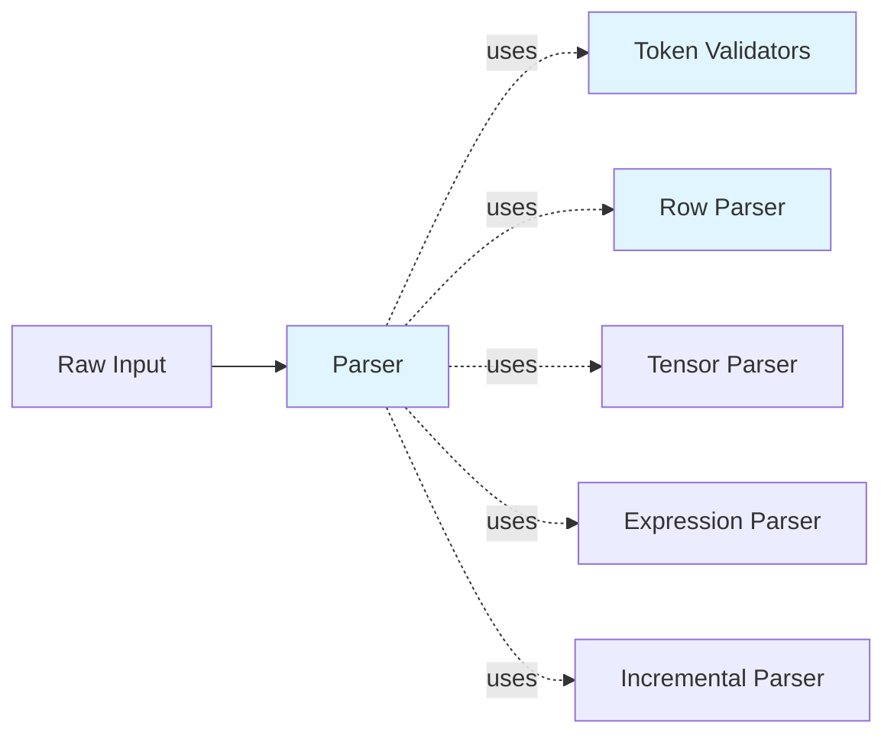

# Lexical Analysis Component

> Token validation and incremental parsing in HEDL

## Overview

The `lex` module provides lexical analysis infrastructure for HEDL parsing. Unlike traditional lexers that produce token streams, HEDL uses direct parsing with validation utilities. The module consolidates functionality for token validation, CSV/matrix row parsing, tensor parsing, and incremental parsing for IDE integration.

## Responsibility

**Primary Function**: Provide lexical validation and parsing utilities

**Key Responsibilities**:
1. Token validation (keys, type names, IDs, references)
2. CSV/matrix row parsing with expression and tensor support
3. Multi-dimensional tensor literal parsing
4. Indentation calculation and validation
5. Source position and span tracking for error reporting
6. Incremental parsing for IDE features

## Architecture



## Module Structure

The `lex` module is organized into submodules:

- `tokens.rs`: Token validation functions
- `row.rs`: CSV/matrix row parsing
- `tensor.rs`: Multi-dimensional tensor parsing
- `expression.rs`: Expression parsing from `$(...)`
- `strings.rs`: String literal handling
- `indent.rs`: Indentation calculation
- `span.rs`: Source position tracking
- `incremental.rs`: Incremental parsing for IDEs
- `config.rs`: Lexical analysis configuration
- `error.rs`: Lexical error types
- `arena.rs`: Arena allocation for lexical structures
- `csv.rs`: CSV tokenization utilities
- `directives.rs`: Directive parsing utilities
- `lex_inference.rs`: Lexical value inference
- `regions.rs`: Region scanning utilities

## Token Validation

```rust
use hedl_core::lex::{is_valid_key_token, is_valid_type_name, is_valid_id_token};

// Validate key tokens (alphanumeric, hyphens, underscores)
assert!(is_valid_key_token("user-name"));
assert!(is_valid_key_token("user_123"));
assert!(!is_valid_key_token("123-invalid")); // Cannot start with digit

// Validate type names (PascalCase)
assert!(is_valid_type_name("User"));
assert!(is_valid_type_name("UserProfile"));
assert!(!is_valid_type_name("user")); // Must be capitalized

// Validate ID tokens
assert!(is_valid_id_token("id-123"));
assert!(is_valid_id_token("user_456"));
```

## Value Types

```rust
use hedl_core::Value;

/// A scalar value in HEDL
pub enum Value {
    /// Null value (~)
    Null,
    /// Boolean value (true/false)
    Bool(bool),
    /// Integer value
    Int(i64),
    /// Floating-point value
    Float(f64),
    /// String value
    String(String),
    /// Tensor (multi-dimensional array)
    Tensor(Tensor),
    /// Reference to another node
    Reference(Reference),
    /// Parsed expression from $(...)
    Expression(Expression),
}
```

## Row Parsing

The CSV parsing functionality is provided for matrix list rows:

```rust
use hedl_core::lex::{parse_csv_row, CsvField};

// Parse CSV row with proper escaping
let fields = parse_csv_row("alice, Alice Smith, alice@example.com")?;
assert_eq!(fields.len(), 3);
assert_eq!(fields[0].value, "alice");
assert_eq!(fields[1].value, "Alice Smith");
assert_eq!(fields[2].value, "alice@example.com");

// Handle quoted fields with commas
let fields = parse_csv_row(r#""Smith, John", 42, "New York""#)?;
assert_eq!(fields[0].value, "Smith, John");
assert_eq!(fields[1].value, "42");
assert_eq!(fields[2].value, "New York");
```

## Tensor Parsing

Multi-dimensional arrays are parsed from nested bracket notation:

```rust
use hedl_core::lex::{parse_tensor, is_tensor_literal};

// Check if a string is a tensor literal
assert!(is_tensor_literal("[1, 2, 3]"));
assert!(is_tensor_literal("[[1, 2], [3, 4]]"));

// Parse 1D tensor: [1, 2, 3]
let tensor = parse_tensor("[1, 2, 3]")?;
assert_eq!(tensor.shape(), vec![3]);
assert_eq!(tensor.flatten(), vec![1.0, 2.0, 3.0]);

// Parse 2D tensor: [[1, 2], [3, 4]]
let tensor = parse_tensor("[[1, 2], [3, 4]]")?;
assert_eq!(tensor.shape(), vec![2, 2]);
assert_eq!(tensor.flatten(), vec![1.0, 2.0, 3.0, 4.0]);
```

## Indentation Handling

```rust
use hedl_core::lex::{calculate_indent, IndentInfo};

// Calculate indentation level - returns IndentInfo with level and spaces
// calculate_indent(line: &str, line_num: u32) -> Result<Option<IndentInfo>>
let info = calculate_indent("  content", 1).unwrap().unwrap();
assert_eq!(info.level, 1);  // 2 spaces = 1 level
assert_eq!(info.spaces, 2);

let info = calculate_indent("    content", 1).unwrap().unwrap();
assert_eq!(info.level, 2);  // 4 spaces = 2 levels

// Tabs in indentation cause an error
// calculate_indent("\tcontent", 1) returns Err(LexError::TabInIndentation)
```

## Source Position Tracking

```rust
use hedl_core::lex::{Span, SourcePos};

// Track exact source locations for error reporting
let pos = SourcePos::new(1, 5);
let span = Span::new(pos, SourcePos::new(1, 10));
```

## Performance Optimizations

### 1. Direct Parsing

HEDL doesn't use a separate tokenization phase. Instead, the parser directly consumes the input, reducing memory overhead and improving cache locality.

**Benefits**:
- No intermediate token array allocation
- Single-pass processing
- Better cache utilization
- Lower memory footprint

### 2. Efficient String Handling

String values are stored directly without unnecessary copying:

```rust
// Values own their strings
pub enum Value {
    String(String),  // Owned string, allocated once
    // ...
}
```

### 3. Incremental Parsing

The `incremental` module enables efficient IDE features:

```rust
use hedl_core::lex::incremental::IncrementalParser;

// Parse with change tracking for IDE integration
let parser = IncrementalParser::new();
let result = parser.parse_incremental(input, changes);
```

## Error Handling

Error types are defined in `hedl_core::error`:

```rust
use hedl_core::{HedlError, HedlErrorKind};

// Lexical errors include position information
let error = HedlError::new(
    HedlErrorKind::Syntax,
    "Invalid token",
    line,
).with_column(column);
```

## Design Decisions

### Why No Separate Tokenization?

**Decision**: Parse directly without generating tokens

**Rationale**:
- Eliminates allocation overhead for token vectors
- Simpler implementation and maintenance
- Better cache locality
- Sufficient for HEDL's simple syntax

**Trade-off**: Less flexible for complex grammars

### Why Consolidated lex Module?

**Decision**: Merge hedl-lex, hedl-row, and hedl-tensor into single module

**Rationale**:
- Reduces code duplication
- Clearer dependencies
- Easier to maintain
- Better encapsulation

**Trade-off**: Larger single module

## Related Documentation

- [Parser Component](parser.md) - Consumes lexer output
- [Parsing Pipeline](../parsing-pipeline.md) - End-to-end flow
- [Performance Architecture](../performance.md) - Performance details

---

*Last updated: 2026-01-06*
