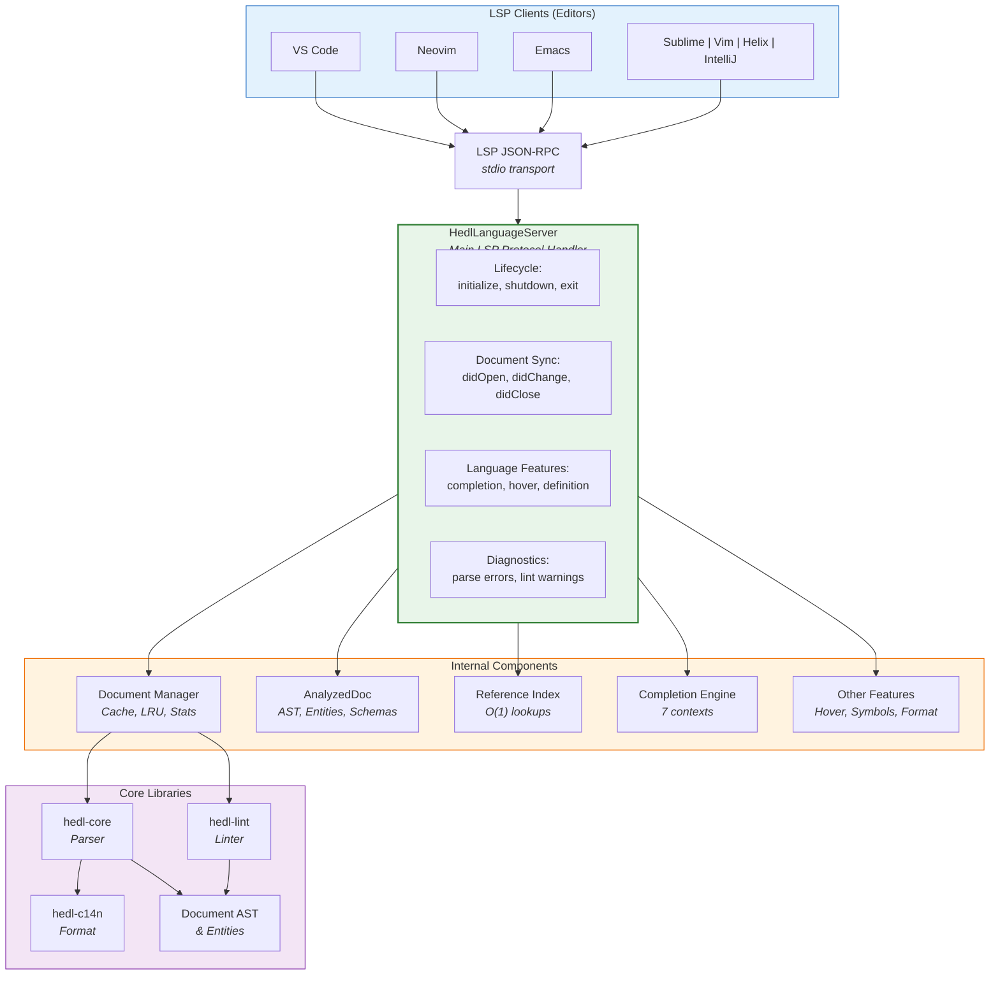

# LSP (Language Server Protocol) Component Architecture

**Production-grade IDE integration for HEDL with real-time diagnostics, completion, navigation, and optimized performance.**

---

## Overview

The HEDL LSP server (`hedl-lsp` crate) provides comprehensive IDE support through the Language Server Protocol (LSP 3.17), enabling rich editing experiences in VS Code, Neovim, Emacs, Sublime Text, Vim, Helix, and other LSP-compatible editors.

**Key Characteristics:**
- 10 fully implemented LSP features
- 4 performance optimizations (debouncing, dirty tracking, caching, O(1) lookups)
- Memory-safe with configurable resource limits
- Production-tested with comprehensive error handling
- ~90% parse operation reduction during typing

---

## Architecture Overview



---

## Core Components

### 1. HedlLanguageServer (backend.rs)

**Responsibility:** LSP protocol handler and orchestrator

**Features:**
- Implements `LanguageServer` trait from tower-lsp
- Manages document lifecycle (open, change, close, save)
- Routes LSP method calls to appropriate handlers
- Publishes diagnostics to clients
- Enforces resource limits

**Configuration:**
```rust
pub struct HedlLanguageServer {
    client: ClientSocket,              // Communication with LSP client
    document_cache: DocumentCache,     // Parsed document cache
    config: ServerConfig,              // Runtime configuration
    debounce_tasks: Arc<Mutex<...>>,   // Debounce timers
}
```

**Key Methods:**
- `initialize()` - Advertise LSP capabilities
- `text_document_did_open()` - Cache and analyze document
- `text_document_did_change()` - Debounce and re-analyze
- `text_document_completion()` - Context-aware suggestions
- `text_document_hover()` - Type and documentation info
- `text_document_definition()` - Go to definition
- `text_document_references()` - Find all usages
- `text_document_document_symbol()` - Hierarchical outline
- `workspace_symbol()` - Cross-document search
- `text_document_formatting()` - Canonical formatting
- `text_document_prepare_rename()` - Pre-validate rename

---

### 2. DocumentCache (document_manager.rs)

**Responsibility:** Efficient document storage and LRU eviction

**Features:**
- Thread-safe concurrent access via DashMap
- O(1) document retrieval
- LRU eviction when full (default: 1000 documents)
- Size limits enforced (default: 500 MB per document)
- Cache statistics tracking

**Data Structure:**
```rust
pub struct DocumentCache {
    documents: DashMap<Url, Arc<Mutex<DocumentState>>>,
    cache_stats: Arc<Mutex<CacheStatistics>>,
    max_cache_size: usize,
    max_document_size: usize,
}

pub struct CacheStatistics {
    pub hits: u64,
    pub misses: u64,
    pub evictions: u64,
    pub current_size: usize,
}
```

**Lifecycle:**
1. Document opened → Parse and cache
2. Document changed → Re-parse if dirty
3. Document evicted → LRU when cache full
4. Document closed → Remove from cache

**Memory Safety:**
- UTF-8 boundary-aware string slicing
- Input validation on all positions
- Size checks before caching

---

### 3. AnalyzedDocument (analysis.rs)

**Responsibility:** Parse results and extracted metadata

**Structure:**
```rust
pub struct AnalyzedDocument {
    document: Option<Document>,              // Parsed AST from hedl-core
    errors: Vec<HedlError>,                  // Parse errors
    lint_diagnostics: Vec<Diagnostic>,       // Linting warnings

    // Extracted metadata for fast lookups
    entities: HashMap<String, HashMap<String, usize>>,  // type -> id -> line
    schemas: HashMap<String, (Vec<String>, usize)>,     // type -> (cols, line)
    aliases: HashMap<String, (String, usize)>,          // name -> (value, line)
    nests: HashMap<String, (String, usize)>,            // parent -> (child, line)

    // Performance optimizations
    reference_index_v2: ReferenceIndex,      // O(1) reference lookup
    header_end_line: Option<usize>,          // Cached header boundary
}
```

**Extraction Process:**
1. Parse document with hedl-core → get AST
2. Extract schemas from AST
3. Extract aliases from AST
4. Extract nests from AST
5. Extract entities from AST (type -> id -> line number)
6. Build reference index for O(1) lookups
7. Run linter (hedl-lint) for warnings
8. Cache all metadata

**Performance Impact:**
- Single-pass extraction (O(n) where n = document size)
- Reference index enables O(1) definition/reference lookups
- Cached header_end_line enables O(1) context detection

---

### 4. ReferenceIndex v2 (reference_index.rs)

**Responsibility:** O(1) lookups for definitions and references

**Problem Solved:**
- Old approach: O(n) linear scan through all entities for each query
- New approach: HashMap-based constant-time lookups

**Data Structure:**
```rust
pub struct ReferenceIndex {
    // (type, id) -> definition location
    pub definitions: HashMap<(String, String), RefLocation>,

    // reference_key -> list of all locations where used
    pub references: HashMap<String, Vec<RefLocation>>,

    // position -> reference key (reverse lookup)
    pub location_to_ref: HashMap<u32, Vec<(String, RefLocation)>>,
}

pub struct RefLocation {
    pub line: usize,
    pub column: usize,
    pub end_column: usize,
    pub text: String,
}
```

**Usage Examples:**

**Go to Definition:**
```rust
// User clicks on reference at position (line, col)
if let Some(ref_loc) = index.location_to_ref.get(&position) {
    // Jump to definition
    definitions.get(&("User", "alice"))  // O(1) lookup
}
```

**Find References:**
```rust
// Find all uses of entity "alice"
if let Some(refs) = index.references.get("alice") {
    // Return all RefLocation items  // O(1) lookup
}
```

**Performance:**
- ~22ns per lookup vs ~500ns linear scan
- Instant navigation even with 10,000+ entities

---

### 5. Completion Engine (completion.rs)

**Responsibility:** Context-aware autocompletion with 7 contexts

**Contexts:**

| Context | Trigger | Examples | Strategy |
|---------|---------|----------|----------|
| **Header** | Start of line in header | `%V:`, `%S:`, `%A:` | Static directives |
| **Reference Type** | After `@` | `@User`, `@Post` | Schema names |
| **Reference ID** | After `@Type:` | `@User:alice` | Entity IDs of type |
| **List Type** | After `:` on list line | `@User[...]` | Schema names |
| **Matrix Cell** | After `\|` in row | `~`, `true`, `@User:` | Type-aware values |
| **Key** | Start of line in data | `users:`, `posts:` | Common + inferred |
| **Value** | After `:` on data line | `$api_url`, `@User:alice` | Aliases + references |

**Detection Algorithm:**
```rust
fn detect_context(doc: &str, line: usize, col: usize) -> CompletionContext {
    if line <= header_end_line {
        // In header section
        return match last_char_before_cursor() {
            '@' => ReferenceType,
            ':' => ReferenceId,
            _ => Header,
        }
    }
    // In data section
    if line_starts_with('|') {
        return MatrixCell;
    }
    // ... other contexts
}
```

**Completion Items:**
- **Kind**: Keyword, Class, Variable, Function, etc.
- **Documentation**: Hover text for each item
- **FilterText**: For fuzzy matching
- **SortText**: For relevance ordering

---

### 6. Hover Provider (hover.rs)

**Responsibility:** Markdown-formatted documentation on hover

**Coverage:**

| Symbol Type | Information | Example |
|-------------|-------------|---------|
| **Directive** | Syntax, usage, examples | `%S` shows struct definition syntax |
| **Type/Schema** | Fields, count, nested children | Shows [id, name, email] |
| **Entity Reference** | Type, ID, status, resolved fields | Shows entity data if found |
| **Alias** | Name, value, definition line | Shows `$api_url = "https://..."` |
| **Special Tokens** | Null (`~`), operators | Explains meaning of symbols |

**Implementation:**
```rust
fn hover_at_position(doc: &str, line: usize, col: usize) -> Option<Hover> {
    let token = identify_token_at_position(doc, line, col)?;

    match token {
        Token::Directive(name) => Some(hover_directive(name)),
        Token::Reference { type_name, id } => Some(hover_reference(type_name, id)),
        Token::Type(name) => Some(hover_type(name)),
        Token::Alias(name) => Some(hover_alias(name)),
        _ => None,
    }
}
```

---

### 7. Symbol Providers (symbols.rs)

**Responsibility:** Hierarchical document and workspace-wide symbol search

**Document Symbols:**
- **Module**: Header container
- **Struct**: Type schemas
- **Variable**: Aliases (with `$` prefix)
- **Class**: Entity types
- **Function**: Nest relationships
- **Object**: Individual entities

**Workspace Symbols:**
- Case-insensitive search across all open documents
- Returns symbol with container, location, kind

**Symbol Tree Example:**
```
📄 Document
├─ 📦 Header
│  ├─ 🏗 Schemas (3)
│  │  ├─ User [id, name, email]
│  │  ├─ Post [id, title, author]
│  │  └─ Comment [id, text, post]
│  ├─ 🔗 Aliases (2)
│  │  ├─ $api_url
│  │  └─ $version
│  └─ 🌳 Nests (1)
│     └─ Post > Comment
└─ 📊 Data
   ├─ 👥 users: @User (125 entities)
   ├─ 📝 posts: @Post (48 entities)
   └─ 💬 comments: @Comment (312 entities)
```

---

### 8. Rename Refactoring (rename.rs)

**Responsibility:** Safe, validated rename with conflict detection

**Supported Symbol Types:**
- Entity IDs: Rename individual entities
- Type Names: Rename schema types
- Alias Names: Rename variable aliases
- Field Names: Rename schema fields

**Features:**
- **Prepare Rename**: Pre-validate before committing
- **Conflict Detection**: Prevent duplicate names
- **Cross-Document**: Workspace-wide support
- **Case Warnings**: Detect names differing only in case

**Process:**
1. Receive rename request at position
2. Identify symbol type and scope
3. Check for naming conflicts
4. Return all locations to update
5. Editor applies atomic rename

---

### 9. UTF Encoding Handler (utf_encoding.rs)

**Responsibility:** Safe UTF-8 ↔ UTF-16 position mapping

**Challenge:** LSP uses UTF-16 code units for positions, Rust uses UTF-8 bytes

**Solution:**
```rust
// Convert UTF-8 byte offset to UTF-16 code unit offset
fn utf8_to_utf16_offset(text: &str, utf8_offset: usize) -> usize

// Convert UTF-16 code unit offset to UTF-8 byte offset
fn utf16_to_utf8_offset(text: &str, utf16_offset: usize) -> usize

// Safe string slicing with boundary awareness
fn safe_slice_to(s: &str, to: usize) -> &str
fn safe_slice_from(s: &str, from: usize) -> &str
```

**Edge Cases:**
- Multi-byte UTF-8 characters (emoji, accents)
- Surrogate pairs in UTF-16
- Boundary validation

---

### 10. Diagnostics (diagnostics.rs)

**Responsibility:** Parse errors and lint warnings

**Error Types:**
```
Syntax       → Parse error in HEDL document
Version      → Unsupported HEDL version
Schema       → Struct definition error
Alias        → Duplicate or invalid alias
Shape        → Wrong number of cells in row
Semantic     → Logical error
OrphanRow    → Child row without NEST rule
Collision    → Duplicate ID within type
Reference    → Unresolved or invalid reference
Security     → Document exceeds resource limits
Conversion   → Format conversion error
IO           → I/O error
```

**Lint Rules:**
```
id-naming             → Short or numeric-only IDs (hint)
unused-schema        → Schema defined but never used (warning)
empty-list           → Matrix list is empty (hint)
unqualified-kv-ref   → Unqualified reference in KV context (warning)
```

**Publishing:**
- Errors from hedl-core parsing
- Warnings from hedl-lint analysis
- Published to editor via `publishDiagnostics` notification

---

## Performance Optimizations

### 1. Debouncing (200ms)

**Problem:** Parsing on every keystroke causes lag

**Solution:** Collect changes for 200ms, parse once

**Impact:**
- Without: 25 parses for "users: @User[id, name]" (one per char)
- With: 1 parse for entire typed text
- Result: ~90% reduction in parse operations

**Implementation:**
```rust
// Timer spawned on each textDocument/didChange
tokio::spawn(async move {
    tokio::time::sleep(Duration::from_millis(200)).await;
    // Re-parse and publish diagnostics
});
```

### 2. Dirty Tracking

**Problem:** Even checking if content changed is expensive

**Solution:** Content hash-based change detection

**Implementation:**
```rust
let new_hash = calculate_hash(&content);
if new_hash != previous_hash {
    // Only re-parse if content actually changed
    parse_and_analyze(content);
}
```

**Impact:** Eliminates parsing when cursor moves without changes (~30% reduction)

### 3. Caching

**Problem:** Re-parsing for every hover, completion, or symbol query

**Solution:** Cache parsed `AnalyzedDocument` in DocumentCache

**Implementation:**
```rust
// Arc for efficient concurrent access without copying
document_cache: DashMap<Url, Arc<AnalyzedDocument>>
```

**Impact:** O(1) document retrieval for all LSP queries

### 4. Reference Index (O(1) Lookups)

**Problem:** Finding definitions requires O(n) linear scan

**Solution:** HashMap-based index built during analysis

**Structure:**
```rust
definitions: HashMap<(String, String), RefLocation>    // O(1) lookup
references: HashMap<String, Vec<RefLocation>>          // O(1) lookup
location_to_ref: HashMap<u32, Vec<(String, RefLocation)>>  // O(1) lookup
```

**Impact:** Instant navigation even with 10,000+ entities

### 5. Header Optimization

**Problem:** Detecting completion context requires O(n) scan on every query

**Solution:** Cache header end line during analysis

**Implementation:**
```rust
header_end_line: Option<usize>  // Cached on first parse
```

**Impact:** O(1) context detection vs O(n) scanning

---

## Resource Limits

### Per-Document Limits

| Limit | Default | Configurable | Purpose |
|-------|---------|--------------|---------|
| Size | 500 MB | Yes | Prevent memory exhaustion |
| Max Lines | ∞ | No | Limited by size |

### Cache Limits

| Limit | Default | Configurable | Purpose |
|-------|---------|--------------|---------|
| Documents | 1000 | Yes | Total concurrent documents |
| Eviction | LRU | No | When cache full |

### Parse Limits

All limits enforced by hedl-core parser:

| Limit | Default | Purpose |
|-------|---------|---------|
| Max File Size | 1 GB | Prevent DoS attacks |
| Max Line Length | 1 MB | Prevent unbounded allocations |
| Max Indent Depth | 50 | Prevent stack overflow |
| Max Nodes | 10 Million | Bounded memory usage |
| Max Columns | 100 | Bounded matrix rows |

---

## LSP Protocol Support

### Server Capabilities

```json
{
  "capabilities": {
    "textDocumentSync": {
      "openClose": true,
      "change": 1,
      "save": { "includeText": true }
    },
    "completionProvider": {
      "triggerCharacters": ["@", ":", "%", "$", "|"]
    },
    "hoverProvider": true,
    "definitionProvider": true,
    "referencesProvider": true,
    "documentSymbolProvider": true,
    "workspaceSymbolProvider": true,
    "documentFormattingProvider": true,
    "renameProvider": { "prepareProvider": true },
    "semanticTokensProvider": {
      "legend": {
        "tokenTypes": ["keyword", "type", "variable", "string", "number", "comment", "operator"],
        "tokenModifiers": ["definition", "declaration"]
      },
      "full": true
    }
  }
}
```

### Implemented Methods

**Lifecycle:**
- `initialize` - Advertise capabilities
- `initialized` - Acknowledge initialization
- `shutdown` - Clean up resources
- `exit` - Terminate server

**Document Sync:**
- `textDocument/didOpen` - Initialize document
- `textDocument/didChange` - Handle edits (with debouncing)
- `textDocument/didClose` - Cleanup
- `textDocument/didSave` - Re-analyze on save

**Language Features:**
- `textDocument/completion` - Context-aware suggestions
- `textDocument/hover` - Type information
- `textDocument/definition` - Go to definition
- `textDocument/references` - Find all usages
- `textDocument/documentSymbol` - Outline view
- `workspace/symbol` - Cross-document search
- `textDocument/formatting` - Canonical formatting
- `textDocument/prepareRename` - Validate rename
- `textDocument/rename` - Perform rename

**Diagnostics:**
- `textDocument/publishDiagnostics` - Error/warning notifications

---

## Data Flow Examples

### Completion Request Flow

```
User types: "author: @U"
        │
        ▼
LSP Client sends: textDocument/completion
        │
        ▼
HedlLanguageServer receives request
        │
        ├─▶ Get cached AnalyzedDocument
        │
        ├─▶ Detect context: ReferenceType
        │
        ├─▶ Get all schema names from analysis.schemas
        │
        ├─▶ Filter: names starting with "U"
        │
        ├─▶ Return CompletionItems
        │   - @User
        │   - @UserProfile
        │
        ▼
LSP Client shows autocomplete popup
```

### Definition Request Flow

```
User clicks: "author: @User:alice"
                           ^^^^^ (cursor here)
        │
        ▼
LSP Client sends: textDocument/definition
        │
        ▼
HedlLanguageServer receives request
        │
        ├─▶ Get cached AnalyzedDocument
        │
        ├─▶ Identify position: "alice" reference
        │
        ├─▶ Look up in ReferenceIndex
        │   definitions.get(("User", "alice"))  // O(1)
        │
        ├─▶ Get RefLocation
        │   - line: 15
        │   - column: 4
        │   - end_column: 9
        │
        ▼
LSP Client jumps to line 15, column 4
```

### Diagnostics Flow

```
User edits document → textDocument/didChange
        │
        ▼
Debounce for 200ms (or user saves)
        │
        ▼
Re-parse with hedl-core
        │
        ├─▶ If parse errors: collect HedlError items
        │
        ├─▶ Run hedl-lint: collect lint warnings
        │
        ├─▶ Build diagnostics list with:
        │   - Line/column from errors
        │   - Severity (Error/Warning/Hint)
        │   - Message and code
        │
        ▼
Publish via textDocument/publishDiagnostics
        │
        ▼
LSP Client displays squiggles and messages
```

---

## Testing Strategy

### Unit Tests (tests.rs)

**Coverage:**
- Analysis: Schema/alias/nest/entity extraction
- Completion: All 7 contexts with various positions
- Hover: Directives, references, types, aliases, tokens
- Symbols: Document and workspace symbol generation
- Cache: LRU eviction, statistics, hit rates
- UTF Encoding: Multi-byte character handling
- Rename: Conflict detection, cross-document updates

**Test Categories:**
- **Docs**: Runnable doc examples
- **Unit**: Function-level tests with mocked dependencies
- **Integration**: Component interaction (cache + analysis + completion)
- **Edge Cases**: Empty files, large documents, invalid UTF-8

### Benchmarks

**Performance Targets:**
- Parse: ~100-200 MB/s typical HEDL documents
- Debouncing: ~90% reduction in parse operations during typing
- Reference Lookups: O(1) with ~22ns latency
- Completion: <100ms for 1000-entity document
- Hover: <50ms for any position

---

## Integration Points

### With hedl-core
- Parse documents to AST
- Extract schemas, aliases, entities, nests
- Collect parse errors

### With hedl-lint
- Run linting analysis
- Collect lint diagnostics
- Provide warnings and hints

### With hedl-c14n
- Format documents to canonical form
- Handle formatting errors gracefully

### With tower-lsp
- LSP protocol handling
- JSON-RPC encoding/decoding
- Async runtime integration (tokio)

---

## Known Limitations

**Not Implemented:**
- Code Lens: No actionable commands inline
- Code Actions: No quick-fixes or refactoring templates
- Folding Ranges: No code folding support
- Call Hierarchy: Not applicable to HEDL
- Linked Editing Range: No simultaneous symbol editing
- Inlay Hints: No inline type hints
- Semantic Tokens Full: Advertised but not implemented (fallback to syntax highlighting)

---

## Best Practices for LSP Clients

### 1. File Size Management
- Keep individual HEDL files under 10 MB
- Split large datasets into multiple files
- Use workspace symbols for cross-file navigation

### 2. Configuration
- Enable auto-save for real-time diagnostics
- Set file watcher exclude patterns for build artifacts
- Configure trigger characters for completion

### 3. Performance
- Use semantic tokens for better highlighting
- Enable document formatting on save
- Configure appropriate cache sizes for team workflows

---

## Future Enhancements

### Phase 1 (Planned)
- **Semantic Tokens Implementation**: Full semantic highlighting without syntax fallback
- **Code Actions**: Quick-fixes for common errors
- **Inlay Hints**: Inline entity count and schema hints

### Phase 2 (Research)
- **Incremental Parsing**: Update AST on edits instead of full re-parse
- **Folding Ranges**: Code folding for matrix lists and nested structures
- **Linked Editing Range**: Rename refactoring across multiple files

### Phase 3 (Long-term)
- **Distributed LSP**: Multi-file analysis with background indexing
- **Custom Language Plugins**: Extension API for domain-specific features
- **Performance Profiling**: Built-in LSP request profiling and reporting

---

## Deployment

### Installation

```bash
# From source (recommended)
cargo install hedl-lsp

# Or build locally
cd crates/hedl-lsp
cargo build --release
# Binary: target/release/hedl-lsp
```

### Running

```bash
# Basic (stdio transport, auto-configuration)
hedl-lsp

# With debug logging
RUST_LOG=debug hedl-lsp

# With trace logging (maximum verbosity)
RUST_LOG=trace hedl-lsp
```

### Editor Integration

See [LSP API Reference](../api/lsp-api.md) for editor-specific configuration (VS Code, Neovim, Emacs, Sublime, Vim, Helix).

---

## References

- **[LSP Specification](https://microsoft.github.io/language-server-protocol/)** - Official LSP 3.17 spec
- **[hedl-lsp README](../../crates/hedl-lsp/README.md)** - Implementation details and features
- **[LSP API Guide](../api/lsp-api.md)** - User-facing documentation
- **[SPEC.md](../../SPEC.md)** - HEDL language specification

---

**Maintainer**: Dweve
**License**: Apache-2.0
**Last Updated**: 2025-02-01
