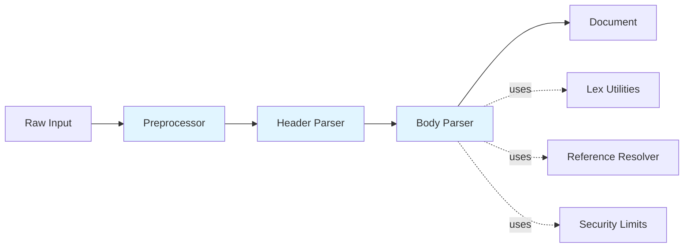

# Parser Component

> Direct parsing and document construction in HEDL

## Overview

The parser component converts raw HEDL input directly into a Document structure. It implements single-pass parsing without separate tokenization, optimized for simplicity and performance.

## Responsibility

**Primary Function**: Parse HEDL input into Document structure

**Key Responsibilities**:
1. Syntax analysis and validation
2. Document structure construction
3. Header directive parsing (%VERSION, %STRUCT, %ALIAS, %NEST)
4. Body parsing (objects, lists, scalars)
5. Reference registration and resolution
6. Indentation handling
7. Security limit enforcement

## Architecture



## Document Structure

```rust
use hedl_core::{Document, Item, MatrixList, Node, Value};
use std::collections::BTreeMap;

/// A parsed HEDL document
pub struct Document {
    /// Version (major, minor)
    pub version: (u32, u32),
    /// Alias definitions (name -> replacement string)
    pub aliases: BTreeMap<String, String>,
    /// Struct definitions (type -> columns)
    pub structs: BTreeMap<String, Vec<String>>,
    /// Nest relationships (parent -> child)
    pub nests: BTreeMap<String, String>,
    /// Root body content
    pub root: BTreeMap<String, Item>,
}

/// An item in the document body
pub enum Item {
    /// A scalar value
    Scalar(Value),
    /// A nested object
    Object(BTreeMap<String, Item>),
    /// A matrix list
    List(MatrixList),
}

/// A node in a matrix list
pub struct Node {
    /// The type name (from schema)
    pub type_name: String,
    /// The node's ID (first column value)
    pub id: String,
    /// Field values (aligned with schema columns)
    pub fields: Vec<Value>,
    /// Child nodes grouped by type (from NEST relationships)
    pub children: BTreeMap<String, Vec<Node>>,
    /// Optional count of direct children (for LLM comprehension hints)
    pub child_count: Option<usize>,
}

/// A scalar value in HEDL
pub enum Value {
    Null,
    Bool(bool),
    Int(i64),
    Float(f64),
    String(String),
    Tensor(Tensor),
    Reference(Reference),
    Expression(Expression),
}
```

## Public Interface

The main entry points are simple functions that take raw input:

```rust
use hedl_core::{parse, parse_with_limits, ParseOptions, Document, HedlResult};

/// Parse HEDL input with default options
pub fn parse(input: &[u8]) -> HedlResult<Document> {
    parse_with_limits(input, ParseOptions::default())
}

/// Parse HEDL input with custom options
pub fn parse_with_limits(input: &[u8], options: ParseOptions) -> HedlResult<Document> {
    // 1. Preprocess input (handle line endings, strip comments)
    // 2. Parse header directives (%VERSION, %STRUCT, etc.)
    // 3. Parse body content
    // 4. Resolve references
    // 5. Return Document
}
```

### Parse Options

Configure parser behavior with `ParseOptions`:

```rust
use hedl_core::{ParseOptions, Limits};

// Use defaults (strict refs, standard limits)
let opts = ParseOptions::default();

// Or customize with builder
let opts = ParseOptions::builder()
    .max_depth(100)
    .max_nodes(100_000)
    .strict(true)
    .build();

// Or use builder pattern for clarity
let opts = ParseOptions::builder()
    .strict(false)
    .max_nodes(50_000)
    .build();

let doc = hedl_core::parse_with_limits(input, opts)?;
```

## Implementation Details

### Header Parsing

The header section contains directives like `%VERSION`, `%STRUCT`, `%ALIAS`, and `%NEST`:

```hedl
%VERSION: 1.0
%STRUCT: User: [id, name, email]
%ALIAS: %u: "User"
%NEST: User > Post
---
```

This parses to:
```rust
let doc = Document {
    version: (1, 0),
    structs: BTreeMap::from([
        ("User".to_string(), vec!["id".to_string(), "name".to_string(), "email".to_string()])
    ]),
    aliases: BTreeMap::from([
        ("U".to_string(), "User".to_string())
    ]),
    nests: BTreeMap::from([
        ("User".to_string(), "Post".to_string())
    ]),
    root: BTreeMap::new(),
};
```

### Body Parsing

The body contains key-value pairs, objects, and matrix lists:

```hedl
# Simple scalar
name: Alice

# Object with children
user:
  name: Alice
  age: 30

# Matrix list (requires %STRUCT: User: [id, name, email] in header)
users: @User
  | alice, Alice Smith, alice@example.com
  | bob, Bob Johnson, bob@example.com
```

### Reference Resolution

References are resolved after parsing using a `TypeRegistry`:

```rust
use hedl_core::reference::{register_node, resolve_references, TypeRegistry};

// 1. Register all nodes during parsing
let mut registry = TypeRegistry::new();
register_node(&mut registry, &node.type_name, &node.id, line_num)?;

// 2. Resolve all references after parsing
// Reference resolution is handled internally based on ParseOptions.strict
resolve_references(&doc, &options)?;
```

References can be:
- Local: `@id-123`
- Qualified: `@User:alice`

## Performance Optimizations

### 1. Direct Parsing (No Tokenization)

The parser reads input directly without generating intermediate tokens:

```rust
// No token array allocation
pub fn parse(input: &[u8]) -> HedlResult<Document> {
    // Parse directly from input
}
```

**Benefits**:
- No token array allocation
- Single memory pass
- Better cache locality
- Lower memory footprint

### 2. Owned Data Structures

All document data is owned, simplifying lifetime management:

```rust
pub struct Document {
    pub root: BTreeMap<String, Item>,  // Owned strings
    // ...
}
```

**Benefits**:
- No lifetime parameters
- Easier to work with
- Suitable for long-lived documents

### 3. BTreeMap for Ordered Keys

Uses `BTreeMap` instead of `HashMap` for deterministic ordering:

```rust
pub root: BTreeMap<String, Item>,  // Sorted keys
```

**Benefits**:
- Deterministic serialization
- Better cache performance
- Ordered iteration

## Security Limits

The parser enforces comprehensive security limits to prevent DoS attacks:

```rust
pub struct Limits {
    pub max_file_size: usize,         // Default: 1GB
    pub max_line_length: usize,       // Default: 1MB
    pub max_indent_depth: usize,      // Default: 50
    pub max_nodes: usize,             // Default: 10M
    pub max_aliases: usize,           // Default: 10k
    pub max_columns: usize,           // Default: 100
    pub max_nest_depth: usize,        // Default: 100
    pub max_block_string_size: usize, // Default: 10MB
    pub max_object_keys: usize,       // Default: 10k
    pub max_total_keys: usize,        // Default: 10M
}
```

See parser.rs documentation for detailed security rationale.

## Testing Strategy

### Unit Tests

```rust
#[cfg(test)]
mod tests {
    use hedl_core::parse;

    #[test]
    fn test_parse_simple() {
        let input = b"name: Alice\nage: 30";
        let doc = parse(input).unwrap();

        assert_eq!(doc.root.len(), 2);
        assert!(doc.root.contains_key("name"));
        assert!(doc.root.contains_key("age"));
    }

    #[test]
    fn test_parse_nested() {
        let input = b"user:\n  name: Alice\n  age: 30";
        let doc = parse(input).unwrap();

        assert_eq!(doc.root.len(), 1);
        if let Some(Item::Object(obj)) = doc.root.get("user") {
            assert_eq!(obj.len(), 2);
        }
    }

    #[test]
    fn test_parse_matrix_list() {
        let input = b"%STRUCT: User: [id, name]\n---\nusers: @User\n  | alice, Alice\n  | bob, Bob";
        let doc = parse(input).unwrap();

        if let Some(Item::List(list)) = doc.root.get("users") {
            assert_eq!(list.rows.len(), 2);
        }
    }
}
```

### Integration Tests

Tests are located in `hedl-core/tests/`:
- `conformance/`: Spec conformance tests
- `security/`: Security limit tests
- `error/`: Error handling tests

## Design Decisions

### Why No Separate Tokenization?

**Decision**: Parse directly from input without tokenization

**Rationale**:
- Simpler implementation
- Lower memory overhead
- Single-pass processing
- HEDL's syntax doesn't require lookahead

**Trade-off**: Less flexible for complex grammars

### Why Owned Data Structures?

**Decision**: Use owned strings instead of lifetimes

**Rationale**:
- Simpler API (no lifetime parameters)
- Easier to use and serialize
- Documents are typically long-lived
- Modern allocators are fast

**Trade-off**: Higher memory usage than zero-copy

### Why Two-Pass References?

**Decision**: Resolve references after parsing

**Rationale**:
- Supports forward references
- Cleaner separation of concerns
- Optional strict mode
- Easier to implement

**Trade-off**: Requires additional traversal

## Related Documentation

- [Lexer Component](lexer.md) - Provides validation and parsing utilities
- [Validator Component](validator.md) - Validates AST
- [Parsing Pipeline](../parsing-pipeline.md) - End-to-end flow
- [Performance Architecture](../performance.md) - Performance details

---

