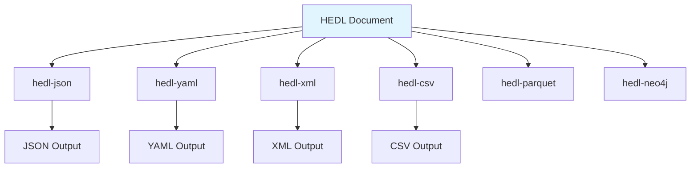

# Serializer Components

> Format-specific conversion in HEDL

## Overview

HEDL provides multiple format conversion crates for exporting documents to common formats. Each crate implements bidirectional conversion (HEDL ↔ Format) with format-specific optimizations.

## Serializer Architecture



## Format Converters

Each format has its own crate with dedicated functionality:

- **hedl-json**: JSON conversion (always available)
- **hedl-yaml**: YAML conversion (`yaml` feature)
- **hedl-xml**: XML with streaming support (`xml` feature)
- **hedl-csv**: CSV import/export (`csv` feature)
- **hedl-parquet**: Apache Parquet (`parquet` feature)
- **hedl-neo4j**: Neo4j Cypher generation (`neo4j` feature)

## JSON Serializer (hedl-json)

The JSON converter provides bidirectional conversion:

```rust
use hedl_json::{to_json_value, from_json_value, ToJsonConfig, FromJsonConfig};
use hedl_core::Document;

// Convert HEDL to JSON value
let doc: Document = hedl_core::parse(input)?;
let config = ToJsonConfig::default();
let json_value = to_json_value(&doc, &config)?;

// Convert JSON value to HEDL
let json_value: serde_json::Value = serde_json::from_str(json_input)?;
let config = FromJsonConfig::default();
let doc = from_json_value(&json_value, &config)?;

// Or use convenience functions
let json_string = hedl_json::to_json(&doc, &ToJsonConfig::default())?;
let doc = hedl_json::from_json(json_input, &FromJsonConfig::default())?;
```

### Configuration Options

```rust
pub struct ToJsonConfig {
    /// Include HEDL metadata (__type__, __schema__)
    pub include_metadata: bool,
    /// Flatten matrix lists to plain arrays
    pub flatten_lists: bool,
    /// Include children as nested arrays
    pub include_children: bool,
}
```

### Value Conversion

```rust
fn value_to_json(value: &Value) -> JsonValue {
    match value {
        Value::Null => JsonValue::Null,
        Value::Bool(b) => JsonValue::Bool(*b),
        Value::Int(n) => JsonValue::Number(Number::from(*n)),
        Value::Float(f) => JsonValue::Number(Number::from_f64(*f).unwrap_or(JsonValue::Null)),
        Value::String(s) => JsonValue::String(s.clone()),
        Value::Tensor(t) => tensor_to_json(t),  // Nested arrays
        Value::Reference(r) => json!({ "@ref": r.to_ref_string() }),
        Value::Expression(e) => JsonValue::String(format!("$({})", e)),
    }
}
```

## Performance Optimizations

### Map Pre-allocation

The JSON serializer pre-allocates maps for better performance:

```rust
// P1 OPTIMIZATION: Pre-allocate map capacity (1.05-1.1x speedup)
let mut map = Map::with_capacity(root.len());

for (key, item) in root {
    let json_value = item_to_json(item, doc, config)?;
    map.insert(key.clone(), json_value);
}
```

### Tensor Optimization

Tensor arrays are pre-allocated to reduce reallocations:

```rust
// OPTIMIZATION: Pre-allocate array with exact capacity
let mut arr = Vec::with_capacity(items.len());
for item in items {
    arr.push(tensor_to_json(item));
}
```

## Related Documentation

- [Format Adapters](format-adapters.md) - Bidirectional conversion
- [Data Flow](../data-flow.md) - Serialization in data flow

---

*Last updated: 2026-01-06*
