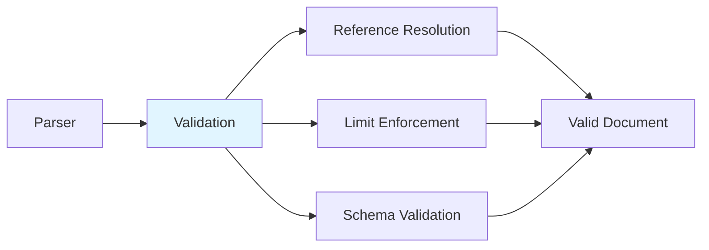

# Validator Component

> Semantic validation and constraint checking in HEDL

## Overview

HEDL validation is integrated into the parsing process. The parser enforces semantic correctness, resolves references, and validates security limits during parsing.

## Responsibility

**Primary Function**: Ensure semantic correctness during parsing

**Key Responsibilities**:
1. Reference validation and resolution
2. Schema validation (struct definitions match usage)
3. Security limit enforcement
4. Duplicate ID detection
5. Orphan row detection (children without NEST)
6. Type collision detection

## Architecture



## Validation During Parsing

Validation happens at parse time, not as a separate pass:

```rust
use hedl::{parse_with_limits, ParseOptions};

// Parse with validation
let opts = ParseOptions::builder()
    .strict(true)  // Strict reference checking
    .max_nodes(10_000)  // Enforce limits
    .build();

let doc = parse_with_limits(input, opts)?;
// All validation passed if no error
```

## Error Types

```rust
use hedl_core::{HedlError, HedlErrorKind};

pub enum HedlErrorKind {
    Syntax,      // Lexical or structural violation
    Version,     // Unsupported version
    Schema,      // Schema violation or mismatch
    Alias,       // Duplicate or invalid alias
    Shape,       // Wrong number of cells in row
    Semantic,    // Logical error (ditto in ID, null in ID)
    OrphanRow,   // Child row without NEST rule
    Collision,   // Duplicate ID within type
    Reference,   // Unresolved reference in strict mode
    Security,    // Security limit exceeded
    Conversion,  // Error during format conversion
    IO,          // I/O error
}
```

## Validation Rules

### Reference Validation

References are validated using a `TypeRegistry`:

```rust
use hedl_core::reference::{TypeRegistry, register_node, resolve_references};

// 1. Register all nodes during parsing
let mut registry = TypeRegistry::new();
for (key, item) in &doc.root {
    if let Item::List(list) = item {
        for node in &list.rows {
            register_node(&mut registry, &node.type_name, &node.id, line_num)?;
        }
    }
}

// 2. Resolve and validate references
// Reference validation based on ParseOptions.strict
resolve_references(&doc, &options)?;
```

Reference errors occur when:
- Reference target doesn't exist
- Type qualifier doesn't match
- Circular references are detected (in strict mode)

### Schema Validation

Schema validation ensures matrix list rows match their struct definitions:

```rust
// Given:
// %STRUCT: User: [id, name, email]
//
// users: @User
//   | alice, Alice, alice@example.com  ✓ Valid (3 fields)
//   | bob, Bob                          ✗ Error (2 fields, expected 3)
```

Errors occur when:
- Row has wrong number of fields
- Matrix list uses undefined type
- Field count doesn't match schema

### Security Limit Validation

Security limits are enforced during parsing:

```rust
pub struct Limits {
    pub max_file_size: usize,         // Default: 1GB
    pub max_line_length: usize,       // Default: 1MB
    pub max_indent_depth: usize,      // Default: 50
    pub max_nodes: usize,             // Default: 10M
    pub max_aliases: usize,           // Default: 10k
    pub max_columns: usize,           // Default: 100
    pub max_nest_depth: usize,        // Default: 100
    pub max_block_string_size: usize, // Default: 10MB
    pub max_object_keys: usize,       // Default: 10k
    pub max_total_keys: usize,        // Default: 10M
}
```

Limit violations immediately abort parsing with a `Security` error.

### Duplicate ID Detection

IDs must be unique within their type:

```hedl
# Error: duplicate ID 'alice' in User
%VERSION: 1.0
%STRUCT: User: [id, name, email]
---
users: @User
  | alice, Alice Smith, alice@example.com
  | alice, Alice Johnson, alice2@example.com
# ✗ Collision - second 'alice' ID is invalid
```

### Orphan Row Detection

Child rows must have a corresponding NEST declaration:

```hedl
# Valid: NEST declared
%VERSION: 1.0
%STRUCT: User: [id, name]
%STRUCT: Post: [id, title]
%NEST: User > Post
---
users: @User
  | alice, Alice
    | p1, First Post

# Invalid: No NEST declared
%VERSION: 1.0
%STRUCT: User: [id, name]
%STRUCT: Post: [id, title]
---
users: @User
  | alice, Alice
    | p1, First Post
# ✗ OrphanRow error - no NEST declaration for Post under User
```

## Example Validation Errors

```rust
use hedl_core::parse;

// Schema mismatch
let input = b"%STRUCT: User: [id, name]\n---\nusers: @User\n  | alice";
assert!(matches!(
    parse(input),
    Err(HedlError { kind: HedlErrorKind::Shape, .. })
));

// Unresolved reference (strict mode)
let input = b"post:\n  author: @unknown";
assert!(matches!(
    parse(input),
    Err(HedlError { kind: HedlErrorKind::Reference, .. })
));

// Security limit exceeded
let opts = ParseOptions::builder().max_nodes(10).build();
let input = generate_large_list(100);  // 100 nodes
assert!(matches!(
    parse_with_limits(input, opts),
    Err(HedlError { kind: HedlErrorKind::Security, .. })
));
```

## Configuration

### Strict vs Lenient Mode

```rust
// Strict mode: unresolved references are errors
let opts = ParseOptions::builder().strict(true).build();
let doc = parse_with_limits(input, opts)?;  // Fails on bad refs

// Lenient mode: unresolved references are ignored
let opts = ParseOptions::builder().strict(false).build();
let doc = parse_with_limits(input, opts)?;  // Continues despite bad refs
```

## Design Decisions

### Why Integrated Validation?

**Decision**: Validate during parsing, not as separate pass

**Rationale**:
- Single traversal of data
- Immediate error reporting
- Lower memory overhead
- Simpler API

**Trade-off**: Cannot parse invalid documents for tooling

### Why Type Registry?

**Decision**: Use registry for reference resolution

**Rationale**:
- O(1) lookup performance
- Supports forward references
- Clear error messages with type info
- Easy to extend

**Trade-off**: Additional memory for registry

## Related Documentation

- [Parser Component](parser.md) - Parsing with validation
- [Error Handling Guide](../../api/guides/error-handling.md) - Error types and recovery

---

