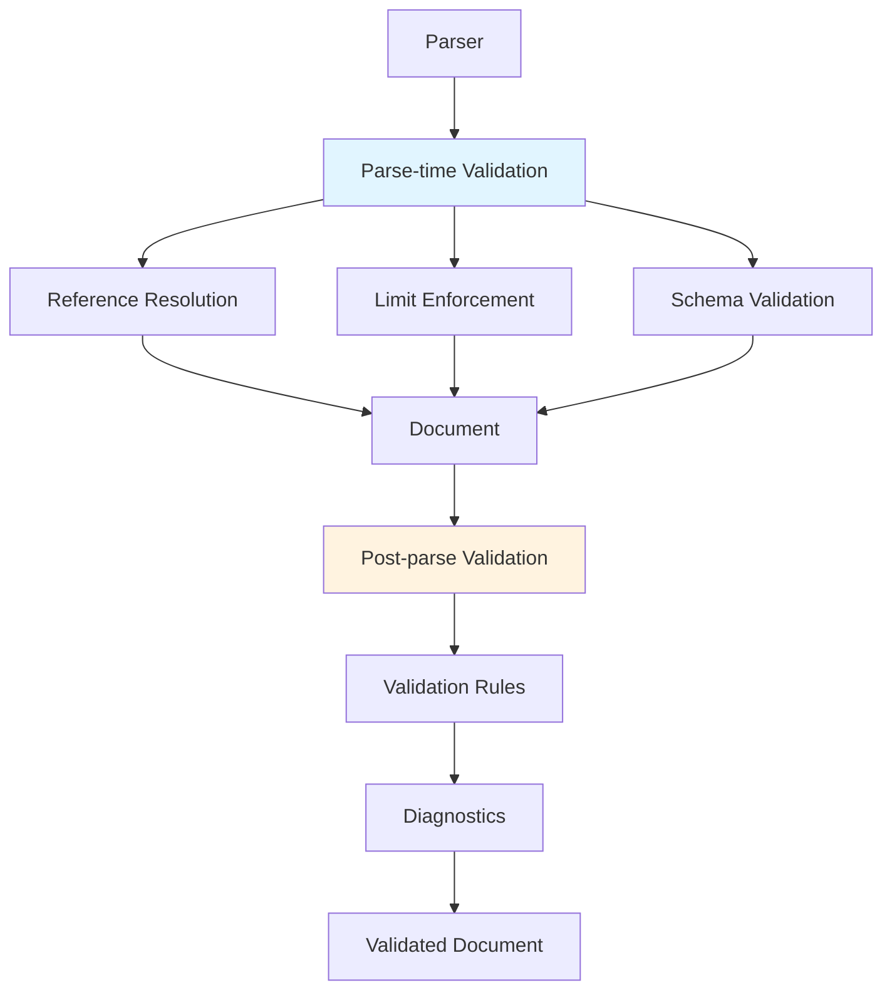

# Validator Component

> Comprehensive validation framework for HEDL documents

## Overview

HEDL provides a comprehensive validation framework that goes beyond basic syntax checking to validate semantic correctness, type safety, referential integrity, and custom business logic. The validation system consists of both parse-time validation (enforced during parsing) and post-parse validation (using the extensible validation framework).

## Responsibility

**Primary Function**: Ensure document correctness at multiple levels

**Key Responsibilities**:
1. Parse-time validation (integrated into parser):
   - Reference validation and resolution
   - Schema validation (struct definitions match usage)
   - Security limit enforcement
   - Duplicate ID detection
   - Orphan row detection (children without NEST)
2. Post-parse validation (extensible framework):
   - Type collision detection
   - Custom business rules
   - Semantic correctness checks
   - Cross-document validation

## Architecture


```mermaid
graph TB
    PARSE[Parser] --> PARSE_VAL[Parse-time Validation]
    PARSE_VAL --> REFS[Reference Resolution]
    PARSE_VAL --> LIMITS[Limit Enforcement]
    PARSE_VAL --> SCHEMA[Schema Validation]

    REFS --> DOC[Document]
    LIMITS --> DOC
    SCHEMA --> DOC

    DOC --> POST_VAL[Post-parse Validation]
    POST_VAL --> RULES[Validation Rules]
    RULES --> DIAG[Diagnostics]
    DIAG --> VALID_DOC[Validated Document]

    style PARSE_VAL fill:#e1f5ff
    style POST_VAL fill:#fff3e0
```

## Parse-time Validation

Basic validation happens during parsing to catch critical errors early:

```rust
use hedl::{parse_with_limits, ParseOptions};

// Parse with validation
let opts = ParseOptions::builder()
    .reference_mode(ReferenceMode::Strict)  // Strict reference checking
    .max_nodes(10_000)  // Enforce limits
    .build();

let doc = parse_with_limits(input, opts)?;
// All validation passed if no error
```

## Error Types

```rust
use hedl_core::{HedlError, HedlErrorKind};

pub enum HedlErrorKind {
    Syntax,      // Lexical or structural violation
    Version,     // Unsupported version
    Schema,      // Schema violation or mismatch
    Alias,       // Duplicate or invalid alias
    Shape,       // Wrong number of cells in row
    Semantic,    // Logical error (null in ID, etc.)
    OrphanRow,   // Child row without NEST rule
    Collision,   // Duplicate ID within type
    Reference,   // Unresolved reference in strict mode
    Security,    // Security limit exceeded
    Conversion,  // Error during format conversion
    IO,          // I/O error
}
```

## Validation Rules

### Reference Validation

References are validated using a `TypeRegistry`:

```rust
use hedl_core::reference::{TypeRegistry, register_node, resolve_references};

// 1. Register all nodes during parsing
let mut registry = TypeRegistry::new();
for (key, item) in &doc.root {
    if let Item::List(list) = item {
        for node in &list.rows {
            register_node(&mut registry, &node.type_name, &node.id, line_num, &limits)?;
        }
    }
}

// 2. Resolve and validate references
// Reference validation based on ParseOptions.reference_mode
resolve_references(&doc, options.reference_mode)?;
```

Reference errors occur when:
- Reference target doesn't exist
- Type qualifier doesn't match
- Circular references are detected (in strict mode)

### Schema Validation

Schema validation ensures matrix list rows match their struct definitions:

```rust
// Given:
// %S:User:[id,name,email]
//
// users:@User
//   |alice,Alice, alice@example.com  ✓ Valid (3 fields)
//   |bob,Bob                          ✗ Error (2 fields, expected 3)
```

Errors occur when:
- Row has wrong number of fields
- Matrix list uses undefined type
- Field count doesn't match schema

### Security Limit Validation

Security limits are enforced during parsing:

```rust
pub struct Limits {
    pub max_file_size: usize,         // Default: 1GB
    pub max_line_length: usize,       // Default: 1MB
    pub max_indent_depth: usize,      // Default: 50
    pub max_nodes: usize,             // Default: 10M
    pub max_aliases: usize,           // Default: 10k
    pub max_columns: usize,           // Default: 100
    pub max_nest_depth: usize,        // Default: 100
    pub max_block_string_size: usize, // Default: 10MB
    pub max_object_keys: usize,       // Default: 10k
    pub max_total_keys: usize,        // Default: 10M
}
```

Limit violations immediately abort parsing with a `Security` error.

### Duplicate ID Detection

IDs must be unique within their type:

```hedl
# Error: duplicate ID 'alice' in User
%V:2.0
%NULL:~
%QUOTE:"
%S:User:[id,name,email]
---
users:@User
 |alice,Alice Smith, alice@example.com
 |alice,Alice Johnson, alice2@example.com
# ✗ Collision - second 'alice' ID is invalid
```

### Orphan Row Detection

Child rows must have a corresponding NEST declaration:

```hedl
# Valid: NEST declared
%V:2.0
%NULL:~
%QUOTE:"
%S:User:[id,name]
%S:Post:[id,title]
%N:User>Post
---
users:@User
 |alice,Alice
 |p1,First Post

# Invalid: No NEST declared
%V:2.0
%NULL:~
%QUOTE:"
%S:User:[id,name]
%S:Post:[id,title]
---
users:@User
 |alice,Alice
 |p1,First Post
# ✗ OrphanRow error - no NEST declaration for Post under User
```

## Example Validation Errors

```rust
use hedl_core::parse;

// Schema mismatch
let input = b"%S:User:[id,name]\n---\nusers:@User\n |alice";
assert!(matches!(
    parse(input),
    Err(HedlError { kind: HedlErrorKind::Shape, .. })
));

// Unresolved reference (strict mode)
let input = b"post:\n  author:@unknown";
assert!(matches!(
    parse(input),
    Err(HedlError { kind: HedlErrorKind::Reference, .. })
));

// Security limit exceeded
let opts = ParseOptions::builder().max_nodes(10).build();
let input = generate_large_list(100);  // 100 nodes
assert!(matches!(
    parse_with_limits(input, opts),
    Err(HedlError { kind: HedlErrorKind::Security, .. })
));
```

## Configuration

### Strict vs Lenient Mode

```rust
// Strict mode: unresolved references are errors
let opts = ParseOptions::builder().reference_mode(ReferenceMode::Strict).build();
let doc = parse_with_limits(input, opts)?;  // Fails on bad refs

// Lenient mode: unresolved references are ignored
let opts = ParseOptions::builder().reference_mode(ReferenceMode::Lenient).build();
let doc = parse_with_limits(input, opts)?;  // Continues despite bad refs
```

## Design Decisions

### Why Integrated Validation?

**Decision**: Validate during parsing, not as separate pass

**Rationale**:
- Single traversal of data
- Immediate error reporting
- Lower memory overhead
- Simpler API

**Trade-off**: Cannot parse invalid documents for tooling

### Why Type Registry?

**Decision**: Use registry for reference resolution

**Rationale**:
- O(1) lookup performance
- Supports forward references
- Clear error messages with type info
- Easy to extend

**Trade-off**: Additional memory for registry

## Post-parse Validation Framework

The validation module (`hedl_core::validation`) provides an extensible framework for advanced validation:

```rust
use hedl_core::validation::{ValidationRunner, LintConfig};

let doc = hedl_core::parse(input)?;
let runner = ValidationRunner::new(LintConfig::default());
let result = runner.validate(&doc);

if !result.is_valid {
    for diagnostic in result.diagnostics {
        eprintln!("{}", diagnostic);
    }
}
```

### Built-in Rules

The framework includes several built-in validation rules:

- **DuplicateKeyRule**: Detects duplicate keys in objects
- **InvalidReferenceRule**: Validates reference integrity
- **TypeMismatchRule**: Checks type consistency
- **UnusedReferenceRule**: Finds unreferenced nodes

### Custom Rules

You can implement custom validation rules using the `Rule` trait:

```rust
use hedl_core::validation::{Rule, ValidationContext, Diagnostic, RuleCategory, Severity};

struct TeamSizeRule;

impl Rule for TeamSizeRule {
    fn id(&self) -> &str { "team-size" }
    fn description(&self) -> &str { "Teams must have 3-50 members" }
    fn category(&self) -> RuleCategory { RuleCategory::BusinessLogic }
    fn default_severity(&self) -> Severity { Severity::Warning }

    fn check(&self, doc: &Document, context: &mut ValidationContext)
        -> Result<Vec<Diagnostic>, HedlError>
    {
        // Custom validation logic here
        Ok(vec![])
    }
}
```

### Diagnostic System

The validation framework provides rich diagnostics with:
- Severity levels (Error, Warning, Info)
- Source locations with line and column numbers
- Suggested fixes (auto-fixable diagnostics)
- Related diagnostics for cross-references
- Diagnostic tags for categorization

## Design Decisions

### Why Two-tier Validation?

**Decision**: Parse-time validation + Post-parse validation framework

**Rationale**:
- Parse-time: Fail-fast for critical errors (syntax, security limits)
- Post-parse: Flexible validation for semantic rules
- Extensibility: Custom rules without modifying parser
- Performance: Optional validation passes

**Trade-off**: More complex architecture

## Related Documentation

- [Parser Component](parser.md) - Parsing with validation
- [Error Handling Guide](../../api/guides/error-handling.md) - Error types and recovery

---

