# Data Flow Architecture

## Overview

This document describes how data flows through the HEDL ecosystem, from raw text input through parsing, transformation, and output to various formats.

## High-Level Data Flow

```mermaid
graph LR
    INPUT[Raw Text Input]
    PREPROCESS[Preprocessing]
    LEX[Lexical Analysis]
    PARSE[Parsing]
    VALIDATE[Validation]
    AST[Document AST]
    TRANSFORM[Transformation]
    OUTPUT[Output Format]

    INPUT --> PREPROCESS
    PREPROCESS --> LEX
    LEX --> PARSE
    PARSE --> VALIDATE
    VALIDATE --> AST
    AST --> TRANSFORM
    TRANSFORM --> OUTPUT

    style INPUT fill:#e3f2fd
    style AST fill:#fff3e0
    style OUTPUT fill:#e8f5e9
```

## Parsing Pipeline

### Input → Document AST

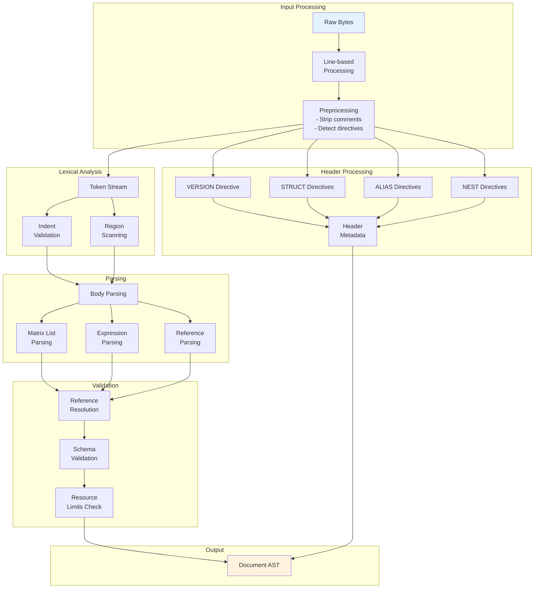

### Detailed Parsing Flow

#### Phase 1: Preprocessing

**Input**: Raw bytes (`&[u8]`)

**Operations**:
1. UTF-8 validation
2. Line-by-line iteration
3. Comment stripping
4. Blank line detection
5. Directive identification

**Output**: Preprocessed lines

**Key Functions**:
```rust
// From hedl-core/src/preprocess.rs
fn preprocess(input: &str) -> impl Iterator<Item = (usize, &str)>  // Returns (line_num, line)
fn is_comment_line(line: &str) -> bool
fn is_blank_line(line: &str) -> bool
// From hedl-core/src/lex/mod.rs
fn strip_comment(line: &str) -> &str
```

#### Phase 2: Header Processing

**Input**: Preprocessed lines before `---` separator

**Operations**:
1. VERSION directive parsing
2. STRUCT schema definitions
3. ALIAS constant definitions
4. NEST relationship definitions

**Output**: Header metadata (internal, not exposed in public API)

Note: The public API exposes the `Document` structure, not the internal `Header`.
From hedl-core/src/document.rs:
```rust
pub struct Document {
    pub version: (u32, u32),
    pub aliases: BTreeMap<String, String>,  // name -> replacement string
    pub structs: BTreeMap<String, Vec<String>>,  // type -> columns
    pub nests: BTreeMap<String, String>,  // parent -> child
    pub root: BTreeMap<String, Item>,
}
```

**Key Functions**:
```rust
// From hedl-core/src/header.rs
fn parse_header(lines: &[&str], limits: &Limits) -> HedlResult<ParsedHeader>
// Returns ParsedHeader with version, structs, aliases, nests
// Note: Header is internal structure, Document fields are public API
```

#### Phase 3: Lexical Analysis

**Input**: Body lines (after `---`)

**Operations**:
1. **Direct Parsing**: Parser consumes input directly (no separate tokenization phase)
2. **Indent Validation**: Check indentation consistency using `calculate_indent`
3. **CSV Row Parsing**: Parse matrix rows using `parse_csv_row` from `lex::row` module
4. **Reference Parsing**: Extract `@Type:id` references during value inference
5. **Block String Parsing**: Handle `"""..."""` multi-line strings

**Output**: Parsed values and structures (no intermediate token stream)

**Key Functions**:
```rust
// From hedl-core/src/lex/mod.rs
pub fn calculate_indent(line: &str) -> HedlResult<usize>  // Returns spaces count
pub fn is_valid_key_token(s: &str) -> bool
pub fn is_valid_type_name(s: &str) -> bool
pub fn strip_comment(line: &str) -> &str

// From hedl-core/src/lex/row.rs
pub fn parse_csv_row(line: &str) -> HedlResult<Vec<String>>  // Returns field values

// From hedl-core/src/inference.rs
fn infer_value(token: &str, ctx: &InferenceContext, line_num: usize) -> HedlResult<Value>
```

#### Phase 4: Parsing

**Input**: Preprocessed lines + Header metadata

**Operations**:
1. **Body Parsing**: Build object hierarchy
2. **Matrix List Parsing**: Parse CSV-style tables
3. **Expression Parsing**: Handle `$(...)` deferred computation
4. **Tensor Parsing**: Parse `[1, 2, 3]` numerical arrays
5. **Value Inference**: Determine types for unquoted values

**Output**: Unvalidated AST

**Key Types**:
```rust
pub struct Document {
    pub version: (u32, u32),
    pub aliases: BTreeMap<String, String>,
    pub structs: BTreeMap<String, Vec<String>>,
    pub nests: BTreeMap<String, String>,
    pub root: BTreeMap<String, Item>,
}

pub enum Item {
    Scalar(Value),
    Object(BTreeMap<String, Item>),
    List(MatrixList),
}
```

**Key Functions**:
```rust
// From hedl-core/src/parser.rs
// Note: These are internal functions; public API is parse() and parse_with_limits()
fn parse_body_section(...) -> HedlResult<BTreeMap<String, Item>>  // Internal parsing
fn parse_item(...) -> HedlResult<(String, Item, usize)>  // Parse single item recursively

// From hedl-core/src/inference.rs
fn infer_value(token: &str, ctx: &InferenceContext, line_num: usize) -> HedlResult<Value>
```

#### Phase 5: Validation

**Input**: Unvalidated AST

**Operations**:
1. **Reference Resolution**: Resolve `@Type:id` to actual nodes
2. **Schema Validation**: Verify matrix lists match STRUCT definitions
3. **NEST Validation**: Build parent-child relationships
4. **Resource Limits**: Enforce security limits

**Output**: Validated Document

**Validation During Parsing**:

Reference resolution and validation occur during parsing, not as a separate post-processing phase:

```rust
// From hedl-core/src/reference.rs (internal module)
pub(crate) fn register_node(registry: &mut TypeRegistry, node: &Node)
// Registers nodes in type registry during parsing

// From hedl-core/src/parser.rs
// Limits are checked during parsing:
// - max_file_size: checked before parsing starts
// - max_total_keys: tracked incrementally and checked during body parsing
// - max_indent_depth: checked during indent calculation
// - max_nodes: checked when adding nodes to matrix lists
```

**Security Limits** (from hedl-core/src/limits.rs):
```rust
pub struct Limits {
    pub max_file_size: usize,           // 1GB default
    pub max_line_length: usize,         // 1MB default
    pub max_indent_depth: usize,        // 50 default
    pub max_nodes: usize,               // 10M default
    pub max_aliases: usize,             // 10k default
    pub max_columns: usize,             // 100 default
    pub max_nest_depth: usize,          // 100 default
    pub max_block_string_size: usize,   // 10MB default
    pub max_object_keys: usize,         // 10k default per object
    pub max_total_keys: usize,          // 10M default cumulative
}
```

## Format Conversion Flow

### Document → JSON

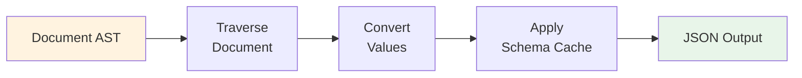

**Process**:
1. Traverse document tree
2. Convert HEDL values to JSON values
3. Apply schema hints from cache
4. Serialize to JSON string

**Key Functions**:
```rust
pub fn to_json(doc: &Document, config: &ToJsonConfig) -> Result<String> {
    let json_value = document_to_json_value(doc, config)?;
    serde_json::to_string_pretty(&json_value)
}
```

### JSON → Document

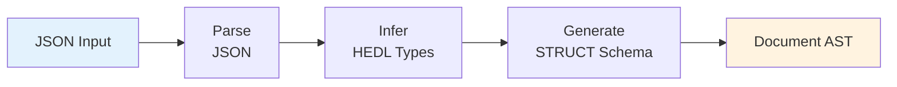

**Process**:
1. Parse JSON to `serde_json::Value`
2. Infer HEDL types from JSON values
3. Generate STRUCT schemas for arrays of objects
4. Build Document AST

**Key Functions**:
```rust
pub fn from_json(json: &str, config: &FromJsonConfig) -> Result<Document> {
    let json_value: serde_json::Value = serde_json::from_str(json)?;
    json_value_to_document(&json_value, config)
}
```

## Streaming Data Flow

### Large File Processing

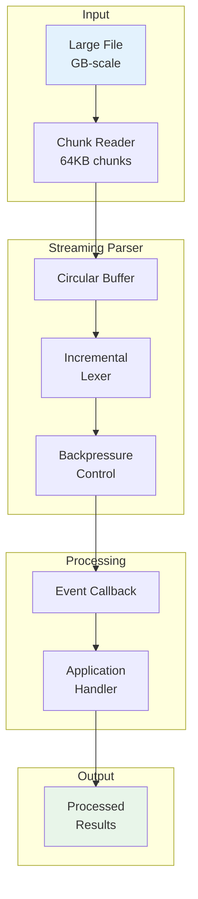

**Key Features**:
1. **Chunked Reading**: Read 64KB at a time
2. **Incremental Parsing**: Parse without full document in memory
3. **Event-Driven**: Callbacks for each parsed item
4. **Backpressure**: Pause input if processing is slow

**Note**: Streaming parser functionality is provided by the `hedl-stream` crate, which offers both synchronous and asynchronous APIs for processing large HEDL files. The core parser in `hedl-core` processes documents in memory.

## Memory Flow

### Memory Optimization

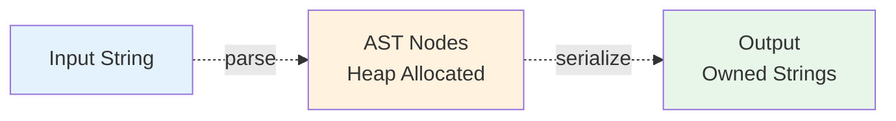

**Strategy**:
1. **Input**: Borrow string slices where possible during initial scanning.
2. **AST**: Use owned `String` for values to ensure document independence and simplicity.
3. **Pre-allocation**: Pre-allocate collection capacity (Vec, BTreeMap) when sizes are known.
4. **Output**: Generate owned strings or stream directly to writers.

**Key Types**:
```rust
// From hedl-core/src/value.rs
pub enum Value {
    Null,
    Bool(bool),
    Int(i64),
    Float(f64),
    String(String),
    Tensor(Tensor),
    Reference(Reference),
    Expression(Expression),
}
```

**Note**: The current implementation uses owned `String` values for simplicity, ergonomics, and compatibility across format conversions. This design choice balances memory usage with API usability.

## Error Flow

### Error Propagation

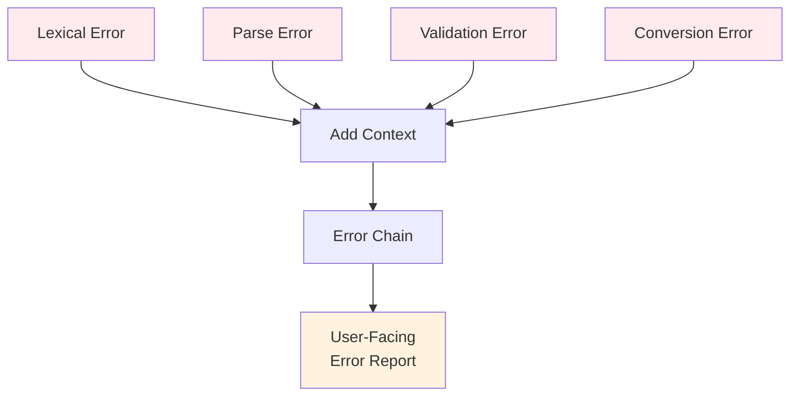

**Error Type**:
```rust
pub struct HedlError {
    pub kind: HedlErrorKind,
    pub message: String,
    pub line: usize,
    pub column: Option<usize>,
    pub context: Option<String>,
}
```

**Error Handling Pattern**:
```rust
fn parse_value(input: &str, line_num: usize) -> Result<Value, HedlError> {
    // Direct parsing without separate lexing phase
    let ctx = InferenceContext::default();

    infer_value(input, &ctx, line_num)
        .map_err(|e| HedlError::syntax(
            format!("Failed to infer value type: {}", e),
            line_num
        ))
}
```

## Caching Flow

### LSP Document Caching

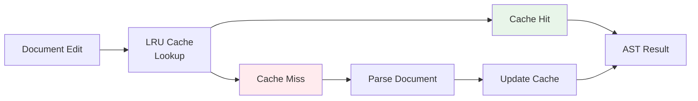

**Cache Strategy**:
1. **LRU Cache**: Keep most recently used documents
2. **Incremental Updates**: Parse only changed regions
3. **Cache Invalidation**: On document change

**Note**: LSP caching is implemented in the `hedl-lsp` crate using LRU caching strategies. The exact cache structure is implementation-specific and may vary. See `hedl-lsp` source code for current implementation details.

### JSON Schema Caching

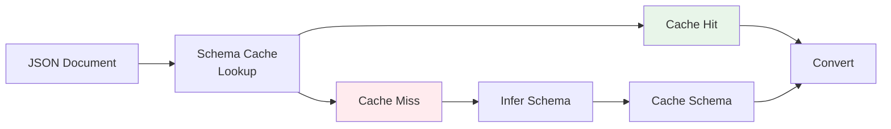

**Schema Cache Strategy**:
1. Cache inferred schemas for common JSON structures
2. Key by JSON structure hash
3. Reuse schema for similar documents

## Parallel Processing Flow

### CLI Parallel Stats

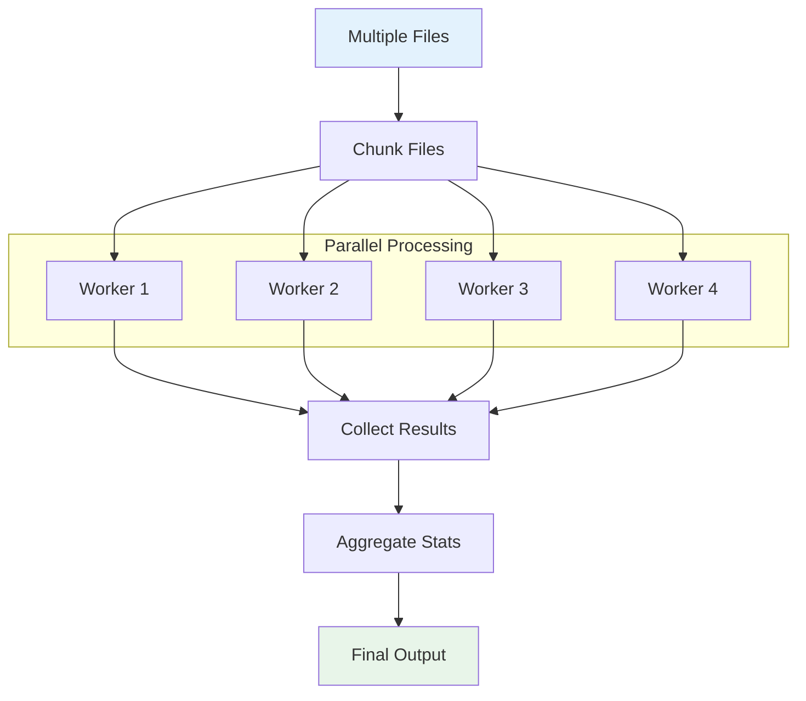

**Pattern**:
```rust
use rayon::prelude::*;

let stats: Vec<Stats> = files
    .par_iter()
    .map(|file| compute_stats(file))
    .collect();

let total = aggregate_stats(&stats);
```

## Data Transformation Flow

### Complete Round-Trip

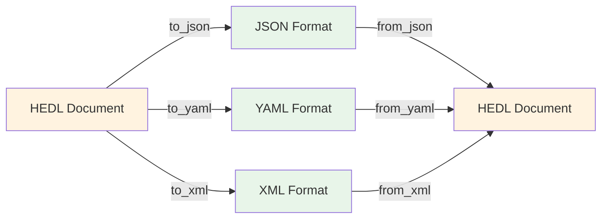

**Guarantees**:
- Type preservation (where possible)
- Reference integrity maintained
- Schema information preserved (via STRUCT)

**Lossy Conversions**:
- Some HEDL features (expressions, ditto) may not round-trip perfectly
- Type inference may differ on reverse conversion

## See Also

- [Parsing Pipeline](parsing-pipeline.md) - Detailed parser architecture
- [Format Adapters](format-adapters.md) - Format conversion details
- [Performance Architecture](performance.md) - Performance optimizations

---

*Last updated: 2026-01-06*
