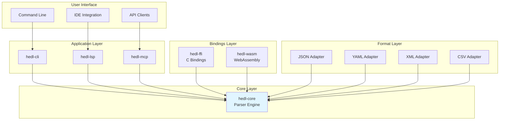
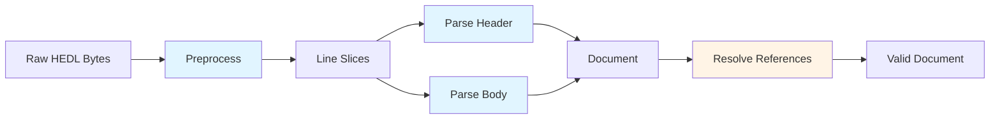

# Architecture Diagrams

> Visual representations of HEDL system architecture

## Overview

This section provides comprehensive architectural diagrams using Mermaid for visualizing system structure, data flow, component relationships, and interaction sequences.

## Diagram Catalog

- [System Overview](system-overview.md) - High-level system architecture
- [Data Flow](data-flow.md) - Data transformation pipelines
- [Component Relationships](component-relationships.md) - Component dependencies
- [Sequence Diagrams](sequence-diagrams.md) - Interaction sequences

## Quick Reference Diagrams

### High-Level Architecture

### Parsing Pipeline

## Diagram Conventions

### Colors
- **Blue (#e1f5ff)**: Core components
- **Orange (#fff4e6)**: Tool/utility components
- **Green**: Data structures
- **Gray**: External systems

### Arrow Types
- **Solid line**: Direct dependency
- **Dashed line**: Optional dependency
- **Dotted line**: Data flow

## Related Documentation

- [System Overview Diagrams](system-overview.md)
- [Data Flow Diagrams](data-flow.md)
- [Component Diagrams](component-relationships.md)
- [Sequence Diagrams](sequence-diagrams.md)

---

