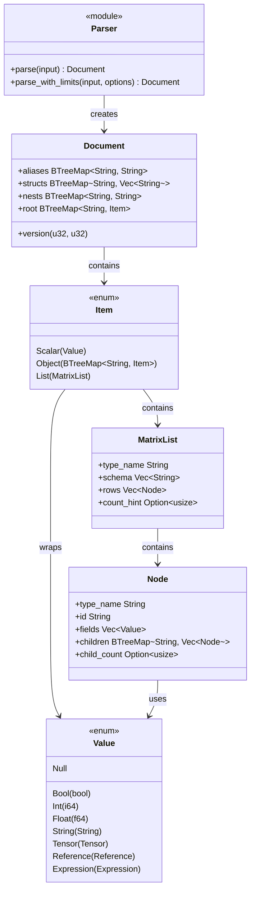
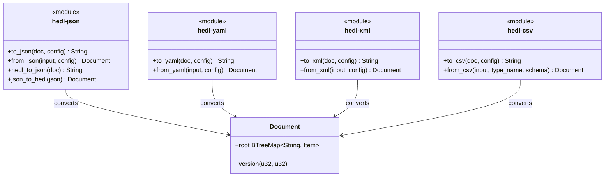
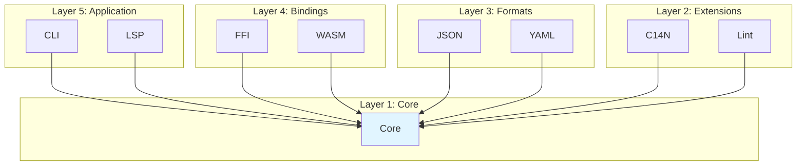

# Component Relationship Diagrams

> Component dependencies and interactions

## Core Component Relationships

```mermaid
classDiagram
    class Parser {
        <<module>>
        +parse(input) Document
        +parse_with_limits(input, options) Document
    }

    class Document {
        +version (u32, u32)
        +aliases BTreeMap~String, String~
        +structs BTreeMap~String, Vec~String~~
        +nests BTreeMap~String, String~
        +root BTreeMap~String, Item~
    }

    class Item {
        <<enum>>
        Scalar(Value)
        Object(BTreeMap~String, Item~)
        List(MatrixList)
    }

    class MatrixList {
        +type_name String
        +schema Vec~String~
        +rows Vec~Node~
        +count_hint Option~usize~
    }

    class Node {
        +type_name String
        +id String
        +fields Vec~Value~
        +children BTreeMap~String, Vec~Node~~
        +child_count Option~usize~
    }

    class Value {
        <<enum>>
        Null
        Bool(bool)
        Int(i64)
        Float(f64)
        String(String)
        Tensor(Tensor)
        Reference(Reference)
        Expression(Expression)
    }

    Parser --> Document : creates
    Document --> Item : contains
    Item --> Value : wraps
    Item --> MatrixList : contains
    MatrixList --> Node : contains
    Node --> Value : uses
```

## Format Adapter Relationships

```mermaid
classDiagram
    class hedl-json {
        <<module>>
        +to_json(doc, config) String
        +from_json(input, config) Document
        +hedl_to_json(doc) String
        +json_to_hedl(json) Document
    }

    class hedl-yaml {
        <<module>>
        +to_yaml(doc, config) String
        +from_yaml(input, config) Document
    }

    class hedl-xml {
        <<module>>
        +to_xml(doc, config) String
        +from_xml(input, config) Document
    }

    class hedl-csv {
        <<module>>
        +to_csv(doc, config) String
        +from_csv(input, type_name, schema) Document
    }

    class Document {
        +version (u32, u32)
        +root BTreeMap~String, Item~
    }

    hedl-json --> Document : converts
    hedl-yaml --> Document : converts
    hedl-xml --> Document : converts
    hedl-csv --> Document : converts
```

## Layer Dependencies

```mermaid
graph TB
    subgraph "Layer 5: Application"
        CLI[CLI]
        LSP[LSP]
    end

    subgraph "Layer 4: Bindings"
        FFI[FFI]
        WASM[WASM]
    end

    subgraph "Layer 3: Formats"
        JSON[JSON]
        YAML[YAML]
    end

    subgraph "Layer 2: Extensions"
        C14N[C14N]
        LINT[Lint]
    end

    subgraph "Layer 1: Core"
        CORE[Core]
    end

    CLI --> CORE
    LSP --> CORE
    FFI --> CORE
    WASM --> CORE
    JSON --> CORE
    YAML --> CORE
    C14N --> CORE
    LINT --> CORE

    style CORE fill:#e1f5ff
```

---

