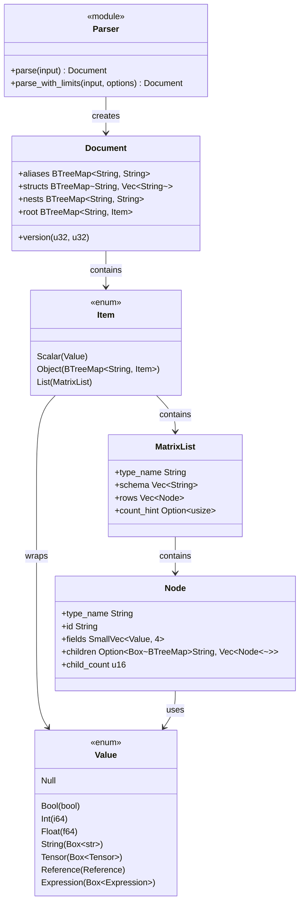
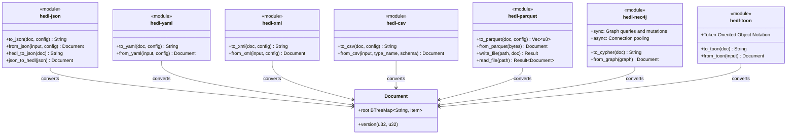
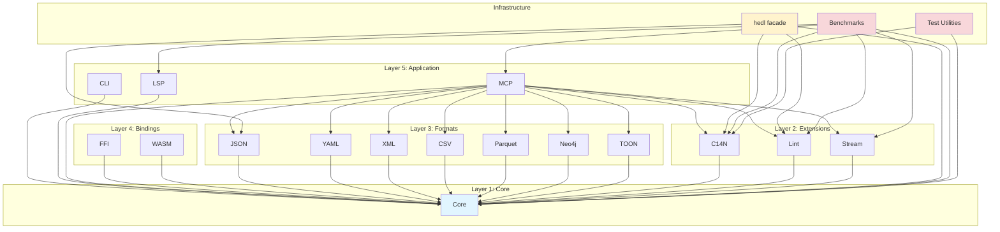

# Component Relationship Diagrams

> Component dependencies and interactions

## Core Component Relationships

## Format Adapter Relationships

## Layer Dependencies

## Complete Crate Dependency Graph

```mermaid
graph TB
    subgraph "Applications (Layer 5)"
        CLI[hedl-cli]
        LSP[hedl-lsp]
        MCP[hedl-mcp]
    end

    subgraph "Bindings (Layer 4)"
        FFI[hedl-ffi]
        WASM[hedl-wasm]
    end

    subgraph "Format Converters (Layer 3)"
        JSON[hedl-json]
        YAML[hedl-yaml]
        XML[hedl-xml]
        CSV[hedl-csv]
        PARQUET[hedl-parquet]
        NEO4J[hedl-neo4j]
        TOON[hedl-toon]
    end

    subgraph "Extensions (Layer 2)"
        C14N[hedl-c14n]
        LINT[hedl-lint]
        STREAM[hedl-stream]
    end

    subgraph "Foundation (Layer 1)"
        CORE[hedl-core]
    end

    subgraph "Infrastructure Crates"
        FACADE[hedl]
        BENCH[hedl-bench]
        TEST[hedl-test]
    end

    %% Application Layer Dependencies
    CLI --> CORE
    CLI --> JSON
    CLI --> YAML
    CLI --> XML
    CLI --> CSV
    CLI --> C14N
    CLI --> LINT

    LSP --> CORE
    LSP --> C14N
    LSP --> LINT

    MCP --> CORE
    MCP --> JSON
    MCP --> YAML
    MCP --> XML
    MCP --> CSV
    MCP --> PARQUET
    MCP --> NEO4J
    MCP --> TOON
    MCP --> C14N
    MCP --> LINT
    MCP --> STREAM

    %% Bindings Layer Dependencies
    FFI --> CORE
    WASM --> CORE

    %% Format Layer Dependencies
    JSON --> CORE
    YAML --> CORE
    XML --> CORE
    CSV --> CORE
    PARQUET --> CORE
    NEO4J --> CORE
    TOON --> CORE

    %% Extension Layer Dependencies
    C14N --> CORE
    LINT --> CORE
    STREAM --> CORE

    %% Facade Dependencies
    FACADE --> CORE
    FACADE --> C14N
    FACADE --> JSON
    FACADE --> LINT

    %% Infrastructure Dependencies
    BENCH --> CORE
    BENCH --> STREAM
    BENCH --> C14N
    BENCH --> LINT
    BENCH --> LSP
    BENCH --> MCP
    BENCH --> JSON
    BENCH --> YAML
    BENCH --> XML
    BENCH --> CSV
    BENCH --> PARQUET
    BENCH --> NEO4J
    BENCH --> TOON
    BENCH --> FFI

    TEST --> CORE
    TEST --> C14N

    %% Styling
    style CORE fill:#e1f5ff,stroke:#0066cc,stroke-width:3px
    style FACADE fill:#fff3cd,stroke:#856404,stroke-width:2px
    style BENCH fill:#f8d7da,stroke:#721c24,stroke-width:2px
    style TEST fill:#f8d7da,stroke:#721c24,stroke-width:2px
    style MCP fill:#d4edda,stroke:#155724,stroke-width:2px
```

## Crate Summary

| Crate | Layer | Purpose | Dependencies on Core |
|-------|-------|---------|---------------------|
| **hedl-core** | Layer 1 | Core parser, types, validation | - |
| **hedl-c14n** | Layer 2 | Canonicalization for consistent output | hedl-core |
| **hedl-lint** | Layer 2 | Linting and validation rules | hedl-core |
| **hedl-stream** | Layer 2 | Streaming parser for large files | hedl-core |
| **hedl-json** | Layer 3 | JSON bidirectional conversion | hedl-core |
| **hedl-yaml** | Layer 3 | YAML bidirectional conversion | hedl-core |
| **hedl-xml** | Layer 3 | XML bidirectional conversion | hedl-core |
| **hedl-csv** | Layer 3 | CSV bidirectional conversion | hedl-core |
| **hedl-parquet** | Layer 3 | Parquet columnar format conversion | hedl-core |
| **hedl-neo4j** | Layer 3 | Neo4j graph database integration | hedl-core |
| **hedl-toon** | Layer 3 | TOON (Token-Oriented Object Notation) | hedl-core |
| **hedl-ffi** | Layer 4 | C FFI bindings for cross-language use | hedl-core |
| **hedl-wasm** | Layer 4 | WebAssembly bindings for browser/JS | hedl-core |
| **hedl-cli** | Layer 5 | Command-line interface tool | hedl-core + formats |
| **hedl-lsp** | Layer 5 | Language Server Protocol implementation | hedl-core, c14n, lint |
| **hedl-mcp** | Layer 5 | Model Context Protocol server for AI/LLM | All format crates |
| **hedl** | Facade | Unified API exposing common functionality | core, json, c14n, lint |
| **hedl-test** | Infra | Shared test fixtures and utilities | hedl-core, c14n |
| **hedl-bench** | Infra | Benchmarks and performance testing | Most crates |

---

