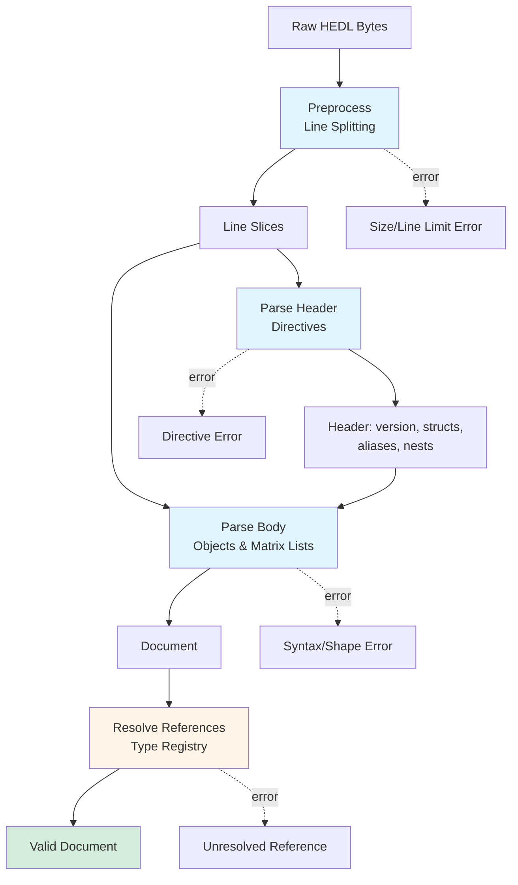
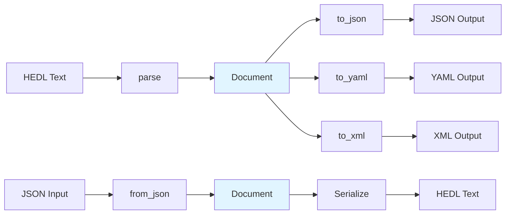
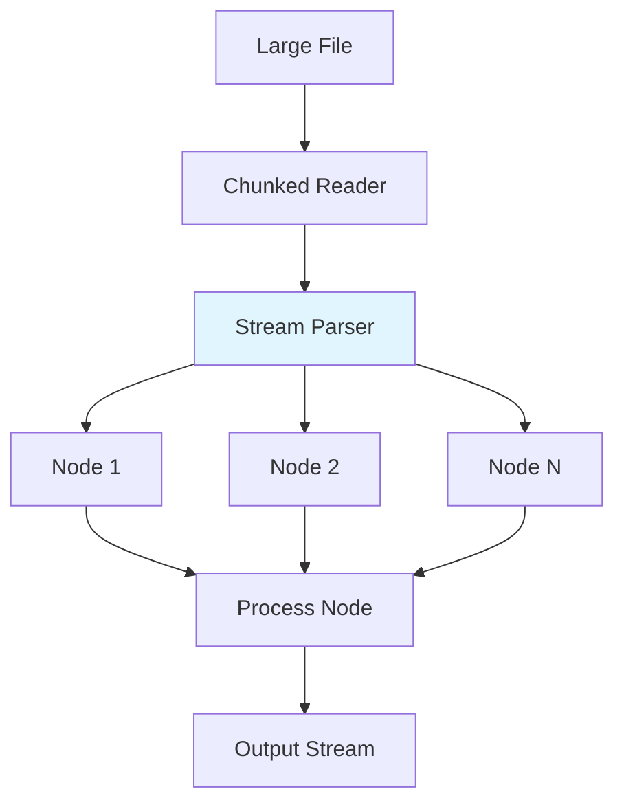
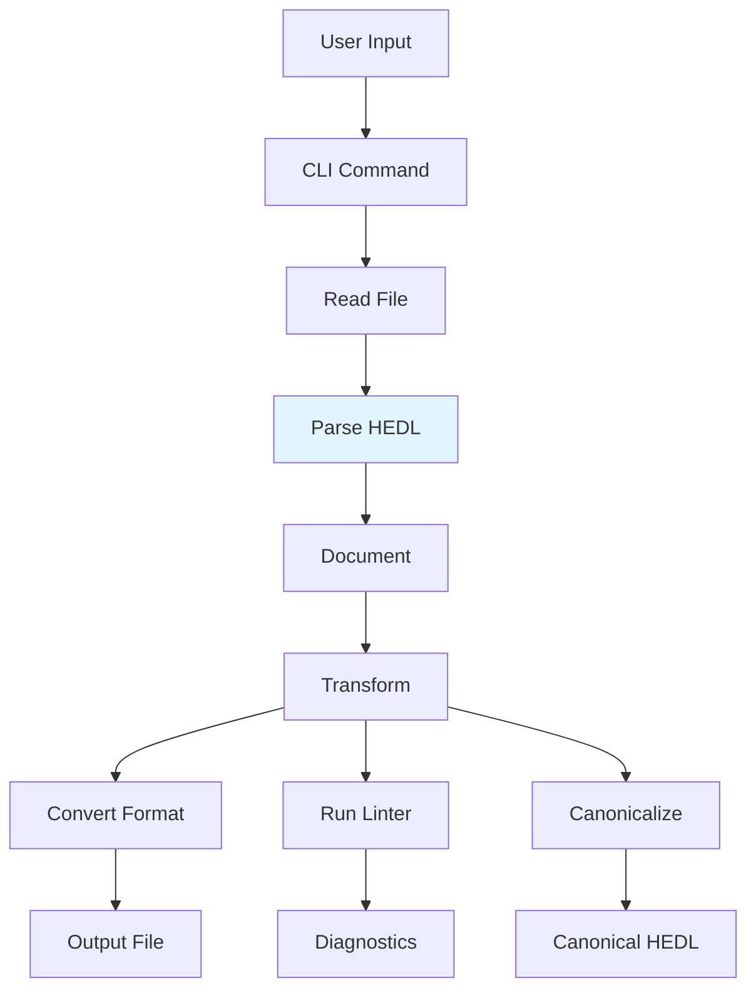

# Data Flow Diagrams

> Data transformation and processing flows

## Parsing Data Flow

```mermaid
flowchart TB
    INPUT[Raw HEDL Bytes] --> PREPROC[Preprocess<br/>Line Splitting]
    PREPROC --> LINES[Line Slices]
    LINES --> HEADER[Parse Header<br/>Directives]
    HEADER --> HDOC[Header: version, structs,<br/>aliases, nests]
    LINES --> BODY[Parse Body<br/>Objects & Matrix Lists]
    HDOC --> BODY
    BODY --> DOC[Document]
    DOC --> REFS[Resolve References<br/>Type Registry]
    REFS --> FINAL[Valid Document]

    PREPROC -.error.-> ERR1[Size/Line Limit Error]
    HEADER -.error.-> ERR2[Directive Error]
    BODY -.error.-> ERR3[Syntax/Shape Error]
    REFS -.error.-> ERR4[Unresolved Reference]

    style PREPROC fill:#e1f5ff
    style HEADER fill:#e1f5ff
    style BODY fill:#e1f5ff
    style REFS fill:#fff4e6
    style FINAL fill:#d4edda
```

## Format Conversion Flow

```mermaid
flowchart LR
    HEDL1[HEDL Text] --> PARSE[parse]
    PARSE --> DOC[Document]
    DOC --> JSON_CONV[to_json]
    DOC --> YAML_CONV[to_yaml]
    DOC --> XML_CONV[to_xml]
    JSON_CONV --> JSON[JSON Output]
    YAML_CONV --> YAML[YAML Output]
    XML_CONV --> XML[XML Output]

    JSON2[JSON Input] --> FROM_JSON[from_json]
    FROM_JSON --> DOC2[Document]
    DOC2 --> TO_HEDL[Serialize]
    TO_HEDL --> HEDL2[HEDL Text]

    style DOC fill:#e1f5ff
    style DOC2 fill:#e1f5ff
```

## Streaming Data Flow

```mermaid
flowchart TB
    LARGE[Large File] --> CHUNK[Chunked Reader]
    CHUNK --> STREAM[Stream Parser]
    STREAM --> NODE1[Node 1]
    STREAM --> NODE2[Node 2]
    STREAM --> NODE3[Node N]

    NODE1 --> PROCESS[Process Node]
    NODE2 --> PROCESS
    NODE3 --> PROCESS

    PROCESS --> OUTPUT[Output Stream]

    style STREAM fill:#e1f5ff
```

## CLI Workflow

```mermaid
flowchart TB
    USER[User Input] --> CLICMD[CLI Command]
    CLICMD --> READ[Read File]
    READ --> PARSE[Parse HEDL]
    PARSE --> DOC[Document]
    DOC --> TRANSFORM[Transform]

    TRANSFORM --> CONVERT[Convert Format]
    TRANSFORM --> LINT[Run Linter]
    TRANSFORM --> CANON[Canonicalize]

    CONVERT --> OUTPUT1[Output File]
    LINT --> OUTPUT2[Diagnostics]
    CANON --> OUTPUT3[Canonical HEDL]

    style PARSE fill:#e1f5ff
```

---

