# LSP Message Flow Diagrams

**Protocol sequence diagrams showing major LSP operations in the HEDL language server.**

---

## 1. Initialization Sequence

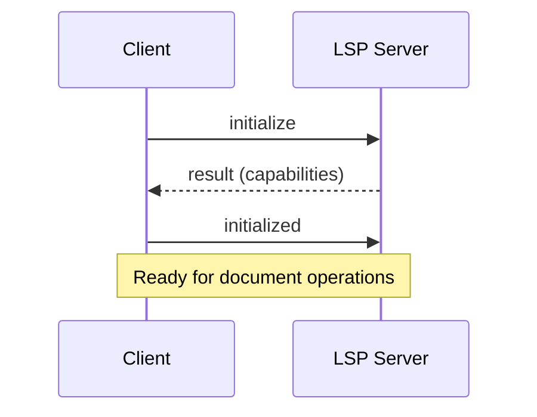
```mermaid
sequenceDiagram
    participant C as Client
    participant S as LSP Server

    C->>S: initialize
    S-->>C: result (capabilities)
    C->>S: initialized
    Note over C,S: Ready for document operations
```

**Server Response:**

```json
{
  "capabilities": {
    "textDocumentSync": { "openClose": true, "change": 1 },
    "completionProvider": { "triggerCharacters": ["@", ":", "%"] },
    "hoverProvider": true,
    "definitionProvider": true,
    "referencesProvider": true,
    "documentSymbolProvider": true,
    "workspaceSymbolProvider": true,
    "documentFormattingProvider": true,
    "renameProvider": { "prepareProvider": true },
    "semanticTokensProvider": { "full": true, "legend": { ... } }
  }
}
```

---

## 2. Document Lifecycle

### 2.1 Open Document

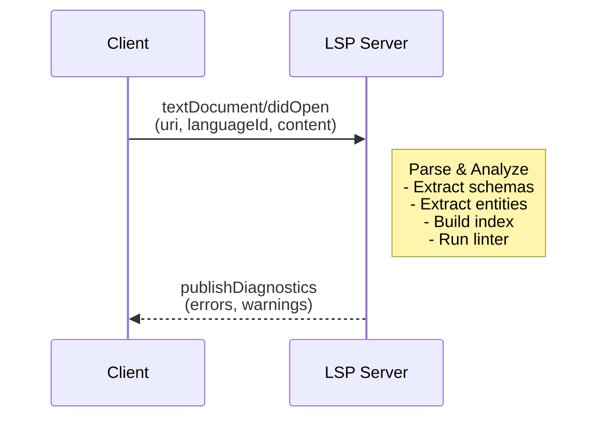
```mermaid
sequenceDiagram
    participant C as Client
    participant S as LSP Server

    C->>S: textDocument/didOpen<br/>(uri, languageId, content)
    Note right of S: Parse & Analyze<br/>- Extract schemas<br/>- Extract entities<br/>- Build index<br/>- Run linter
    S-->>C: publishDiagnostics<br/>(errors, warnings)
```

### 2.2 Edit Document (with Debouncing)

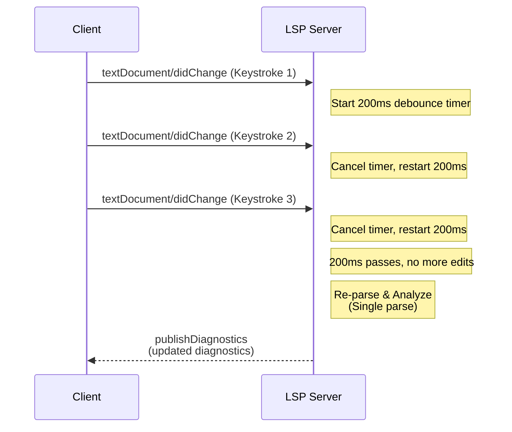
```mermaid
sequenceDiagram
    participant C as Client
    participant S as LSP Server

    C->>S: textDocument/didChange (Keystroke 1)
    Note right of S: Start 200ms debounce timer

    C->>S: textDocument/didChange (Keystroke 2)
    Note right of S: Cancel timer, restart 200ms

    C->>S: textDocument/didChange (Keystroke 3)
    Note right of S: Cancel timer, restart 200ms

    Note right of S: 200ms passes, no more edits
    Note right of S: Re-parse & Analyze<br/>(Single parse)
    S-->>C: publishDiagnostics<br/>(updated diagnostics)
```

### 2.3 Save Document

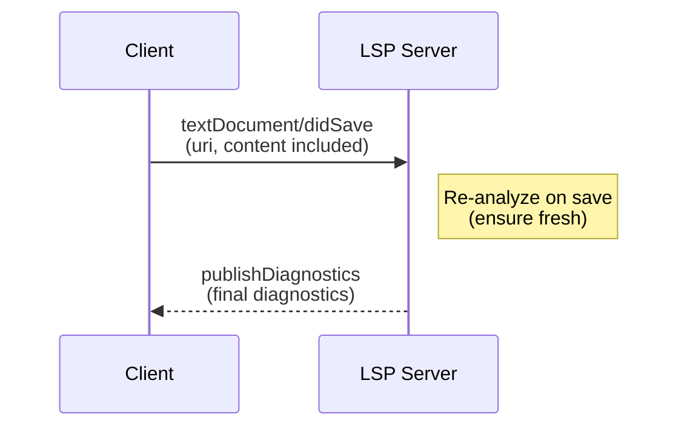
```mermaid
sequenceDiagram
    participant C as Client
    participant S as LSP Server

    C->>S: textDocument/didSave<br/>(uri, content included)
    Note right of S: Re-analyze on save<br/>(ensure fresh)
    S-->>C: publishDiagnostics<br/>(final diagnostics)
```

### 2.4 Close Document

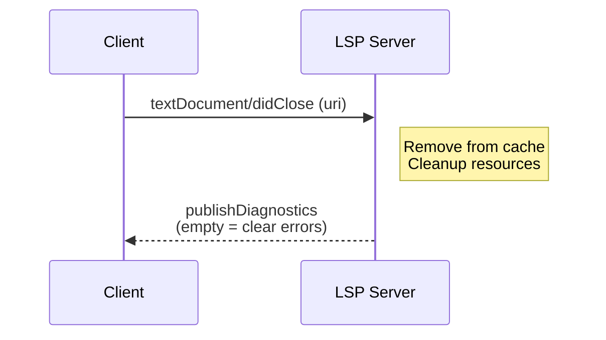
```mermaid
sequenceDiagram
    participant C as Client
    participant S as LSP Server

    C->>S: textDocument/didClose (uri)
    Note right of S: Remove from cache<br/>Cleanup resources
    S-->>C: publishDiagnostics<br/>(empty = clear errors)
```

---

## 3. Completion Request Flow

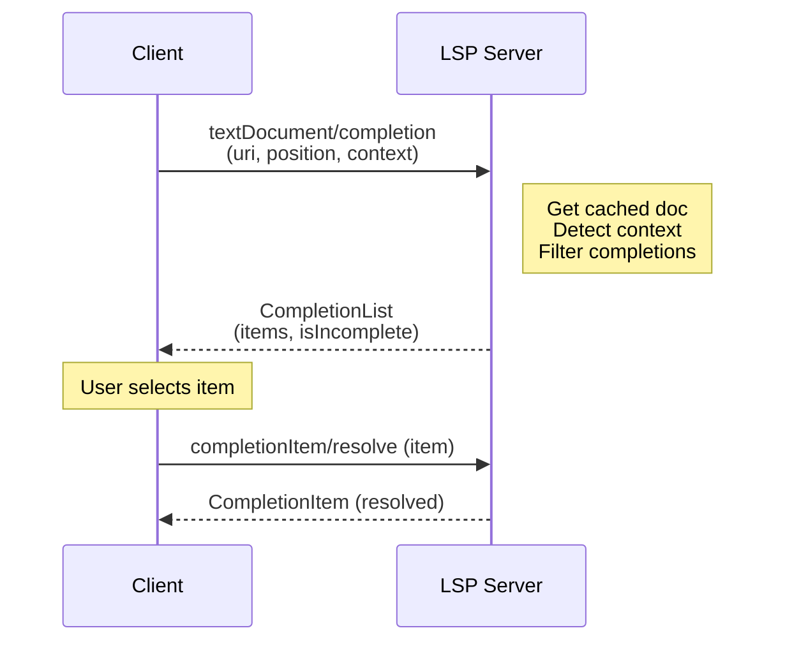
```mermaid
sequenceDiagram
    participant C as Client
    participant S as LSP Server

    C->>S: textDocument/completion<br/>(uri, position, context)
    Note right of S: Get cached doc<br/>Detect context<br/>Filter completions
    S-->>C: CompletionList<br/>(items, isIncomplete)

    Note over C: User selects item

    C->>S: completionItem/resolve (item)
    S-->>C: CompletionItem (resolved)
```

**Completion Contexts:**

| Context | Trigger | Examples |
|---------|---------|----------|
| Header | Line start | `%V:`, `%S:`, `%A:` |
| Reference Type | After `@` | `@User`, `@Post` |
| Reference ID | After `@Type:` | `@User:alice` |
| List Type | After `:` | `@User[id,name]` |
| Matrix Cell | After `\|` | `~`, `true`, `@User:` |
| Key | Line start | `users:`, `posts:` |
| Value | After `:` | `$alias`, `@User:alice` |

---

## 4. Hover Request Flow

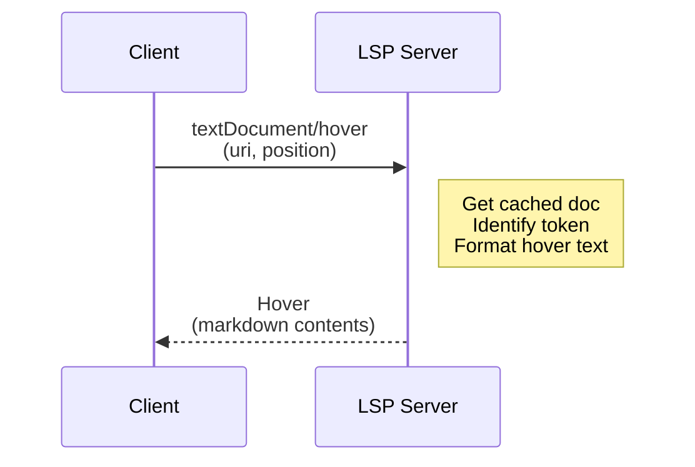
```mermaid
sequenceDiagram
    participant C as Client
    participant S as LSP Server

    C->>S: textDocument/hover<br/>(uri, position)
    Note right of S: Get cached doc<br/>Identify token<br/>Format hover text
    S-->>C: Hover<br/>(markdown contents)
```

**Hover Information:**

| Token Type | Information Displayed |
|------------|----------------------|
| Directive | Syntax, parameters, description |
| Schema | Field names, count, nested children |
| Reference | Type, ID, status, resolved data |
| Alias | Name, expanded value, definition line |
| Special (`~`) | Token meaning and usage |

---

## 5. Go to Definition Flow

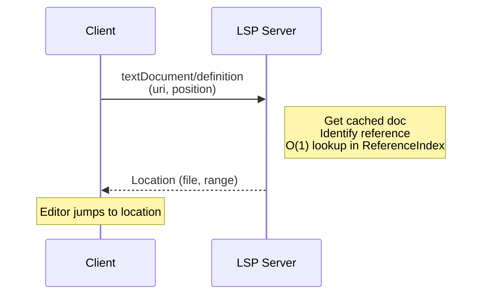
```mermaid
sequenceDiagram
    participant C as Client
    participant S as LSP Server

    C->>S: textDocument/definition<br/>(uri, position)
    Note right of S: Get cached doc<br/>Identify reference<br/>O(1) lookup in ReferenceIndex
    S-->>C: Location (file, range)
    Note over C: Editor jumps to location
```

**Performance:**

| Entity Count | Lookup Time (O(1)) |
|--------------|-------------------|
| 100 | ~22ns |
| 1,000 | ~22ns |
| 10,000 | ~22ns |
| 100,000 | ~22ns |

---

## 6. Find References Flow

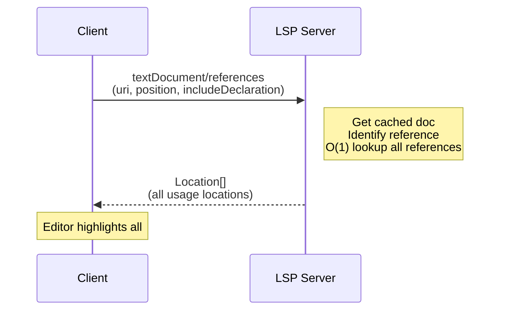
```mermaid
sequenceDiagram
    participant C as Client
    participant S as LSP Server

    C->>S: textDocument/references<br/>(uri, position, includeDeclaration)
    Note right of S: Get cached doc<br/>Identify reference<br/>O(1) lookup all references
    S-->>C: Location[]<br/>(all usage locations)
    Note over C: Editor highlights all
```

**Example Result:**

```hedl
# Query: Find references to "alice"
# Results:

users: @User
 |alice,Alice Smith        # (definition)

posts: @Post
 |post1,@User:alice        # (reference 1)

comments: @Comment
 |comment1,@User:alice     # (reference 2)
```

---

## 7. Document Symbols Flow

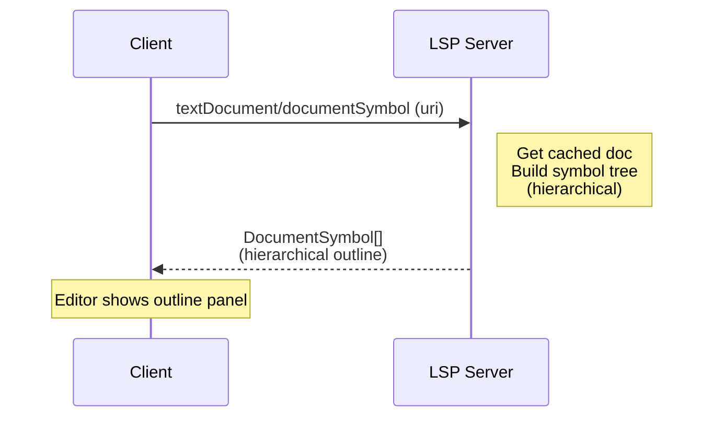
```mermaid
sequenceDiagram
    participant C as Client
    participant S as LSP Server

    C->>S: textDocument/documentSymbol (uri)
    Note right of S: Get cached doc<br/>Build symbol tree<br/>(hierarchical)
    S-->>C: DocumentSymbol[]<br/>(hierarchical outline)
    Note over C: Editor shows outline panel
```

**Symbol Hierarchy:**

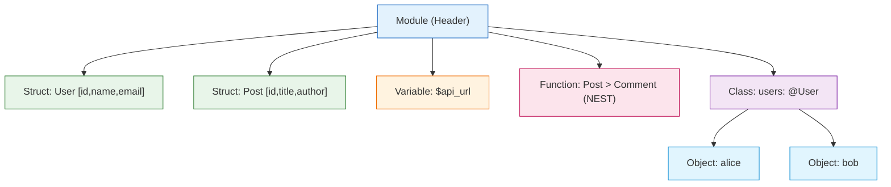
```mermaid
graph TD
    M["Module (Header)"]
    M --> S1["Struct: User [id,name,email]"]
    M --> S2["Struct: Post [id,title,author]"]
    M --> V["Variable: $api_url"]
    M --> F["Function: Post > Comment (NEST)"]
    M --> CL["Class: users: @User"]
    CL --> O1["Object: alice"]
    CL --> O2["Object: bob"]

    style M fill:#e3f2fd,stroke:#1565c0
    style S1 fill:#e8f5e9,stroke:#2e7d32
    style S2 fill:#e8f5e9,stroke:#2e7d32
    style V fill:#fff3e0,stroke:#ef6c00
    style F fill:#fce4ec,stroke:#c2185b
    style CL fill:#f3e5f5,stroke:#7b1fa2
    style O1 fill:#e1f5fe,stroke:#0288d1
    style O2 fill:#e1f5fe,stroke:#0288d1
```

---

## 8. Workspace Symbols Flow

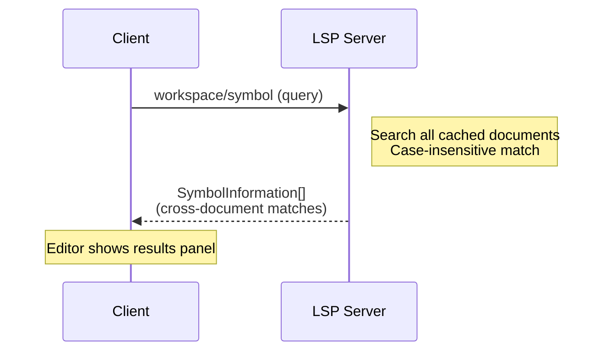
```mermaid
sequenceDiagram
    participant C as Client
    participant S as LSP Server

    C->>S: workspace/symbol (query)
    Note right of S: Search all cached documents<br/>Case-insensitive match
    S-->>C: SymbolInformation[]<br/>(cross-document matches)
    Note over C: Editor shows results panel
```

**Search Result Format:**

| Query: "user" | File | Line |
|---------------|------|------|
| User (schema) | users.hedl | 5 |
| users (list) | data.hedl | 12 |
| user_roles (alias) | settings.hedl | 8 |
| user_count (field) | stats.hedl | 23 |

---

## 9. Document Formatting Flow

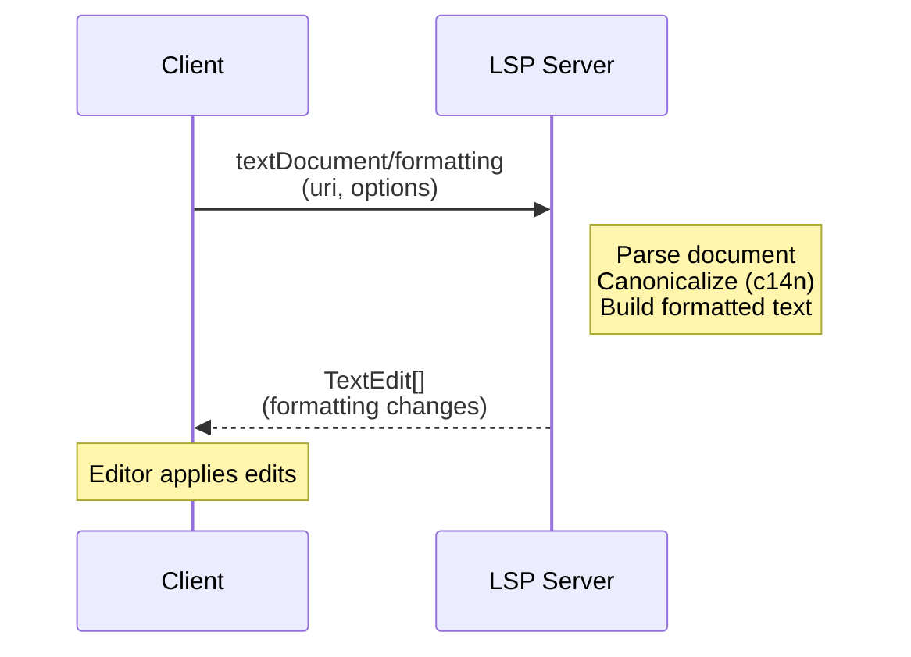
```mermaid
sequenceDiagram
    participant C as Client
    participant S as LSP Server

    C->>S: textDocument/formatting<br/>(uri, options)
    Note right of S: Parse document<br/>Canonicalize (c14n)<br/>Build formatted text
    S-->>C: TextEdit[]<br/>(formatting changes)
    Note over C: Editor applies edits
```

**Formatting Changes:**

Before:
```hedl
users:@User[id,name]
|alice,Alice Smith
```

After:
```hedl
users: @User
 |alice,Alice Smith
```

---

## 10. Rename Refactoring Flow

### 10.1 Prepare Rename

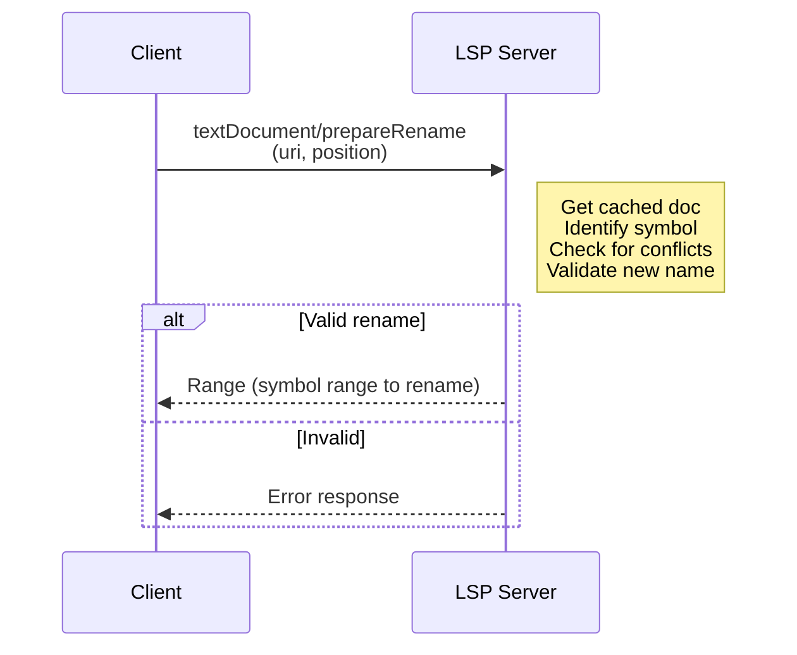
```mermaid
sequenceDiagram
    participant C as Client
    participant S as LSP Server

    C->>S: textDocument/prepareRename<br/>(uri, position)
    Note right of S: Get cached doc<br/>Identify symbol<br/>Check for conflicts<br/>Validate new name
    alt Valid rename
        S-->>C: Range (symbol range to rename)
    else Invalid
        S-->>C: Error response
    end
```

### 10.2 Execute Rename

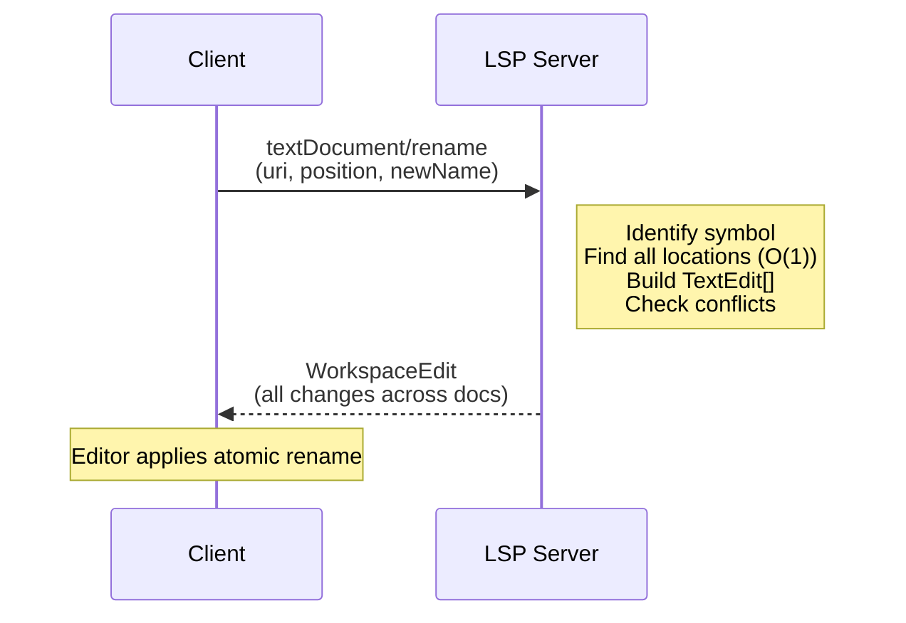
```mermaid
sequenceDiagram
    participant C as Client
    participant S as LSP Server

    C->>S: textDocument/rename<br/>(uri, position, newName)
    Note right of S: Identify symbol<br/>Find all locations (O(1))<br/>Build TextEdit[]<br/>Check conflicts
    S-->>C: WorkspaceEdit<br/>(all changes across docs)
    Note over C: Editor applies atomic rename
```

**Rename Example:**

```
Before:
  Entity: alice
  References: 3 locations

After: textDocument/rename("alice", "alice_smith")

Result: 3 TextEdit objects applied atomically
  Line 16: alice -> alice_smith (definition)
  Line 42: @User:alice -> @User:alice_smith
  Line 58: @User:alice -> @User:alice_smith
```

---

## 11. Diagnostic Publishing

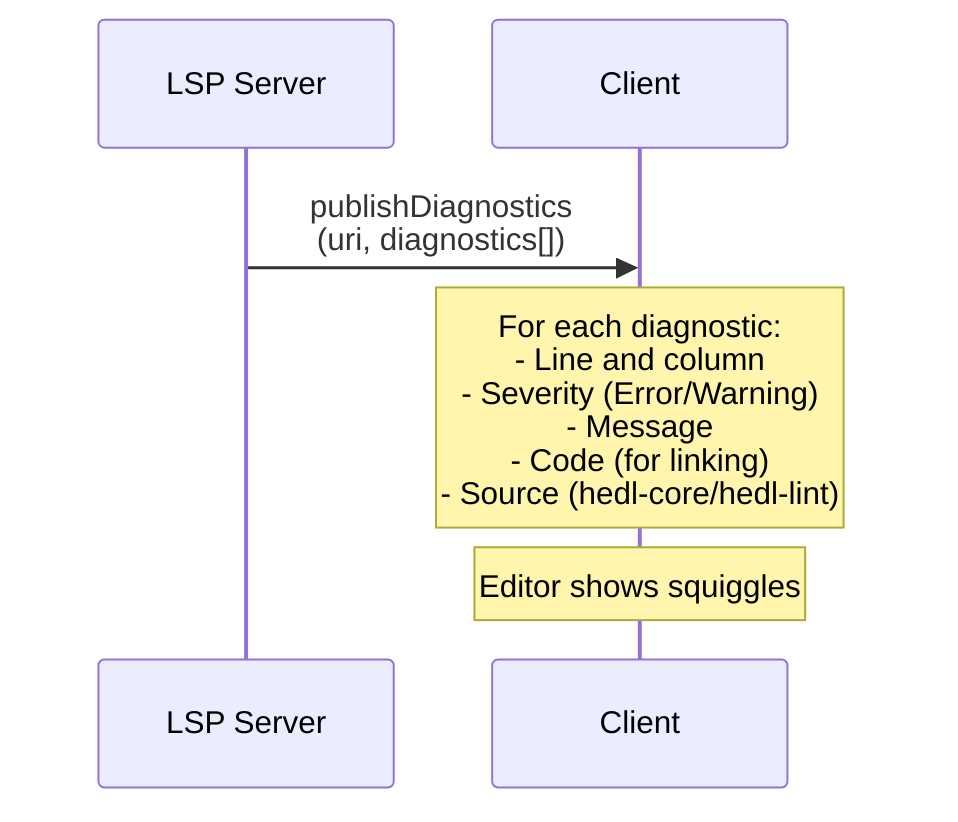
```mermaid
sequenceDiagram
    participant S as LSP Server
    participant C as Client

    S->>C: publishDiagnostics<br/>(uri, diagnostics[])
    Note over C: For each diagnostic:<br/>- Line and column<br/>- Severity (Error/Warning)<br/>- Message<br/>- Code (for linking)<br/>- Source (hedl-core/hedl-lint)
    Note over C: Editor shows squiggles
```

**Diagnostic Types:**

| Category | Source | Severity | Example |
|----------|--------|----------|---------|
| Parse Error | hedl-core | Error | Syntax: unexpected '[' |
| Lint Warning | hedl-lint | Warning | Unused alias 'old_api' |
| Lint Hint | hedl-lint | Hint | Short ID naming |
| Security | hedl-core | Error | Document exceeds size limit |

---

## 12. Performance Timeline

| User Operation | Time Range | Notes |
|----------------|------------|-------|
| Keystroke typed | 0ms | |
| Debounce starts | 0ms | 200ms timer begins |
| More keystrokes | 0-150ms | Timer cancelled, restarted |
| Last keystroke | 150ms | |
| Debounce expires | 350ms | Re-parse triggered |
| Parse document | 350-400ms | O(n) where n = doc size |
| Publish diagnostics | 400-402ms | Instant push to client |
| Hover at position | 402ms | O(1) cached lookup |
| Go to definition | 402ms | O(1) index lookup |

---

## 13. Error Handling Flow

### 13.1 Parse Error

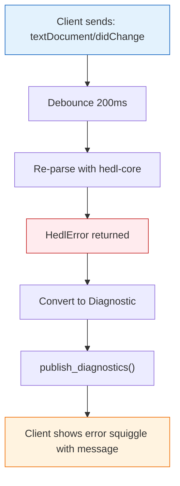
```mermaid
flowchart TD
    A["Client sends: textDocument/didChange"] --> B["Debounce 200ms"]
    B --> C["Re-parse with hedl-core"]
    C --> D["HedlError returned"]
    D --> E["Convert to Diagnostic"]
    E --> F["publish_diagnostics()"]
    F --> G["Client shows error squiggle with message"]

    style A fill:#e3f2fd,stroke:#1565c0
    style D fill:#ffebee,stroke:#c62828
    style G fill:#fff3e0,stroke:#ef6c00
```

### 13.2 Resource Limit Exceeded

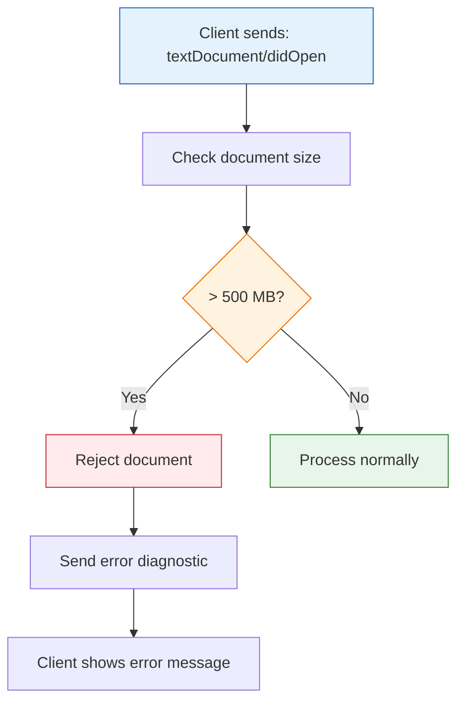
```mermaid
flowchart TD
    A["Client sends: textDocument/didOpen"] --> B["Check document size"]
    B --> C{"> 500 MB?"}
    C -->|Yes| D["Reject document"]
    D --> E["Send error diagnostic"]
    C -->|No| F["Process normally"]
    E --> G["Client shows error message"]

    style A fill:#e3f2fd,stroke:#1565c0
    style C fill:#fff3e0,stroke:#ef6c00
    style D fill:#ffebee,stroke:#c62828
    style F fill:#e8f5e9,stroke:#2e7d32
```

### 13.3 Cache Eviction

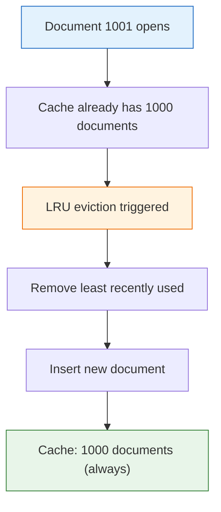
```mermaid
flowchart TD
    A["Document 1001 opens"] --> B["Cache already has 1000 documents"]
    B --> C["LRU eviction triggered"]
    C --> D["Remove least recently used"]
    D --> E["Insert new document"]
    E --> F["Cache: 1000 documents (always)"]

    style A fill:#e3f2fd,stroke:#1565c0
    style C fill:#fff3e0,stroke:#ef6c00
    style F fill:#e8f5e9,stroke:#2e7d32
```

---

## 14. Concurrent Request Handling

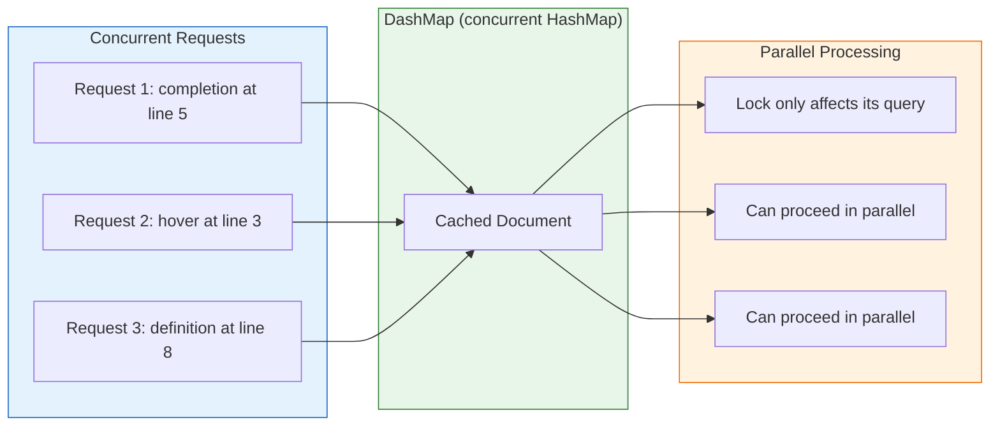
```mermaid
flowchart LR
    subgraph Requests["Concurrent Requests"]
        R1["Request 1: completion at line 5"]
        R2["Request 2: hover at line 3"]
        R3["Request 3: definition at line 8"]
    end

    subgraph Cache["DashMap (concurrent HashMap)"]
        DOC["Cached Document"]
    end

    R1 --> DOC
    R2 --> DOC
    R3 --> DOC

    subgraph Results["Parallel Processing"]
        RES1["Lock only affects its query"]
        RES2["Can proceed in parallel"]
        RES3["Can proceed in parallel"]
    end

    DOC --> RES1
    DOC --> RES2
    DOC --> RES3

    style Requests fill:#e3f2fd,stroke:#1565c0
    style Cache fill:#e8f5e9,stroke:#2e7d32
    style Results fill:#fff3e0,stroke:#ef6c00
```

No blocking between requests.

---

## References

- **[LSP Specification](https://microsoft.github.io/language-server-protocol/)**
- **[Message Types](https://microsoft.github.io/language-server-protocol/specifications/specification-current/#textDocument_completion)**
- **[hedl-lsp Architecture](../components/lsp.md)**

---

**Last Updated**: 2025-02-01
