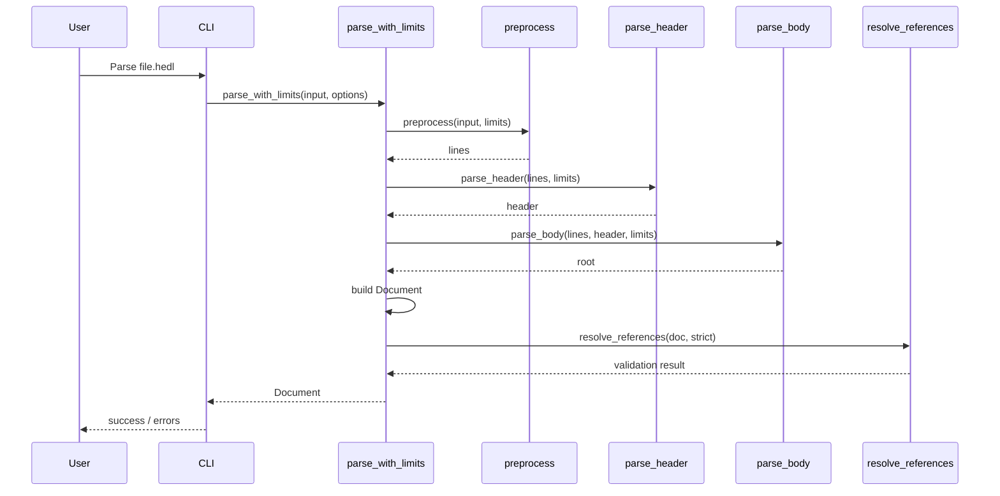
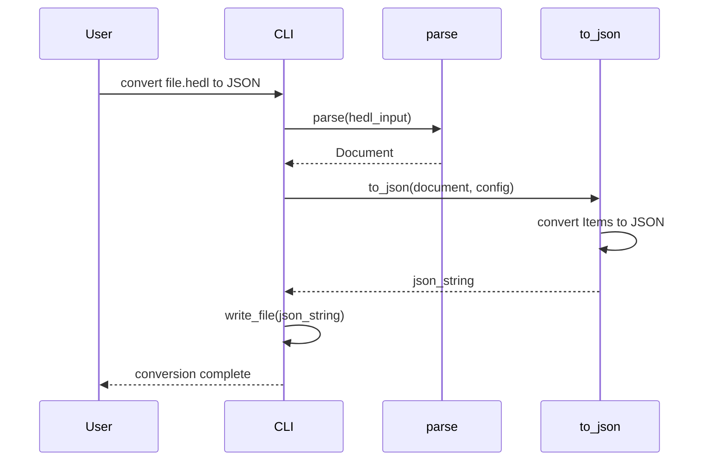
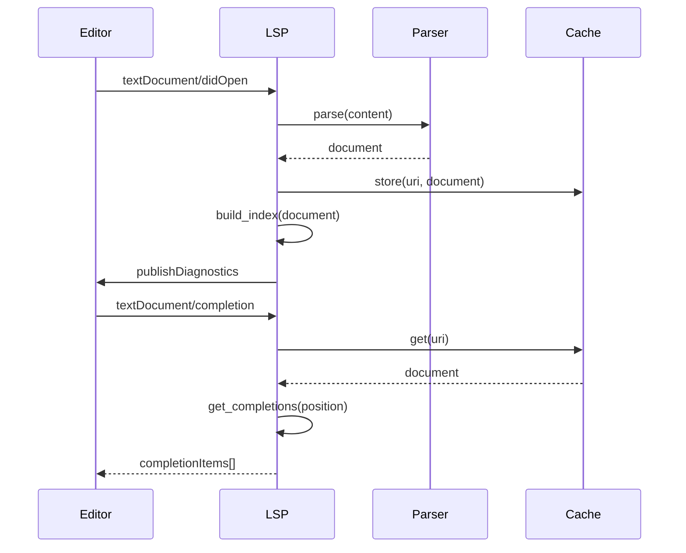
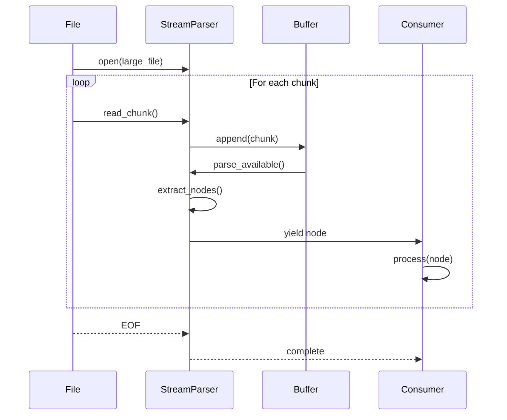

# Sequence Diagrams

> Interaction sequences and message flows

## Parsing Sequence

## Format Conversion Sequence

## LSP Interaction Sequence

## Streaming Parse Sequence

---

*Last updated: 2026-01-06*
