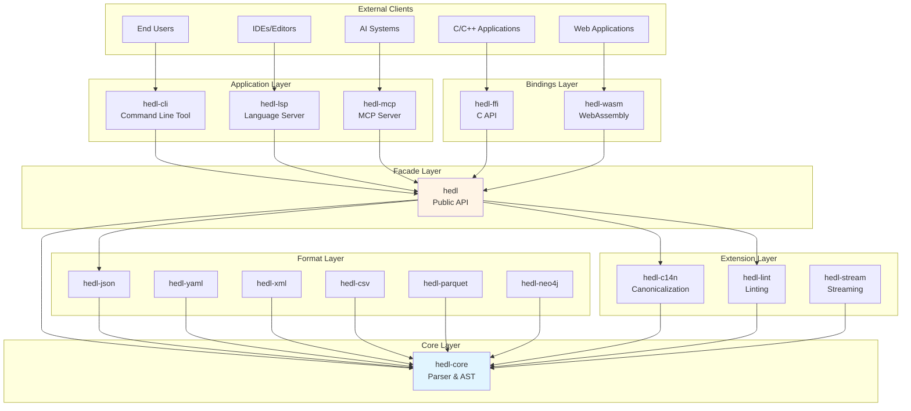
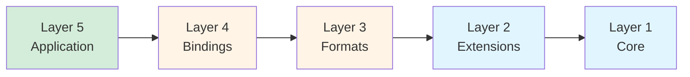
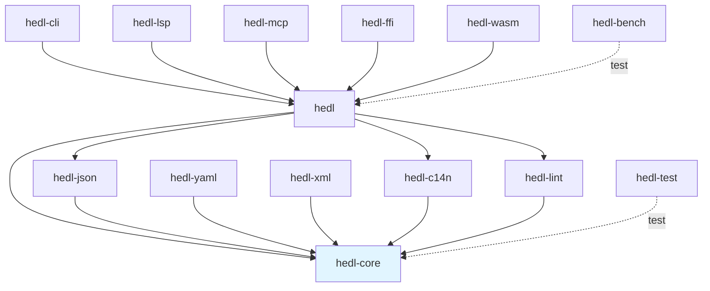

# System Overview Diagrams

> High-level architectural visualization

## Complete System Architecture

```mermaid
graph TB
    subgraph "External Clients"
        USER[End Users]
        IDE[IDEs/Editors]
        AI[AI Systems]
        FFI_CLIENT[C/C++ Applications]
        WEB[Web Applications]
    end

    subgraph "Application Layer"
        CLI[hedl-cli<br/>Command Line Tool]
        LSP[hedl-lsp<br/>Language Server]
        MCP[hedl-mcp<br/>MCP Server]
    end

    subgraph "Bindings Layer"
        FFI[hedl-ffi<br/>C API]
        WASM[hedl-wasm<br/>WebAssembly]
    end

    subgraph "Facade Layer"
        HEDL[hedl<br/>Public API]
    end

    subgraph "Format Layer"
        JSON[hedl-json]
        YAML[hedl-yaml]
        XML[hedl-xml]
        CSV[hedl-csv]
        PARQUET[hedl-parquet]
        NEO4J[hedl-neo4j]
    end

    subgraph "Extension Layer"
        C14N[hedl-c14n<br/>Canonicalization]
        LINT[hedl-lint<br/>Linting]
        STREAM[hedl-stream<br/>Streaming]
    end

    subgraph "Core Layer"
        CORE[hedl-core<br/>Parser & AST]
    end

    USER --> CLI
    IDE --> LSP
    AI --> MCP
    FFI_CLIENT --> FFI
    WEB --> WASM

    CLI --> HEDL
    LSP --> HEDL
    MCP --> HEDL
    FFI --> HEDL
    WASM --> HEDL

    HEDL --> CORE
    HEDL --> C14N
    HEDL --> LINT
    HEDL --> JSON

    JSON --> CORE
    YAML --> CORE
    XML --> CORE
    CSV --> CORE
    PARQUET --> CORE
    NEO4J --> CORE

    C14N --> CORE
    LINT --> CORE
    STREAM --> CORE

    style CORE fill:#e1f5ff
    style HEDL fill:#fff4e6
```

## Layer Interaction

```mermaid
graph LR
    L5[Layer 5<br/>Application] --> L4[Layer 4<br/>Bindings]
    L4 --> L3[Layer 3<br/>Formats]
    L3 --> L2[Layer 2<br/>Extensions]
    L2 --> L1[Layer 1<br/>Core]

    style L1 fill:#e1f5ff
    style L2 fill:#e1f5ff
    style L3 fill:#fff4e6
    style L4 fill:#fff4e6
    style L5 fill:#d4edda
```

## Module Dependency Graph

```mermaid
graph TD
    CLI[hedl-cli] --> HEDL[hedl]
    LSP[hedl-lsp] --> HEDL
    MCP[hedl-mcp] --> HEDL
    FFI[hedl-ffi] --> HEDL
    WASM[hedl-wasm] --> HEDL

    HEDL --> CORE[hedl-core]
    HEDL --> JSON[hedl-json]
    HEDL --> C14N[hedl-c14n]
    HEDL --> LINT[hedl-lint]

    JSON --> CORE
    YAML[hedl-yaml] --> CORE
    XML[hedl-xml] --> CORE
    C14N --> CORE
    LINT --> CORE

    BENCH[hedl-bench] -.test.-> HEDL
    TEST[hedl-test] -.test.-> CORE

    style CORE fill:#e1f5ff
```

---

