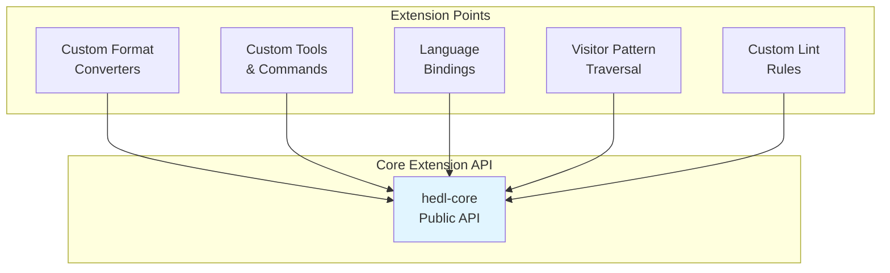

# Extension Points

## Overview

HEDL is designed for extensibility at multiple levels: custom formats, tools, bindings, and visitor patterns for traversal. This document describes both currently implemented extension mechanisms and planned future capabilities.

## Extension Categories



## 1. Custom Format Converters

### Creating a New Format Adapter

**Step-by-step guide**:

1. **Create new crate**:
```bash
cargo new --lib crates/hedl-protobuf
```

2. **Add dependencies** (`Cargo.toml`):
```toml
[package]
name = "hedl-protobuf"
version.workspace = true
edition.workspace = true

[dependencies]
hedl-core.workspace = true
thiserror.workspace = true
prost = "0.12"  # Example: protobuf library
```

3. **Implement conversion functions**:
```rust
use hedl_core::{Document, HedlError, Value, Item};
use prost::Message;

pub fn to_protobuf(doc: &Document, config: &ToProtobufConfig) -> Result<Vec<u8>, String> {
    let proto = document_to_proto(doc)
        .map_err(|e| format!("Proto conversion error: {}", e))?;
    let mut buf = Vec::new();
    proto.encode(&mut buf)
        .map_err(|e| format!("Protobuf encoding error: {}", e))?;
    Ok(buf)
}

pub fn from_protobuf(bytes: &[u8], config: &FromProtobufConfig) -> Result<Document, String> {
    let proto = MyProto::decode(bytes)
        .map_err(|e| format!("Protobuf decoding error: {}", e))?;
    proto_to_document(&proto, config)
}

// Configuration
pub struct ToProtobufConfig {
    pub preserve_types: bool,
}

pub struct FromProtobufConfig {
    pub infer_schemas: bool,
}
```

4. **Add to workspace** (`Cargo.toml` root):
```toml
[workspace]
members = [
    # ... existing members
    "crates/hedl-protobuf",
]

[workspace.dependencies]
hedl-protobuf = { version = "1.0.0", path = "crates/hedl-protobuf" }
```

5. **Optional: Integrate with facade**:
```toml
# crates/hedl/Cargo.toml
[dependencies]
hedl-protobuf = { workspace = true, optional = true }

[features]
protobuf = ["dep:hedl-protobuf"]
```

```rust
// crates/hedl/src/lib.rs
#[cfg(feature = "protobuf")]
pub mod protobuf {
    pub use hedl_protobuf::*;
}
```

### Format Converter Template

```rust
use hedl_core::{Document, Item, Value, traverse};
use thiserror::Error;

#[derive(Error, Debug)]
pub enum FormatError {
    #[error("Conversion error: {0}")]
    Conversion(String),
}

pub struct ToFormatConfig {
    // Format-specific options
}

pub struct FromFormatConfig {
    // Format-specific options
}

pub fn to_format(doc: &Document, config: &ToFormatConfig) -> Result<String, FormatError> {
    // Create a visitor that implements DocumentVisitor
    struct FormatVisitor {
        output: String,
    }

    impl DocumentVisitor for FormatVisitor {
        type Error = hedl_core::HedlError;

        fn visit_scalar(&mut self, _key: &str, _value: &Value, _ctx: &VisitorContext) -> Result<(), Self::Error> {
            Ok(())
        }

        fn visit_node(&mut self, _node: &Node, _schema: &[String], _ctx: &VisitorContext) -> Result<(), Self::Error> {
            Ok(())
        }
    }

    let mut visitor = FormatVisitor { output: String::new() };
    traverse(doc, &mut visitor)
        .map_err(|e| FormatError::Conversion(e.to_string()))?;

    Ok(visitor.output)
}

pub fn from_format(input: &str, config: &FromFormatConfig) -> Result<Document, FormatError> {
    // Parse format and build Document
    todo!()
}
```

## 2. Custom Tools

### Building a CLI Tool

**Example: Custom validation tool**:

```rust
use hedl::{parse, lint};
use clap::Parser;

#[derive(Parser)]
struct Args {
    #[arg(short, long)]
    file: String,

    #[arg(short, long)]
    strict: bool,
}

fn main() -> Result<(), Box<dyn std::error::Error>> {
    let args = Args::parse();

    // Read file
    let content = std::fs::read_to_string(&args.file)?;

    // Parse
    let doc = if args.strict {
        parse(&content)?
    } else {
        hedl::parse_lenient(&content)?
    };

    // Lint
    let diagnostics = lint(&doc);

    // Report
    for diag in diagnostics {
        println!("{}", diag);
    }

    Ok(())
}
```

## 3. Language Bindings

### Creating Bindings

**Example: Python bindings with PyO3**:

1. **Create binding crate**:
```bash
cargo new --lib crates/hedl-python
```

2. **Add PyO3 dependency**:
```toml
[package]
name = "hedl-python"
version = "1.0.0"

[dependencies]
hedl.workspace = true
pyo3 = { version = "0.20", features = ["extension-module"] }

[lib]
crate-type = ["cdylib"]
```

3. **Implement Python bindings**:
```rust
use pyo3::prelude::*;
use hedl::{parse, to_json, canonicalize};

#[pyfunction]
fn parse_hedl(input: &str) -> PyResult<String> {
    let doc = parse(input)
        .map_err(|e| PyErr::new::<pyo3::exceptions::PyValueError, _>(e.to_string()))?;

    to_json(&doc)
        .map_err(|e| PyErr::new::<pyo3::exceptions::PyValueError, _>(e.to_string()))
}

#[pyfunction]
fn canonicalize_hedl(input: &str) -> PyResult<String> {
    let doc = parse(input)
        .map_err(|e| PyErr::new::<pyo3::exceptions::PyValueError, _>(e.to_string()))?;

    canonicalize(&doc)
        .map_err(|e| PyErr::new::<pyo3::exceptions::PyValueError, _>(e.to_string()))
}

#[pymodule]
fn hedl_python(_py: Python, m: &PyModule) -> PyResult<()> {
    m.add_function(wrap_pyfunction!(parse_hedl, m)?)?;
    m.add_function(wrap_pyfunction!(canonicalize_hedl, m)?)?;
    Ok(())
}
```

4. **Build and distribute**:
```bash
maturin build --release
pip install target/wheels/hedl_python-*.whl
```

### Binding Template

Key considerations for language bindings:

- **Memory Safety**: Ensure safe interop across language boundaries
- **Error Handling**: Convert Rust errors to target language exceptions
- **Type Mapping**: Map HEDL types to target language types
- **Performance**: Minimize overhead in boundary crossing

## 4. Visitor Pattern Traversal

### Document Traversal API (Currently Implemented)

**Core traversal function** (from `hedl-core/src/traverse.rs`):

```rust
use hedl_core::{traverse, Document, DocumentVisitor, VisitorContext, Item, Value};

pub struct CustomVisitor {
    // Visitor state
}

impl DocumentVisitor for CustomVisitor {
    type Error = hedl_core::HedlError;

    fn visit_document(&mut self, doc: &Document) -> Result<(), Self::Error> {
        // Visit all root items
        for (key, item) in &doc.root {
            self.visit_item(key, item)?;
        }
        Ok(())
    }

    fn visit_item(&mut self, key: &str, item: &Item) -> Result<(), Self::Error> {
        match item {
            Item::Scalar(v) => { /* process scalar */ }
            Item::Object(children) => {
                for (child_key, child_item) in children {
                    self.visit_item(child_key, child_item)?;
                }
            }
            Item::List(matrix) => { /* process matrix list */ }
        }
        Ok(())
    }
}

// Usage
let mut visitor = CustomVisitor::new();
visitor.visit_document(&doc)?;
```

### Example: Statistics Collector (Currently Implemented)

The `StatsCollector` is built into `hedl-core/src/traverse.rs`:

```rust
use hedl_core::StatsCollector;

// StatsCollector is provided by hedl-core and implements DocumentVisitor
let mut stats = StatsCollector::default();
traverse(&doc, &mut stats).unwrap();

println!("Total objects: {}", stats.object_count);
println!("Total scalars: {}", stats.scalar_count);
println!("Total matrix nodes: {}", stats.node_count);
println!("Max depth: {}", stats.max_depth);
```

### Example: Reference Collector

```rust
pub struct ReferenceCollector {
    pub references: Vec<String>,
}

impl DocumentVisitor for ReferenceCollector {
    fn visit_value(&mut self, value: &Value, _ctx: &VisitorContext) -> Result<(), HedlError> {
        if let Value::Reference(ref r) = value {
            let ref_str = if let Some(type_name) = &r.type_name {
                format!("@{}:{}", type_name, r.id)
            } else {
                format!("@{}", r.id)
            };
            self.references.push(ref_str);
        }
        Ok(())
    }
}
```

## 5. Custom Lint Rules

### Implementing Lint Rules

**Example: Custom lint rule**:

```rust
use hedl_lint::{LintRule, Diagnostic, DiagnosticKind, Severity};
use hedl_core::Document;

pub struct NoLongKeysRule {
    max_length: usize,
}

impl LintRule for NoLongKeysRule {
    fn id(&self) -> &str {
        "no-long-keys"
    }

    fn description(&self) -> &str {
        "Check that keys do not exceed maximum length"
    }

    fn check(&self, doc: &Document) -> Vec<Diagnostic> {
        // Create a visitor to collect diagnostics
        struct KeyLengthVisitor {
            max_length: usize,
            diagnostics: Vec<Diagnostic>,
        }

        impl DocumentVisitor for KeyLengthVisitor {
            type Error = std::convert::Infallible;

            fn visit_item(&mut self, _item: &Item, ctx: &VisitorContext) -> Result<(), Self::Error> {
                if let Some(key) = ctx.current_key() {
                    if key.len() > self.max_length {
                        self.diagnostics.push(Diagnostic {
                            kind: DiagnosticKind::Style,
                            severity: Severity::Warning,
                            message: format!(
                                "Key '{}' exceeds maximum length of {} characters",
                                key, self.max_length
                            ),
                            position: ctx.position,
                        });
                    }
                }
                Ok(())
            }
        }

        let mut visitor = KeyLengthVisitor {
            max_length: self.max_length,
            diagnostics: Vec::new(),
        };
        let _ = traverse(doc, &mut visitor);

        visitor.diagnostics
    }
}

// Register custom rule
use hedl_lint::LintRunner;

let mut runner = LintRunner::new();
runner.add_rule(Box::new(NoLongKeysRule { max_length: 50 }));

let diagnostics = runner.run(&doc);
```

### Lint Rule Template

```rust
pub struct CustomRule {
    // Rule configuration
}

impl LintRule for CustomRule {
    fn id(&self) -> &str {
        "custom-rule"
    }

    fn description(&self) -> &str {
        "Description of what this rule checks"
    }

    fn severity(&self) -> Severity {
        Severity::Warning
    }

    fn check(&self, doc: &Document) -> Vec<Diagnostic> {
        // Create a visitor to collect diagnostics
        struct RuleVisitor {
            rule_name: String,
            severity: Severity,
            diagnostics: Vec<Diagnostic>,
        }

        impl DocumentVisitor for RuleVisitor {
            type Error = std::convert::Infallible;

            fn visit_item(&mut self, item: &Item, ctx: &VisitorContext) -> Result<(), Self::Error> {
                // Custom validation logic
                // if /* condition */ {
                //     self.diagnostics.push(Diagnostic::new(
                //         &self.rule_name,
                //         self.severity,
                //         "Rule violation message",
                //         ctx.position,
                //     ));
                // }
                Ok(())
            }
        }

        let mut visitor = RuleVisitor {
            rule_name: self.id().to_string(),
            severity: self.severity(),
            diagnostics: Vec::new(),
        };
        let _ = traverse(doc, &mut visitor);

        visitor.diagnostics
    }
}
```

## 6. Parser Extensions

### Custom Value Types

**Example: Adding custom value types**:

```rust
use hedl_core::Value;

// Extend Value enum (requires forking hedl-core)
pub enum ExtendedValue {
    // Standard types
    Standard(Value),

    // Custom types
    Timestamp(chrono::DateTime<chrono::Utc>),
    Uuid(uuid::Uuid),
    BigInt(num_bigint::BigInt),
}

impl From<Value> for ExtendedValue {
    fn from(v: Value) -> Self {
        ExtendedValue::Standard(v)
    }
}
```

### Custom Inference Logic

**Example: Type-specific inference**:

```rust
use hedl_core::inference::{infer_value, InferenceContext};

pub fn custom_infer_value(token: &str, ctx: &InferenceContext) -> Value {
    // Try custom types first
    if let Ok(uuid) = uuid::Uuid::parse_str(token) {
        return Value::String(uuid.to_string().into());
    }

    if let Ok(timestamp) = chrono::DateTime::parse_from_rfc3339(token) {
        return Value::String(timestamp.to_rfc3339().into());
    }

    // Fall back to standard inference
    infer_value(token, ctx)
}
```

## Extension Best Practices

### 1. Maintain API Compatibility

- Follow semantic versioning
- Deprecate before removing APIs
- Document breaking changes

### 2. Error Handling

- Use `Result<T, HedlError>` for consistency
- Provide context in error messages
- Implement `From` for error type conversions

### 3. Performance

- Benchmark custom code
- Avoid unnecessary allocations
- Use zero-copy where possible

### 4. Testing

- Write comprehensive tests
- Include round-trip tests for formats
- Test error paths

### 5. Documentation

- Document public APIs with examples
- Provide migration guides
- Include performance notes

## Extension Examples Repository

See the `examples/` directory for complete extension examples:

- `examples/custom_format/` - Custom format converter
- `examples/custom_tool/` - Custom CLI tool
- `examples/python_bindings/` - Python binding example
- `examples/custom_lint/` - Custom lint rule

## See Also

- [Format Adapters](format-adapters.md) - Format conversion architecture
- [Module Dependencies](module-dependencies.md) - Understanding dependencies
- [Architecture Overview](README.md) - System architecture

---

