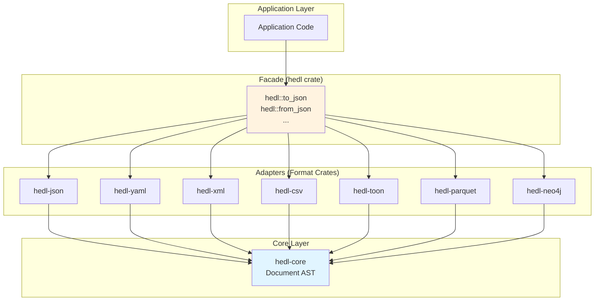

# Format Adapters Architecture

## Overview

HEDL's format adapters follow a consistent pattern for bidirectional conversion between HEDL and various data formats. Each adapter is a separate crate implementing symmetric `to_format` and `from_format` APIs.

## Adapter Pattern

### Uniform Interface

All format adapters follow this naming pattern:

```rust
// Convenience wrappers (default config)
pub fn hedl_to_format(doc: &Document) -> Result<String, String>
pub fn format_to_hedl(input: &str) -> Result<Document, String>

// With configuration
pub fn hedl_to_format_with_config(doc: &Document, config: &ToFormatConfig) -> Result<String, String>
pub fn format_to_hedl_with_config(input: &str, config: &FromFormatConfig) -> Result<Document, FormatError>

// Configuration structs (format-specific)
pub struct ToFormatConfig { /* format-specific options */ }
pub struct FromFormatConfig { /* format-specific options */ }
```

**Examples**:
- `hedl-json`: `hedl_to_json`, `json_to_hedl`
- `hedl-yaml`: `hedl_to_yaml`, `yaml_to_hedl`
- `hedl-xml`: `hedl_to_xml`, `xml_to_hedl`

### Adapter Architecture


```mermaid
graph TB
    subgraph "Application Layer"
        APP[Application Code]
    end

    subgraph "Facade (hedl crate)"
        FACADE[hedl::to_json<br/>hedl::from_json<br/>...]
    end

    subgraph "Adapters (Format Crates)"
        JSON[hedl-json]
        YAML[hedl-yaml]
        XML[hedl-xml]
        CSV[hedl-csv]
        TOON[hedl-toon]
        PARQUET[hedl-parquet]
        NEO4J[hedl-neo4j]
    end

    subgraph "Core Layer"
        CORE[hedl-core<br/>Document AST]
    end

    APP --> FACADE
    FACADE --> JSON
    FACADE --> YAML
    FACADE --> XML
    FACADE --> CSV
    FACADE --> TOON
    FACADE --> PARQUET
    FACADE --> NEO4J

    JSON --> CORE
    YAML --> CORE
    XML --> CORE
    CSV --> CORE
    TOON --> CORE
    PARQUET --> CORE
    NEO4J --> CORE

    style CORE fill:#e1f5ff
    style FACADE fill:#fff3e0
```

## Format Converters

### hedl-json: JSON Adapter

**Purpose**: Bidirectional JSON conversion with schema preservation

**Key Features**:
- Schema generation and caching
- Efficient string handling
- Streaming JSON parsing
- Partial document parsing

**Architecture**:
```rust
// Convenience wrappers (default config)
pub fn hedl_to_json(doc: &Document) -> Result<String, String>
pub fn json_to_hedl(json: &str) -> Result<Document, String>

// With configuration
pub fn hedl_to_json_with_config(doc: &Document, config: &ToJsonConfig) -> Result<String, String>
pub fn json_to_hedl_with_config(json: &str, config: &FromJsonConfig) -> Result<Document, JsonConversionError>

// Lower-level conversion functions
pub fn to_json_value(doc: &Document, config: &ToJsonConfig) -> Result<JsonValue, String>
pub fn from_json_value(value: &JsonValue, config: &FromJsonConfig) -> Result<Document, JsonConversionError>
```

**Configuration**:
```rust
pub struct ToJsonConfig {
    pub include_metadata: bool,  // Include HEDL metadata (__type__, __schema__)
    pub flatten_lists: bool,      // Flatten matrix lists to plain arrays
    pub include_children: bool,   // Include children as nested arrays
    pub ascii_safe: bool,         // Escape all non-ASCII as \uXXXX
}

pub struct FromJsonConfig {
    pub default_type_name: String,    // Default type name for arrays
    pub version: (u32, u32),          // HEDL version to use
    pub max_depth: Option<usize>,     // Maximum recursion depth (default: 10,000)
    pub max_array_size: Option<usize>, // Maximum array size
    pub max_string_length: Option<usize>, // Maximum string length
    pub max_object_size: Option<usize>,  // Maximum object size
    pub surrogate_policy: SurrogatePolicy, // Policy for unpaired UTF-16 surrogates
}

pub enum SurrogatePolicy {
    Reject,       // Reject unpaired surrogates with error (default)
    ReplaceWithFFFD, // Replace with U+FFFD
    Skip,         // Skip/remove silently
}
```

**Schema Caching**:
```rust
// Cache inferred schemas for repeated conversions
static SCHEMA_CACHE: Lazy<Mutex<LruCache<u64, Schema>>> = ...;

pub fn infer_schema(json: &Value) -> Schema {
    let hash = calculate_hash(json);
    if let Some(schema) = SCHEMA_CACHE.lock().get(&hash) {
        return schema.clone();
    }
    let schema = infer_schema_impl(json);
    SCHEMA_CACHE.lock().put(hash, schema.clone());
    schema
}
```

**Performance**: Optimized for hot path with `#[inline]` hints

---

### hedl-yaml: YAML Adapter

**Purpose**: YAML conversion with security hardening

**Key Features**:
- Resource limits (max depth, keys, string length)
- DoS protection
- Anchor/alias support
- Multi-document handling

**Architecture**:
```rust
pub fn to_yaml(doc: &Document, config: &ToYamlConfig) -> Result<String> {
    let value = document_to_yaml_value(doc)?;
    serde_yaml::to_string(&value)
        .map_err(|e| HedlError::conversion(e))
}

pub fn from_yaml(yaml: &str, config: &FromYamlConfig) -> Result<Document> {
    let value: serde_yaml::Value = serde_yaml::from_str(yaml)?;
    yaml_value_to_document(&value, config)
}
```

**Security Limits**:
```rust
pub struct FromYamlConfig {
    pub default_type_name: String,      // Default type name for arrays
    pub version: (u32, u32),            // HEDL version to use
    pub max_document_size: usize,       // Default: 500 MB
    pub max_array_length: usize,        // Default: 10 million elements
    pub max_nesting_depth: usize,       // Default: 10,000 levels
}
```

**Anchor Handling**:
```rust
fn resolve_anchors(value: &mut serde_yaml::Value, anchors: &AnchorMap) -> Result<()> {
    // Recursively resolve YAML anchors to HEDL references
}
```

---

### hedl-xml: XML Adapter

**Purpose**: XML transformation with streaming support

**Key Features**:
- Streaming XML parsing via `quick-xml`
- Attribute vs element handling
- Namespace support
- Schema validation

**Architecture**:
```rust
pub fn to_xml(doc: &Document, config: &ToXmlConfig) -> Result<String> {
    let mut writer = quick_xml::Writer::new(Vec::new());
    write_document(&mut writer, doc, config)?;
    String::from_utf8(writer.into_inner())
        .map_err(|e| HedlError::conversion(e))
}

pub fn from_xml(xml: &str, config: &FromXmlConfig) -> Result<Document> {
    let mut reader = quick_xml::Reader::from_str(xml);
    parse_xml_document(&mut reader, config)
}
```

**Streaming Parser**:
```rust
pub fn stream_from_xml<R: BufRead>(
    reader: R,
    handler: &mut dyn XmlHandler,
) -> Result<()> {
    let mut xml_reader = quick_xml::Reader::from_reader(reader);
    loop {
        match xml_reader.read_event()? {
            Event::Start(e) => handler.on_element_start(e)?,
            Event::End(e) => handler.on_element_end(e)?,
            Event::Text(e) => handler.on_text(e)?,
            Event::Eof => break,
            _ => {}
        }
    }
    Ok(())
}
```

**Configuration**:
```rust
pub struct ToXmlConfig {
    pub pretty: bool,             // Pretty-print with indentation
    pub indent: String,           // Indentation string (e.g., "  " or "\t")
    pub root_element: String,     // Root element name
    pub include_metadata: bool,   // Include HEDL metadata as attributes
    pub use_attributes: bool,     // Use attributes for scalar values
}

pub struct FromXmlConfig {
    pub default_type_name: String,    // Default type name for list items
    pub version: (u32, u32),          // HEDL version to use
    pub infer_lists: bool,            // Infer list structures from repeated elements
    pub entity_policy: EntityPolicy,  // Entity handling policy (XXE prevention)
    pub log_security_events: bool,    // Enable security event logging
}
```

---

### hedl-csv: CSV File Adapter

**Purpose**: CSV file conversion (distinct from row parsing)

**Key Features**:
- High-performance CSV parsing via `csv` crate
- Schema inference
- Custom pluralization
- Streaming support

**Architecture**:
```rust
pub fn to_csv(doc: &Document) -> Result<String> {
    let list = find_first_matrix_list(doc)?;
    let mut wtr = csv::Writer::from_writer(vec![]);
    write_headers(&mut wtr, &list.schema)?;
    write_rows(&mut wtr, &list)?;
    String::from_utf8(wtr.into_inner()?)
        .map_err(|e| CsvError::Utf8Error(e.to_string()))
}

pub fn from_csv(
    csv: &str,
    type_name: &str,
    schema: &[&str],
) -> Result<Document> {
    from_csv_with_config(csv, type_name, schema, FromCsvConfig::default())
}
```

**Schema Inference**:
```rust
pub fn infer_csv_schema(reader: &mut csv::Reader<&[u8]>) -> Result<Vec<String>> {
    // Infer column names from header row
    // Infer types from first N rows
}
```

**Pluralization**:
```rust
pub fn pluralize(singular: &str) -> String {
    // Custom pluralization rules for table names
    // "user" → "users", "person" → "people", etc.
}
```

---

### hedl-parquet: Parquet Adapter

**Purpose**: Apache Parquet columnar format conversion

**Key Features**:
- Arrow schema integration
- Columnar data layout
- Efficient compression
- Position encoding for source tracking

**Architecture**:
```rust
pub fn to_parquet(doc: &Document, config: &ToParquetConfig) -> Result<Vec<u8>> {
    let schema = build_arrow_schema(doc)?;
    let record_batches = document_to_record_batches(doc, &schema)?;
    write_parquet(record_batches, schema, config)
}

pub fn from_parquet(bytes: &[u8]) -> Result<Document> {
    let file_reader = SerializedFileReader::new(bytes)?;
    read_parquet_document(file_reader)
}
```

**Schema Mapping**:
```rust
fn build_arrow_schema(doc: &Document) -> Result<arrow::datatypes::Schema> {
    // Map HEDL types to Arrow types
    // String → Utf8
    // Number → Float64
    // Bool → Boolean
    // Reference → Utf8 (encoded)
    // Tensor → List<Float64>
}
```

**Position Encoding**:
```rust
// Encode source position for error reporting
pub struct PositionMetadata {
    pub line: u32,
    pub column: u32,
    pub file: String,
}

fn encode_position(pos: &PositionMetadata) -> Vec<u8> {
    // Encode as Parquet column metadata
}
```

---

### hedl-neo4j: Graph Database Adapter

**Purpose**: Neo4j graph database and Cypher query generation

**Key Features**:
- Graph mapping (Node/Relationship)
- Cypher query generation
- Bidirectional conversion
- Streaming API for large graphs

**Architecture**:
```rust
pub fn to_cypher(doc: &Document, config: &ToCypherConfig) -> Result<CypherScript> {
    let mut script = CypherScript::new();

    // Generate CREATE statements for nodes
    for node in traverse_nodes(doc) {
        let stmt = generate_node_statement(node)?;
        script.add_statement(stmt);
    }

    // Generate CREATE statements for relationships
    for rel in traverse_relationships(doc) {
        let stmt = generate_relationship_statement(rel)?;
        script.add_statement(stmt);
    }

    Ok(script)
}

pub fn from_neo4j_records(
    records: Vec<Neo4jRecord>,
    config: &FromNeo4jConfig,
) -> Result<Document> {
    neo4j_records_to_document(&records, config)
}
```

**Cypher Generation**:
```rust
fn generate_node_statement(node: &Node) -> CypherStatement {
    // CREATE (n:Type {id: "...", field1: "...", ...})
    CypherStatement {
        statement_type: StatementType::CreateNode,
        cypher: format!(
            "CREATE (n:{} {{{}}})",
            node.type_name,
            format_properties(&node.fields)
        ),
    }
}

fn generate_relationship_statement(rel: &Relationship) -> CypherStatement {
    // MATCH (a:Type1 {id: "..."}), (b:Type2 {id: "..."})
    // CREATE (a)-[:REL_TYPE]->(b)
    CypherStatement {
        statement_type: StatementType::CreateRelationship,
        cypher: format!(
            "MATCH (a:{} {{id: '{}'}}), (b:{} {{id: '{}'}})\nCREATE (a)-[:{}]->(b)",
            rel.from_type, rel.from_id,
            rel.to_type, rel.to_id,
            rel.rel_type
        ),
    }
}
```

**Streaming API**:
```rust
pub fn stream_to_cypher<W: Write>(
    doc: &Document,
    writer: &mut W,
    config: &ToCypherConfig,
) -> Result<()> {
    // Stream Cypher statements without buffering
    for node in traverse_nodes(doc) {
        let stmt = generate_node_statement(node)?;
        writeln!(writer, "{};", stmt.cypher)?;
    }
    Ok(())
}
```

---

### hedl-toon: TOON Adapter

**Purpose**: LLM-optimized compact format conversion

**Key Features**:
- TOON v3.0 specification compliance
- Tabular format for primitive arrays
- Expanded format for complex structures
- Reference preservation as `@Type:id` strings
- Depth limit protection (100 levels)

**Architecture**:
```rust
pub fn hedl_to_toon(doc: &Document) -> Result<String> {
    to_toon(doc, &ToToonConfig::default())
}

pub fn toon_to_hedl(toon: &str) -> Result<Document> {
    from_toon(toon, &FromToonConfig::default())
}
```

**Configuration**:
```rust
pub struct ToToonConfig {
    pub indent: usize,          // Spaces per indent level (default: 2)
    pub delimiter: Delimiter,   // Column delimiter for tabular format
}

pub enum Delimiter {
    Comma,   // ","
    Tab,     // "\t"
    Pipe,    // " |"
}

pub struct FromToonConfig {
    pub default_type_name: String,  // Default type for untyped arrays
    pub version: (u32, u32),        // HEDL version to use
}
```

**TOON Format Examples**:
```toon
// Tabular format (primitive arrays)
users[2]{id,name}:
  u1,Alice
  u2,Bob

// Expanded format (complex structures)
orders[1]:
  - id: ord1
    customer:@User:u1
    total: 150.00
```

## Common Patterns

### Configuration Pattern

All adapters use builder pattern for configuration:

```rust
let config = ToJsonConfig::builder()
    .pretty(true)
    .preserve_types(true)
    .build();

let json = to_json(&doc, &config)?;
```

### Error Handling Pattern

Consistent error types across adapters:

```rust
pub enum ConversionError {
    Parse(String),
    InvalidType(String),
    SchemaError(String),
    IoError(std::io::Error),
}

impl From<ConversionError> for HedlError {
    fn from(e: ConversionError) -> Self {
        HedlError::conversion(e.to_string())
    }
}
```

### Testing Pattern

All adapters have round-trip tests:

```rust
#[test]
fn test_roundtrip() {
    let hedl = parse(HEDL_INPUT).unwrap();
    let json = to_json(&hedl, &ToJsonConfig::default()).unwrap();
    let roundtrip = from_json(&json, &FromJsonConfig::default()).unwrap();
    assert_eq!(hedl, roundtrip);
}
```

## Adapter Comparison

| Format |Streaming |Schema |Binary |Complexity |
|--------|-----------|--------|--------|------------|
| JSON |Yes |Cache |No |Low |
| YAML |No |No |No |Medium |
| XML |Yes |Validation |No |High |
| CSV |Yes |Inference |No |Low |
| Parquet |Yes |Arrow |Yes |High |
| Neo4j |Yes |Graph |No |High |

## Extension Points

### Adding New Format

1. Create new crate: `crates/hedl-newformat/`
2. Implement core functions:
   ```rust
   pub fn to_newformat(doc: &Document, config: &Config) -> Result<String>;
   pub fn from_newformat(input: &str, config: &Config) -> Result<Document>;
   ```
3. Add dependency in `hedl/Cargo.toml`:
   ```toml
   hedl-newformat = { workspace = true, optional = true }
   ```
4. Add feature gate:
   ```toml
   [features]
   newformat = ["dep:hedl-newformat"]
   ```
5. Re-export in `hedl/src/lib.rs`:
   ```rust
   #[cfg(feature = "newformat")]
   pub mod newformat {
       pub use hedl_newformat::*;
   }
   ```

### Custom Conversion Logic

Users can implement custom converters using the `DocumentVisitor` trait:

```rust
use hedl_core::{Document, Item, traverse, DocumentVisitor, VisitorContext};

struct CustomVisitor {
    output: String,
}

impl DocumentVisitor for CustomVisitor {
    type Error = hedl_core::HedlError;

    fn visit_item(&mut self, item: &Item, _ctx: &VisitorContext) -> Result<(), Self::Error> {
        // Process each item and build output
        Ok(())
    }
}

pub fn custom_converter(doc: &Document) -> Result<String, hedl_core::HedlError> {
    let mut visitor = CustomVisitor { output: String::new() };
    traverse(doc, &mut visitor)?;
    Ok(visitor.output)
}
```

## See Also

- [Data Flow](data-flow.md) - Data transformation flow
- [Module Dependencies](module-dependencies.md) - Adapter dependencies
- [Extension Points](extension-points.md) - Extending HEDL

---

