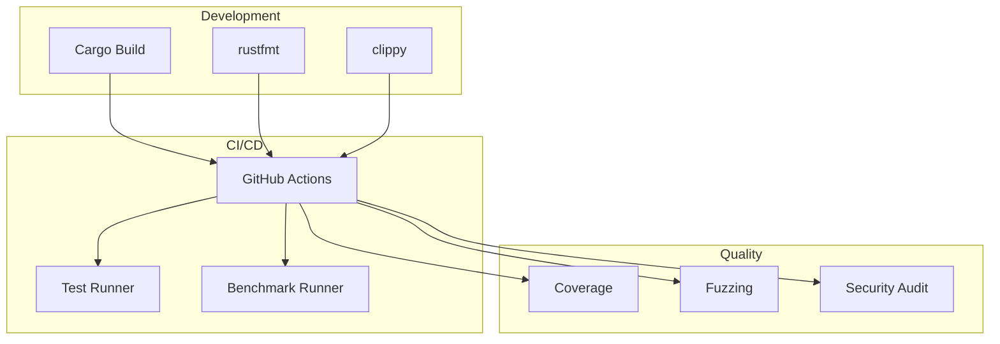

# Infrastructure Documentation

> Build, deployment, and testing infrastructure for HEDL

## Overview

This section documents the infrastructure supporting HEDL development, including build systems, CI/CD pipelines, benchmarking, and testing frameworks.

## Infrastructure Components

- [Build System](build-system.md) - Cargo workspace and build configuration
- [CI/CD](ci-cd.md) - Continuous integration and deployment
- [Benchmarking](benchmarking.md) - Performance benchmark infrastructure
- [Testing](testing.md) - Test framework and strategies

## Infrastructure Stack



## Quick Reference

### Build Commands

```bash
# Development build
cargo build

# Release build
cargo build --release

# Build specific crate
cargo build -p hedl-core

# Build all workspace members
cargo build --workspace
```

### Test Commands

```bash
# Run all tests
cargo test --workspace

# Run specific test suite
cargo test -p hedl-core

# Run with coverage
cargo tarpaulin --workspace
```

### Benchmark Commands

```bash
# Run all benchmarks
cargo bench --workspace

# Run specific benchmark
cargo bench --bench lexer

# Generate reports
cargo bench -- --save-baseline current
```

## Related Documentation

- [Build System Details](build-system.md)
- [CI/CD Pipeline](ci-cd.md)
- [Benchmarking Guide](benchmarking.md)
- [Testing Strategy](testing.md)

---

