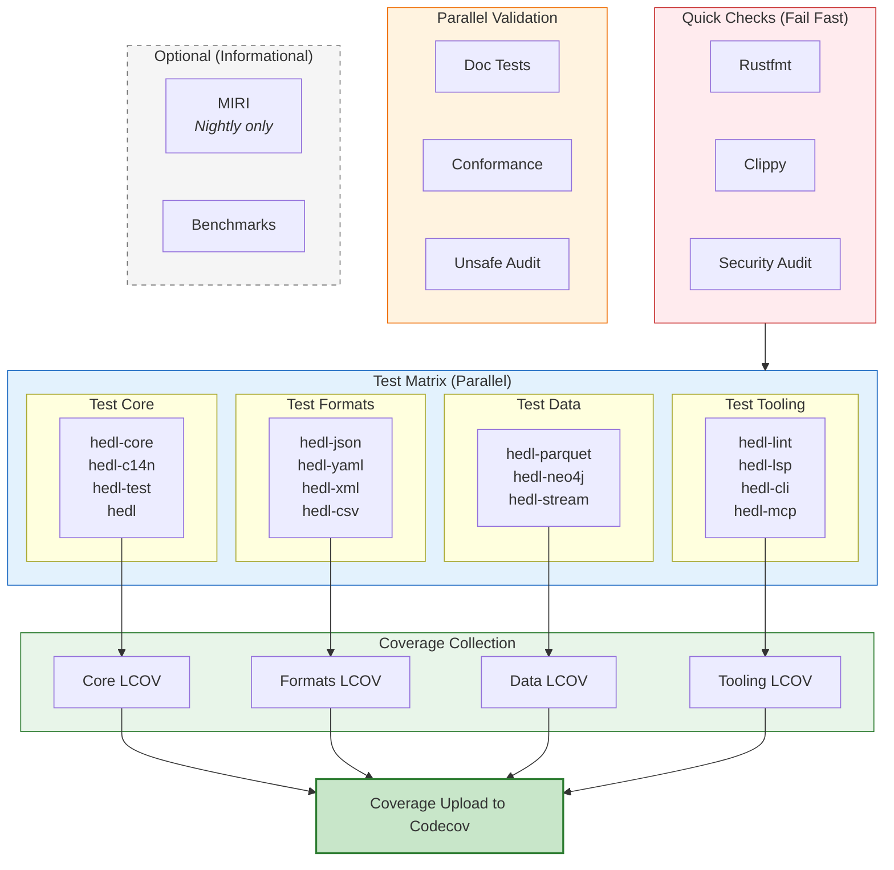
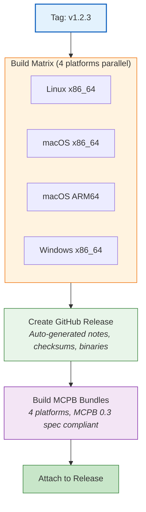
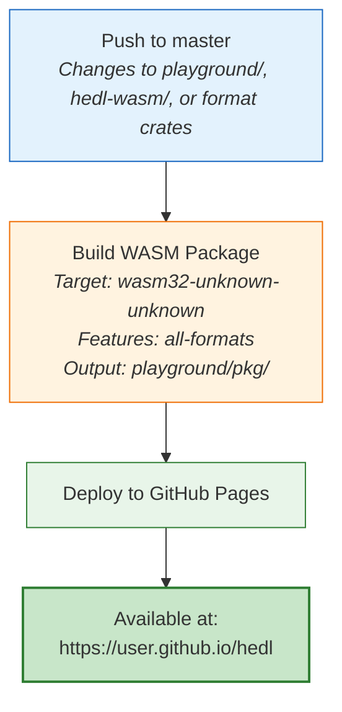

# CI/CD Architecture

Continuous integration and deployment pipeline infrastructure

## Overview

HEDL uses GitHub Actions for automated CI/CD with a multi-stage approach:

1. **Pre-flight checks** (fmt, clippy, security) fail fast
2. **Grouped parallel tests** to manage disk space
3. **Coverage collection** (optional, non-blocking)
4. **Specialized validation** (SPEC compliance, MIRI, benchmarks)
5. **Release build and publishing** with multi-platform support
6. **Deployment to GitHub Pages** for interactive playground

## Pipeline Architecture

## Job Grouping Strategy

Tests are split into 5 groups to manage disk space and enable parallelization:

### Core Group
- `hedl-core` - Parser, data structures, canonicalization
- `hedl-c14n` - Canonicalization
- `hedl-test` - Test utilities
- `hedl` - Root crate

### Formats Group
- `hedl-json` - JSON conversion
- `hedl-yaml` - YAML conversion
- `hedl-xml` - XML conversion
- `hedl-csv` - CSV conversion

### Data Group
- `hedl-parquet` - Parquet format
- `hedl-neo4j` - Graph database integration
- `hedl-stream` - Streaming support
- Service: Neo4j 5.15

### Tooling Group
- `hedl-lint` - Linting
- `hedl-lsp` - Language Server
- `hedl-cli` - Command-line tool
- `hedl-mcp` - Model Context Protocol server

### Bindings Group
- `hedl-ffi` - C FFI bindings
- `hedl-wasm` - WebAssembly
- `hedl-toon` - Toon integration

## Quality Gates

### Blocking Checks (Must Pass)

| Category | Job | Failure Mode |
|----------|-----|--------------|
| Formatting | `fmt` | Code not formatted per Rust standards |
| Linting | `clippy` | Code quality warnings or violations |
| Security | `security` | Known CVEs in dependencies |
| Tests | `test-*` | Any test failure |
| Doc Tests | `doc-tests` | Documentation examples don't work |
| Spec | `conformance` | HEDL v2.0 non-compliance |
| Unsafe (PR) | `unsafe-audit` | New unsafe code in core |

### Informational Checks (Non-Blocking)

| Category | Job | Purpose |
|----------|-----|---------|
| Coverage | `coverage-*` | Code coverage metrics |
| UB Detection | `miri` | Undefined behavior detection |

## Release Pipeline

Release builds happen when tags matching `v*` are pushed or when manually triggered.

### Artifacts Generated

**Release Binaries:**
- `hedl-x86_64-unknown-linux-gnu.tar.gz` - CLI + MCP server (Linux)
- `hedl-x86_64-apple-darwin.tar.gz` - CLI + MCP server (macOS Intel)
- `hedl-aarch64-apple-darwin.tar.gz` - CLI + MCP server (macOS ARM64)
- `hedl-x86_64-pc-windows-msvc.zip` - CLI + MCP server (Windows)
- `checksums.txt` - SHA256 hashes for integrity verification

**MCPB Bundles:**
- `hedl-mcp-linux-amd64.mcpb` - Linux bundle (MCPB 0.3)
- `hedl-mcp-darwin-amd64.mcpb` - macOS Intel bundle
- `hedl-mcp-darwin-arm64.mcpb` - macOS ARM64 bundle
- `hedl-mcp-win32-amd64.mcpb` - Windows bundle
- SHA256 checksums for each bundle

## GitHub Pages Deployment

Interactive WASM playground deployed to GitHub Pages.

## Scheduled Maintenance

**Frequency:** First day of January at 10:00 UTC

**Actions:**
1. Annual unsafe code audit in `hedl-core`
2. Dependency security audit
3. Warns if unsafe code found
4. Requests re-audit if needed

## Caching Strategy

All jobs use `Swatinem/rust-cache@v2`:

- **Cache key:** Rust toolchain hash + MSRV version
- **Separate keys:** Different test groups use different cache keys for parallelization
- **Time saved:** 5-15 minutes per build

Example cache keys:
- `test-core`, `test-formats`, `test-data`, `test-tooling`, `test-bindings`
- `coverage-core`, `coverage-formats`, etc.
- `benchmarks`, `miri`, `wasm-playground`

## Dependency Management

**Dependabot** updates dependencies weekly:

- **Rust crates:** Max 10 open PRs
- **GitHub Actions:** Max 5 open PRs
- **Labels:** `dependencies`, `documentation`
- **Commit prefix:** `deps:` for crates, `ci:` for actions

All Dependabot PRs run through full CI before merging.

## Performance Characteristics

| Stage | Runtime | Notes |
|-------|---------|-------|
| Quick checks | 10-20m | Parallel |
| Test groups | 30m each | 5 groups, parallel |
| Coverage jobs | 30m each | Parallel, non-blocking |
| Specialized | 20-45m | Some parallel |
| Release build | 60m | 4 platforms, sequential download then parallel |
| WASM build | 30m | On-demand |

**Total CI runtime for PR:** ~30-45 minutes (most work is parallel)
**Total release build time:** ~80-90 minutes (4 platforms + release job + MCPB)

## Environment Configuration

### Ubuntu Latest
- Rust stable (auto-updated)
- Default: x86_64-unknown-linux-gnu
- Optional targets: wasm32-unknown-unknown, others via matrix

### macOS Latest
- Rust stable
- Intel (x86_64-apple-darwin) and Apple Silicon (aarch64-apple-darwin)

### Windows Latest
- Rust stable MSVC
- x86_64-pc-windows-msvc

### Nightly (MIRI only)
- Nightly Rust with miri component
- Only runs on `hedl-core --lib`
- Strict provenance checks enabled

## Related Documentation

- [Operations: CI/CD](../../developer/operations/ci-cd.md)
- [Testing](../../developer/testing.md)
- [Release Process](../../developer/guides/release-process.md)
- [GitHub Actions Workflows](../../.github/workflows/)
