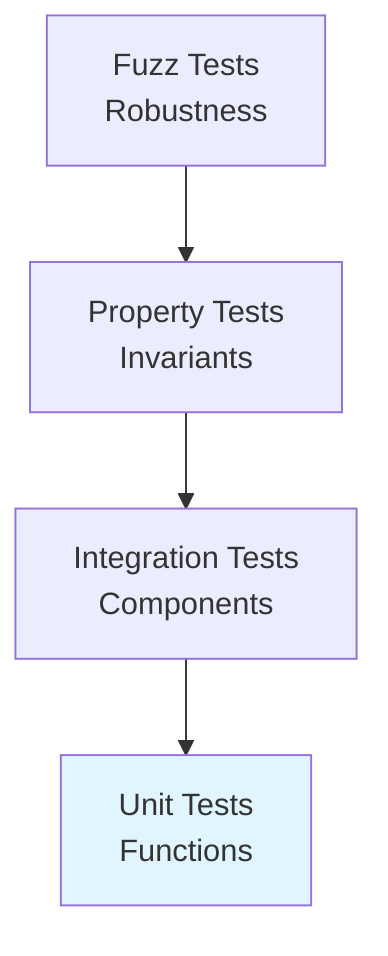

# Testing Infrastructure

> Comprehensive testing strategy and framework

## Overview

HEDL employs multiple testing strategies: unit tests, integration tests, property tests, fuzz tests, and benchmark tests.

## Testing Pyramid



## Test Categories

### Unit Tests

```rust
#[cfg(test)]
mod tests {
    use super::*;

    #[test]
    fn test_parse_simple() {
        let input = b"%VERSION: 1.0\n---\nkey: value";
        let doc = parse(input).unwrap();
        assert_eq!(doc.root.len(), 1);
        assert!(doc.root.contains_key("key"));
    }
}
```

**Coverage**: Individual functions and methods

### Integration Tests

```rust
// tests/roundtrip_tests.rs
#[test]
fn test_json_roundtrip() {
    let hedl = b"%VERSION: 1.0\n---\nkey: value";
    let doc = hedl_core::parse(hedl).unwrap();
    let json = hedl_json::to_json(&doc, &Default::default()).unwrap();
    let doc2 = hedl_json::from_json(&json, &Default::default()).unwrap();
    assert_eq!(doc.root.len(), doc2.root.len());
}
```

**Coverage**: Cross-module interactions

### Property Tests

```rust
use proptest::prelude::*;

proptest! {
    #[test]
    fn test_parse_never_panics(input in ".*") {
        let hedl_input = format!("%VERSION: 1.0\n---\n{}", input);
        let _ = hedl_core::parse(hedl_input.as_bytes());
    }
}
```

**Coverage**: Invariant verification

### Fuzz Tests

Fuzz tests are located in individual crate fuzz directories:
- `crates/hedl-core/fuzz/`
- `crates/hedl-cli/fuzz/`
- `crates/hedl-csv/fuzz/`
- `crates/hedl-stream/fuzz/`

```rust
// crates/hedl-core/fuzz/fuzz_targets/parse.rs
#![no_main]
use libfuzzer_sys::fuzz_target;
use hedl_core::parse;

fuzz_target!(|data: &[u8]| {
    let _ = parse(data);
});
```

**Coverage**: Edge cases and crashes

## Test Execution

```bash
# Run all tests
cargo test --workspace

# Run with coverage
cargo tarpaulin --workspace --out Html

# Run fuzz tests
cargo fuzz run parse -- -max_total_time=60
```

## Coverage Targets

- **Unit Tests**: 90%+ line coverage
- **Integration Tests**: All public APIs
- **Property Tests**: Core invariants
- **Fuzz Tests**: Parser robustness

---

*Last updated: 2026-01-06*
