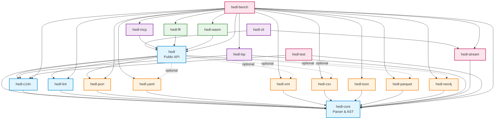
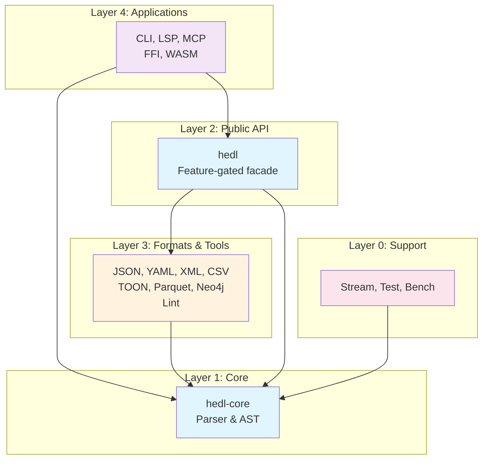

# Module Dependencies

## Dependency Graph

This document visualizes the dependency relationships between HEDL crates.

### Complete Dependency Graph



### Simplified Layer View



## Dependency Matrix

| Crate | Core | hedl | C14N | JSON | YAML | XML | CSV | TOON | Parquet | Neo4j | Lint | Stream | Test | Bench |
|-------|------|------|------|------|------|-----|-----|------|---------|-------|------|--------|------|-------|
| **hedl-core** | - | | | | | | | | | | | | | |
| **hedl** | ✓ | - | ✓ | ✓ | opt | opt | opt | | opt | opt | ✓ | | | |
| **hedl-c14n** | ✓ | | - | | | | | | | | | | | |
| **hedl-json** | ✓ | | | - | | | | | | | | | | |
| **hedl-yaml** | ✓ | | | | - | | | | | | | | | |
| **hedl-xml** | ✓ | | | | | - | | | | | | | | |
| **hedl-csv** | ✓ | | | | | | - | | | | | | | |
| **hedl-toon** | ✓ | | | | | | | - | | | | | | |
| **hedl-parquet** | ✓ | | | | | | | | - | | | | | |
| **hedl-neo4j** | ✓ | | | | | | | | | - | | | | |
| **hedl-lint** | ✓ | | | | | | | | | | - | | | |
| **hedl-cli** | | ✓ | | | | | | | | | | ✓ | | |
| **hedl-lsp** | ✓ | | ✓ | | | | | | | | | | | |
| **hedl-mcp** | | ✓ | | | | | | | | | | | | |
| **hedl-ffi** | | ✓ | | | | | | | | | | | | |
| **hedl-wasm** | | ✓ | | | | | | | | | | | | |
| **hedl-stream** | ✓ | | | | | | | | | | | - | | |
| **hedl-test** | ✓ | | ✓ | | | | | | | | | | - | |
| **hedl-bench** | ✓ | ✓ | ✓ | ✓ | ✓ | ✓ | ✓ | ✓ | ✓ | ✓ | ✓ | ✓ | | - |

Legend: ✓ = required, opt = optional (feature-gated)

## Dependency Categories

### Zero Dependencies (Foundation)
- **hedl-core**: Only external deps are `thiserror`, `memchr`, `bumpalo`
  - Self-contained parsing engine
  - No other internal crate dependencies
  - Forms the foundation layer

### Single Dependency (Core Adapters)
All format crates depend only on `hedl-core`:
- **hedl-json** → hedl-core
- **hedl-yaml** → hedl-core
- **hedl-xml** → hedl-core
- **hedl-csv** → hedl-core
- **hedl-toon** → hedl-core
- **hedl-parquet** → hedl-core
- **hedl-neo4j** → hedl-core
- **hedl-c14n** → hedl-core
- **hedl-lint** → hedl-core
- **hedl-stream** → hedl-core

**Rationale**: Clean adapter pattern with minimal coupling

### Facade Pattern (hedl)
- **hedl** → hedl-core, hedl-c14n, hedl-json, hedl-lint
  - Optional: hedl-yaml, hedl-xml, hedl-csv, hedl-parquet, hedl-neo4j
  - Re-exports public API with feature gates
  - Provides convenience functions

### Application Crates
- **hedl-cli** → hedl, hedl-stream
- **hedl-lsp** → hedl-core, hedl-c14n
- **hedl-mcp** → hedl
- **hedl-ffi** → hedl
- **hedl-wasm** → hedl

### Testing Infrastructure
- **hedl-test** → hedl-core, hedl-c14n
  - Provides fixtures for all crates
  - No circular dependencies

- **hedl-bench** → (all crates)
  - Benchmarks entire ecosystem
  - Only dependency for benchmark harness

## External Dependencies

### Core Parser (hedl-core)
```toml
thiserror = "1.0"      # Error derive macros
memchr = "2.7"         # SIMD byte searching
bumpalo = "3.16"       # Arena allocation
serde = { optional }   # Optional serialization support
```

### Format Converters
```toml
# JSON
serde_json = "1.0"

# YAML
serde_yaml = "0.9"

# XML
quick-xml = "0.31"

# CSV
csv = "1.3"

# Parquet
parquet = "57.0"
arrow = "57.0"
```

### Tools
```toml
# CLI
clap = "4.4"           # Command-line parsing

# LSP
lsp-types = "0.94"     # LSP protocol types
tower-lsp = "0.19"     # LSP server framework

# MCP
serde = "1.0"          # Serialization for protocol
```

### Bindings
```toml
# FFI
libc = "0.2"           # C types

# WASM
wasm-bindgen = "0.2"   # JS interop
```

### Performance & Testing
```toml
# Benchmarks
criterion = "0.5"      # Benchmark harness

# Testing
proptest = "1.5"       # Property-based testing
```

## Circular Dependency Prevention

The architecture prevents circular dependencies through:

1. **Unidirectional Flow**: Dependencies flow toward core
   - Applications → Facade → Formats → Core
   - No format depends on another format
   - No core depends on facade

2. **Test-Only Dependencies**: `hedl-test` is dev-dependency only
   - Used in `[dev-dependencies]` sections
   - Not in runtime dependency graph

3. **Benchmark Isolation**: `hedl-bench` depends on everything
   - Only used for benchmarking
   - Not a dependency of any other crate

4. **Feature Gates**: Optional dependencies via Cargo features
   - `hedl` can optionally include formats
   - No compile-time circular dependencies
   - Runtime feature selection

## Dependency Principles

### 1. Minimal Core Dependencies
**Principle**: Keep `hedl-core` dependencies minimal

**Rationale**:
- Faster compilation
- Smaller dependency tree
- Easier security auditing
- Clear separation of concerns

**Current Count**: 3 required (thiserror, memchr, bumpalo) + 1 optional (serde)

### 2. Format Isolation
**Principle**: Format crates don't depend on each other

**Rationale**:
- Independent evolution
- Optional compilation
- Clear adapter boundaries
- No format coupling

**Enforcement**: All formats depend only on `hedl-core`

### 3. Feature-Gated Optionality
**Principle**: Use Cargo features for optional functionality

**Example**:
```rust
#[cfg(feature = "yaml")]
pub mod yaml {
    pub use hedl_yaml::*;
}
```

**Benefits**:
- Smaller binary size
- Faster compilation
- User choice of features
- Clear capability signaling

### 4. Workspace Version Coherence
**Principle**: All workspace crates use same version

**Configuration**:
```toml
[workspace.package]
version = "1.0.0"

[package]
version.workspace = true
```

**Benefits**:
- Simplified versioning
- Consistent releases
- Clear compatibility

### 5. External Dependency Coordination
**Principle**: Coordinate major external dependencies

**Example**: All format crates use compatible `serde` versions

**Rationale**:
- Avoid duplicate dependencies
- Version conflict prevention
- Smaller dependency graph

## Dependency Metrics

| Metric | Value |
|--------|-------|
| **Total Crates** | 19 |
| **Core Crates** | 1 (hedl-core) |
| **Zero Internal Dependencies** | 1 (hedl-core) |
| **Single Internal Dependency** | 10 (all formats + c14n + lint + stream) |
| **Multi Internal Dependencies** | 8 (hedl, CLI, LSP, MCP, FFI, WASM, test, bench) |
| **External Dependencies (core)** | 3 required + 1 optional |
| **External Dependencies (total)** | ~15 unique |
| **Max Dependency Depth** | 2 (app → hedl → core) |
| **Circular Dependencies** | 0 |

## Compilation Order

Topological sort for compilation:

1. **hedl-core** (no dependencies)
2. **Formats + Support** (parallel compilation possible)
   - hedl-json, hedl-yaml, hedl-xml, hedl-csv, hedl-toon, hedl-parquet, hedl-neo4j
   - hedl-c14n, hedl-lint, hedl-stream
3. **hedl** (depends on core + formats)
4. **Test Infrastructure** (depends on core)
   - hedl-test
5. **Applications** (parallel compilation possible)
   - hedl-cli, hedl-lsp, hedl-mcp, hedl-ffi, hedl-wasm
6. **Benchmarks** (depends on everything)
   - hedl-bench

**Parallel Compilation**: Steps 2 and 5 can compile in parallel

## Dependency Evolution

### Adding New Format Converter

1. Create new crate in `crates/hedl-newformat/`
2. Add dependency on `hedl-core` only
3. Add optional dependency in `hedl/Cargo.toml`
4. Add feature gate in `hedl/src/lib.rs`
5. Add benchmarks in `hedl-bench`

**No changes needed to**: Other formats, core, tools

### Adding New Tool

1. Create new crate in `crates/hedl-newtool/`
2. Depend on `hedl` (facade) or `hedl-core` (direct)
3. Add workspace member in root `Cargo.toml`
4. Add benchmarks if performance-critical

**No changes needed to**: Core, formats, other tools

## See Also

- [Architecture Overview](README.md) - System architecture
- [Data Flow](data-flow.md) - How data moves through dependencies
- [ADR-001: Workspace Structure](decisions/adr-001-workspace-structure.md) - Workspace design rationale

---

*Last updated: 2026-01-06*
