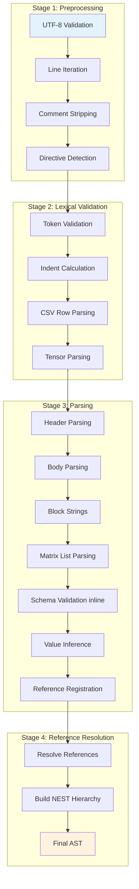

# Parsing Pipeline Architecture

## Overview

The HEDL parsing pipeline transforms raw text into a validated AST through four distinct phases: Preprocessing → Lexical Analysis → Parsing → Reference Resolution. Schema validation and resource limits are enforced inline during the parsing phase.

## Pipeline Stages


```mermaid
graph TB
    subgraph "Stage 1: Preprocessing"
        S1A[UTF-8 Validation]
        S1B[Line Iteration]
        S1C[Comment Stripping]
        S1D[Directive Detection]
    end

    subgraph "Stage 2: Lexical Validation"
        S2A[Token Validation]
        S2B[Indent Calculation]
        S2C[CSV Row Parsing]
        S2D[Tensor Parsing]
    end

    subgraph "Stage 3: Parsing"
        S3A[Header Parsing]
        S3B[Body Parsing]
        S3C[Block Strings]
        S3D[Matrix List Parsing]
        S3E[Schema Validation inline]
        S3F[Value Inference]
        S3G[Reference Registration]
    end

    subgraph "Stage 4: Reference Resolution"
        S4A[Resolve References]
        S4B[Build NEST Hierarchy]
        S4C[Final AST]
    end

    S1A --> S1B --> S1C --> S1D
    S1D --> S2A --> S2B --> S2C --> S2D
    S2D --> S3A --> S3B --> S3C --> S3D --> S3E --> S3F --> S3G
    S3G --> S4A --> S4B --> S4C

    style S1A fill:#e3f2fd
    style S4C fill:#fff3e0
```

## Stage 1: Preprocessing

### Responsibilities

Transform raw byte input into structured lines ready for parsing.

### Operations

#### 1. UTF-8 Validation
```rust
fn validate_utf8(input: &[u8]) -> Result<&str> {
    std::str::from_utf8(input)
        .map_err(|e| HedlError::syntax("Invalid UTF-8", e.valid_up_to()))
}
```

**Validates**:
- Input is valid UTF-8
- No byte-order marks (BOM)
- No invalid sequences

#### 2. Line Iteration
```rust
// Actual signature from hedl-core/src/preprocess.rs
pub fn preprocess(input: &[u8], limits: &Limits) -> HedlResult<PreprocessedInput> {
    // Check file size
    if input.len() > limits.max_file_size {
        return Err(HedlError::security(...));
    }
    // ... produces PreprocessedInput with lines() iterator
}
```

**Provides**:
- Line-by-line access
- Line numbers for error reporting
- Lazy evaluation

#### 3. Comment Stripping
```rust
fn strip_comment(line: &str) -> &str {
    if let Some(pos) = line.find('#') {
        &line[..pos]
    } else {
        line
    }
}
```

**Handles**:
- `#` line comments
- Inline comments (after values)
- Preserves `#` inside quoted strings

#### 4. Directive Detection
```rust
fn is_directive(line: &str) -> bool {
    line.trim_start().starts_with('%')
}

fn is_separator(line: &str) -> bool {
    line.trim() == "---"
}
```

**Detects**:
- `%VERSION`, `%STRUCT`, `%ALIAS`, `%NEST` directives
- `---` header/body separator
- Invalid directive names (error)

### Output

**Type**: `PreprocessedInput`
```rust
pub struct PreprocessedInput {
    text: String,
    line_offsets: Vec<(usize, usize, usize)>,
}

impl PreprocessedInput {
    pub fn lines(&self) -> impl Iterator<Item = (usize, &str)> {
        // Returns (line_number, line_content)
    }
}
```

### Performance

- **Complexity**: O(n) where n = file size
- **Memory**: O(1) - streaming iterator, no buffering
- **Optimization**: Uses `memchr` for SIMD comment detection

## Stage 2: Lexical Validation

### Responsibilities

Provide validation utilities for tokens, structures (rows, tensors, expressions), and indentation without producing a separate token stream. These utilities are called by the parser as needed.

### Operations

#### 1. Token Validation
HEDL uses direct parsing with validation utilities. No separate tokenization phase is performed:

```rust
use hedl_core::lex::{is_valid_key_token, is_valid_type_name, is_valid_id_token};

assert!(is_valid_key_token("user_name"));
assert!(is_valid_type_name("User"));
```

**Token Types**:
- **Key**: `key:` with colon
- **Value**: Unquoted or quoted string
- **Row Operator**: `|`
- **Ditto Operator**: `^`
- **Expression**: `$(...)`
- **Tensor**: `[...]`
- **Reference**: `@Type:id` or `@id`
- **Alias**: `%alias`

#### 2. Indent Validation
```rust
use hedl_core::lex::{calculate_indent, validate_indent, IndentInfo};

// Calculate indentation from a line
pub fn calculate_indent(line: &str, line_num: u32) -> Result<Option<IndentInfo>, LexError> {
    let bytes = line.as_bytes();
    let mut spaces = 0;

    for &b in bytes {
        match b {
            b' ' => spaces += 1,
            b'\t' => {
                if bytes[spaces..].iter().all(|&b| b.is_ascii_whitespace()) {
                    return Ok(None);
                }
                return Err(LexError::TabInIndentation {
                    pos: SourcePos::new(line_num as usize, spaces + 1)
                });
            }
            _ => break,
        }
    }

    if spaces == bytes.len() || bytes[spaces..].iter().all(|&b| b.is_ascii_whitespace()) {
        return Ok(None);
    }

    if spaces % 2 != 0 {
        return Err(LexError::InvalidIndentation {
            spaces,
            pos: SourcePos::new(line_num as usize, 1)
        });
    }

    Ok(Some(IndentInfo { spaces, level: spaces / 2 }))
}
```

**Validates**:
- No tabs in indentation
- Even number of spaces (2-space increments)
- Enforces `max_indent_depth` limit

#### 3. Reference Parsing
```rust
pub fn parse_reference(token: &str) -> Result<Reference, LexError> {
    if !token.starts_with('@') {
        return Err(LexError::InvalidToken { ... });
    }

    let token = &token[1..];

    if let Some(colon_pos) = token.find(':') {
        let type_name = &token[..colon_pos];
        let id = &token[colon_pos + 1..];
        // ... validation ...
        Ok(Reference {
            type_name: Some(type_name.into()),
            id: id.into(),
        })
    } else {
        // ... validation ...
        Ok(Reference {
            type_name: None,
            id: token.into(),
        })
    }
}
```

**Validates**:
- `@` prefix
- Type name format (PascalCase)
- ID token format (lowercase, alphanumeric)

### Output

No separate output or intermediate data structure. Lexical utilities are called on-demand by the parser to validate and extract data from preprocessed lines.

### Design Note: No Separate Tokenization

Unlike traditional parsers, HEDL does not generate a separate token stream. Instead:
- The parser calls lexical utilities to validate and parse specific text segments as needed
- No intermediate token array is allocated
- This reduces memory overhead and improves cache locality
- It's sufficient for HEDL's simple syntax (no lookahead needed)

### Performance

- **Complexity**: O(n) where n = line length
- **Memory**: O(1) for most validations, O(f) for row parsing (where f = field count)
- **Optimization**: SIMD for comment detection, zero-copy string slices for bare tokens

## Stage 3: Parsing

### Responsibilities

Build AST from preprocessed lines using header metadata. This is the main parsing phase where the document structure is constructed from input text.

### Operations

#### 0. Timeout Checking

The parser includes automatic timeout checking to prevent long-running operations:

```rust
// From parser.rs:561 - Automatic timeout checking every 10,000 iterations
for result in lines.iter().copied().with_timeout_check(timeout_ctx) {
    let (line_num, line) = result?;
    // ... parse line
}
```

**Features**:
- Uses `TimeoutCheckExt` extension trait on iterators
- Checks timeout every 10,000 iterations (configurable)
- Default timeout: 30 seconds (configurable via `ParseOptions`)
- Returns `HedlError::Timeout` if limit exceeded

#### 1. Header Parsing
```rust
pub fn parse_header(lines: &[(usize, &str)], limits: &Limits) -> HedlResult<(Header, usize)> {
    let mut version = None;
    let mut structs = BTreeMap::new();
    let mut aliases = BTreeMap::new();
    let mut nests = BTreeMap::new();

    for (idx, &(line_num, line)) in lines.iter().enumerate() {
        if line.trim() == "---" {
            return Ok((Header { version, structs, aliases, nests }, idx + 1));
        }
        // ... parse %VERSION, %STRUCT, %ALIAS, %NEST ...
    }
}
```

**Parses**:
- `%VERSION: 1.0` → `(1, 0)`
- `%STRUCT: User: [id, name, email]` → Schema
- `%ALIAS: %pi: "3.14159"` → Constant
- `%NEST: User > Post` → Relationship

#### 2. Body Parsing

The body is parsed using a stack-based recursive descent algorithm that processes lines based on their indentation:

```rust
// Internal parsing state tracking
enum Frame {
    Root { object: BTreeMap<String, Item> },
    Object { key: String, indent: usize, object: BTreeMap<String, Item> },
    List { ... },
}

// The parser maintains a stack of frames to handle nesting
let mut stack = vec![Frame::Root { object: BTreeMap::new() }];
```

**Key Operations**:
- Track current indentation level
- Manage stack frames for nested objects and lists
- Track total key count across all objects for security (`max_total_keys` limit)
- Handle simple key-value pairs, nested objects, and matrix lists
- Parse block strings for multi-line text values

#### 3. Block String Handling

Block strings allow multi-line text values using triple-quote delimiters:

```rust
// From parser.rs:564-574 and block_string.rs
if let Some(ref mut state) = block_string {
    if let Some(full_content) = state.process_line(line, line_num, limits)? {
        // Block string complete
        let value = Value::String(full_content.into());
        pop_frames(&mut stack, state.indent);
        insert_into_current(&mut stack, state.key.clone(), Item::Scalar(value));
        block_string = None;
    }
    continue;
}
```

**Features**:
- Opening `"""` must be followed by newline
- Closing `"""` must be on its own line
- Content preserved as-is (including whitespace)
- Security: enforces `max_block_string_size` limit

#### 4. Matrix List Parsing

Matrix lists are detected via the `@TypeName` syntax and parsed by processing subsequent pipe-prefixed (`|`) lines:

**Key Features**:
- CSV field parsing with quoting and escaping
- Ditto operator (`^`) for efficient value repetition
- Child count syntax `|[N]` for NEST parent nodes (parser.rs:988-1018)
- Count hint syntax `teams(3): @Team` for pre-allocation (parser.rs:843-880)
- Automatic registration of node IDs for reference resolution
- **Inline schema validation**: Row field count validated against declared struct schema (parser.rs:1056-1062)
- Security enforcement of `max_nodes` limit

**Schema Validation During Parsing**:

Schema validation happens inline during matrix list parsing, NOT as a separate stage:

```rust
// From parser.rs:1056-1062
let fields = parse_csv_row(csv_content)?;

// Validate shape immediately
if fields.len() != schema.len() {
    return Err(HedlError::shape(
        format!("expected {} columns, got {}", schema.len(), fields.len()),
        line_num,
    ));
}
```

This fail-fast approach catches schema errors early, providing better error messages with accurate line numbers.

#### 5. Value Inference
```rust
pub fn infer_value(s: &str, ctx: &InferenceContext, line_num: usize) -> HedlResult<Value> {
    let s = s.trim();

    // Fast path for common values (true, false, ~)
    if let Some(value) = try_lookup_common(s) {
        return Ok(value);
    }

    // First-byte dispatch
    match s.as_bytes().first() {
        Some(b'^') => infer_ditto(ctx, line_num),
        Some(b'[') => parse_tensor(s),
        Some(b'@') => parse_reference(s),
        Some(b'$') => parse_expression(s),
        Some(b'%') => infer_alias(s, ctx),
        Some(b'-') | Some(b'0'..=b'9') => try_parse_number(s),
        _ => Ok(Value::String(s.into())),
    }
}
```

**Inference Rules**:
1. `~` → `Value::Null`
2. `true`/`false` → `Value::Bool`
3. `^` → Ditto (copies from previous row)
4. `@...` → `Value::Reference`
5. `$(...)` → `Value::Expression`
6. `[...]` → `Value::Tensor`
7. Numeric → `Value::Int` or `Value::Float`
8. Otherwise → `Value::String`

### Output

**Type**: Parsed `Document`
```rust
pub struct Document {
    pub version: (u32, u32),
    pub schema_versions: BTreeMap<String, SchemaVersion>,
    pub aliases: BTreeMap<String, String>,
    pub structs: BTreeMap<String, Vec<String>>,
    pub nests: BTreeMap<String, String>,
    pub root: BTreeMap<String, Item>,
}
```

### Performance

- **Complexity**: O(n) where n = token count
- **Memory**: O(n) for AST (heap allocated)
- **Optimization**: P2 lookup table for common values, P1 first-byte dispatch, zero-copy for strings during lexing (where applicable)

## Stage 4: Reference Resolution

### Responsibilities

Resolve all `@Type:id` and `@id` references to actual nodes.

### Operations

#### 1. ID Collection

The parser collects IDs into the type registry as it encounters them:

```rust
use hedl_core::reference::{TypeRegistry, register_node};

// During body parsing
register_node(
    &mut registries,
    &list.type_name,
    &node.id,
    line_num,
)?;
```

**Registry Structure**:
```rust
pub struct TypeRegistry {
    /// Forward index: type_name -> (id -> line_number)
    by_type: BTreeMap<String, BTreeMap<String, usize>>,
    /// Inverted index: id -> list of type names containing that ID
    by_id: HashMap<String, Vec<String>>,
}
```

#### 2. Resolve References

Reference resolution is handled during parsing with the `reference_mode` option:

```rust
use hedl::{parse_with_limits, ParseOptions, ReferenceMode};

// Strict mode: fail on unresolved references
let options = ParseOptions {
    limits: Limits::default(),
    reference_mode: ReferenceMode::Strict,
};
let doc = parse_with_limits(input.as_bytes(), options)?;

// Lenient mode: unresolved references remain as-is
let options = ParseOptions {
    limits: Limits::default(),
    reference_mode: ReferenceMode::Lenient,
};
let doc = parse_with_limits(input.as_bytes(), options)?;
```

**Resolution Rules**:
- `@Type:id` → Look up in `registry[Type][id]`
- `@id` → Search all types for matching ID
- Strict mode: Error on unresolved
- Lenient mode: Replace with `null`

#### 3. Build NEST Hierarchy

NEST hierarchies are built based on the `%NEST` directives during reference resolution:

```rust
// NEST relationships are defined in the header
// %NEST: User > Post
// This means Post nodes nest under User nodes

// The nests map stores: BTreeMap<parent_type, child_type>
pub fn get_child_type(doc: &Document, parent_type: &str) -> Option<&String> {
    doc.nests.get(parent_type)
}
```

**NEST Rules**:
- `%NEST: User > Post` means Post nodes nest under User
- Child nodes have reference to parent
- Built during reference resolution

### Output

**Type**: Fully validated `Document` (ready for use)

### Performance

- **Complexity**: O(n + r) where n = nodes, r = references (amortized O(1) lookups via inverted index)
- **Memory**: O(n) for type registry
- **Optimization**: Inverted index for O(1) unqualified reference resolution

## Resource Limits Enforcement

Resource limits are enforced **inline during parsing** to enable fail-fast behavior and prevent DoS attacks:

**Limits and Enforcement Points**:
- `max_file_size`: Checked in preprocessing before parsing starts
- `max_total_keys`: Tracked cumulatively and checked on each key insertion (parser.rs:1376-1387)
- `max_indent_depth`: Checked during indentation calculation (parser.rs:590-598)
- `max_nodes`: Checked as each matrix row is added (parser.rs:1094-1103)
- `max_aliases`: Checked during header parsing
- `max_columns`: Checked when parsing struct definitions (parser.rs:978-983)
- `max_block_string_size`: Checked during block string accumulation
- `max_object_keys`: Checked before inserting keys (parser.rs:1364-1373)
- `max_nest_depth`: Checked before creating child list frames (parser.rs:1212-1229)
- `timeout`: Checked every 10,000 iterations via `with_timeout_check`

## Security Considerations

### DoS Protection

The parser enforces multiple defense-in-depth limits:

1. **Input Size Limit** (`max_file_size`): Prevent large input DoS
2. **Per-Object Keys Limit** (`max_object_keys`): Prevent single object memory exhaustion
3. **Total Keys Limit** (`max_total_keys`): Prevent cumulative allocation DoS across all objects
4. **Depth Limit** (`max_indent_depth`): Prevent stack overflow
5. **Node Count Limit** (`max_nodes`): Prevent excessive node allocation
6. **NEST Depth Limit** (`max_nest_depth`): Prevent deeply nested NEST hierarchies
7. **Block String Size Limit** (`max_block_string_size`): Prevent large string DoS
8. **Timeout Limit**: Prevent long-running parsing operations

### Example Attack Mitigation

**Attack 1**: Many small objects with cumulative large key count
```hedl
%VERSION: 1.0
---
# 100,000 objects with 10 keys each = 1,000,000 total keys
# Each object is "valid" (under max_object_keys = 10,000)
# But total memory usage is excessive!
obj0:
  k0: v0
  k1: v1
  ...
obj1:
  k0: v0
  ...
```

**Defense**: `max_total_keys` limit (default 10M) tracks cumulative keys across ALL objects and rejects document when exceeded. See parser.rs:1376-1387.

**Attack 2**: Deeply nested NEST hierarchy
```hedl
%NEST: A > B
%NEST: B > C
# ... many levels deep
```

**Defense**: `max_nest_depth` limit (default 100) counts List frames in the parsing stack and rejects when exceeded. See parser.rs:1212-1229.

## Parser Configuration

```rust
// From hedl-core/src/parser.rs
pub struct ParseOptions {
    pub limits: Limits,
    pub reference_mode: ReferenceMode,
}

pub enum ReferenceMode {
    Strict,   // Unresolved references cause errors (default)
    Lenient,  // Unresolved references are silently ignored
}

impl Default for ParseOptions {
    fn default() -> Self {
        Self {
            limits: Limits::default(),
            reference_mode: ReferenceMode::Strict,
        }
    }
}
```

## Error Handling

All parsing stages use `Result<T, HedlError>`:

```rust
pub fn parse_with_limits(input: &[u8], options: ParseOptions) -> HedlResult<Document> {
    // Create timeout context for parsing
    let timeout_ctx = TimeoutContext::new(options.limits.timeout);

    // 1. Preprocess (handles file size, UTF-8, line splitting)
    let preprocessed = preprocess(input, &options.limits)?;

    // 2. Parse header directives
    let lines: Vec<(usize, &str)> = preprocessed.lines().collect();
    let (header, body_start_idx) = parse_header(&lines, &options.limits, &timeout_ctx)?;

    // 3. Parse body
    let mut type_registries = TypeRegistry::new();
    let root = parse_body(
        &lines[body_start_idx..],
        &header,
        &options.limits,
        &mut type_registries,
        &timeout_ctx,
    )?;

    // 4. Resolve references (with timeout check)
    let doc = Document { /* ... */ };
    timeout_ctx.check_timeout(0)?;
    resolve_references(&doc, options.reference_mode)?;

    Ok(doc)
}
```

## See Also

- [Data Flow](data-flow.md) - Overall data flow architecture
- [Module Dependencies](module-dependencies.md) - Crate dependencies
- [Performance Architecture](performance.md) - Performance optimizations

---

