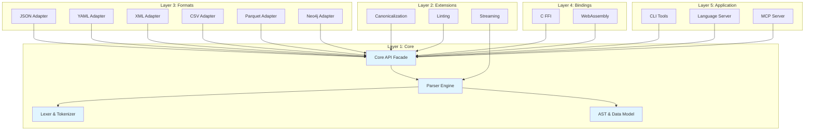

# Layered Architecture

> Detailed design of HEDL's multi-tier layered architecture

## Overview

HEDL follows a strict layered architecture pattern where dependencies flow in one direction: from higher layers to lower layers. This creates a stable foundation with clear separation of concerns.

## Layer Hierarchy



## Layer Definitions

### Layer 1: Core Layer

**Purpose**: Foundational parsing, AST representation, and validation

**Crates**:
- `hedl-core`: Core parser engine
- `hedl`: Public API facade

**Responsibilities**:
1. Lexical analysis and validation
2. Parsing HEDL syntax into AST
3. Reference resolution and validation
4. Memory-efficient parsing
5. Security limit enforcement

**Key Abstractions**:

```rust
// Core data types (from hedl-core/src/document.rs)
pub struct Document {
    pub version: (u32, u32),
    pub aliases: BTreeMap<String, String>,
    pub structs: BTreeMap<String, Vec<String>>,
    pub nests: BTreeMap<String, String>,
    pub root: BTreeMap<String, Item>,
}

pub enum Item {
    Scalar(Value),
    Object(BTreeMap<String, Item>),
    List(MatrixList),
}

pub struct MatrixList {
    pub type_name: String,
    pub schema: Vec<String>,
    pub rows: Vec<Node>,
    pub count_hint: Option<usize>,
}

pub struct Node {
    pub type_name: String,
    pub id: String,
    pub fields: Vec<Value>,
    pub children: BTreeMap<String, Vec<Node>>,
    pub child_count: Option<usize>,
}

pub enum Value {
    Null,
    Bool(bool),
    Int(i64),
    Float(f64),
    String(String),
    Tensor(Tensor),
    Reference(Reference),
    Expression(Expression),
}

// Parsing interface (from hedl-core/src/parser.rs)
pub fn parse(input: &[u8]) -> HedlResult<Document>;
pub fn parse_with_limits(input: &[u8], options: ParseOptions) -> HedlResult<Document>;
```

**Design Constraints**:
- Efficient parsing (internal zero-copy)
- Arena allocation for AST nodes
- No dependencies on format adapters
- Stable API with semantic versioning

**Performance Characteristics**:
- O(n) parsing complexity
- O(1) amortized allocation via arena
- SIMD byte searching with `memchr`
- Streaming support for large files

### Layer 2: Extension Layer

**Purpose**: Core functionality extensions that don't depend on external formats

**Crates**:
- `hedl-c14n`: Canonicalization
- `hedl-lint`: Static analysis
- `hedl-stream`: Streaming parser

**Responsibilities**:

#### hedl-c14n (Canonicalization)
- Deterministic document ordering
- Consistent formatting
- Hash-friendly output

```rust
pub fn canonicalize(doc: &Document, config: &C14nConfig) -> Result<String> {
    // Sort keys alphabetically
    // Apply consistent formatting
    // Generate deterministic output
}
```

**Use Cases**:
- Version control diffing
- Content-addressable storage
- Cryptographic signatures

#### hedl-lint (Static Analysis)
- Best practice detection
- Performance anti-patterns
- Code quality metrics

```rust
pub trait LintRule {
    fn check(&self, doc: &Document) -> Vec<Diagnostic>;
}

pub struct LintEngine {
    rules: Vec<Box<dyn LintRule>>,
}

impl LintEngine {
    pub fn run(&self, doc: &Document) -> Vec<Diagnostic> {
        self.rules.iter()
            .flat_map(|rule| rule.check(doc))
            .collect()
    }
}
```

#### hedl-stream (Streaming Parser)
- Large file handling
- Async/await support
- Backpressure management

```rust
pub async fn process_stream<R: AsyncRead + Unpin>(
    reader: R,
) -> Result<()> {
    let mut parser = AsyncStreamingParser::new(reader).await?;
    while let Some(event) = parser.next_event().await? {
        // Process event
    }
    Ok(())
}
```

### Layer 3: Format Adapter Layer

**Purpose**: Bidirectional conversion between HEDL and external formats

**Crates**:
- `hedl-json`: JSON adapter
- `hedl-yaml`: YAML adapter
- `hedl-xml`: XML adapter
- `hedl-csv`: CSV adapter
- `hedl-toon`: TOON adapter
- `hedl-parquet`: Parquet adapter
- `hedl-neo4j`: Neo4j/Cypher adapter

**Common Interface**:

All format adapters implement symmetric APIs:

```rust
// HEDL → Format
pub fn to_format(doc: &Document, config: &ToFormatConfig) -> Result<String>;

// Format → HEDL
pub fn from_format(input: &str, config: &FromFormatConfig) -> Result<Document>;
```

**Design Pattern**: Adapter pattern

```rust
// Each adapter translates between AST representations
pub struct JsonAdapter;

impl JsonAdapter {
    pub fn to_json(&self, doc: &Document) -> Result<String> {
        // 1. Convert HEDL AST to JSON value tree
        let json_value = self.convert_document(doc)?;

        // 2. Serialize JSON value to string
        serde_json::to_string_pretty(&json_value)
    }

    pub fn from_json(&self, input: &str) -> Result<Document> {
        // 1. Parse JSON string to value tree
        let json_value: serde_json::Value = serde_json::from_str(input)?;

        // 2. Convert JSON value tree to HEDL AST
        self.convert_value(&json_value)
    }
}
```

**Key Features**:

1. **Schema Generation** (JSON):
   ```rust
   pub fn generate_schema(doc: &Document) -> Result<JsonSchema>;
   ```

2. **Schema Validation** (XML, JSON):
   ```rust
   pub fn validate_against_schema(doc: &Document, schema: &Schema) -> Result<()>;
   ```

3. **Streaming Support** (XML, JSON):
   ```rust
   pub async fn to_json_stream(doc: &Document) -> impl Stream<Item = Result<String>>;
   ```

**Isolation Benefits**:
- Independent evolution of format support
- Optional compilation via feature gates
- Format-specific optimizations
- Clear testing boundaries

### Layer 4: Bindings Layer

**Purpose**: Language interoperability for non-Rust environments

**Crates**:
- `hedl-ffi`: C ABI bindings
- `hedl-wasm`: WebAssembly bindings

**Responsibilities**:

#### hedl-ffi (C FFI)

Safe C API with ownership tracking:

```rust
// Opaque pointer handle
pub struct HedlDocument {
    inner: Box<Document>,
}

#[no_mangle]
pub extern "C" fn hedl_parse(
    input: *const c_char,
    options: *const HedlParseOptions,
    error: *mut HedlError,
) -> *mut HedlDocument {
    // 1. Validate input pointers
    // 2. Convert C types to Rust types
    // 3. Call Rust API
    // 4. Convert result to C types
    // 5. Handle errors via out-parameter
}

#[no_mangle]
pub extern "C" fn hedl_document_free(doc: *mut HedlDocument) {
    // Safe deallocation
}
```

**Safety Mechanisms**:
1. **Opaque Pointers**: Prevent direct memory access
2. **Ownership Tracking**: Detect use-after-free
3. **Poison Pointers**: Debug builds detect misuse
4. **Audit Logging**: Optional operation logging

#### hedl-wasm (WebAssembly)

JavaScript-friendly API using `wasm-bindgen`:

```rust
#[wasm_bindgen]
pub struct WasmDocument {
    inner: Document,
}

#[wasm_bindgen]
impl WasmDocument {
    pub fn parse(input: &str) -> Result<WasmDocument, JsError> {
        let doc = hedl::parse(input)?;
        Ok(WasmDocument { inner: doc })
    }

    pub fn to_json(&self) -> Result<String, JsError> {
        hedl::to_json(&self.inner).map_err(Into::into)
    }
}
```

**TypeScript Definitions**:
```typescript
export class WasmDocument {
    static parse(input: string): WasmDocument;
    to_json(): string;
    free(): void;
}
```

### Layer 5: Application Layer

**Purpose**: End-user applications and tooling

**Crates**:
- `hedl-cli`: Command-line interface
- `hedl-lsp`: Language Server Protocol
- `hedl-mcp`: Model Context Protocol server

**Responsibilities**:

#### hedl-cli (CLI)

Command-line tool for HEDL operations:

```rust
#[derive(Subcommand)]
pub enum Commands {
    Validate(ValidateArgs),
    Format(FormatArgs),
    Lint(LintArgs),
    Inspect(InspectArgs),
    Stats(StatsArgs),
}

fn main() -> Result<()> {
    let cli = Cli::parse();
    match cli.command {
        Commands::Validate(args) => {
            let content = fs::read_to_string(&args.file)?;
            let doc = hedl::parse(&content)?;
            println!("Parsed document version {:?}", doc.version);
        }
        // ...
    }
}
```

#### hedl-lsp (Language Server)

IDE integration via LSP:

```rust
pub struct HedlLanguageServer {
    documents: HashMap<Url, DocumentState>,
    reference_index: ReferenceIndex,
    cache: LruCache<Url, Document>,
}

impl LanguageServer for HedlLanguageServer {
    async fn did_open(&mut self, params: DidOpenTextDocumentParams) {
        // Parse document
        // Update index
        // Send diagnostics
    }

    async fn completion(&self, params: CompletionParams) -> Result<CompletionList> {
        // Reference completion
        // Key completion
    }
}
```

#### hedl-mcp (MCP Server)

AI/LLM integration:

```rust
pub struct McpServer {
    cache: Arc<RwLock<HashMap<PathBuf, Document>>>,
}

impl McpServer {
    pub fn handle_request(&mut self, request: JsonRpcRequest) -> JsonRpcResponse {
        match request.method.as_str() {
            "initialize" => self.handle_initialize(id, request.params),
            "tools/call" => self.handle_tools_call(id, request.params),
            "resources/list" => self.handle_resources_list(id),
            _ => JsonRpcResponse::method_not_found(id),
        }
    }
}
```

## Layer Communication

### Dependency Rules

**Strict Rules**:
1. Higher layers MAY depend on lower layers
2. Lower layers MUST NOT depend on higher layers
3. Layers MAY NOT skip layers (except via explicit interfaces)

**Example Violations** (not allowed):
```rust
// ❌ Core depending on format adapter
// in hedl-core/src/lib.rs
use hedl_json::to_json; // VIOLATION

// ❌ Format skipping core facade
// in hedl-json/src/lib.rs
use hedl_stream::StreamingParser; // VIOLATION (should use hedl-core)
```

**Correct Dependencies**:
```rust
// ✅ CLI depending on facade
use hedl::{parse, to_json};

// ✅ Format adapter depending on core
use hedl_core::{Document, Node, Value};

// ✅ Extension depending on core
use hedl_core::Document;
```

### Interface Contracts

Each layer defines stable interfaces:

**Layer 1 → Layer 2**:
```rust
// hedl-core provides
pub struct Document { /* ... */ }
pub fn parse(input: &str, opts: &ParseOptions) -> Result<Document>;
```

**Layer 2 → Layer 3**:
```rust
// hedl-c14n provides
pub fn canonicalize(doc: &Document) -> Result<String>;

// hedl-json consumes
use hedl_core::Document;
```

**Layer 3 → Layer 4**:
```rust
// hedl-json provides
pub fn to_json(doc: &Document) -> Result<String>;

// hedl-ffi wraps
#[no_mangle]
pub extern "C" fn hedl_to_json(doc: *const HedlDocument) -> *mut c_char;
```

## Testing Strategy

### Unit Testing

Test each layer independently:

```rust
// Layer 1: Core parsing
#[cfg(test)]
mod tests {
    use super::*;

    #[test]
    fn test_parse_basic() {
        let input = b"%VERSION: 1.0\n---\nkey: value";
        let doc = parse(input).unwrap();
        assert_eq!(doc.root.len(), 1);
    }
}

// Layer 3: Format conversion
#[cfg(test)]
mod tests {
    use hedl_core::parse;

    #[test]
    fn test_json_roundtrip() {
        let hedl_input = b"%VERSION: 1.0\n---\nkey: value";
        let doc = parse(hedl_input).unwrap();
        let json = to_json(&doc, &Default::default()).unwrap();
        let doc2 = from_json(&json, &Default::default()).unwrap();
        assert_eq!(doc.root.len(), doc2.root.len());
    }
}
```

### Integration Testing

Test layer interactions:

```rust
// Test Application Layer → Format Layer → Core Layer
#[test]
fn test_cli_conversion() {
    let input = b"%VERSION: 1.0\n---\nkey: value";
    let doc = hedl::parse(input).unwrap();
    let json = hedl_json::to_json(&doc, &Default::default()).unwrap();
    assert!(json.contains("\"key\""));
    assert!(json.contains("\"value\""));
}
```

### Contract Testing

Verify interface stability:

```rust
#[test]
fn test_document_api_stability() {
    // Ensure Document API hasn't changed
    let doc = Document::new((1, 0));
    let _version = doc.version;
    let _root = &doc.root;
    let _structs = &doc.structs;
}
```

## Performance Implications

### Layer Overhead

**Core Layer**: O(n) parsing, O(1) allocation
- Minimal overhead
- SIMD optimizations
- Zero-copy where possible

**Format Layer**: O(n) conversion
- Additional allocation for format-specific structures
- Serialization overhead
- Streaming available for large documents

**Bindings Layer**: O(1) overhead
- Pointer conversion
- Type marshalling
- No significant computational overhead

**Application Layer**: Varies
- CLI: File I/O dominates
- LSP: Incremental parsing
- MCP: Network latency

### Optimization Strategies

1. **Hot Path Inlining**: Mark critical functions `#[inline]`
2. **Layer Bypassing**: Direct access to lower layers when performance critical
3. **Caching**: LRU caches in LSP, schema caches in JSON
4. **Lazy Evaluation**: Defer expensive operations

## Evolution and Stability

### Versioning Strategy

Each layer has independent versioning:
- Core: Stable, semver-compliant
- Formats: Can evolve independently
- Tools: May have breaking changes
- Bindings: Follow language conventions

### Deprecation Policy

When deprecating APIs:
1. Mark as `#[deprecated]` in current major version
2. Provide migration path in documentation
3. Remove in next major version

Example:
```rust
#[deprecated(since = "1.2.0", note = "Use `parse_with_options` instead")]
pub fn parse(input: &str) -> Result<Document> {
    parse_with_options(input, &ParseOptions::default())
}
```

## Trade-offs and Alternatives

### Considered Alternative: Flat Architecture

**Alternative**: All functionality in single crate

**Rejected Because**:
- Tight coupling between concerns
- All dependencies required
- Larger binary sizes
- Slower compilation

### Considered Alternative: Microservices

**Alternative**: Each layer as separate process

**Rejected Because**:
- Unnecessary overhead for library
- Complex deployment
- Process communication latency

### Chosen Trade-offs

| Aspect | Trade-off | Rationale |
|--------|-----------|-----------|
| Modularity vs. Simplicity | Favor modularity | Benefits outweigh complexity |
| Performance vs. Safety | Safety first | Optimize hot paths only |
| Flexibility vs. Stability | Stable core, flexible formats | Core must be rock-solid |

## Related Documentation

- [Module Structure](module-structure.md) - Workspace organization
- [Dependency Injection](dependency-injection.md) - Cross-layer abstractions
- [Component Diagrams](../diagrams/component-relationships.md) - Visual layer relationships
- [ADR-001](../decisions/adr-001-workspace-structure.md) - Workspace decision rationale

---

*Last updated: 2026-01-06*
