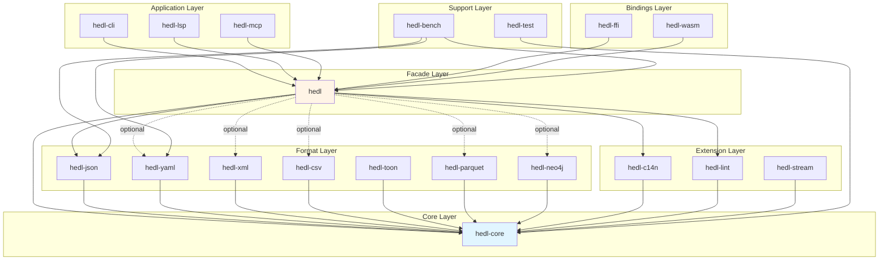

# Module Structure

> Detailed documentation of workspace organization and crate boundaries in HEDL

## Overview

HEDL uses a Cargo workspace with 19 specialized crates, each with single responsibility and clear boundaries. This document details the structure, dependencies, and organization principles.

## Workspace Layout

```
hedl/
├── Cargo.toml (workspace root)
├── crates/
│   ├── hedl/              # Public facade
│   ├── hedl-core/         # Core parser
│   ├── hedl-c14n/         # Canonicalization
│   ├── hedl-json/         # JSON adapter
│   ├── hedl-yaml/         # YAML adapter
│   ├── hedl-xml/          # XML adapter
│   ├── hedl-csv/          # CSV adapter
│   ├── hedl-toon/         # TOON adapter
│   ├── hedl-parquet/      # Parquet adapter
│   ├── hedl-neo4j/        # Neo4j adapter
│   ├── hedl-lint/         # Static analysis
│   ├── hedl-cli/          # CLI tool
│   ├── hedl-lsp/          # LSP server
│   ├── hedl-mcp/          # MCP server
│   ├── hedl-ffi/          # C FFI bindings
│   ├── hedl-wasm/         # WASM bindings
│   ├── hedl-stream/       # Streaming parser
│   ├── hedl-test/         # Test utilities
│   └── hedl-bench/        # Benchmarks
└── docs/
    └── architecture/
```

## Crate Categories

### Core Crates (3)

#### hedl-core

**Purpose**: Core parsing engine and data model

**Dependencies**:
```toml
[dependencies]
thiserror = "1.0"
memchr = "2.7"      # SIMD byte searching
bumpalo = "3.16"    # Arena allocation
```

**Public API**:
```rust
// Parsing
pub fn parse(input: &str, options: &ParseOptions) -> Result<Document>;

// Data structures
pub struct Document { /* ... */ }
pub struct Node { /* ... */ }
pub enum Value { /* ... */ }

// Configuration
pub struct ParseOptions { /* ... */ }
```

**Key Characteristics**:
- Zero external format dependencies
- Minimal dependency tree (3 crates)
- Stable semver-compliant API
- Comprehensive test coverage

**Module Organization**:
```
hedl-core/
├── src/
│   ├── lib.rs           # Public API
│   ├── parser.rs        # Parsing logic
│   ├── value.rs         # Value types
│   ├── error.rs         # Error types
│   ├── document.rs      # Document structure
│   ├── limits.rs        # Security limits
│   ├── reference.rs     # Reference resolution
│   ├── lex/             # Lexical analysis module
│   │   ├── mod.rs
│   │   └── ...
│   ├── errors/          # Error definitions
│   │   ├── mod.rs
│   │   └── ...
│   └── ...
├── tests/
│   ├── parse_tests.rs
│   ├── validation_tests.rs
│   └── property_tests.rs
└── Cargo.toml
```

#### hedl

**Purpose**: Public facade and convenience API

**Dependencies**:
```toml
[dependencies]
hedl-core = { workspace = true }
hedl-json = { workspace = true }  # Always included
hedl-yaml = { workspace = true, optional = true }
hedl-xml = { workspace = true, optional = true }
hedl-csv = { workspace = true, optional = true }
hedl-parquet = { workspace = true, optional = true }
hedl-neo4j = { workspace = true, optional = true }
hedl-c14n = { workspace = true }
hedl-lint = { workspace = true }
```

**Feature Gates**:
```toml
[features]
default = []
yaml = ["dep:hedl-yaml"]
xml = ["dep:hedl-xml"]
csv = ["dep:hedl-csv"]
parquet = ["dep:hedl-parquet"]
neo4j = ["dep:hedl-neo4j"]
all-formats = ["yaml", "xml", "csv", "parquet", "neo4j", "toon"]
```

**Public API Pattern**:
```rust
// Re-exports from hedl-core
pub use hedl_core::{Document, Node, Value, ParseOptions};

// Re-exports from hedl-c14n
pub use hedl_c14n::canonicalize;

// Conditional re-exports
#[cfg(feature = "yaml")]
pub use hedl_yaml::{to_yaml, from_yaml};

// Convenience functions
pub fn parse(input: &str) -> Result<Document> {
    hedl_core::parse(input, &ParseOptions::default())
}
```

**Module Organization**:
```
hedl/
├── src/
│   ├── lib.rs           # Public facade
│   ├── prelude.rs       # Common imports
│   └── examples/        # Embedded examples
└── Cargo.toml
```

#### hedl-c14n

**Purpose**: Deterministic canonicalization

**Dependencies**:
```toml
[dependencies]
hedl-core = { workspace = true }
```

**Public API**:
```rust
pub fn canonicalize(doc: &Document, config: &C14nConfig) -> Result<String>;

pub struct C14nConfig {
    pub sort_keys: bool,
    pub indent: usize,
    pub quote_style: QuoteStyle,
}
```

### Format Adapter Crates (7)

All format adapters follow a consistent pattern:

#### Common Pattern

**Structure**:
```
hedl-FORMAT/
├── src/
│   ├── lib.rs          # Public API
│   ├── to_format.rs    # HEDL → Format
│   ├── from_format.rs  # Format → HEDL
│   ├── config.rs       # Configuration
│   └── error.rs        # Format-specific errors
├── tests/
│   ├── roundtrip_tests.rs
│   └── comprehensive_tests.rs
└── Cargo.toml
```

**Public API**:
```rust
// HEDL → Format
pub fn to_format(doc: &Document, config: &ToFormatConfig) -> Result<String>;

// Format → HEDL
pub fn from_format(input: &str, config: &FromFormatConfig) -> Result<Document>;

// Configuration
pub struct ToFormatConfig { /* ... */ }
pub struct FromFormatConfig { /* ... */ }
```

#### hedl-json

**Dependencies**:
```toml
[dependencies]
hedl-core = { workspace = true }
serde_json = "1.0"
serde = { workspace = true, features = ["derive"] }
```

**Special Features**:
- Schema generation and caching
- Zero-copy optimizations
- Streaming support
- Partial parsing

#### hedl-yaml

**Dependencies**:
```toml
[dependencies]
hedl-core = { workspace = true }
serde_yaml = "0.9"
serde = { workspace = true, features = ["derive"] }
```

**Security Features**:
- `max_depth`: 50 default
- `max_total_keys`: 10M default
- `max_string_length`: 10MB default

#### hedl-xml

**Dependencies**:
```toml
[dependencies]
hedl-core = { workspace = true }
quick-xml = { version = "0.31", features = ["serialize"] }
```

**Special Features**:
- Streaming XML parsing
- Schema validation
- Namespace support

#### hedl-csv

**Dependencies**:
```toml
[dependencies]
hedl-core = { workspace = true }
csv = "1.3"
```

**Special Features**:
- Schema inference
- Custom pluralization
- High-performance parsing

#### hedl-toon

**Dependencies**:
```toml
[dependencies]
hedl-core = { workspace = true }
```

**Purpose**:
- TOON format conversion
- Token efficiency analysis
- Readability metrics

#### hedl-parquet

**Dependencies**:
```toml
[dependencies]
hedl-core = { workspace = true }
parquet = "57.0"
arrow = "57.0"
```

**Special Features**:
- Arrow schema integration
- Columnar data layout
- Position encoding

#### hedl-neo4j

**Dependencies**:
```toml
[dependencies]
hedl-core = { workspace = true }
```

**Special Features**:
- Graph mapping (Node/Relationship)
- Cypher query generation
- Streaming API for large graphs

### Tool Crates (4)

#### hedl-cli

**Purpose**: Command-line interface

**Dependencies**:
```toml
[dependencies]
hedl = { workspace = true, features = ["all-formats"] }
clap = { version = "4.4", features = ["derive"] }
anyhow = "1.0"
tokio = { version = "1", features = ["full"] }
rayon = "1.8"
```

**Module Organization**:
```
hedl-cli/
├── src/
│   ├── main.rs
│   ├── cli/
│   │   ├── parse.rs     # Parse command
│   │   ├── convert.rs   # Convert command
│   │   ├── lint.rs      # Lint command
│   │   └── stats.rs     # Stats command
│   └── utils/
│       ├── io.rs        # File I/O
│       └── parallel.rs  # Parallel processing
└── Cargo.toml
```

**Commands**:
```rust
#[derive(Subcommand)]
pub enum Commands {
    Validate(ValidateArgs),
    Format(FormatArgs),
    Lint(LintArgs),
    Inspect(InspectArgs),
    Stats(StatsArgs),
    ToJson(ToJsonArgs),
    FromJson(FromJsonArgs),
    // ... other format-specific commands ...
    BatchValidate(BatchValidateArgs),
    BatchFormat(BatchFormatArgs),
    BatchLint(BatchLintArgs),
    Completion(CompletionArgs),
}
```

#### hedl-lsp

**Purpose**: Language Server Protocol implementation

**Dependencies**:
```toml
[dependencies]
hedl = { workspace = true }
tower-lsp = "0.20"
tokio = { version = "1", features = ["full"] }
lru = "0.12"
```

**Module Organization**:
```
hedl-lsp/
├── src/
│   ├── lib.rs
│   ├── server.rs        # LSP server
│   ├── handlers/
│   │   ├── completion.rs
│   │   ├── diagnostics.rs
│   │   └── formatting.rs
│   ├── index.rs         # Reference index
│   └── cache.rs         # LRU caching
└── Cargo.toml
```

**Key Features**:
- Incremental parsing
- Reference indexing with LRU cache
- Syntax highlighting
- Auto-completion

#### hedl-mcp

**Purpose**: Model Context Protocol server for AI/LLM integration

**Dependencies**:
```toml
[dependencies]
hedl = { workspace = true, features = ["all-formats"] }
serde_json = "1.0"
tokio = { version = "1", features = ["full"] }
```

**Module Organization**:
```
hedl-mcp/
├── src/
│   ├── lib.rs
│   ├── server.rs        # MCP server
│   ├── tools/
│   │   ├── parse.rs     # Parse tool
│   │   ├── convert.rs   # Convert tool
│   │   └── validate.rs  # Validate tool
│   └── cache.rs         # Document cache
└── Cargo.toml
```

#### hedl-lint

**Purpose**: Static analysis and linting

**Dependencies**:
```toml
[dependencies]
hedl-core = { workspace = true }
```

**Module Organization**:
```
hedl-lint/
├── src/
│   ├── lib.rs
│   ├── engine.rs        # Lint engine
│   ├── rules/
│   │   ├── performance.rs
│   │   ├── style.rs
│   │   └── best_practices.rs
│   └── diagnostic.rs    # Diagnostic types
└── Cargo.toml
```

**Rule System**:
```rust
pub trait LintRule {
    fn id(&self) -> &str;
    fn description(&self) -> &str;
    fn check(&self, doc: &Document) -> Vec<Diagnostic>;
}

pub struct LintEngine {
    rules: Vec<Box<dyn LintRule>>,
}
```

### Binding Crates (2)

#### hedl-ffi

**Purpose**: C FFI bindings

**Dependencies**:
```toml
[dependencies]
hedl = { workspace = true, features = ["all-formats"] }
libc = "0.2"
```

**Module Organization**:
```
hedl-ffi/
├── src/
│   ├── lib.rs           # FFI API
│   ├── types.rs         # C-compatible types
│   ├── handles.rs       # Opaque handles
│   ├── safety.rs        # Safety checks
│   └── audit.rs         # Audit logging
├── include/
│   └── hedl.h           # C header
└── Cargo.toml
```

**Safety Features**:
- Opaque pointer handles
- Ownership tracking
- Poison pointers (debug mode)
- Audit logging

#### hedl-wasm

**Purpose**: WebAssembly bindings

**Dependencies**:
```toml
[dependencies]
hedl = { workspace = true }
wasm-bindgen = "0.2"
serde-wasm-bindgen = "0.6"
```

**Module Organization**:
```
hedl-wasm/
├── src/
│   ├── lib.rs           # WASM API
│   ├── types.rs         # JS-compatible types
│   └── utils.rs         # Utilities
├── pkg/                 # Generated pkg
└── Cargo.toml
```

**TypeScript Definitions**:
Automatically generated via `wasm-bindgen`

### Support Crates (3)

#### hedl-stream

**Purpose**: Streaming parser for large files

**Dependencies**:
```toml
[dependencies]
hedl-core = { workspace = true }
tokio = { version = "1", features = ["full"] }
futures = "0.3"
```

**Module Organization**:
```
hedl-stream/
├── src/
│   ├── lib.rs
│   ├── parser.rs        # Streaming parser
│   ├── async_parser.rs  # Async parser
│   └── buffer.rs        # Buffer management
└── Cargo.toml
```

#### hedl-test

**Purpose**: Shared test utilities and fixtures

**Dependencies**:
```toml
[dependencies]
hedl-core = { workspace = true }
proptest = "1.0"
```

**Module Organization**:
```
hedl-test/
├── src/
│   ├── lib.rs
│   ├── fixtures/
│   │   ├── documents.rs # Test documents
│   │   └── expressions.rs # Test expressions
│   └── utils/
│       ├── expr_utils.rs
│       └── generators.rs # PropTest generators
└── Cargo.toml
```

#### hedl-bench

**Purpose**: Comprehensive benchmark suite

**Dependencies**:
```toml
[dependencies]
hedl-core = { workspace = true }
hedl-stream = { workspace = true }
# Format crates (optional)
hedl-json = { workspace = true, optional = true }
# ... other formats
criterion = { version = "0.5", features = ["html_reports"] }
```

**Module Organization**:
```
hedl-bench/
├── benches/
│   ├── core/
│   │   ├── lexer.rs
│   │   ├── parsing.rs
│   │   └── validation.rs
│   ├── formats/
│   │   ├── json.rs
│   │   ├── yaml.rs
│   │   └── xml.rs
│   ├── features/
│   │   ├── streaming.rs
│   │   ├── canonicalization.rs
│   │   └── zero_copy.rs
│   └── integration/
│       ├── comprehensive.rs
│       └── end_to_end.rs
├── src/
│   └── common/
│       ├── generators.rs
│       └── reporting.rs
└── Cargo.toml
```

## Dependency Graph



## Workspace Configuration

### Root Cargo.toml

```toml
[workspace]
resolver = "2"
members = [
    "crates/hedl",
    "crates/hedl-core",
    # ... all 19 crates
]

[workspace.package]
version = "1.0.0"
edition = "2021"
license = "Apache-2.0"
authors = ["Dweve B.V. <opensource@dweve.com>"]
repository = "https://github.com/dweve-ai/hedl"
homepage = "https://dweve.com"
rust-version = "1.70"

[workspace.dependencies]
# Internal crates
hedl = { version = "1.0.0", path = "crates/hedl" }
hedl-core = { version = "1.0.0", path = "crates/hedl-core" }
# ... all internal crates

# External dependencies
thiserror = "1.0"
serde = { version = "1.0", features = ["derive"] }
serde_json = "1.0"
# ... all external dependencies

[profile.release]
lto = "thin"
codegen-units = 1
opt-level = 3

[profile.bench]
inherits = "release"
```

### Individual Crate Pattern

```toml
[package]
name = "hedl-FORMAT"
version.workspace = true
edition.workspace = true
license.workspace = true
repository.workspace = true
homepage.workspace = true
description = "FORMAT adapter for HEDL"

[dependencies]
hedl-core.workspace = true
# Format-specific dependencies

[dev-dependencies]
hedl-test.workspace = true
proptest = "1.0"

[features]
default = []
```

## Module Organization Principles

### Single Responsibility

Each crate has one clear purpose:
- **hedl-core**: Parsing and AST
- **hedl-json**: JSON conversion (only)
- **hedl-cli**: CLI tool (only)

### Minimal Dependencies

Core crates have minimal dependencies:
- **hedl-core**: 3 dependencies (thiserror, memchr, bumpalo)
- **hedl**: Core + optional format adapters
- **hedl-FORMAT**: Core + format library

### Clear Boundaries

Public APIs are well-defined:
- Each crate exports specific functionality
- Internal modules are private
- Breaking changes require major version bump

### Consistent Patterns

All format adapters follow same pattern:
- `to_format()` / `from_format()` naming
- Configuration via dedicated structs
- Error types via `thiserror`

## Testing Organization

### Unit Tests

Each crate has internal unit tests:
```rust
// In hedl-core/src/parser.rs
#[cfg(test)]
mod tests {
    use super::*;

    #[test]
    fn test_parse_simple() { /* ... */ }
}
```

### Integration Tests

Cross-crate integration tests:
```rust
// In hedl-json/tests/roundtrip_tests.rs
use hedl_core::parse;
use hedl_json::{to_json, from_json};

#[test]
fn test_json_roundtrip() {
    let hedl = "key: value";
    let doc = parse(hedl, &Default::default()).unwrap();
    let json = to_json(&doc, &Default::default()).unwrap();
    let doc2 = from_json(&json, &Default::default()).unwrap();
    assert_eq!(doc, doc2);
}
```

### Property Tests

Shared generators in `hedl-test`:
```rust
// In hedl-test/src/generators.rs
pub fn arb_document() -> impl Strategy<Value = Document> {
    /* ... */
}
```

## Build and Release

### Parallel Compilation

Cargo builds independent crates in parallel:
```bash
cargo build --release
# Builds format crates (json, yaml, xml) in parallel
# Builds tool crates (cli, lsp, mcp) in parallel
```

### Selective Publishing

Can publish subsets:
```bash
# Publish core
cargo publish -p hedl-core

# Publish facade
cargo publish -p hedl

# Publish tools
cargo publish -p hedl-cli
```

### Feature Combinations

Users choose features:
```toml
# Minimal: core + JSON only
hedl = "1.0"

# With YAML support
hedl = { version = "1.0", features = ["yaml"] }

# All formats
hedl = { version = "1.0", features = ["all-formats"] }
```

## Related Documentation

- [ADR-001](../decisions/adr-001-workspace-structure.md) - Workspace rationale
- [Module Dependencies](../module-dependencies.md) - Dependency details

---

*Last updated: 2026-01-06*
