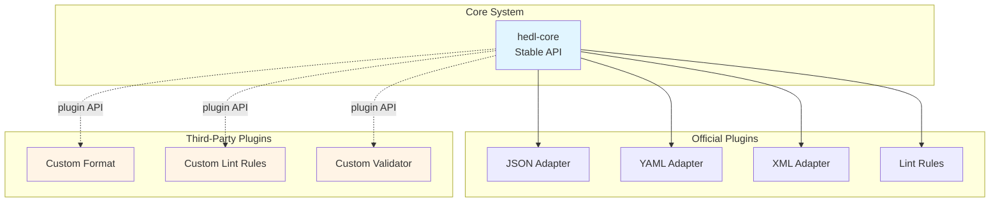

# Plugin Architecture

> Extension system and format adapter architecture in HEDL

## Overview

> **Note**: This document describes the planned plugin architecture for HEDL. Some features described here are aspirational and represent the intended design for future extensibility. Current extension capabilities are limited to:
> - Creating custom format adapter crates following the established pattern
> - Implementing custom lint rules in the `hedl-lint` framework
> - Using the `DocumentVisitor` trait for custom traversal logic
> - Creating custom CLI tools using the `hedl` facade crate
>
> The trait-based plugin system with dynamic loading described below represents the roadmap for future development.

HEDL is designed with extensibility in mind, allowing third-party developers to extend functionality without modifying core code. The planned system will support format adapters, lint rules, validators, and custom tooling through well-defined trait interfaces.

## Extension Points



## Plugin Types

### 1. Format Adapter Plugins

Format adapters convert between HEDL and external formats.

#### Format Adapter Trait

```rust
/// Trait for format conversion plugins
pub trait FormatAdapter: Send + Sync {
    /// Adapter name/identifier
    fn name(&self) -> &str;

    /// Convert HEDL document to format
    fn to_format(
        &self,
        doc: &Document,
        options: &FormatOptions,
    ) -> Result<String>;

    /// Convert format to HEDL document
    fn from_format(
        &self,
        input: &str,
        options: &FormatOptions,
    ) -> Result<Document>;

    /// Supported file extensions
    fn extensions(&self) -> &[&str];

    /// MIME type
    fn mime_type(&self) -> &str;
}

/// Format-specific options
pub struct FormatOptions {
    pub indent: Option<usize>,
    pub sort_keys: bool,
    pub schema_validation: bool,
    pub custom_options: HashMap<String, String>,
}
```

#### Example: Custom TOML Adapter

```rust
use hedl_core::{Document, Node, Value, Result};

pub struct TomlAdapter;

impl FormatAdapter for TomlAdapter {
    fn name(&self) -> &str {
        "toml"
    }

    fn to_format(
        &self,
        doc: &Document,
        options: &FormatOptions,
    ) -> Result<String> {
        // Convert HEDL AST to TOML table
        let toml_value = self.convert_document(doc)?;

        // Serialize with formatting
        Ok(toml::to_string_pretty(&toml_value)?)
    }

    fn from_format(
        &self,
        input: &str,
        _options: &FormatOptions,
    ) -> Result<Document> {
        // Parse TOML
        let toml_value: toml::Value = toml::from_str(input)?;

        // Convert TOML table to HEDL AST
        self.convert_value(&toml_value)
    }

    fn extensions(&self) -> &[&str] {
        &["toml"]
    }

    fn mime_type(&self) -> &str {
        "application/toml"
    }
}

impl TomlAdapter {
    fn convert_document(&self, doc: &Document) -> Result<toml::Value> {
        let mut table = toml::map::Map::new();

        for (key, item) in &doc.root {
            let value = self.convert_item_value(item)?;
            table.insert(key.clone(), value);
        }

        Ok(toml::Value::Table(table))
    }

    fn convert_item_value(&self, item: &Item) -> Result<toml::Value> {
        match item {
            Item::Scalar(value) => self.convert_value(value),
            Item::Object(children) => {
                let mut table = toml::map::Map::new();
                for (key, child) in children {
                    table.insert(
                        key.to_string(),
                        self.convert_item_value(child)?,
                    );
                }
                Ok(toml::Value::Table(table))
            }
            Item::List(matrix) => {
                let array: Result<Vec<_>> = matrix.rows.iter()
                    .map(|node| self.convert_node_to_toml(node))
                    .collect();
                Ok(toml::Value::Array(array?))
            }
        }
    }

    fn convert_value(&self, value: &Value) -> Result<toml::Value> {
        match value {
            Value::Null => Ok(toml::Value::String(String::new())),
            Value::Bool(b) => Ok(toml::Value::Boolean(*b)),
            Value::Int(i) => Ok(toml::Value::Integer(*i)),
            Value::Float(f) => Ok(toml::Value::Float(*f)),
            Value::String(s) => Ok(toml::Value::String(s.to_string())),
            _ => Err(HedlError::conversion("Unsupported value type")),
        }
    }

    fn convert_value(&self, value: &toml::Value) -> Result<Document> {
        match value {
            toml::Value::Table(table) => {
                let mut doc = Document::new((1, 0));
                for (k, v) in table {
                    let item = self.table_entry_to_item(k, v)?;
                    doc.root.insert(k.clone(), item);
                }
                Ok(doc)
            }
            _ => Err(HedlError::conversion("TOML root must be a table")),
        }
    }
}
```

#### Registering Custom Adapters

```rust
/// Plugin registry for format adapters
pub struct AdapterRegistry {
    adapters: HashMap<String, Box<dyn FormatAdapter>>,
}

impl AdapterRegistry {
    pub fn new() -> Self {
        Self {
            adapters: HashMap::new(),
        }
    }

    /// Register a format adapter
    pub fn register<A: FormatAdapter + 'static>(
        &mut self,
        adapter: A,
    ) -> &mut Self {
        self.adapters.insert(
            adapter.name().to_string(),
            Box::new(adapter),
        );
        self
    }

    /// Get adapter by name
    pub fn get(&self, name: &str) -> Option<&dyn FormatAdapter> {
        self.adapters.get(name).map(|a| &**a)
    }

    /// Get adapter by file extension
    pub fn get_by_extension(&self, ext: &str) -> Option<&dyn FormatAdapter> {
        self.adapters.values()
            .find(|a| a.extensions().contains(&ext))
            .map(|a| &**a)
    }

    /// List all registered adapters
    pub fn list(&self) -> Vec<&str> {
        self.adapters.keys().map(|s| s.as_str()).collect()
    }
}

// Usage
let mut registry = AdapterRegistry::new();
registry
    .register(JsonAdapter)
    .register(YamlAdapter)
    .register(TomlAdapter);  // Custom adapter

// Convert using registry
let adapter = registry.get("toml").unwrap();
let toml = adapter.to_format(&doc, &FormatOptions::default())?;
```

### 2. Lint Rule Plugins

Custom lint rules for static analysis.

#### Lint Rule Trait

```rust
/// Trait for custom lint rules
pub trait LintRule: Send + Sync {
    /// Rule identifier
    fn id(&self) -> &str;

    /// Rule description
    fn description(&self) -> &str;

    /// Check document and return diagnostics
    fn check(&self, doc: &Document) -> Vec<Diagnostic>;

    /// Check with context (optional)
    fn check_with_context(&self, doc: &Document, context: &dyn Any) -> Vec<Diagnostic> {
        self.check(doc)
    }
}

pub struct Diagnostic {
    severity: Severity,       // access via severity()
    kind: DiagnosticKind,     // access via kind()
    message: String,          // access via message()
    line: Option<usize>,      // access via line()
    rule_id: String,          // access via rule_id()
}

pub enum Severity {
    Error,
    Warning,
    Info,
    Hint,
}
```

#### Example: Custom Security Rule

```rust
/// Lint rule to detect potential PII in keys
pub struct PiiDetectionRule {
    patterns: Vec<regex::Regex>,
}

impl PiiDetectionRule {
    pub fn new() -> Self {
        Self {
            patterns: vec![
                regex::Regex::new(r"(?i)(password|secret|token|api[_-]?key)").unwrap(),
                regex::Regex::new(r"(?i)(ssn|social[_-]?security)").unwrap(),
                regex::Regex::new(r"(?i)(credit[_-]?card|ccn)").unwrap(),
            ],
        }
    }

    fn check_key(&self, key: &str) -> Option<String> {
        for pattern in &self.patterns {
            if pattern.is_match(key) {
                return Some(format!(
                    "Key '{}' may contain sensitive information",
                    key
                ));
            }
        }
        None
    }
}

impl LintRule for PiiDetectionRule {
    fn id(&self) -> &str {
        "pii-detection"
    }

    fn description(&self) -> &str {
        "Detects keys that may contain personally identifiable information"
    }

    fn check(&self, doc: &Document) -> Vec<Diagnostic> {
        let mut diagnostics = Vec::new();

        // Check all keys in root
        for (key, item) in &doc.root {
            if let Some(message) = self.check_key(key) {
                diagnostics.push(Diagnostic {
                    severity: Severity::Warning,
                    message,
                    position: None,
                    rule_id: self.id().to_string(),
                });
            }

            // Recursively check nested objects
            self.check_item_keys(item, &mut diagnostics);
        }

        diagnostics
    }
}

impl PiiDetectionRule {
    fn check_item_keys(&self, item: &Item, diagnostics: &mut Vec<Diagnostic>) {
        match item {
            Item::Object(children) => {
                for (key, child) in children {
                    if let Some(message) = self.check_key(key) {
                        diagnostics.push(Diagnostic {
                            severity: Severity::Warning,
                            message,
                            position: None,
                            rule_id: self.id().to_string(),
                        });
                    }
                    self.check_item_keys(child, diagnostics);
                }
            }
            _ => {}
        }
    }
}

// Usage
let engine = LintEngine::new()
    .add_rule(PiiDetectionRule::new())
    .add_rule(DeepNestingRule::new());

let diagnostics = engine.run(&doc);
```

### 3. Validator Plugins

Custom validation logic beyond standard parsing.

#### Validator Trait

```rust
/// Trait for custom validators
pub trait Validator: Send + Sync {
    /// Validator name
    fn name(&self) -> &str;

    /// Validate document
    fn validate(&self, doc: &Document) -> ValidationResult;
}

pub struct ValidationResult {
    pub valid: bool,
    pub errors: Vec<ValidationError>,
    pub warnings: Vec<ValidationWarning>,
}

pub struct ValidationError {
    pub message: String,
    pub path: String,
    pub position: usize,
}

pub struct ValidationWarning {
    pub message: String,
    pub path: String,
}
```

#### Example: Schema Validator

```rust
/// JSON Schema-based validator
pub struct SchemaValidator {
    schema: serde_json::Value,
}

impl SchemaValidator {
    pub fn new(schema: serde_json::Value) -> Self {
        Self { schema }
    }

    pub fn from_file(path: &Path) -> Result<Self> {
        let content = std::fs::read_to_string(path)?;
        let schema = serde_json::from_str(&content)?;
        Ok(Self::new(schema))
    }
}

impl Validator for SchemaValidator {
    fn name(&self) -> &str {
        "json-schema"
    }

    fn validate(&self, doc: &Document) -> ValidationResult {
        // Convert HEDL to JSON
        let json = match hedl_json::to_json(doc, &Default::default()) {
            Ok(j) => j,
            Err(e) => {
                return ValidationResult {
                    valid: false,
                    errors: vec![ValidationError {
                        message: format!("Failed to convert to JSON: {}", e),
                        path: "/".to_string(),
                        position: 0,
                    }],
                    warnings: vec![],
                };
            }
        };

        let json_value: serde_json::Value = serde_json::from_str(&json).unwrap();

        // Validate against schema
        let compiled = jsonschema::JSONSchema::compile(&self.schema)
            .expect("Invalid schema");

        let mut errors = Vec::new();
        let mut warnings = Vec::new();

        if let Err(validation_errors) = compiled.validate(&json_value) {
            for error in validation_errors {
                errors.push(ValidationError {
                    message: error.to_string(),
                    path: error.instance_path.to_string(),
                    position: 0,
                });
            }
        }

        ValidationResult {
            valid: errors.is_empty(),
            errors,
            warnings,
        }
    }
}

// Usage
let schema = serde_json::json!({
    "type": "object",
    "properties": {
        "name": { "type": "string" },
        "age": { "type": "integer", "minimum": 0 }
    },
    "required": ["name"]
});

let validator = SchemaValidator::new(schema);
let result = validator.validate(&doc);

if !result.valid {
    for error in result.errors {
        eprintln!("Validation error: {}", error.message);
    }
}
```

### 4. Serializer Plugins

Custom serialization formats.

#### Serializer Trait

```rust
/// Trait for custom serializers
pub trait Serializer: Send + Sync {
    /// Serializer name
    fn name(&self) -> &str;

    /// Serialize document
    fn serialize(
        &self,
        doc: &Document,
        options: &SerializerOptions,
    ) -> Result<Vec<u8>>;

    /// Deserialize document
    fn deserialize(
        &self,
        data: &[u8],
        options: &SerializerOptions,
    ) -> Result<Document>;

    /// Content type
    fn content_type(&self) -> &str;
}

pub struct SerializerOptions {
    pub compression: Option<CompressionType>,
    pub encoding: Encoding,
}

pub enum CompressionType {
    Gzip,
    Zstd,
    Lz4,
}

pub enum Encoding {
    Binary,
    Base64,
    Hex,
}
```

#### Example: Binary Serializer

```rust
use bincode;

/// Binary serializer using bincode
pub struct BinarySerializer;

impl Serializer for BinarySerializer {
    fn name(&self) -> &str {
        "binary"
    }

    fn serialize(
        &self,
        doc: &Document,
        options: &SerializerOptions,
    ) -> Result<Vec<u8>> {
        // Serialize to bincode
        let mut data = bincode::serialize(doc)?;

        // Apply compression if requested
        if let Some(compression) = &options.compression {
            data = match compression {
                CompressionType::Gzip => self.compress_gzip(&data)?,
                CompressionType::Zstd => self.compress_zstd(&data)?,
                CompressionType::Lz4 => self.compress_lz4(&data)?,
            };
        }

        Ok(data)
    }

    fn deserialize(
        &self,
        data: &[u8],
        options: &SerializerOptions,
    ) -> Result<Document> {
        // Decompress if needed
        let data = if let Some(compression) = &options.compression {
            match compression {
                CompressionType::Gzip => self.decompress_gzip(data)?,
                CompressionType::Zstd => self.decompress_zstd(data)?,
                CompressionType::Lz4 => self.decompress_lz4(data)?,
            }
        } else {
            data.to_vec()
        };

        // Deserialize from bincode
        Ok(bincode::deserialize(&data)?)
    }

    fn content_type(&self) -> &str {
        "application/octet-stream"
    }
}
```

## Plugin Discovery

### Static Registration

Compile-time plugin registration:

```rust
/// Static plugin registry
pub struct PluginRegistry {
    format_adapters: HashMap<String, Box<dyn FormatAdapter>>,
    lint_rules: Vec<Box<dyn LintRule>>,
    validators: HashMap<String, Box<dyn Validator>>,
    serializers: HashMap<String, Box<dyn Serializer>>,
}

impl PluginRegistry {
    /// Create registry with default plugins
    pub fn with_defaults() -> Self {
        let mut registry = Self::new();

        // Register format adapters
        registry.register_adapter(JsonAdapter);
        registry.register_adapter(YamlAdapter);
        registry.register_adapter(XmlAdapter);

        // Register lint rules
        registry.register_lint_rule(DeepNestingRule::new());
        registry.register_lint_rule(PerformanceRule::new());

        registry
    }

    /// Register format adapter
    pub fn register_adapter<A: FormatAdapter + 'static>(
        &mut self,
        adapter: A,
    ) -> &mut Self {
        self.format_adapters.insert(
            adapter.name().to_string(),
            Box::new(adapter),
        );
        self
    }

    /// Register lint rule
    pub fn register_lint_rule<R: LintRule + 'static>(
        &mut self,
        rule: R,
    ) -> &mut Self {
        self.lint_rules.push(Box::new(rule));
        self
    }

    /// Register validator
    pub fn register_validator<V: Validator + 'static>(
        &mut self,
        validator: V,
    ) -> &mut Self {
        self.validators.insert(
            validator.name().to_string(),
            Box::new(validator),
        );
        self
    }

    /// Register serializer
    pub fn register_serializer<S: Serializer + 'static>(
        &mut self,
        serializer: S,
    ) -> &mut Self {
        self.serializers.insert(
            serializer.name().to_string(),
            Box::new(serializer),
        );
        self
    }
}

// Usage
let mut registry = PluginRegistry::with_defaults();
registry
    .register_adapter(TomlAdapter)
    .register_lint_rule(PiiDetectionRule::new())
    .register_validator(SchemaValidator::from_file("schema.json")?);
```

### Dynamic Loading (Advanced)

Dynamic plugin loading via shared libraries:

```rust
use libloading::{Library, Symbol};

/// Plugin metadata
pub struct PluginMetadata {
    pub name: String,
    pub version: String,
    pub author: String,
    pub description: String,
}

/// Plugin entry point
pub type PluginCreate = unsafe fn() -> *mut dyn Plugin;

/// Main plugin trait
pub trait Plugin: Send + Sync {
    fn metadata(&self) -> &PluginMetadata;
    fn initialize(&mut self) -> Result<()>;
    fn shutdown(&mut self) -> Result<()>;
}

/// Dynamic plugin loader
pub struct PluginLoader {
    libraries: Vec<Library>,
    plugins: Vec<Box<dyn Plugin>>,
}

impl PluginLoader {
    pub fn new() -> Self {
        Self {
            libraries: Vec::new(),
            plugins: Vec::new(),
        }
    }

    /// Load plugin from shared library
    pub unsafe fn load_plugin(&mut self, path: &Path) -> Result<()> {
        let library = Library::new(path)?;

        let create: Symbol<PluginCreate> = library.get(b"create_plugin")?;
        let plugin_ptr = create();
        let plugin = Box::from_raw(plugin_ptr);

        plugin.initialize()?;

        self.libraries.push(library);
        self.plugins.push(plugin);

        Ok(())
    }

    /// Get all loaded plugins
    pub fn plugins(&self) -> &[Box<dyn Plugin>] {
        &self.plugins
    }
}
```

## Plugin Configuration

### Configuration File

```toml
# hedl-plugins.toml

[plugins]
# Enable/disable plugins
enabled = ["json", "yaml", "xml", "toml"]
disabled = []

[plugins.toml]
# TOML adapter configuration
pretty = true
indent = 2

[linting]
# Lint rules configuration
enabled_rules = ["deep-nesting", "pii-detection", "performance"]

[linting.deep-nesting]
max_depth = 10

[linting.pii-detection]
patterns = ["password", "secret", "api_key"]

[validation]
# Validator configuration
schema_validation = true
schema_path = "./schema.json"
```

### Loading Configuration

```rust
use serde::Deserialize;

#[derive(Deserialize)]
pub struct PluginConfig {
    pub plugins: PluginsConfig,
    pub linting: LintingConfig,
    pub validation: ValidationConfig,
}

#[derive(Deserialize)]
pub struct PluginsConfig {
    pub enabled: Vec<String>,
    pub disabled: Vec<String>,
}

#[derive(Deserialize)]
pub struct LintingConfig {
    pub enabled_rules: Vec<String>,
}

#[derive(Deserialize)]
pub struct ValidationConfig {
    pub schema_validation: bool,
    pub schema_path: Option<PathBuf>,
}

impl PluginConfig {
    pub fn from_file(path: &Path) -> Result<Self> {
        let content = std::fs::read_to_string(path)?;
        Ok(toml::from_str(&content)?)
    }

    pub fn apply_to_registry(&self, registry: &mut PluginRegistry) {
        // Enable/disable plugins based on config
        for name in &self.plugins.enabled {
            // Enable plugin
        }

        for name in &self.plugins.disabled {
            // Disable plugin
        }
    }
}
```

## Best Practices

### 1. Follow Trait Conventions

Implement all required trait methods:

```rust
impl FormatAdapter for CustomAdapter {
    fn name(&self) -> &str { "custom" }
    fn to_format(&self, doc: &Document, opts: &FormatOptions) -> Result<String> { /* ... */ }
    fn from_format(&self, input: &str, opts: &FormatOptions) -> Result<Document> { /* ... */ }
    fn extensions(&self) -> &[&str] { &["custom"] }
    fn mime_type(&self) -> &str { "application/x-custom" }
}
```

### 2. Handle Errors Gracefully

Return descriptive errors:

```rust
fn to_format(&self, doc: &Document, opts: &FormatOptions) -> Result<String> {
    let value = self.convert(doc)
        .map_err(|e| HedlError::conversion(
            format!("Failed to convert to custom format: {}", e)
        ))?;

    Ok(value)
}
```

### 3. Document Configuration Options

```rust
/// Custom format adapter
///
/// # Configuration
///
/// - `indent`: Number of spaces for indentation (default: 2)
/// - `sort_keys`: Sort keys alphabetically (default: false)
/// - `schema_validation`: Validate against schema (default: true)
///
/// # Example
///
/// ```rust
/// let adapter = CustomAdapter::new();
/// let options = FormatOptions {
///     indent: Some(4),
///     sort_keys: true,
///     ..Default::default()
/// };
/// let output = adapter.to_format(&doc, &options)?;
/// ```
pub struct CustomAdapter;
```

### 4. Version Compatibility

Specify supported core version:

```rust
impl Plugin for CustomPlugin {
    fn metadata(&self) -> &PluginMetadata {
        &PluginMetadata {
            name: "custom-plugin".to_string(),
            version: "1.0.0".to_string(),
            author: "Developer".to_string(),
            description: "Custom plugin".to_string(),
            hedl_version_requirement: "^1.0".to_string(),
        }
    }
}
```

## Related Documentation

- [Format Adapters](../format-adapters.md) - Built-in format adapters
- [Extension Points](../extension-points.md) - Extension mechanisms
- [Dependency Injection](dependency-injection.md) - DI patterns
- [Module Structure](module-structure.md) - Crate organization

---

