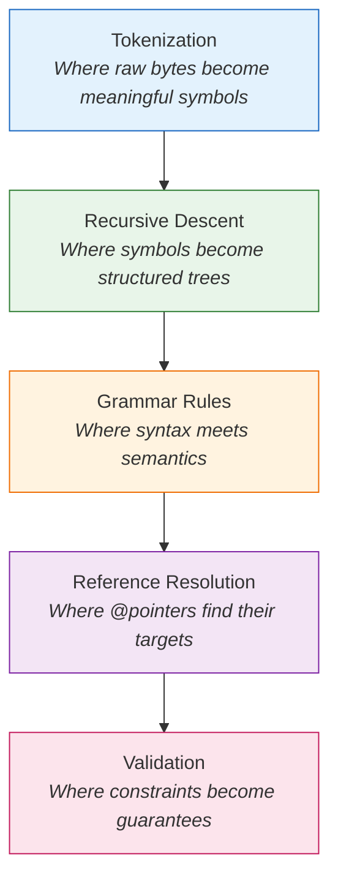
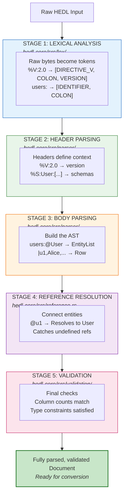
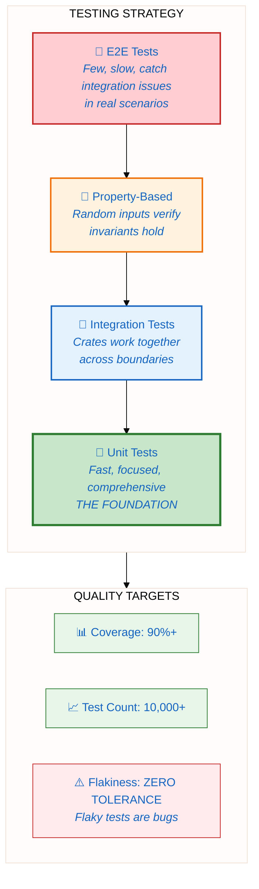
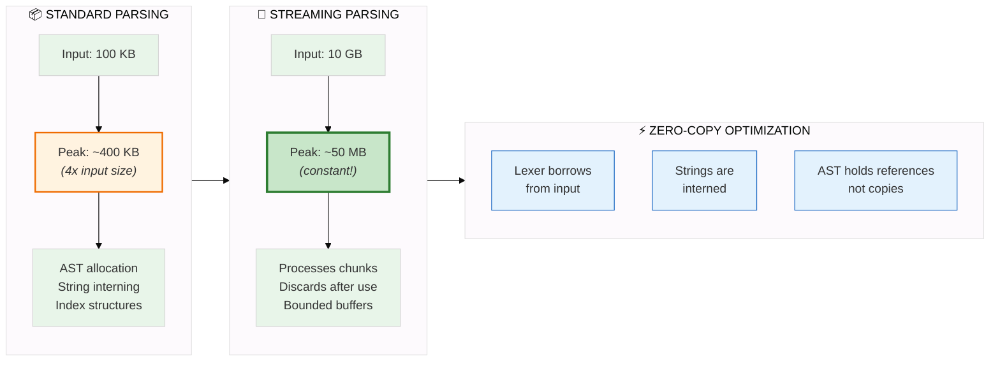

# HEDL Developer Guide

There's a moment every developer knows.

You're debugging someone else's code. The variable names are cryptic. The architecture is a maze. Documentation? Three years out of date. You feel like an archaeologist, not a programmer.

This guide exists because HEDL should never feel that way.

We built a parser that turns text into structured data faster than JSON libraries can blink. We wrote 10,000+ tests to make sure it stays that way. We organized 19 crates into a system where every piece has one job and does it well.

And now you're here, ready to look under the hood.

Maybe you found a bug and want to squash it. Maybe you have an idea for a feature that would help thousands of users. Maybe you're curious how a zero-dependency parser achieves sub-millisecond performance on documents of any size.

Whatever brought you here: welcome. This guide will take you from "I cloned the repo" to "I'm shipping PRs."

---

## The Joy of Working on HEDL

Before we dive into mechanics, let's talk about what makes this codebase special.

### A Real Parser

Not a wrapper around serde. Not a thin layer over another library. HEDL has its own lexer, its own parser, its own Abstract Syntax Tree.

When you work on HEDL, you work on:



This is computer science the way you learned it in school. Finite automata. Context-free grammars. Symbol tables. The difference? Here, it actually matters. Every optimization you make processes millions of real documents.

### Radical Modularity

HEDL is a workspace of 19 crates. Each crate has exactly one job.

When you add a feature to `hedl-json`, you don't touch `hedl-yaml`. When you optimize the lexer, you don't break the CLI. When you write tests for one component, you know exactly what you're testing.

```mermaid
graph TB
    subgraph User["USER TOUCHPOINTS"]
        CLI["hedl-cli<br/><i>Your terminal</i>"]
        LSP["hedl-lsp<br/><i>Your editor</i>"]
        MCP["hedl-mcp<br/><i>Your AI</i>"]
        WASM["hedl-wasm<br/><i>Your browser</i>"]
        FFI["hedl-ffi<br/><i>Your C/Python</i>"]
    end

    subgraph Facade["THE UNIFIED FACADE"]
        HEDL["hedl<br/><i>One API for everything</i>"]
    end

    subgraph Engine["THE ENGINE ROOM"]
        CORE["hedl-core<br/><i>Lexer and parser</i>"]
        C14N["hedl-c14n<br/><i>Canonical formatting</i>"]
        STREAM["hedl-stream<br/><i>Streaming parser</i>"]
        LINT["hedl-lint<br/><i>Style rules</i>"]
    end

    subgraph Formats["FORMAT BRIDGES"]
        JSON["hedl-json"]
        YAML["hedl-yaml"]
        XML["hedl-xml"]
        CSV["hedl-csv"]
        PARQUET["hedl-parquet"]
        NEO4J["hedl-neo4j"]
        TOON["hedl-toon"]
    end

    subgraph Quality["QUALITY INFRASTRUCTURE"]
        TEST["hedl-test<br/><i>Shared fixtures</i>"]
        BENCH["hedl-bench<br/><i>Benchmarks</i>"]
    end

    User --> Facade --> Engine --> Formats --> Quality

    style User fill:#e3f2fd,stroke:#1565c0
    style Facade fill:#e8f5e9,stroke:#2e7d32,stroke-width:2px
    style Engine fill:#fff3e0,stroke:#ef6c00
    style Formats fill:#f3e5f5,stroke:#7b1fa2
    style Quality fill:#fce4ec,stroke:#c2185b
```



This modularity is not accidental. It's a deliberate choice that makes the codebase navigable. You can understand one crate completely without knowing the others. You can fix a bug in isolation. You can add a feature without fear.

### Obsessive Testing

10,000+ tests guard this codebase. Not because we're paranoid (okay, maybe a little), but because parsers have infinite edge cases.

Unit tests. Integration tests. Property-based tests that generate random inputs. Fuzz tests that throw arbitrary bytes at the lexer. Conformance tests that verify every implementation agrees on semantics.

When you submit a PR, you'll never wonder "did I break something?" CI will tell you immediately, precisely, with context.

### Real Impact

HEDL saves real money. When your data format is 40% smaller than JSON, and your parser is 3x faster, the savings compound. Every API call. Every log entry. Every configuration file.

The optimization you make today might save someone's infrastructure budget tomorrow. The bug you fix might unblock someone's deployment. The feature you add might change how teams think about their data.

---

## Your First Five Minutes

Let's get your hands dirty. Here's how to go from zero to running code:

```bash
# Step 1: Clone the repository
git clone https://github.com/dweve-ai/hedl.git
cd hedl

# Step 2: Build everything (this verifies your Rust toolchain is ready)
cargo build --all-features

# Step 3: Run the test suite (this should pass completely)
cargo test

# Step 4: Generate and browse the documentation
cargo doc --workspace --all-features --no-deps --open
```

That's it. If all four commands succeeded, your environment is ready.

If something failed, don't worry. Check the [Getting Started](getting-started.md) guide for troubleshooting specific issues with Rust versions, missing dependencies, or platform-specific quirks.

---

## Understanding the Architecture

When someone hands you a HEDL document and asks you to convert it to JSON, a lot happens behind the scenes. Let's trace the journey.

### The Document's Journey

**Sample Input:**
```hedl
%V:2.0
%NULL:~
%QUOTE:"
%S:User:[id,name,email]
---
users:@User
 |u1,Alice,alice@example.com
 |u2,Bob,bob@example.com
```



### Where Each Crate Fits

Here's a quick reference for the crates you'll encounter most:

**Core Crates** (the heart of the system):

| Crate | Responsibility | Key Entry Points |
|-------|----------------|------------------|
| `hedl-core` | Lexer, parser, AST, validation | `src/lex/`, `src/parser/`, `src/document.rs` |
| `hedl` | Public API facade | `src/lib.rs` |
| `hedl-c14n` | Canonical (deterministic) formatting | `src/lib.rs` |
| `hedl-stream` | Streaming parser for large files | `src/async_parser/` |

**Format Adapters** (bridges to other worlds):

| Crate | Converts Between |
|-------|------------------|
| `hedl-json` | HEDL and JSON |
| `hedl-yaml` | HEDL and YAML |
| `hedl-xml` | HEDL and XML |
| `hedl-csv` | HEDL and CSV |
| `hedl-parquet` | HEDL and Apache Parquet |
| `hedl-neo4j` | HEDL and Neo4j Cypher |
| `hedl-toon` | HEDL and TOON format |

**User-Facing Tools** (how people interact with HEDL):

| Crate | What It Does |
|-------|--------------|
| `hedl-cli` | Command-line interface for all HEDL operations |
| `hedl-lsp` | Language Server Protocol for editor integration |
| `hedl-mcp` | Model Context Protocol server for AI agents |
| `hedl-lint` | Style checking and improvement suggestions |

**Language Bindings** (HEDL beyond Rust):

| Crate | Target Ecosystem |
|-------|------------------|
| `hedl-ffi` | C ABI for C, C++, Python, and others |
| `hedl-wasm` | WebAssembly for browsers and Node.js |

**Infrastructure** (keeping quality high):

| Crate | Purpose |
|-------|---------|
| `hedl-test` | Shared test utilities and fixture data |
| `hedl-bench` | Performance benchmarks and regression detection |

---

## Your First Feature: A Complete Walkthrough

Let's build something real. You want to add a lint rule that warns when inline children have inconsistent column counts. This catches a common mistake: adding a row with the wrong number of fields.

### Step 1: Find the Right Crate

This is a lint rule, so we're working in `hedl-lint`. Navigate there:

```bash
cd crates/hedl-lint
```

Take a moment to understand the structure:

```
hedl-lint/
├── src/
│   ├── lib.rs          # Public API: the lint() function
│   ├── linter.rs       # The engine that runs rules
│   └── rules/          # Individual lint rules live here
│       ├── mod.rs      # Rule registry
│       ├── unused_schema.rs
│       ├── duplicate_id.rs
│       └── ...
└── tests/              # Integration tests for the linter
```

### Step 2: Write a Failing Test First

Before writing any implementation, write a test that describes the behavior you want. Create `tests/inconsistent_columns_test.rs`:

```rust
//! Tests for the inconsistent column count lint rule.
//!
//! This rule catches a common mistake: adding a row with fewer
//! or more columns than the schema defines.

use hedl_lint::{lint, LintLevel};

#[test]
fn warns_when_row_has_fewer_columns_than_schema() {
    // This document has a schema with 3 columns: [id, name, email]
    // But the second row only has 2 values: u2, Bob
    // The linter should catch this inconsistency.

    let input = r#"
%V:2.0
%NULL:~
%QUOTE:"
%S:User:[id,name,email]
---
users:@User
 |u1,Alice,alice@example.com
 |u2,Bob
"#;

    let warnings = lint(input).unwrap();

    // We expect at least one warning about column count
    assert!(
        warnings.iter().any(|w| {
            w.level == LintLevel::Warning
                && w.message.contains("column")
        }),
        "Expected a warning about column count mismatch. Got: {:?}",
        warnings
    );
}

#[test]
fn warns_when_row_has_more_columns_than_schema() {
    // Schema defines 3 columns, but row has 4 values

    let input = r#"
%V:2.0
%NULL:~
%QUOTE:"
%S:User:[id,name,email]
---
users:@User
 |u1,Alice,alice@example.com,extra_value
"#;

    let warnings = lint(input).unwrap();

    assert!(
        warnings.iter().any(|w| {
            w.level == LintLevel::Warning
                && w.message.contains("column")
        }),
        "Expected a warning about column count mismatch. Got: {:?}",
        warnings
    );
}

#[test]
fn no_warning_when_columns_match() {
    // All rows have exactly 3 columns, matching the schema

    let input = r#"
%V:2.0
%NULL:~
%QUOTE:"
%S:User:[id,name,email]
---
users:@User
 |u1,Alice,alice@example.com
 |u2,Bob,bob@example.com
 |u3,Charlie,charlie@example.com
"#;

    let warnings = lint(input).unwrap();

    // No column count warnings expected
    let column_warnings: Vec<_> = warnings
        .iter()
        .filter(|w| w.message.contains("column"))
        .collect();

    assert!(
        column_warnings.is_empty(),
        "Expected no column warnings for valid document. Got: {:?}",
        column_warnings
    );
}

#[test]
fn warning_includes_helpful_context() {
    // The warning should tell the user which row has the problem
    // and what the expected vs actual column counts are

    let input = r#"
%V:2.0
%NULL:~
%QUOTE:"
%S:User:[id,name,email]
---
users:@User
 |u1,Alice,alice@example.com
 |u2,Bob
"#;

    let warnings = lint(input).unwrap();
    let column_warning = warnings
        .iter()
        .find(|w| w.message.contains("column"))
        .expect("Expected a column count warning");

    // Warning should mention expected count
    assert!(
        column_warning.message.contains("3") || column_warning.context.contains("3"),
        "Warning should mention expected column count (3)"
    );

    // Warning should mention actual count
    assert!(
        column_warning.message.contains("2") || column_warning.context.contains("2"),
        "Warning should mention actual column count (2)"
    );
}
```

### Step 3: Run the Test (It Should Fail)

```bash
cargo test -p hedl-lint inconsistent_columns
```

You'll see failures because the rule doesn't exist yet. That's exactly what we want. Red, then green, then refactor.

### Step 4: Implement the Rule

Create `src/rules/inconsistent_columns.rs`:

```rust
//! Lint rule: Detect rows with inconsistent column counts.
//!
//! When a schema defines N columns, every row in a matrix list
//! should have exactly N values. Deviations are usually mistakes.

use hedl_core::{Document, Value};
use crate::{LintRule, LintWarning, LintLevel, Span};

/// Warns when matrix list rows have column counts that don't match their schema.
pub struct InconsistentColumnsRule;

impl LintRule for InconsistentColumnsRule {
    fn name(&self) -> &'static str {
        "inconsistent-columns"
    }

    fn description(&self) -> &'static str {
        "Rows should have the same number of columns as their schema defines"
    }

    fn check(&self, doc: &Document) -> Vec<LintWarning> {
        let mut warnings = Vec::new();

        // Walk through all values in the document
        self.check_value(&doc.root, doc, &mut warnings);

        warnings
    }
}

impl InconsistentColumnsRule {
    fn check_value(
        &self,
        value: &Value,
        doc: &Document,
        warnings: &mut Vec<LintWarning>,
    ) {
        match value {
            Value::Object(obj) => {
                // Check each field in the object
                for (_, field_value) in &obj.fields {
                    self.check_value(field_value, doc, warnings);
                }
            }

            Value::MatrixList(matrix) => {
                // This is where schemas meet data
                if let Some(schema) = doc.schemas.get(&matrix.type_name) {
                    let expected_columns = schema.columns.len();

                    for (row_index, row) in matrix.rows.iter().enumerate() {
                        let actual_columns = row.values.len();

                        if actual_columns != expected_columns {
                            warnings.push(LintWarning {
                                level: LintLevel::Warning,
                                rule: self.name().to_string(),
                                message: format!(
                                    "Row {} has {} column(s), but schema '{}' defines {}",
                                    row_index + 1,
                                    actual_columns,
                                    matrix.type_name,
                                    expected_columns
                                ),
                                span: row.span.clone(),
                                context: format!(
                                    "Schema columns: {:?}",
                                    schema.columns
                                ),
                                suggestion: if actual_columns < expected_columns {
                                    Some(format!(
                                        "Add {} missing value(s) or use ~ for null",
                                        expected_columns - actual_columns
                                    ))
                                } else {
                                    Some(format!(
                                        "Remove {} extra value(s)",
                                        actual_columns - expected_columns
                                    ))
                                },
                            });
                        }
                    }
                }
            }

            Value::List(list) => {
                // Check nested values in lists
                for item in &list.items {
                    self.check_value(item, doc, warnings);
                }
            }

            // Scalar values don't have column counts
            _ => {}
        }
    }
}

#[cfg(test)]
mod tests {
    use super::*;

    #[test]
    fn rule_has_correct_name() {
        let rule = InconsistentColumnsRule;
        assert_eq!(rule.name(), "inconsistent-columns");
    }
}
```

### Step 5: Register the Rule

Edit `src/rules/mod.rs` to include your new rule:

```rust
mod inconsistent_columns;

pub use inconsistent_columns::InconsistentColumnsRule;

// In the function that collects all rules:
pub fn all_rules() -> Vec<Box<dyn LintRule>> {
    vec![
        // ... existing rules ...
        Box::new(InconsistentColumnsRule),
    ]
}
```

### Step 6: Run Tests Again (They Should Pass)

```bash
cargo test -p hedl-lint
```

All green? Excellent.

### Step 7: Run the Full Quality Suite

Before submitting, verify you haven't broken anything else:

```bash
# Format check
cargo fmt --check

# Lint check (zero warnings required)
cargo clippy --workspace --all-features -- -D warnings

# Full test suite
cargo test --all-features

# Documentation builds
cargo doc --workspace --all-features --no-deps
```

If all of these pass, you're ready to submit a PR.

---

## Development Commands Cheat Sheet

Keep this handy. You'll use these commands constantly.

### Building

| What You Want | Command |
|---------------|---------|
| Build everything | `cargo build --all-features` |
| Build one crate | `cargo build -p hedl-core` |
| Build in release mode | `cargo build --release --all-features` |
| Check without building | `cargo check --all-features` |

### Testing

| What You Want | Command |
|---------------|---------|
| Run all tests | `cargo test --all-features` |
| Run tests for one crate | `cargo test -p hedl-core` |
| Run a specific test | `cargo test -p hedl-core test_name` |
| Run tests with output | `cargo test -- --nocapture` |
| Run ignored tests | `cargo test -- --ignored` |

### Code Quality

| What You Want | Command |
|---------------|---------|
| Format code | `cargo fmt` |
| Check formatting | `cargo fmt --check` |
| Run clippy | `cargo clippy --workspace --all-features` |
| Strict clippy | `cargo clippy --workspace --all-features -- -D warnings` |

### Documentation

| What You Want | Command |
|---------------|---------|
| Generate docs | `cargo doc --workspace --all-features --no-deps` |
| Generate and open | `cargo doc --workspace --all-features --no-deps --open` |
| Check doc links | `cargo doc --workspace --all-features --no-deps 2>&1 \| grep warning` |

### Benchmarks and Fuzzing

| What You Want | Command |
|---------------|---------|
| Run benchmarks | `cargo bench` |
| Compare to baseline | `cargo bench -- --baseline main` |
| Run fuzz tests | `cd crates/hedl-core/fuzz && cargo +nightly fuzz run fuzz_parser` |
| List fuzz targets | `cd crates/hedl-core/fuzz && cargo +nightly fuzz list` |

---

## Testing Philosophy

We don't just test. We test at every level, in every way that could catch a bug.

### The Testing Pyramid



The pyramid narrows as you go up because higher-level tests should be fewer in number but broader in scope. Unit tests form the foundation: they're fast, focused, and catch most bugs. Integration tests verify that crates play nicely together. Property-based tests throw random inputs at invariants. E2E tests prove the whole system works in real scenarios.

### Unit Tests

Found in each crate's `src/` directory or `tests/` folder. Test individual functions in isolation. Fast to run, fast to write, fast to debug.

```rust
#[test]
fn lexer_recognizes_pipe_character() {
    let lexer = Lexer::new("|value");
    let tokens: Vec<_> = lexer.collect();
    assert_eq!(tokens[0].kind, TokenKind::Pipe);
}
```

### Integration Tests

Found in `tests/` directories. Test multiple components working together. Slower, but catch interface mismatches.

```rust
#[test]
fn parse_and_convert_to_json_roundtrips() {
    let input = include_str!("fixtures/users.hedl");
    let doc = hedl::parse(input).unwrap();
    let json = hedl_json::to_json(&doc).unwrap();
    let doc2 = hedl_json::from_json(&json).unwrap();
    assert_eq!(doc, doc2);
}
```

### Property-Based Tests

Found in `tests/property/`. Generate random inputs and verify invariants hold.

```rust
#[quickcheck]
fn parsing_never_panics(input: String) -> bool {
    // Parser should return Ok or Err, never panic
    let _ = hedl::parse(&input);
    true
}

#[quickcheck]
fn valid_docs_roundtrip_through_json(doc: ValidDocument) -> bool {
    let json = hedl_json::to_json(&doc).unwrap();
    let back = hedl_json::from_json(&json).unwrap();
    doc == back
}
```

### Fuzz Tests

Found in `fuzz/` directories. Throw arbitrary bytes at the parser. Find edge cases no human would think of.

```rust
fuzz_target!(|data: &[u8]| {
    if let Ok(input) = std::str::from_utf8(data) {
        // Should never panic, even on garbage input
        let _ = hedl::parse(input);
    }
});
```

### Conformance Tests

Found in `tests/conformance/`. Verify compliance with the HEDL specification. Every implementation must agree on these.

```rust
#[test]
fn spec_example_4_2_matrix_list() {
    // From SPEC.md section 4.2
    let input = include_str!("spec_examples/4.2_matrix_list.hedl");
    let expected = include_str!("spec_examples/4.2_matrix_list.expected.json");

    let doc = hedl::parse(input).unwrap();
    let json = hedl_json::to_json(&doc).unwrap();

    assert_json_eq!(json, expected);
}
```

### The Testing Rule

When you add a feature, add tests at multiple levels. When you fix a bug, add a regression test that would have caught it. Tests are not overhead; they're documentation that runs.

---

## Performance Expectations

HEDL is fast. We intend to keep it that way.

### Current Benchmarks

| Operation | Target | Current | Notes |
|-----------|--------|---------|-------|
| Parse small doc (1 KB) | < 100 µs | ~37 µs | 2.7x faster than target |
| Parse medium doc (100 KB) | < 1 ms | ~396 µs | 2.5x faster than target |
| JSON conversion | < 200 µs | ~115 µs | Bottleneck is often JSON serialization |
| Validation | < 50 µs | ~24 µs | Depends on constraint complexity |

### Before Submitting Performance-Critical Changes

Run the benchmarks and compare against the baseline:

```bash
# Create a baseline from main branch
git checkout main
cargo bench -- --save-baseline main

# Switch to your branch
git checkout your-feature-branch
cargo bench -- --baseline main
```

If your change makes things slower, investigate. Sometimes it's worth it (new functionality). Sometimes it's not (inefficient implementation). Document the tradeoff in your PR.

### Memory Usage

HEDL is designed to be memory-efficient:



**The key insight**: Standard parsing gives you full random access to the document, but costs memory proportional to input size. Streaming parsing gives you constant memory usage, but you can only move forward through the document. Choose based on your use case.

---

## Where to Find Things

When you need something, here's where to look:

**The Specification**: `SPEC.md` in the repository root. This is the source of truth for HEDL syntax and semantics. When in doubt, the spec wins.

**Test Fixtures**: `crates/hedl-test/fixtures/`. Shared test data used across crates. Realistic documents for various scenarios.

**Examples**: `examples/` in the repository root. Real HEDL documents demonstrating various features and use cases.

**CI Configuration**: `.github/workflows/`. See exactly how tests run in continuous integration. If CI fails and you can't reproduce locally, check here.

**Benchmarks**: `crates/hedl-bench/`. Performance measurement infrastructure. Add benchmarks for new features here.

---

## Getting Help

Stuck on something? Here's how to get unstuck:

### Check the Existing Code

HEDL follows consistent patterns. If you're adding a new format adapter, look at `hedl-json`. If you're adding a lint rule, look at existing rules in `hedl-lint/src/rules/`. The codebase is its own best documentation.

### Read the Tests

Tests show how APIs are meant to be used. They're executable documentation. When the comments lie, the tests tell the truth.

### Ask in Discussions

[GitHub Discussions](https://github.com/dweve-ai/hedl/discussions) is the place for questions. No question is too basic. We were all beginners once.

### Open a Draft PR

If you're partway through something and need feedback, open a draft PR. Describe what you're trying to do, what's working, what's not. Code reviews aren't just for finished work.

---

## Your Next Step

You've read the overview. Now pick your path:

**Ready to set up your development environment properly?**
→ [Getting Started Guide](getting-started.md) walks through toolchain setup, IDE configuration, and common issues.

**Want to understand the parser deeply?**
→ [Internals](internals.md) explains the lexer, parser, and AST in detail.

**Want to add support for a new format?**
→ [Adding Format Support](tutorials/03-adding-format-support.md) guides you through creating a new adapter.

**Ready to submit code?**
→ [Contributing Guide](contributing.md) explains our PR workflow and review process.

---

## Documentation Map

This is a large codebase with comprehensive documentation. Here's your navigation guide:

### Core Concepts

| Document | What You'll Learn |
|----------|-------------------|
| [Architecture Overview](architecture.md) | High-level system design and crate relationships |
| [Module Guide](module-guide.md) | Deep dive into all 19 crates |
| [Internals](internals.md) | Parser, AST, and core algorithms explained |

### Concept Deep-Dives

| Document | What You'll Learn |
|----------|-------------------|
| [AST Design](concepts/ast-design.md) | How the Abstract Syntax Tree represents HEDL documents |
| [Parser Architecture](concepts/parser-architecture.md) | Lexer and parser internals, grammar rules |
| [Error Handling](concepts/error-handling.md) | Error types, propagation, and user-friendly messages |
| [Zero-Copy Optimizations](concepts/zero-copy-optimizations.md) | Performance techniques used throughout |

### Development Guides

| Document | What You'll Learn |
|----------|-------------------|
| [Getting Started](getting-started.md) | Environment setup and troubleshooting |
| [Contributing](contributing.md) | PR workflow, code review, and merge process |
| [Testing](testing.md) | Writing effective tests at all levels |
| [Benchmarking](benchmarking.md) | Measuring and tracking performance |
| [Testing Conformance](testing-conformance.md) | Verifying spec compliance |

### Tutorials

| Tutorial | What You'll Build |
|----------|-------------------|
| [Setup Dev Environment](tutorials/01-setup-dev-environment.md) | Complete, working toolchain |
| [First Feature](tutorials/02-first-feature.md) | End-to-end feature addition |
| [Adding Format Support](tutorials/03-adding-format-support.md) | New format adapter from scratch |
| [Writing Tests](tutorials/04-writing-tests.md) | Comprehensive test coverage |

### How-To Guides

| Guide | What You'll Accomplish |
|-------|------------------------|
| [Debug Parser](how-to/debug-parser.md) | Troubleshoot parsing issues effectively |
| [Profile Performance](how-to/profile-performance.md) | Find and fix performance bottlenecks |
| [Add Benchmarks](how-to/add-benchmarks.md) | Measure impact of your changes |
| [Write FFI Bindings](how-to/write-ffi-bindings.md) | Expose HEDL to other languages |

### Reference

| Document | What's Inside |
|----------|---------------|
| [Build System](reference/build-system.md) | Cargo configuration and workspace setup |
| [Dependencies](reference/dependencies.md) | External crate usage and policies |
| [Module API](reference/module-api.md) | Internal API documentation |
| [Testing Framework](reference/testing-framework.md) | Test infrastructure and utilities |

### Operations

| Document | What's Inside |
|----------|---------------|
| [CI/CD](operations/ci-cd.md) | GitHub Actions workflows |
| [Security](operations/security.md) | Security practices and vulnerability handling |
| [Monitoring](operations/monitoring.md) | Performance tracking in production |
| [Debugging Production](operations/debugging-production.md) | Troubleshooting live issues |

---

## The Best Way to Learn

The best way to learn a codebase is to change it.

Find something small. A typo in an error message. A missing test case. A lint rule that would have caught your own mistake.

Fix it. Submit a PR. Get feedback. Repeat.

That's how you become a contributor. That's how you become an expert.

Welcome to HEDL.
