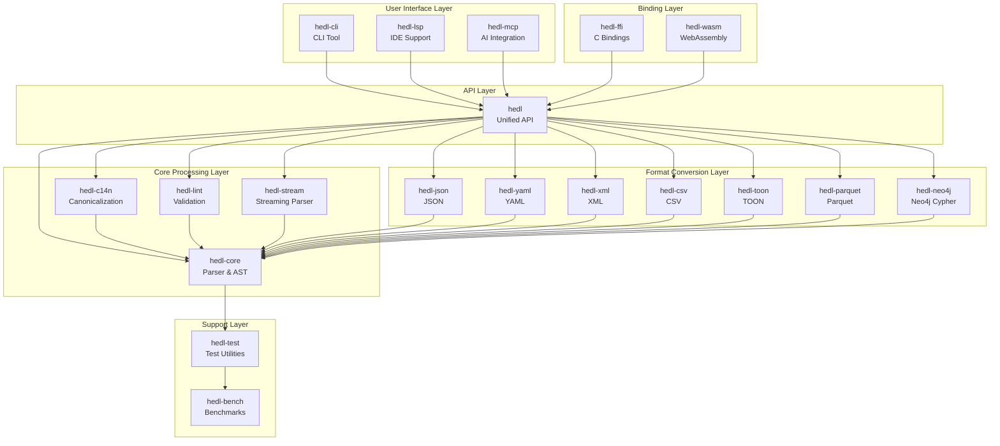

# HEDL Architecture Overview

This document provides a high-level overview of the HEDL architecture, design patterns, and key architectural decisions.

## System Architecture

### High-Level Overview



## Architectural Layers

### 1. Core Processing Layer

The foundation of the HEDL system.

#### hedl-core: Parser & Data Model

**Responsibilities:**
- Lexical analysis and tokenization
- Parsing HEDL text into AST
- Reference resolution and validation
- Error reporting with source locations
- Resource limit enforcement

**Key Components:**
```rust
pub struct Document {
    pub version: (u32, u32),
    pub aliases: BTreeMap<String, String>,
    pub structs: BTreeMap<String, Vec<String>>,
    pub nests: BTreeMap<String, String>,
    pub root: BTreeMap<String, Item>,
}

pub enum Item {
    Scalar(Value),
    Object(BTreeMap<String, Item>),
    List(MatrixList),
}

pub enum Value {
    Null,
    Bool(bool),
    Int(i64),
    Float(f64),
    String(String),
    Tensor(Tensor),
    Reference(Reference),
    Expression(Expression),
}
```

**Design Patterns:**
- **Builder pattern** for `ParseOptions`
- **Visitor pattern** for AST traversal
- **Error accumulation** for comprehensive error reporting
- **Zero-copy parsing** where possible

#### hedl-c14n: Canonicalization

**Responsibilities:**
- Convert AST back to canonical HEDL text
- Ensure consistent formatting
- Handle quoting and escaping
- Support configurable output options

**Key Features:**
- Deterministic output (same AST always produces same text)
- Minimal quoting (only when necessary)
- Configurable indentation and newlines

#### hedl-lint: Validation & Linting

**Responsibilities:**
- Validate HEDL documents against best practices
- Check for common errors and anti-patterns
- Provide actionable suggestions
- Support custom rules

**Linting Rules:**
- Unused schemas
- Inconsistent naming
- Missing type annotations
- Duplicate IDs
- Reference validation

#### hedl-stream: Streaming Parser

**Responsibilities:**
- Parse large files without loading entirely in memory
- Support async I/O
- Event-based parsing model
- Backpressure handling

**Use Cases:**
- Processing multi-GB files
- Real-time data ingestion
- Memory-constrained environments

### 2. API Layer

#### hedl: Unified API Facade

**Responsibilities:**
- Provide single entry point for all functionality
- Re-export commonly used types and functions
- Feature-gate optional functionality
- Maintain API stability

**API Design:**
```rust
// Simple parsing
let doc = hedl::parse(text)?;

// With options
let options = hedl::ParseOptions::builder().max_depth(50).build();
let doc = hedl::parse_with_limits(text.as_bytes(), options)?;

// Canonicalization
let output = hedl::c14n::canonicalize(&doc)?;

// Format conversion
let json = hedl::json::to_json(&doc)?;
let yaml = hedl::yaml::to_yaml(&doc)?;
```

### 3. Format Conversion Layer

All format converters follow a consistent pattern:

```rust
// To HEDL
pub fn from_format(input: &str) -> Result<Document>;

// From HEDL
pub fn to_format(doc: &Document) -> Result<String>;

// With configuration
pub fn to_format_with_config(doc: &Document, config: &Config) -> Result<String>;
```

#### hedl-json: JSON Conversion

**Mapping Strategy:**
- Objects → HEDL objects
- Arrays → HEDL lists or matrix lists
- Primitives → HEDL scalars
- Schema inference for array-of-objects

#### hedl-yaml: YAML Conversion

**Features:**
- Anchors and aliases → HEDL aliases
- Tags → HEDL type annotations
- Merge keys → flattened attributes

#### hedl-xml: XML Conversion

**Mapping:**
- Elements → HEDL objects
- Attributes → HEDL key-value pairs
- Text content → `_text` attribute
- Namespaces preserved in attribute names

#### hedl-csv: CSV Conversion

**Features:**
- Header row → schema inference
- Rows → matrix list entries
- Type detection (string, int, float, bool)
- Configurable delimiters and quoting

#### hedl-parquet: Parquet Conversion

**Features:**
- Schema mapping
- Efficient columnar storage
- Nested data structures
- Type preservation

#### hedl-neo4j: Neo4j Cypher Generation

**Features:**
- Nodes → Neo4j nodes
- References → Neo4j relationships
- Type names → labels
- Attributes → properties
- Query generation for import

#### hedl-toon: TOON Format

**TOON** (Token-Oriented Object Notation) is a format optimized for LLMs:
- No header section
- No schemas
- No matrix lists
- Simpler syntax

### 4. User Interface Layer

#### hedl-cli: Command-Line Tool

**Commands:**
```bash
hedl validate <file>        # Validate HEDL syntax
hedl format <file>          # Format to canonical form
hedl lint <file>            # Lint document
hedl inspect <file>         # Show internal structure
hedl stats <file>           # Show statistics
hedl to-json <file>         # Convert to JSON
hedl from-json <file>       # Convert from JSON
```

**Features:**
- Colored output
- Progress bars for large files
- Batch processing
- Shell completion

#### hedl-lsp: Language Server Protocol

**LSP Features:**
- Syntax highlighting
- Auto-completion (keys, types, IDs)
- Go-to-definition for references
- Hover documentation
- Diagnostics (errors and warnings)
- Formatting
- Rename refactoring

**Integration:**
- VS Code extension
- Vim/Neovim support
- IntelliJ plugin (planned)

#### hedl-mcp: Model Context Protocol

**MCP Features:**
- Convert between HEDL and JSON/YAML
- Schema validation
- Document linting
- Format detection
- Streaming support for large contexts

**Use Cases:**
- AI/ML data preparation
- LLM context optimization
- Data format normalization

### 5. Binding Layer

#### hedl-ffi: C FFI Bindings

**API Design:**
- C-compatible ABI
- No panics across FFI boundary
- Comprehensive error handling
- Memory management (caller-owned, callee-owned)

**Example:**
```c
hedl_document* doc = hedl_parse(text, &error);
if (doc) {
    char* json = hedl_to_json(doc);
    printf("%s\n", json);
    hedl_free_string(json);
    hedl_free_document(doc);
}
```

#### hedl-wasm: WebAssembly Bindings

**API Design:**
- JavaScript-friendly API
- Promise-based async operations
- TypeScript type definitions
- Browser and Node.js support

**Example:**
```javascript
import init, { parse } from './hedl_wasm.js';

await init();
const doc = parse(hedlText);
const json = doc.toJsonString();  // Method on HedlDocument
console.log(json);
```

### 6. Support Layer

#### hedl-test: Test Utilities

**Utilities:**
- Test data generators
- Assertion helpers
- Fixture management
- Property-based testing helpers
- Fuzz testing support

#### hedl-bench: Performance Benchmarks

**Benchmark Categories:**
- **Parsing**: Lexer, parser, full document
- **Conversion**: JSON, YAML, XML, CSV
- **Operations**: Canonicalization, linting, traversal
- **Scalability**: Small, medium, large documents
- **Regression**: Track performance over time

## Design Patterns

### 1. Error Handling

All crates use consistent error types:

```rust
pub struct HedlError {
    pub kind: HedlErrorKind,
    pub message: String,
    pub line: usize,
    pub column: Option<usize>,
    pub context: Option<String>,
}

pub enum HedlErrorKind {
    Syntax,
    Version,
    Schema,
    Alias,
    Shape,
    Semantic,
    OrphanRow,
    Collision,
    Reference,
    Security,
    Conversion,
    IO,
}
```

### 2. Configuration

Simple configuration objects with default values:

```rust
let config = ToJsonConfig {
    pretty: true,
    include_metadata: true,
    flatten_lists: false,
    include_children: true,
};

let json = hedl::json::to_json(&doc, &config)?;
```

### 3. Resource Limits

Configurable limits prevent DoS attacks:

```rust
pub struct Limits {
    pub max_file_size: usize,         // 1 GB default
    pub max_line_length: usize,       // 1 MB default
    pub max_indent_depth: usize,      // 50 default
    pub max_nodes: usize,             // 10 million default
    pub max_aliases: usize,           // 10,000 default
    pub max_columns: usize,           // 100 default
    pub max_nest_depth: usize,        // 100 default
    pub max_block_string_size: usize, // 10 MB default
    pub max_object_keys: usize,       // 10,000 per object
    pub max_total_keys: usize,        // 10 million total
}
```

### 4. Visitor Pattern

Extensible AST traversal:

```rust
pub trait DocumentVisitor {
    fn visit_node(&mut self, node: &Node, ctx: &VisitorContext) -> Result<()>;
    fn visit_value(&mut self, value: &Value, ctx: &VisitorContext) -> Result<()>;
}

let mut visitor = MyVisitor::new();
traverse(&doc, &mut visitor)?;
```

### 5. Type-Safe Builders

Compile-time validation of configuration:

```rust
let options = ParseOptions::builder()
    .strict(true)
    .max_depth(50)
    .build();
```

## Performance Optimizations

### 1. Zero-Copy Parsing

Use string slices where possible during lexing and preprocessing. The public `Reference` and `Value` types in the AST currently own their data (`String`) for safety and simplicity, ensuring they can be easily moved across threads or used in different format converters.

### 2. Parallel Processing

Use `rayon` for parallel operations across independent documents or files:

```rust
use rayon::prelude::*;

files.par_iter()
    .map(|file| process_file(file))
    .collect()
```

### 3. Caching

Cache expensive computations, such as pre-expanded aliases in `InferenceContext` or inferred schemas in format converters.

```rust
pub struct InferenceContext {
    alias_cache: HashMap<String, Value>,
}
```

### 4. SIMD Optimizations

Use SIMD-optimized byte searching via the `memchr` crate for performance-critical scanning tasks like comment stripping.

## Security Considerations

### 1. Input Validation

All inputs validated before processing:
- Size limits
- Depth limits
- String length limits
- Character validation

### 2. DoS Prevention

Resource limits prevent attacks:
- Maximum nesting depth
- Maximum number of keys
- Maximum string length
- Maximum file size

### 3. Memory Safety

Rust guarantees memory safety:
- No buffer overflows
- No use-after-free
- No data races

### 4. Dependency Management

Regular security audits:
```bash
cargo audit
cargo outdated
```

## Testing Strategy

### 1. Unit Tests

Every public function has unit tests:
```rust
#[test]
fn test_parse_simple_value() {
    assert_eq!(parse_value("42"), Ok(Value::Int(42)));
}
```

### 2. Integration Tests

Test crate interactions:
```rust
#[test]
fn test_round_trip() {
    let doc = parse(hedl_text).unwrap();
    let json = to_json(&doc).unwrap();
    let doc2 = from_json(&json).unwrap();
    assert_eq!(doc, doc2);
}
```

### 3. Property-Based Tests

Use `proptest` for randomized testing:
```rust
proptest! {
    #[test]
    fn test_parse_any_string(s in ".*") {
        let _ = parse(&s); // Should not panic
    }
}
```

### 4. Fuzz Testing

Use `cargo-fuzz` for fuzzing:
```bash
cargo fuzz run parse
```

### 5. Conformance Tests

Specification compliance:
```rust
#[test]
fn test_conformance_suite() {
    for test_case in conformance_tests() {
        verify_conformance(&test_case);
    }
}
```

## Documentation Standards

### 1. Public API Documentation

Every public item documented:
```rust
/// Parses a HEDL document from text.
///
/// # Arguments
///
/// * `input` - The HEDL text to parse
///
/// # Errors
///
/// Returns `HedlError` if parsing fails
///
/// # Examples
///
/// ```
/// let doc = hedl::parse("name: Alice")?;
/// ```
pub fn parse(input: &str) -> Result<Document, HedlError>;
```

### 2. Module Documentation

Each module has overview documentation:
```rust
//! Parser module for HEDL documents.
//!
//! This module provides the core parsing functionality,
//! including lexical analysis, syntax parsing, and
//! semantic validation.
```

### 3. Architecture Decision Records

Major decisions documented in ADRs.

## Deployment & Distribution

### 1. Versioning

Semantic versioning (SemVer):
- Major: Breaking changes
- Minor: New features (backward compatible)
- Patch: Bug fixes

### 2. Release Process

1. Update `CHANGELOG.md`
2. Bump version in `Cargo.toml`
3. Run full test suite
4. Create git tag
5. Publish to crates.io
6. Create GitHub release

### 3. Continuous Integration

GitHub Actions for:
- Build (Linux, macOS, Windows)
- Test (all crates)
- Lint (clippy, fmt)
- Coverage (tarpaulin)
- Benchmarks (criterion)
- Security audit (cargo-audit)

## Future Architecture

### Planned Enhancements

1. **Incremental Parsing**: Update AST on edits (for LSP)
2. **Query Language**: SQL-like queries over HEDL data
3. **Schema Validation**: JSON Schema-like validation
4. **Binary Format**: Compact binary representation
5. **Distributed Processing**: Spark/Dask integration

### Extension Points

1. **Custom Directives**: Plugin system for header directives
2. **Custom Validators**: Pluggable validation rules
3. **Custom Serializers**: Add new format converters
4. **Custom Analyzers**: Extend linting rules

## References

- [Module Guide](module-guide.md) - Detailed crate documentation
- [Internals](internals.md) - Deep dive into core concepts
- [SPEC.md](../../SPEC.md) - Language specification
- [Contributing](contributing.md) - How to contribute

---

**Next**: Explore individual crates in the [Module Guide](module-guide.md)
