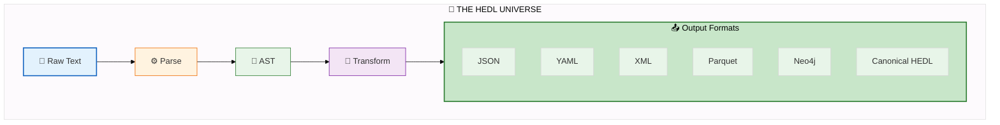
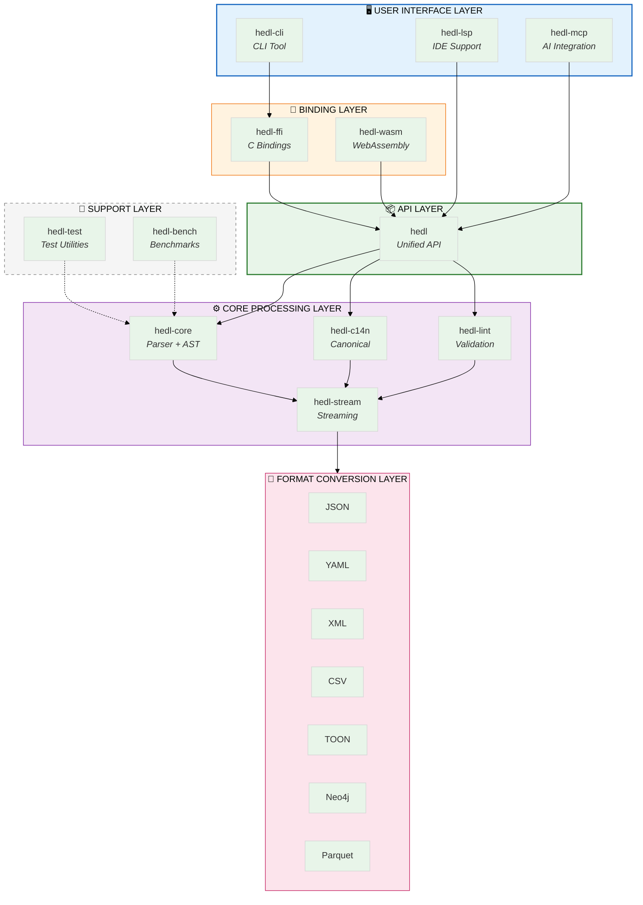
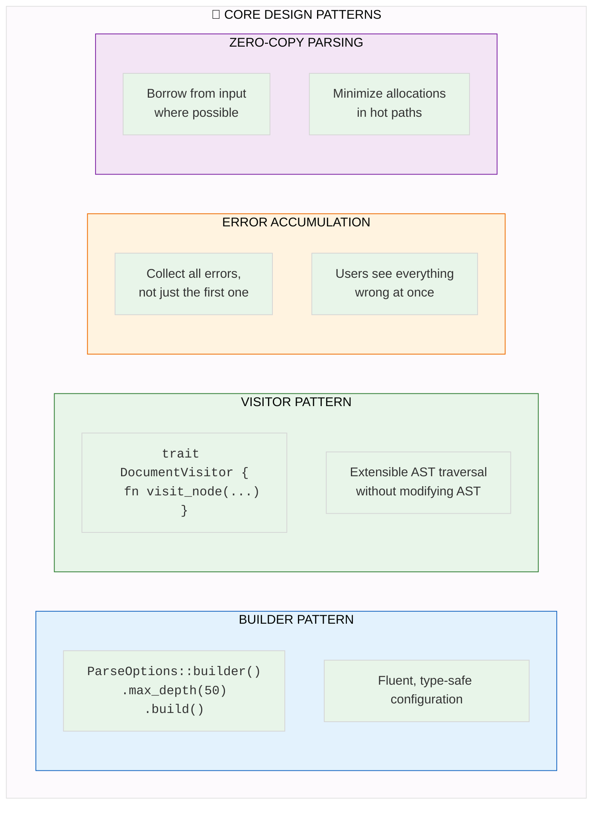
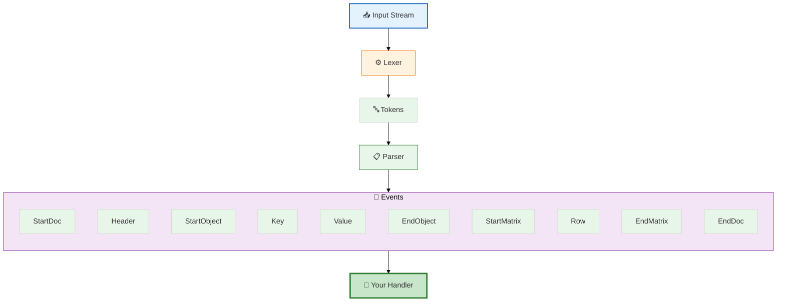
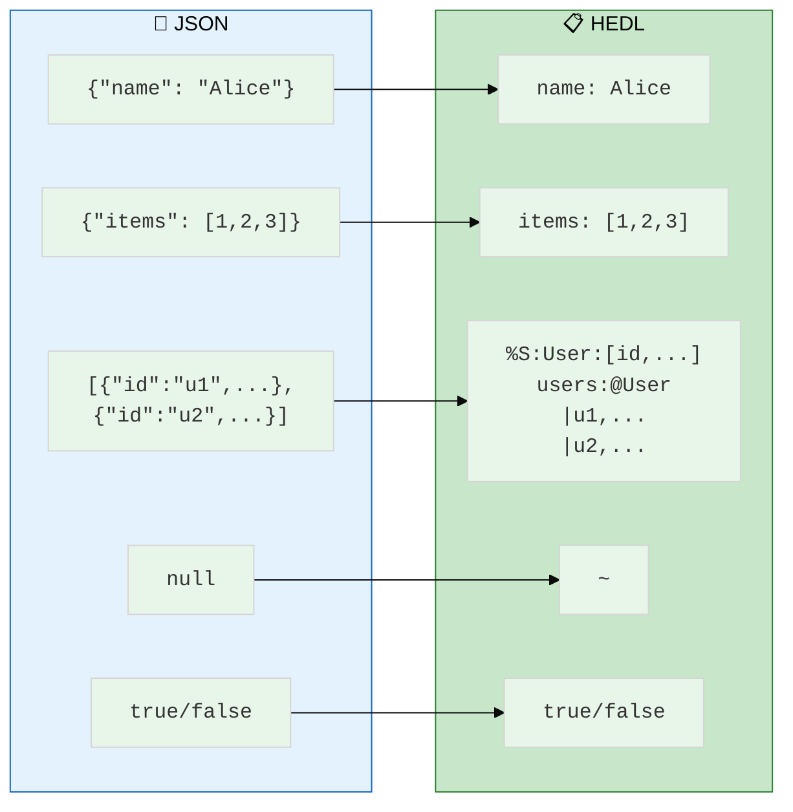
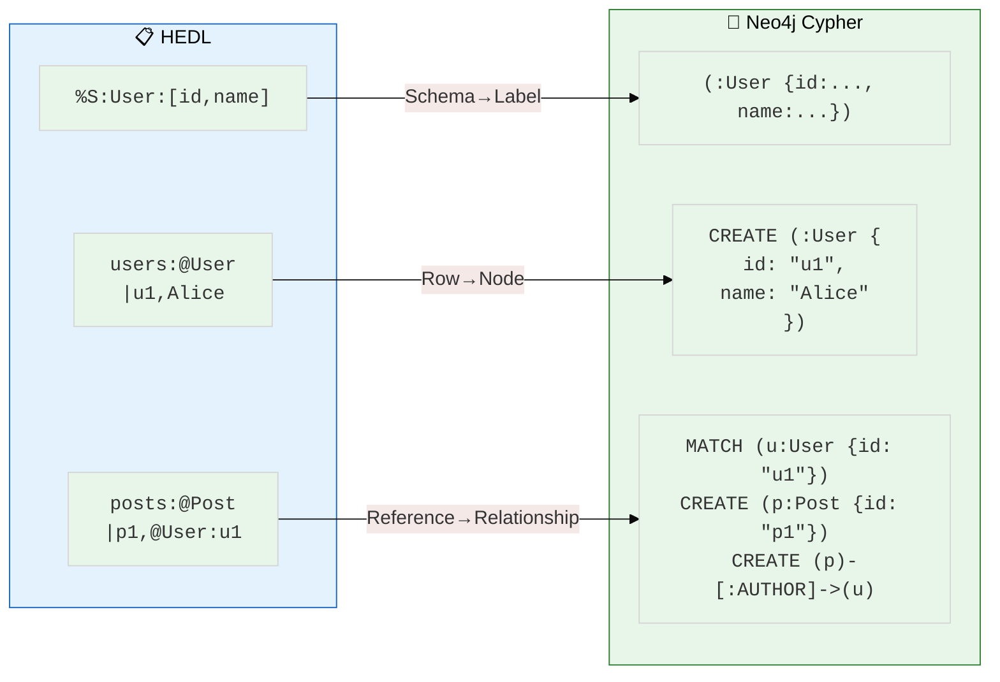
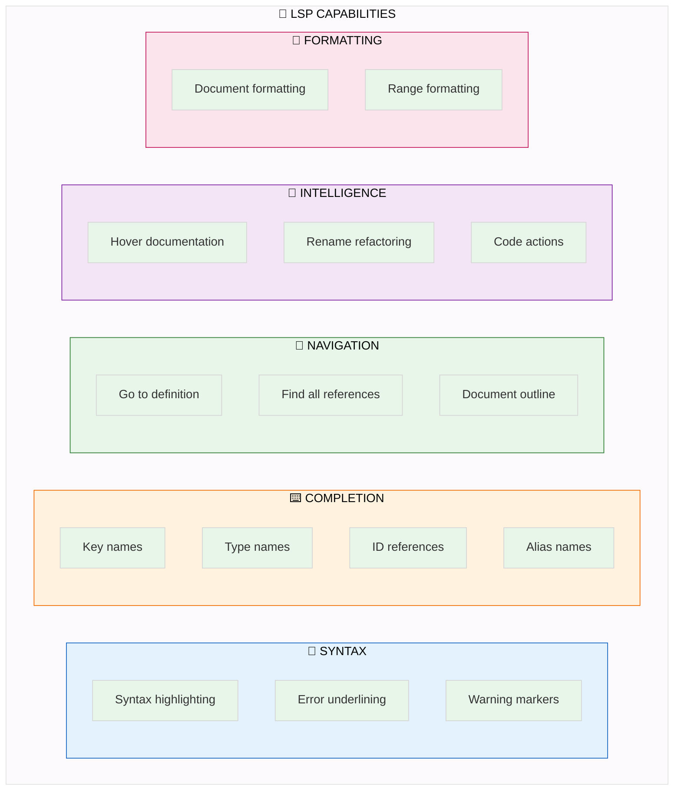
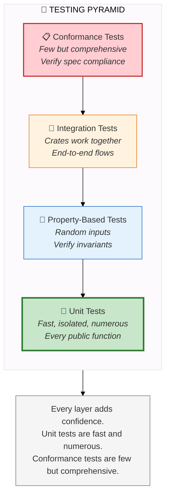
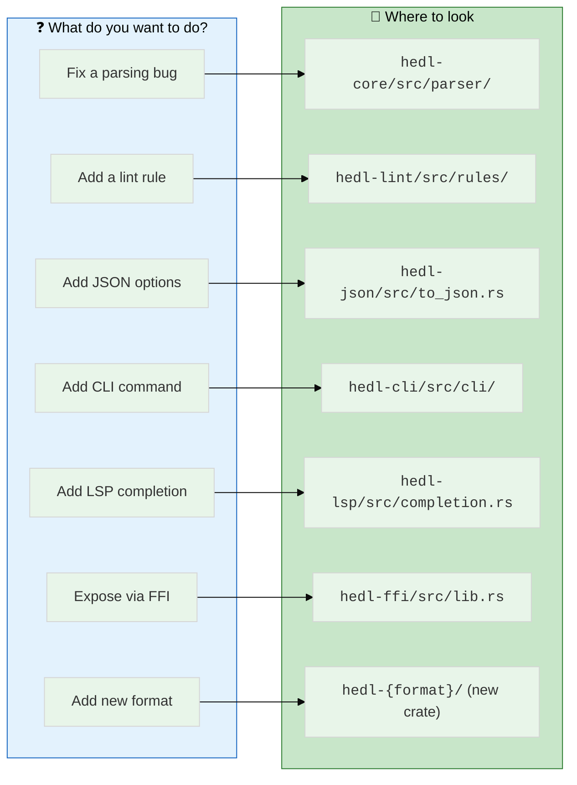

# The HEDL Architecture: A Journey Through the Codebase

Every great parser tells a story. Raw text enters. Structured data emerges. But between those two points lies a carefully orchestrated journey through layers of code, each with its own purpose, each building on the last.

Understanding this architecture isn't just about knowing where things are. It's about understanding *why* they're there, how they work together, and how you can extend them without breaking what already works.


```mermaid
%%{init: {'theme': 'base', 'themeVariables': { 'primaryColor': '#e8f5e9'}}}%%
flowchart LR
    subgraph universe["🌌 THE HEDL UNIVERSE"]
        direction LR
        TEXT["📄 Raw Text"]
        PARSE["⚙️ Parse"]
        AST["🌲 AST"]
        TRANSFORM["🔄 Transform"]

        subgraph output["📤 Output Formats"]
            JSON["JSON"]
            YAML["YAML"]
            XML["XML"]
            PARQUET["Parquet"]
            NEO4J["Neo4j"]
            HEDL_OUT["Canonical HEDL"]
        end

        TEXT --> PARSE --> AST --> TRANSFORM --> output
    end

    style TEXT fill:#e3f2fd,stroke:#1565c0,stroke-width:2px
    style PARSE fill:#fff3e0,stroke:#ef6c00
    style AST fill:#e8f5e9,stroke:#2e7d32
    style TRANSFORM fill:#f3e5f5,stroke:#7b1fa2
    style output fill:#c8e6c9,stroke:#2e7d32,stroke-width:2px
```

---

## The Layered Architecture

HEDL is organized into six distinct layers. Each layer has clear responsibilities and well-defined boundaries. Data flows down through the layers, transformations flow up.


```mermaid
%%{init: {'theme': 'base', 'themeVariables': { 'primaryColor': '#e8f5e9'}}}%%
graph TB
    subgraph ui["🖥️ USER INTERFACE LAYER"]
        CLI["hedl-cli<br/><i>CLI Tool</i>"]
        LSP["hedl-lsp<br/><i>IDE Support</i>"]
        MCP["hedl-mcp<br/><i>AI Integration</i>"]
    end

    subgraph bindings["🔗 BINDING LAYER"]
        FFI["hedl-ffi<br/><i>C Bindings</i>"]
        WASM["hedl-wasm<br/><i>WebAssembly</i>"]
    end

    subgraph api["📦 API LAYER"]
        HEDL["hedl<br/><i>Unified API</i>"]
    end

    subgraph core["⚙️ CORE PROCESSING LAYER"]
        CORE["hedl-core<br/><i>Parser + AST</i>"]
        C14N["hedl-c14n<br/><i>Canonical</i>"]
        LINT["hedl-lint<br/><i>Validation</i>"]
        STREAM["hedl-stream<br/><i>Streaming</i>"]
    end

    subgraph formats["🔄 FORMAT CONVERSION LAYER"]
        JSON["JSON"]
        YAML["YAML"]
        XML["XML"]
        CSV["CSV"]
        TOON["TOON"]
        NEO4J["Neo4j"]
        PARQUET["Parquet"]
    end

    subgraph support["🧪 SUPPORT LAYER"]
        TEST["hedl-test<br/><i>Test Utilities</i>"]
        BENCH["hedl-bench<br/><i>Benchmarks</i>"]
    end

    CLI --> FFI
    LSP --> HEDL
    MCP --> HEDL
    FFI --> HEDL
    WASM --> HEDL
    HEDL --> CORE
    HEDL --> C14N
    HEDL --> LINT
    CORE --> STREAM
    C14N --> STREAM
    LINT --> STREAM
    STREAM --> formats
    TEST -.-> CORE
    BENCH -.-> CORE

    style ui fill:#e3f2fd,stroke:#1565c0,stroke-width:2px
    style bindings fill:#fff3e0,stroke:#ef6c00
    style api fill:#e8f5e9,stroke:#2e7d32,stroke-width:2px
    style core fill:#f3e5f5,stroke:#7b1fa2
    style formats fill:#fce4ec,stroke:#c2185b
    style support fill:#f5f5f5,stroke:#757575,stroke-dasharray: 5 5
```

Each layer depends only on layers below it. This separation enables independent testing, parallel development, and clean upgrades.

---

## Layer 1: Core Processing

This is where the magic happens. Raw text becomes structured data.

### hedl-core: The Heart of Everything

Every other crate depends on `hedl-core`. It provides the parser, the AST, the reference resolver, and the error types that everything else builds upon.

**What it does:**
- Lexical analysis: turning text into tokens
- Parsing: turning tokens into an abstract syntax tree
- Reference resolution: connecting `@` references to their targets
- Validation: ensuring the document makes sense
- Error reporting: telling users what went wrong and where

**The Document Structure:**

```rust
/// A parsed HEDL document
pub struct Document {
    /// The document version (e.g., 1, 3 for v2.0)
    pub version: (u32, u32),

    /// Schema version overrides (from %SV headers)
    pub schema_versions: BTreeMap<String, SchemaVersion>,

    /// Alias definitions (from %A headers)
    pub aliases: BTreeMap<String, String>,

    /// Struct/schema definitions (from %S headers)
    pub structs: BTreeMap<String, Vec<String>>,

    /// Nesting relationships (from %N headers)
    pub nests: BTreeMap<String, String>,

    /// The actual document content
    pub root: BTreeMap<String, Item>,
}
```

The `BTreeMap` choice is deliberate. Unlike `HashMap`, it provides deterministic iteration order. Same document, same iteration, every time. This matters for canonicalization and testing.

**The Value Hierarchy:**

```rust
/// A HEDL item (can be scalar, object, or matrix list)
pub enum Item {
    Scalar(Value),
    Object(BTreeMap<String, Item>),
    List(MatrixList),
}

/// A HEDL value (the atomic types)
pub enum Value {
    Null,
    Bool(bool),
    Int(i64),
    Float(f64),
    String(Box<str>),        // Box<str> instead of String saves 8 bytes
    Tensor(Box<Tensor>),     // Boxed to keep enum size small
    Reference(Reference),
    Expression(Box<Expression>),
}
```

Why `Box<str>` instead of `String`? Because `String` is 24 bytes (pointer + length + capacity) while `Box<str>` is 16 bytes (pointer + length). Since HEDL documents can contain millions of strings, this optimization adds up.

**Design Patterns in Core:**


```mermaid
%%{init: {'theme': 'base', 'themeVariables': { 'primaryColor': '#e8f5e9'}}}%%
graph TB
    subgraph patterns["🎯 CORE DESIGN PATTERNS"]
        subgraph builder["BUILDER PATTERN"]
            B_CODE["<code>ParseOptions::builder()<br/>.max_depth(50)<br/>.build()</code>"]
            B_DESC["Fluent, type-safe configuration"]
        end

        subgraph visitor["VISITOR PATTERN"]
            V_CODE["<code>trait DocumentVisitor {<br/>  fn visit_node(...)<br/>}</code>"]
            V_DESC["Extensible AST traversal<br/>without modifying AST"]
        end

        subgraph errors["ERROR ACCUMULATION"]
            E_CODE["Collect all errors,<br/>not just the first one"]
            E_DESC["Users see everything<br/>wrong at once"]
        end

        subgraph zerocopy["ZERO-COPY PARSING"]
            Z_CODE["Borrow from input<br/>where possible"]
            Z_DESC["Minimize allocations<br/>in hot paths"]
        end
    end

    style builder fill:#e3f2fd,stroke:#1565c0
    style visitor fill:#e8f5e9,stroke:#2e7d32
    style errors fill:#fff3e0,stroke:#ef6c00
    style zerocopy fill:#f3e5f5,stroke:#7b1fa2
```

### hedl-c14n: Canonicalization

Given an AST, produce a canonical HEDL text representation. Two ASTs that represent the same data must produce identical output.

**Why canonicalization matters:**
- **Diffing**: Compare documents meaningfully
- **Hashing**: Compute content-addressable identifiers
- **Testing**: Verify round-trip correctness
- **Formatting**: Produce consistent, readable output

**Features:**
- Deterministic output (same AST always produces same text)
- Minimal quoting (only when necessary)
- Configurable indentation
- Normalized whitespace

### hedl-lint: Validation and Linting

Beyond syntax validation, this crate checks for best practices and common mistakes.

**Linting Rules:**
- Unused schema definitions
- Inconsistent naming conventions
- Missing type annotations
- Duplicate IDs across different types
- Dangling references
- Unreachable rows (parents defined after children)

### hedl-stream: Streaming Parser

Some documents are too large to fit in memory. The streaming parser processes them piece by piece.

**How it works:**


```mermaid
%%{init: {'theme': 'base', 'themeVariables': { 'primaryColor': '#e8f5e9'}}}%%
flowchart TB
    INPUT["📥 Input Stream"]
    LEXER["⚙️ Lexer"]
    TOKENS["🔤 Tokens"]
    PARSER["📋 Parser"]

    subgraph events["📢 Events"]
        direction TB
        E1["StartDoc"]
        E2["Header"]
        E3["StartObject"]
        E4["Key"]
        E5["Value"]
        E6["EndObject"]
        E7["StartMatrix"]
        E8["Row"]
        E9["EndMatrix"]
        E10["EndDoc"]
    end

    HANDLER["🎯 Your Handler"]

    INPUT --> LEXER --> TOKENS --> PARSER --> events --> HANDLER

    style INPUT fill:#e3f2fd,stroke:#1565c0,stroke-width:2px
    style LEXER fill:#fff3e0,stroke:#ef6c00
    style PARSER fill:#e8f5e9,stroke:#2e7d32
    style events fill:#f3e5f5,stroke:#7b1fa2
    style HANDLER fill:#c8e6c9,stroke:#2e7d32,stroke-width:3px
```

Events stream through one at a time. Your handler processes each event, then the memory is reclaimed. A 10GB file needs only megabytes of RAM.

**Use cases:**
- Processing multi-gigabyte files
- Real-time data ingestion
- Memory-constrained environments
- Building indexes without loading full documents

---

## Layer 2: API Layer

### hedl: The Unified Facade

Instead of importing from a dozen crates, users import from `hedl`. It re-exports the most commonly used types and provides a clean, stable interface.

**Simple usage:**

```rust
use hedl::{parse, Document, HedlError};

// Parse a document
let doc: Document = hedl::parse(text.as_bytes())?;

// Parse with options
let options = hedl::ParseOptions::builder()
    .max_depth(50)
    .build();
let doc = hedl::parse_with_limits(text.as_bytes(), options)?;

// Canonicalize
let canonical = hedl::c14n::canonicalize(&doc)?;

// Convert to other formats
let json = hedl::json::hedl_to_json(&doc)?;
let yaml = hedl::yaml::hedl_to_yaml(&doc)?;
```

**Feature gating:**

```toml
# Enable only what you need
[dependencies]
hedl = { version = "2.0", features = ["json", "yaml"] }

# Or enable everything
hedl = { version = "2.0", features = ["full"] }
```

---

## Layer 3: Format Conversion

Every format converter follows a consistent pattern:

```rust
// From other format to HEDL
pub fn from_format(input: &str) -> Result<Document, HedlError>;

// From HEDL to other format
pub fn to_format(doc: &Document) -> Result<String, HedlError>;

// With configuration
pub fn to_format_with_config(doc: &Document, config: &Config) -> Result<String, HedlError>;
```

### hedl-json: JSON Conversion

**Mapping Strategy:**


```mermaid
%%{init: {'theme': 'base', 'themeVariables': { 'primaryColor': '#e8f5e9'}}}%%
flowchart LR
    subgraph json["📄 JSON"]
        J1["<code>{&quot;name&quot;: &quot;Alice&quot;}</code>"]
        J2["<code>{&quot;items&quot;: [1,2,3]}</code>"]
        J3["<code>[{&quot;id&quot;:&quot;u1&quot;,...},<br/>{&quot;id&quot;:&quot;u2&quot;,...}]</code>"]
        J4["<code>null</code>"]
        J5["<code>true/false</code>"]
    end

    subgraph hedl["📋 HEDL"]
        H1["<code>name: Alice</code>"]
        H2["<code>items: [1,2,3]</code>"]
        H3["<code>%S:User:[id,...]<br/>users:@User<br/> |u1,...<br/> |u2,...</code>"]
        H4["<code>~</code>"]
        H5["<code>true/false</code>"]
    end

    J1 --> H1
    J2 --> H2
    J3 --> H3
    J4 --> H4
    J5 --> H5

    style json fill:#e3f2fd,stroke:#1565c0
    style hedl fill:#c8e6c9,stroke:#2e7d32
```

The converter detects patterns. An array of objects with consistent keys? That becomes a matrix list with an inferred schema.

The converter detects patterns. An array of objects with consistent keys? That becomes a matrix list with an inferred schema.

### hedl-yaml: YAML Conversion

YAML and HEDL share some philosophy. Both support aliases, both handle nested structures elegantly.

**Feature Mapping:**
- YAML anchors and aliases become HEDL aliases
- YAML tags become type annotations
- YAML merge keys are flattened

### hedl-xml: XML Conversion

XML is more hierarchical than HEDL, but the mapping is straightforward.

**Mapping:**
- Elements become objects
- Attributes become key-value pairs
- Text content becomes a `_text` attribute
- Namespaces are preserved in attribute names

### hedl-csv: CSV Conversion

CSV maps naturally to matrix lists.

**Conversion:**
```
id,name,email                     %S:User:[id,name,email]
u1,Alice,alice@example.com   ──►  users:@User
u2,Bob,bob@example.com             |u1,Alice,alice@example.com
                                   |u2,Bob,bob@example.com
```

### hedl-parquet: Columnar Storage

For big data workflows, Parquet provides efficient columnar storage.

**Features:**
- Schema mapping between HEDL structs and Parquet schemas
- Efficient compression
- Column pruning (read only what you need)
- Predicate pushdown

### hedl-neo4j: Graph Database Export

HEDL's reference system maps beautifully to graph databases.

**Mapping:**


```mermaid
%%{init: {'theme': 'base', 'themeVariables': { 'primaryColor': '#e8f5e9'}}}%%
flowchart LR
    subgraph hedl["📋 HEDL"]
        H1["<code>%S:User:[id,name]</code>"]
        H2["<code>users:@User<br/> |u1,Alice</code>"]
        H3["<code>posts:@Post<br/> |p1,@User:u1</code>"]
    end

    subgraph neo4j["🔵 Neo4j Cypher"]
        N1["<code>(:User {id:..., name:...})</code>"]
        N2["<code>CREATE (:User {<br/>  id: &quot;u1&quot;,<br/>  name: &quot;Alice&quot;<br/>})</code>"]
        N3["<code>MATCH (u:User {id: &quot;u1&quot;})<br/>CREATE (p:Post {id: &quot;p1&quot;})<br/>CREATE (p)-[:AUTHOR]->(u)</code>"]
    end

    H1 -->|"Schema→Label"| N1
    H2 -->|"Row→Node"| N2
    H3 -->|"Reference→Relationship"| N3

    style hedl fill:#e3f2fd,stroke:#1565c0
    style neo4j fill:#e8f5e9,stroke:#2e7d32
```

References become relationships. The graph structure emerges naturally from your data.

### hedl-toon: LLM-Optimized Format

TOON (Token-Oriented Object Notation) is a simplified HEDL variant for LLM contexts:
- No header section
- No schemas
- No matrix lists
- Simpler syntax for smaller token counts

---

## Layer 4: User Interface

### hedl-cli: Command-Line Tool

The CLI is how most users first interact with HEDL.

**Available Commands:**

```bash
# Validation and formatting
hedl validate input.hedl          # Check syntax and semantics
hedl format input.hedl            # Output canonical form
hedl lint input.hedl              # Check for best practices
hedl inspect input.hedl           # Show internal structure
hedl stats input.hedl             # Show statistics

# Format conversion
hedl to-json input.hedl           # Convert to JSON
hedl from-json input.json         # Convert from JSON
hedl to-yaml input.hedl           # Convert to YAML
hedl from-yaml input.yaml         # Convert from YAML
hedl to-xml input.hedl            # Convert to XML
hedl from-csv input.csv           # Convert from CSV

# Batch processing
hedl convert --from json --to hedl *.json
```

**Features:**
- Colored output for readability
- Progress bars for large files
- Batch processing with glob patterns
- Shell completion for bash, zsh, fish

### hedl-lsp: Language Server Protocol

The LSP enables IDE support without writing plugins for every editor.

**Features:**


```mermaid
%%{init: {'theme': 'base', 'themeVariables': { 'primaryColor': '#e8f5e9'}}}%%
graph TB
    subgraph lsp["🔧 LSP CAPABILITIES"]
        subgraph syntax["🎨 SYNTAX"]
            S1["Syntax highlighting"]
            S2["Error underlining"]
            S3["Warning markers"]
        end

        subgraph completion["⌨️ COMPLETION"]
            C1["Key names"]
            C2["Type names"]
            C3["ID references"]
            C4["Alias names"]
        end

        subgraph navigation["🧭 NAVIGATION"]
            N1["Go to definition"]
            N2["Find all references"]
            N3["Document outline"]
        end

        subgraph intelligence["🧠 INTELLIGENCE"]
            I1["Hover documentation"]
            I2["Rename refactoring"]
            I3["Code actions"]
        end

        subgraph formatting["📐 FORMATTING"]
            F1["Document formatting"]
            F2["Range formatting"]
        end
    end

    style syntax fill:#e3f2fd,stroke:#1565c0
    style completion fill:#fff3e0,stroke:#ef6c00
    style navigation fill:#e8f5e9,stroke:#2e7d32
    style intelligence fill:#f3e5f5,stroke:#7b1fa2
    style formatting fill:#fce4ec,stroke:#c2185b
```

**Editor Support:**
- VS Code (official extension)
- Vim/Neovim (via coc.nvim or nvim-lspconfig)
- Emacs (via lsp-mode)
- Any LSP-compatible editor

### hedl-mcp: Model Context Protocol

MCP enables AI assistants to work with HEDL documents.

**Features:**
- Convert between HEDL and JSON/YAML
- Validate documents
- Lint for best practices
- Format detection and suggestion
- Streaming for large contexts

---

## Layer 5: Binding Layer

### hedl-ffi: C Bindings

C is the lingua franca of systems programming. With C bindings, any language can use HEDL.

**API Design Principles:**
- C-compatible ABI
- No panics across FFI boundary (caught and converted to error codes)
- Clear memory ownership (caller-owned vs callee-owned)
- Comprehensive error handling

**Example usage from C:**

```c
#include <hedl.h>

int main() {
    hedl_error* error = NULL;
    hedl_document* doc = hedl_parse(hedl_text, &error);

    if (doc == NULL) {
        fprintf(stderr, "Parse error: %s\n", hedl_error_message(error));
        hedl_free_error(error);
        return 1;
    }

    char* json = hedl_to_json(doc);
    printf("%s\n", json);

    hedl_free_string(json);
    hedl_free_document(doc);
    return 0;
}
```

### hedl-wasm: WebAssembly Bindings

WASM brings HEDL to the browser and Node.js.

**API Design:**
- JavaScript-friendly API
- Promise-based async operations
- TypeScript type definitions included
- Works in browsers and Node.js

**Example usage:**

```javascript
import init, { parse, toJsonString, fromJsonString } from './hedl_wasm.js';

async function main() {
    await init();

    const hedlText = `%V:2.0
%NULL:~
%QUOTE:"
---
name: Alice
age: 30
`;

    // Parse HEDL
    const doc = parse(hedlText);

    // Convert to JSON
    const json = toJsonString(doc);
    console.log(json);

    // Convert JSON back to HEDL
    const doc2 = fromJsonString(json);
}
```

**Size Optimization:** The WASM build excludes optional format adapters (YAML, XML, CSV, Parquet, Neo4j) to minimize bundle size. Only HEDL parsing and JSON conversion are available.

---

## Layer 6: Support Layer

### hedl-test: Test Utilities

Consistent testing across all crates.

**Utilities:**
- Test data generators for property-based testing
- Assertion helpers for common patterns
- Fixture management
- Fuzz testing harnesses

### hedl-bench: Performance Benchmarks

Performance matters. Benchmarks keep us honest.

**Categories:**
- Parsing (lexer, parser, full document)
- Conversion (JSON, YAML, XML, CSV)
- Operations (canonicalization, linting)
- Scalability (small, medium, large, huge)
- Regression tracking

---

## Design Patterns Throughout

### Error Handling

All crates use a consistent error type:

```rust
pub struct HedlError {
    /// The category of error
    pub kind: HedlErrorKind,

    /// Human-readable error message
    pub message: String,

    /// Line number (1-indexed)
    pub line: usize,

    /// Column number (1-indexed, optional)
    pub column: Option<usize>,

    /// Additional context (the problematic line, etc.)
    pub context: Option<String>,
}

pub enum HedlErrorKind {
    Syntax,      // Lexer or parser error
    Version,     // Invalid or unsupported version
    Schema,      // Schema definition error
    Alias,       // Alias definition or expansion error
    Shape,       // Matrix row doesn't match schema
    Semantic,    // Reference or type error
    OrphanRow,   // Child row without NEST directive
    Collision,   // Duplicate ID
    Reference,   // Unresolved reference
    Security,    // Resource limit exceeded
    Conversion,  // Format conversion error
    IO,          // File system error
}
```

### Resource Limits

Configurable limits prevent denial-of-service attacks:

```rust
pub struct Limits {
    pub max_file_size: usize,         // Default: 1 GB
    pub max_line_length: usize,       // Default: 1 MB
    pub max_indent_depth: usize,      // Default: 50
    pub max_nodes: usize,             // Default: 10 million
    pub max_aliases: usize,           // Default: 10,000
    pub max_columns: usize,           // Default: 100
    pub max_nest_depth: usize,        // Default: 100
    pub max_block_string_size: usize, // Default: 10 MB
    pub max_object_keys: usize,       // Default: 10,000 per object
    pub max_total_keys: usize,        // Default: 10 million total
}
```

### Visitor Pattern

Extensible AST traversal without modifying the AST:

```rust
/// Implement this trait to traverse a document
pub trait DocumentVisitor {
    fn visit_node(&mut self, node: &Node, ctx: &VisitorContext) -> Result<()>;
    fn visit_value(&mut self, value: &Value, ctx: &VisitorContext) -> Result<()>;
}

// Usage
let mut visitor = MyCustomVisitor::new();
traverse(&doc, &mut visitor)?;
```

### Type-Safe Builders

Compile-time validation of configuration:

```rust
let options = ParseOptions::builder()
    .reference_mode(ReferenceMode::Strict)
    .max_depth(50)
    .collect_all_errors(true)
    .build();
```

---

## Performance Optimizations

### Zero-Copy Where Possible

During lexing and preprocessing, we borrow from the input rather than copying. The public AST types own their data for safety and thread-safety, but internal processing minimizes allocations.

### Parallel Processing

Use `rayon` for embarrassingly parallel workloads:

```rust
use rayon::prelude::*;

// Process multiple files in parallel
let results: Vec<Result<Document, HedlError>> = files
    .par_iter()
    .map(|file| parse_file(file))
    .collect();
```

### Caching

Expensive computations are cached. Alias expansion, schema lookups, and type inference all benefit from caching.

### SIMD Optimization

Performance-critical byte scanning uses the `memchr` crate, which provides SIMD-accelerated implementations for searching bytes in strings.

---

## Security Considerations

### Input Validation

Every input is validated before processing:
- Size limits enforced before allocation
- Depth limits prevent stack overflow
- String length limits prevent memory exhaustion
- Character validation prevents injection attacks

### Memory Safety

Rust's ownership system provides strong guarantees:
- No buffer overflows
- No use-after-free
- No data races in concurrent code

### Dependency Auditing

Regular security audits:

```bash
# Check for known vulnerabilities
cargo audit

# Check for outdated dependencies
cargo outdated
```

---

## Testing Strategy


```mermaid
%%{init: {'theme': 'base', 'themeVariables': { 'primaryColor': '#e8f5e9'}}}%%
graph TB
    subgraph pyramid["🔺 TESTING PYRAMID"]
        direction TB
        CONF["📋 Conformance Tests<br/><i>Few but comprehensive<br/>Verify spec compliance</i>"]
        INTEG["🔗 Integration Tests<br/><i>Crates work together<br/>End-to-end flows</i>"]
        PROP["🎲 Property-Based Tests<br/><i>Random inputs<br/>Verify invariants</i>"]
        UNIT["🧱 Unit Tests<br/><i>Fast, isolated, numerous<br/>Every public function</i>"]

        CONF --> INTEG
        INTEG --> PROP
        PROP --> UNIT
    end

    NOTE["Every layer adds confidence.<br/>Unit tests are fast and numerous.<br/>Conformance tests are few but comprehensive."]

    pyramid --> NOTE

    style CONF fill:#ffcdd2,stroke:#c62828,stroke-width:2px
    style INTEG fill:#fff3e0,stroke:#ef6c00
    style PROP fill:#e3f2fd,stroke:#1565c0
    style UNIT fill:#c8e6c9,stroke:#2e7d32,stroke-width:3px
    style NOTE fill:#f5f5f5,stroke:#757575
```

**Unit Tests**: Every public function has tests. Fast, isolated, numerous.

**Property-Based Tests**: Use `proptest` to generate random inputs and verify invariants.

**Integration Tests**: Verify that crates work together correctly.

**Conformance Tests**: Verify specification compliance against the official test suite.

**Fuzz Tests**: Use `cargo-fuzz` to find edge cases that handwritten tests miss.

---

## The Big Picture

When you understand the architecture, you understand where to look and what to change:


```mermaid
%%{init: {'theme': 'base', 'themeVariables': { 'primaryColor': '#e8f5e9'}}}%%
graph LR
    subgraph questions["❓ What do you want to do?"]
        Q1["Fix a parsing bug"]
        Q2["Add a lint rule"]
        Q3["Add JSON options"]
        Q4["Add CLI command"]
        Q5["Add LSP completion"]
        Q6["Expose via FFI"]
        Q7["Add new format"]
    end

    subgraph answers["📁 Where to look"]
        A1["<code>hedl-core/src/parser/</code>"]
        A2["<code>hedl-lint/src/rules/</code>"]
        A3["<code>hedl-json/src/to_json.rs</code>"]
        A4["<code>hedl-cli/src/cli/</code>"]
        A5["<code>hedl-lsp/src/completion.rs</code>"]
        A6["<code>hedl-ffi/src/lib.rs</code>"]
        A7["<code>hedl-{format}/</code> (new crate)"]
    end

    Q1 --> A1
    Q2 --> A2
    Q3 --> A3
    Q4 --> A4
    Q5 --> A5
    Q6 --> A6
    Q7 --> A7

    style questions fill:#e3f2fd,stroke:#1565c0
    style answers fill:#c8e6c9,stroke:#2e7d32
```

The modular architecture means you rarely need to touch more than one crate to add a feature.

---

## Future Directions

The architecture is designed for growth:

**Planned Enhancements:**
1. **Incremental Parsing**: Update AST on edits for better LSP performance
2. **Query Language**: SQL-like queries over HEDL data
3. **Schema Validation**: JSON Schema-like validation rules
4. **Binary Format**: Compact binary representation for efficiency
5. **Distributed Processing**: Spark/Dask integration for big data

**Extension Points:**
1. **Custom Directives**: Plugin system for new header types
2. **Custom Validators**: Pluggable validation rules
3. **Custom Serializers**: Add new format converters
4. **Custom Analyzers**: Extend linting with domain-specific rules

---

## Next Steps

Now that you understand the architecture:

1. **Explore a crate**: Pick one that interests you and read its code
2. **Run the tests**: See how the crates validate their behavior
3. **Make a change**: Fix a bug or add a feature
4. **Read the internals**: Dive deeper into parsing specifics

The architecture is your map. The code is the territory. Happy exploring.
