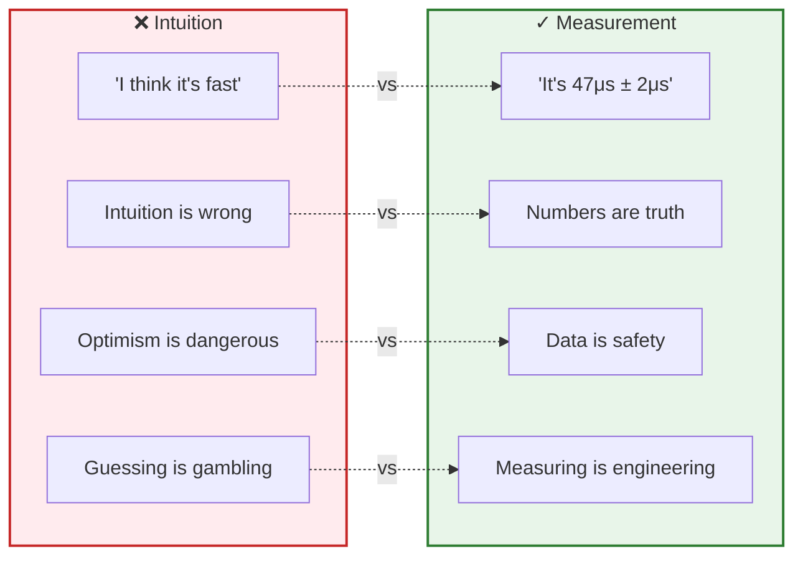
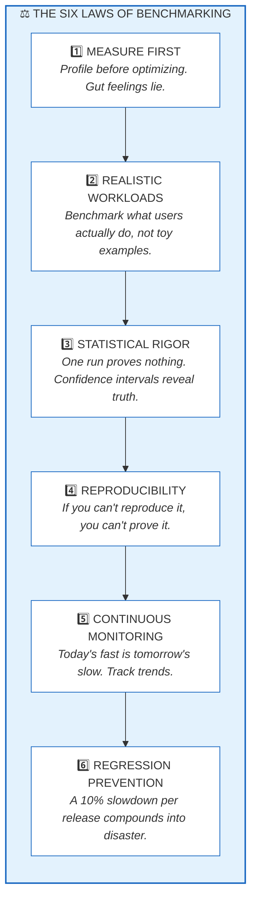
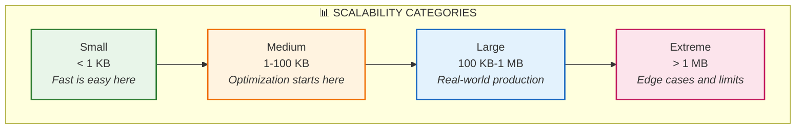
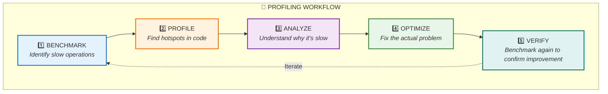
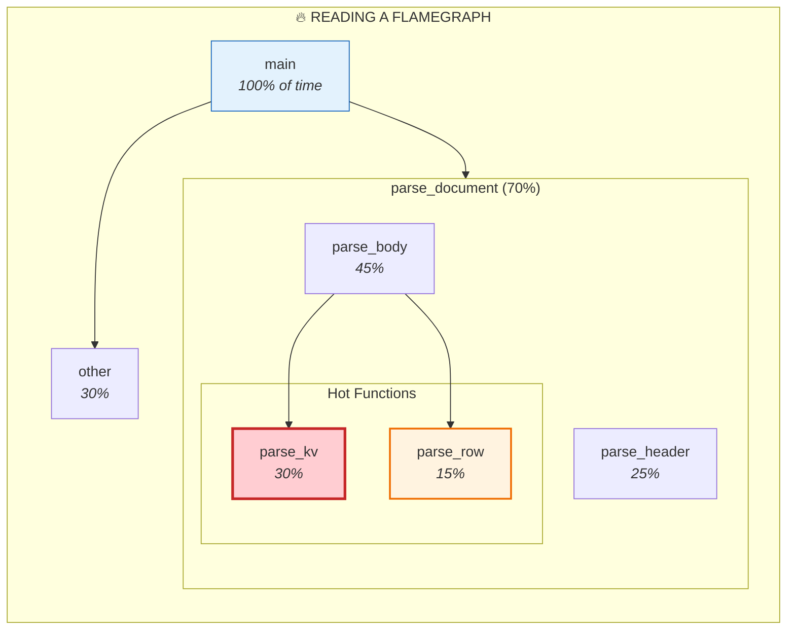
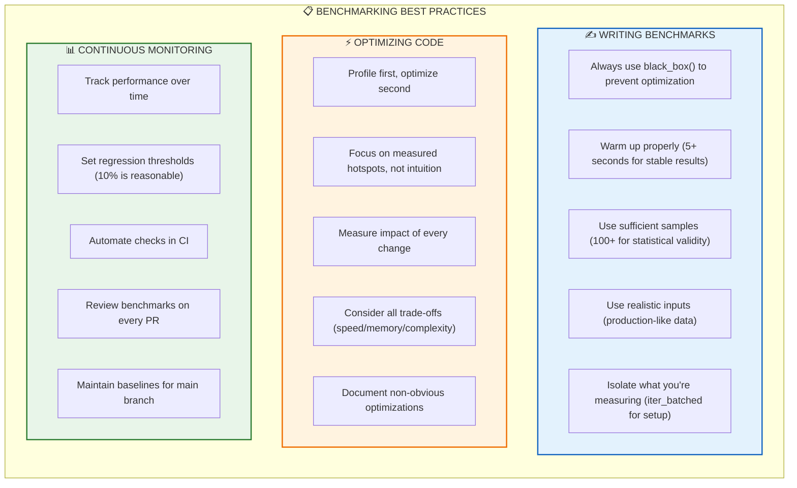

# The Art of Measuring Speed: HEDL Benchmarking

You've written what you think is fast code. The parser feels snappy. Tests pass in the blink of an eye. But feeling fast and being fast are different things entirely.

Then production hits. A customer uploads a 500KB document. Your "fast" parser takes 3 seconds. Users complain. Your intuition betrayed you.

This is why we benchmark. Not to feel fast, but to know fast. To measure precisely, optimize wisely, and prevent regressions relentlessly.



---

## The Philosophy of Performance

Before touching any code, internalize these principles. They separate engineers who optimize from engineers who fumble.

### The Six Laws of Benchmarking



**Measure First** means never writing an optimization based on intuition. Profile your code. Find the actual hotspots. That function you thought was slow? It runs once at startup. That innocent-looking loop? It's 80% of your runtime.

**Realistic Workloads** means benchmarking with data that looks like production. A parser that screams through 10 keys might crawl through 10,000. A serializer that handles ASCII perfectly might choke on Unicode.

**Statistical Rigor** means understanding that performance varies. CPU frequency scaling, background processes, cache effects: all add noise. Run enough samples. Report confidence intervals. Reject false precision.

### Performance Targets

HEDL parsing should feel instant. These are our targets:

| Operation | Target | Measured |
|-----------|--------|----------|
| Parse 10 keys (flat) | < 50 μs | ~20 μs |
| Parse 50 keys (flat) | < 200 μs | ~115 μs |
| Parse 100 keys (flat) | < 500 μs | ~229 μs |
| Parse 500 keys (flat) | < 2 ms | ~1.12 ms |
| Parse nested (blog 5p/2c) | < 100 μs | ~41 μs |

**Throughput:** 33-49 MiB/s depending on document structure

**Verify with:** `cargo bench -p hedl-bench`

These aren't arbitrary numbers. They're derived from user experience research. Under 50μs feels instantaneous. Under 200μs feels fast. Over 1 second and users start wondering if something broke.

---

## Running Benchmarks

Let's get practical. Here's how to measure performance and understand what the numbers mean.

### The Essential Commands

```bash
# Run all benchmarks in the project
cargo bench --all

# Run benchmarks for a specific crate
cargo bench -p hedl-bench

# Run a specific benchmark suite
cargo bench --bench parsing

# Run benchmarks matching a pattern
cargo bench parsing -- simple

# Save a baseline for comparison
cargo bench --bench parsing -- --save-baseline master

# Compare current performance to a baseline
cargo bench --bench parsing -- --baseline master

# Generate detailed HTML reports
cargo bench --bench parsing -- --plotting-backend gnuplot
```

### Understanding the Output

When you run benchmarks, Criterion produces output like this:

```
parse_simple            time:   [48.234 µs 48.567 µs 48.912 µs]
                        change: [-2.5234% -1.2345% +0.3456%] (p = 0.13 > 0.05)
                        No change in performance detected.
```

Let's decode this:

**Understanding the time output:**

```
parse_simple    time:   [48.234 µs  48.567 µs  48.912 µs]
                         ─────────  ─────────  ─────────
                            │          │          │
                            │          │          └─ Upper 95% confidence bound
                            │          └─ Mean estimate
                            └─ Lower 95% confidence bound
```

**Understanding the change output:**

```
change: [-2.5234%  -1.2345%  +0.3456%] (p = 0.13 > 0.05)
         ────────  ────────  ────────   ───────────────
            │         │         │              │
            │         │         │              └─ p-value > 0.05 means
            │         │         │                 NO significant change
            │         │         └─ Upper change bound
            │         └─ Mean change from baseline
            └─ Lower change bound
```

The p-value tells you if the change is real or noise. Below 0.05? The change is statistically significant. Above 0.05? Could just be measurement variation.

### Preparing Your Environment

Noisy environments produce noisy benchmarks. For reliable measurements:

```bash
# Disable CPU frequency scaling (Linux)
sudo cpupower frequency-set --governor performance

# Disable Turbo Boost (Intel)
echo 1 | sudo tee /sys/devices/system/cpu/intel_pstate/no_turbo

# Pin to a specific CPU core
taskset -c 0 cargo bench

# General best practices:
# - Close other applications
# - Ensure stable power (plugged in, not battery)
# - Run multiple iterations
# - Don't benchmark on a laptop in power-saving mode
```

These steps might seem paranoid. They're not. I've seen benchmark results vary by 30% just because of CPU frequency scaling.

---

## Benchmark Organization

The benchmark suite is structured to match how we think about performance.

```
hedl-bench/
├── Cargo.toml
├── benches/
│   ├── core/                    # Core parsing performance
│   │   ├── lexer.rs             # Tokenization
│   │   ├── parsing.rs           # AST construction
│   │   └── validation.rs        # Rule checking
│   │
│   ├── features/                # Feature-specific
│   │   ├── canonicalization.rs  # Normalization
│   │   ├── references.rs        # Reference resolution
│   │   ├── streaming.rs         # Stream parsing
│   │   └── zero_copy.rs         # Zero-copy optimization
│   │
│   ├── formats/                 # Format conversion
│   │   ├── json.rs              # JSON to/from
│   │   ├── yaml.rs              # YAML to/from
│   │   ├── xml.rs               # XML to/from
│   │   ├── csv.rs               # CSV to/from
│   │   └── parquet.rs           # Parquet to/from
│   │
│   ├── bindings/                # Foreign bindings
│   │   ├── ffi.rs               # C FFI overhead
│   │   └── wasm.rs              # WebAssembly overhead
│   │
│   ├── integration/             # End-to-end scenarios
│   │   ├── end_to_end.rs        # Full pipeline
│   │   ├── parallel.rs          # Multi-threaded
│   │   └── comprehensive.rs     # All features
│   │
│   └── regression/              # Regression tracking
│       └── tracking.rs          # Historical comparison
│
├── baselines/
│   ├── current.json             # Current expected values
│   └── main.json                # Main branch baseline
│
└── target/criterion/            # Generated reports
```

### Benchmark Categories

**Core Benchmarks** measure the fundamental parsing pipeline. These are the most important. If parsing is slow, everything built on top will be slow.

**Feature Benchmarks** measure specific capabilities. Canonicalization overhead. Reference resolution cost. These help identify which features are expensive.

**Format Benchmarks** measure conversion to and from other formats. If JSON conversion is slow, users won't choose HEDL over JSON.

**Scalability Benchmarks** measure how performance changes with input size:



---

## Writing Benchmarks

Good benchmarks are like good tests: focused, reproducible, and meaningful.

### The Basic Benchmark

```rust
use criterion::{black_box, criterion_group, criterion_main, Criterion};
use hedl_core::parse;

fn bench_parse_simple(c: &mut Criterion) {
    // Create a realistic test document
    let input = br#"%V:2.0
%NULL:~
%QUOTE:"
---
name: Alice
age: 30
active: true
"#;

    c.bench_function("parse_simple", |b| {
        b.iter(|| {
            // black_box prevents the compiler from optimizing away the result
            parse(black_box(input)).unwrap()
        })
    });
}

criterion_group!(benches, bench_parse_simple);
criterion_main!(benches);
```

The `black_box` function is critical. Without it, the compiler might realize you're not using the result and optimize away the entire computation.

### Parameterized Benchmarks

Measure how performance scales with different inputs:

```rust
use criterion::{BenchmarkId, Criterion};
use hedl_core::parse;

fn bench_parse_varying_size(c: &mut Criterion) {
    let mut group = c.benchmark_group("parse_varying_size");

    for size in [10, 100, 1000, 10000] {
        let input = generate_document(size);

        group.bench_with_input(
            BenchmarkId::from_parameter(size),
            &input,
            |b, input| {
                b.iter(|| parse(black_box(input.as_bytes())).unwrap())
            },
        );
    }

    group.finish();
}

/// Generate a HEDL document with the specified number of key-value pairs
fn generate_document(lines: usize) -> String {
    let mut doc = String::from("%V:2.0\n%NULL:~\n%QUOTE:\"\n---\n");
    for i in 0..lines {
        doc.push_str(&format!("key{}: value{}\n", i, i));
    }
    doc
}
```

This produces beautiful scaling charts showing exactly where performance degrades.

### Throughput Benchmarks

Sometimes you care about bytes per second, not operations per second:

```rust
use criterion::{BenchmarkId, Throughput, Criterion};
use hedl_core::parse;

fn bench_parse_throughput(c: &mut Criterion) {
    let mut group = c.benchmark_group("parse_throughput");

    for size in [1024, 10240, 102400, 1024000] {
        let input = generate_document_bytes(size);

        // Tell Criterion how many bytes we're processing
        group.throughput(Throughput::Bytes(input.len() as u64));

        group.bench_with_input(
            BenchmarkId::from_parameter(size),
            &input,
            |b, input| {
                b.iter(|| parse(black_box(input)).unwrap())
            },
        );
    }

    group.finish();
}

fn generate_document_bytes(target_size: usize) -> Vec<u8> {
    let mut doc = String::from("%V:2.0\n%NULL:~\n%QUOTE:\"\n---\n");
    let mut i = 0;
    while doc.len() < target_size {
        doc.push_str(&format!("key{}: value{}\n", i, i));
        i += 1;
    }
    doc.into_bytes()
}
```

### Comparison Benchmarks

How does HEDL compare to other formats?

```rust
use criterion::Criterion;
use hedl_core::parse;

fn bench_parse_vs_json(c: &mut Criterion) {
    let hedl_input = br#"%V:2.0
%NULL:~
%QUOTE:"
%S:User:[id,name,email,active]
---
users:@User
 |u1,Alice,alice@example.com,true
 |u2,Bob,bob@example.com,false
 |u3,Charlie,charlie@example.com,true
"#;

    let json_input = r#"{
        "users": [
            {"id": "u1", "name": "Alice", "email": "alice@example.com", "active": true},
            {"id": "u2", "name": "Bob", "email": "bob@example.com", "active": false},
            {"id": "u3", "name": "Charlie", "email": "charlie@example.com", "active": true}
        ]
    }"#;

    let mut group = c.benchmark_group("format_comparison");

    group.bench_function("hedl_parse", |b| {
        b.iter(|| parse(black_box(hedl_input)).unwrap())
    });

    group.bench_function("json_parse", |b| {
        b.iter(|| {
            serde_json::from_str::<serde_json::Value>(black_box(json_input)).unwrap()
        })
    });

    group.finish();
}
```

### Benchmarks with Setup

When setup is expensive, exclude it from measurement:

```rust
use criterion::BatchSize;
use hedl_core::parse;

fn bench_with_expensive_setup(c: &mut Criterion) {
    c.bench_function("parse_with_setup", |b| {
        b.iter_batched(
            // Setup function: NOT measured
            || generate_large_document(),
            // Benchmark function: measured
            |input| parse(&input).unwrap(),
            // Batch size affects memory vs. accuracy tradeoff
            BatchSize::SmallInput,
        )
    });
}

fn generate_large_document() -> Vec<u8> {
    let mut doc = String::from("%V:2.0\n%NULL:~\n%QUOTE:\"\n---\n");
    for i in 0..10000 {
        doc.push_str(&format!("key{}: value{}\n", i, i));
    }
    doc.into_bytes()
}
```

### Configuring Measurement

For high-precision benchmarks, tweak the measurement parameters:

```rust
use criterion::Criterion;
use std::time::Duration;

fn bench_with_custom_config(c: &mut Criterion) {
    let mut group = c.benchmark_group("high_precision");

    // More samples for tighter confidence intervals
    group.sample_size(1000);

    // Longer warm-up for stable CPU state
    group.warm_up_time(Duration::from_secs(5));

    // Longer measurement for more data points
    group.measurement_time(Duration::from_secs(10));

    group.bench_function("parse", |b| {
        let input = br#"%V:2.0
%NULL:~
%QUOTE:"
---
name: Alice
"#;
        b.iter(|| parse(black_box(input)).unwrap())
    });

    group.finish();
}
```

---

## Performance Profiling

Benchmarks tell you *what* is slow. Profilers tell you *why*.

### The Profiling Workflow



### CPU Profiling with Flamegraph

Flamegraphs are the most intuitive way to understand where time goes:

```bash
# Install flamegraph
cargo install flamegraph

# Generate a flamegraph for parsing benchmarks
cargo flamegraph --bench parsing

# Open the result in your browser
firefox flamegraph.svg
# or
open flamegraph.svg  # macOS
```

The resulting SVG is interactive. Click to zoom into specific functions. Look for wide bars: those are your hotspots.



**Reading tip:** Wide bars = lots of time spent. Look at `parse_kv` above: it's the widest bar in the hot path, making it the prime optimization target.

### CPU Profiling with perf

For deeper analysis on Linux:

```bash
# Build with debug symbols
cargo build --release --bench parsing

# Record performance data
perf record -g target/release/deps/parsing-* --bench

# View the report
perf report

# Annotate specific functions
perf annotate function_name
```

### Memory Profiling

Performance isn't just CPU. Memory allocation can kill throughput.

**With Valgrind's Massif:**

```bash
# Build the benchmark
cargo build --release --bench parsing

# Profile memory allocation
valgrind --tool=massif target/release/deps/parsing-* --bench

# Visualize the results
ms_print massif.out.*
```

**With Heaptrack:**

```bash
# Install heaptrack
sudo apt install heaptrack heaptrack-gui

# Profile
heaptrack target/release/deps/parsing-* --bench

# Analyze with GUI
heaptrack_gui heaptrack.parsing.*.gz
```

This shows you:
- Total allocations over time
- Which functions allocate the most
- Memory leaks
- Allocation patterns

### macOS: Instruments

On macOS, Instruments provides excellent profiling:

```bash
# Install cargo-instruments
cargo install cargo-instruments

# CPU time profiler
cargo instruments -t time --bench parsing

# Memory allocations
cargo instruments -t alloc --bench parsing

# Open the trace
open target/release/instruments/*.trace
```

---

## The Optimization Workflow

You've found a bottleneck. Now what?

### Step 1: Create a Baseline

Before touching anything, capture current performance:

```bash
cargo bench --bench parsing -- --save-baseline before
```

This is your safety net. You'll compare against it to prove your optimization works.

### Step 2: Understand the Problem

Don't just hack at code. Understand *why* it's slow:

```mermaid
graph TB
    subgraph Problems["⚠️ COMMON PERFORMANCE PROBLEMS"]
        direction TB

        subgraph P1["Excessive Allocation"]
            P1A["Creating new Strings/Vecs in hot loops"]
            P1F["✓ Fix: Pre-allocate, use slices"]
        end

        subgraph P2["Cache Misses"]
            P2A["Jumping around in memory unpredictably"]
            P2F["✓ Fix: Better data layout, access patterns"]
        end

        subgraph P3["Branch Misprediction"]
            P3A["Unpredictable if/else in tight loops"]
            P3F["✓ Fix: Sort data, branchless algorithms"]
        end

        subgraph P4["Unnecessary Computation"]
            P4A["Recomputing the same thing multiple times"]
            P4F["✓ Fix: Caching, lazy evaluation"]
        end

        subgraph P5["Algorithmic Complexity"]
            P5A["O(n²) where O(n) is possible"]
            P5F["✓ Fix: Better algorithms, data structures"]
        end
    end

    P1A --> P1F
    P2A --> P2F
    P3A --> P3F
    P4A --> P4F
    P5A --> P5F

    style P1 fill:#ffebee,stroke:#c62828
    style P2 fill:#fff3e0,stroke:#ef6c00
    style P3 fill:#f3e5f5,stroke:#7b1fa2
    style P4 fill:#e3f2fd,stroke:#1565c0
    style P5 fill:#e0f2f1,stroke:#00695c
    style P1F fill:#e8f5e9,stroke:#2e7d32
    style P2F fill:#e8f5e9,stroke:#2e7d32
    style P3F fill:#e8f5e9,stroke:#2e7d32
    style P4F fill:#e8f5e9,stroke:#2e7d32
    style P5F fill:#e8f5e9,stroke:#2e7d32
```



### Step 3: Make the Change

Here's a real example of reducing allocations:

```rust
// BEFORE: Allocates a new String for every line
fn process_lines(input: &str) -> Vec<String> {
    let mut result = Vec::new();
    for line in input.lines() {
        result.push(line.trim().to_string());  // Allocation!
    }
    result
}

// AFTER: Returns slices into the original input
fn process_lines(input: &str) -> Vec<&str> {
    let mut result = Vec::with_capacity(input.lines().count());
    for line in input.lines() {
        result.push(line.trim());  // No allocation!
    }
    result
}
```

### Step 4: Measure the Improvement

```bash
# Compare to your baseline
cargo bench --bench parsing -- --baseline before

# Expected output:
# parse_simple            time:   [32.123 µs 32.456 µs 32.789 µs]
#                         change: [-35.234% -33.567% -31.890%] (p = 0.00 < 0.05)
#                         Performance has improved.
```

A 33% improvement! The change is statistically significant (p < 0.05).

### Step 5: Verify Correctness

Speed is useless if correctness is broken:

```bash
# Run all tests
cargo test --all

# Run benchmarks against main baseline
cargo bench --all -- --baseline main
```

---

## Regression Detection

A 5% slowdown per release. Seems small. After 10 releases, you're 40% slower. After 20, you're 64% slower. Performance death by a thousand cuts.

### Automatic Regression Detection

Set up benchmarks that fail on regression:

```rust
use criterion::{criterion_group, criterion_main, Criterion};

fn bench_critical_path(c: &mut Criterion) {
    c.bench_function("critical_parse", |b| {
        let input = load_fixture("production_sample.hedl");
        b.iter(|| parse(black_box(&input)).unwrap())
    });
}

criterion_group! {
    name = benches;
    config = Criterion::default()
        // Fail CI if performance degrades by more than 10%
        .noise_threshold(0.10);
    targets = bench_critical_path
}
criterion_main!(benches);
```

### CI Integration

Make regression detection automatic:

```yaml
# .github/workflows/benchmarks.yml
name: Performance Benchmarks

on:
  pull_request:
    branches: [main, master]
  push:
    branches: [main, master]

jobs:
  benchmark:
    name: Run Benchmarks
    runs-on: ubuntu-latest

    steps:
      - name: Checkout
        uses: actions/checkout@v4

      - name: Install Rust
        uses: dtolnay/rust-toolchain@stable

      - name: Restore baseline
        uses: actions/cache@v4
        with:
          path: target/criterion
          key: criterion-baseline-${{ github.base_ref }}

      - name: Run benchmarks
        run: |
          cargo bench --all -- \
            --save-baseline pr-${{ github.event.number }}

      - name: Check for regressions
        run: |
          cargo bench --all -- \
            --baseline main \
            --compare

      - name: Upload results
        uses: actions/upload-artifact@v4
        with:
          name: benchmark-results
          path: target/criterion
          retention-days: 30
```

### Regression Detection Script

For local use or custom CI:

```bash
#!/bin/bash
# scripts/check_regression.sh

set -e

# Run current benchmarks
cargo bench --bench parsing -- --save-baseline current

# Compare to main baseline
cargo bench --bench parsing -- --baseline main --load-baseline current

# Extract mean times
CURRENT=$(jq '.mean.point_estimate' target/criterion/parse_simple/current/estimates.json)
BASELINE=$(jq '.mean.point_estimate' target/criterion/parse_simple/main/estimates.json)

# Calculate percentage change
CHANGE=$(echo "scale=2; ($CURRENT - $BASELINE) / $BASELINE * 100" | bc)

echo "Performance change: ${CHANGE}%"

# Fail if more than 10% slower
if (( $(echo "$CHANGE > 10" | bc -l) )); then
    echo "ERROR: Performance regression detected!"
    echo "Current: ${CURRENT}ns"
    echo "Baseline: ${BASELINE}ns"
    exit 1
fi

echo "Performance is acceptable."
```

---

## Common Optimization Patterns

Over years of optimization work, certain patterns emerge repeatedly.

### Reduce Allocations

The number one performance killer in garbage-collected and reference-counted languages alike:

```rust
// BAD: Allocates on every call
fn parse_key(line: &str) -> String {
    line.split(':')
        .next()
        .unwrap()
        .trim()
        .to_string()  // Allocation!
}

// GOOD: Returns a slice into the input
fn parse_key(line: &str) -> &str {
    line.split(':')
        .next()
        .unwrap()
        .trim()  // No allocation!
}
```

### Pre-allocate Collections

Know the size? Allocate it up front:

```rust
// BAD: Grows incrementally, multiple reallocations
fn collect_keys(input: &str) -> Vec<&str> {
    let mut keys = Vec::new();  // Starts empty
    for line in input.lines() {
        keys.push(parse_key(line));  // May reallocate
    }
    keys
}

// GOOD: Single allocation
fn collect_keys(input: &str) -> Vec<&str> {
    let line_count = input.lines().count();
    let mut keys = Vec::with_capacity(line_count);  // Pre-sized
    for line in input.lines() {
        keys.push(parse_key(line));  // Never reallocates
    }
    keys
}
```

### Cache Computed Results

If you compute the same thing multiple times, compute it once:

```rust
use std::collections::HashMap;
use std::sync::Arc;

struct Parser {
    schema_cache: HashMap<String, Arc<Schema>>,
}

impl Parser {
    fn get_schema(&mut self, name: &str) -> Arc<Schema> {
        self.schema_cache
            .entry(name.to_string())
            .or_insert_with(|| Arc::new(self.load_schema(name)))
            .clone()
    }
}
```

### Use Appropriate Data Structures

The right data structure makes a huge difference:

```rust
// BAD: O(n) lookup in a Vec
fn find_by_id<'a>(rows: &'a [Row], id: &str) -> Option<&'a Row> {
    rows.iter().find(|r| r.id == id)
}

// GOOD: O(1) lookup in a HashMap
use std::collections::HashMap;

struct Document {
    rows_by_id: HashMap<String, Row>,
}

impl Document {
    fn find_by_id(&self, id: &str) -> Option<&Row> {
        self.rows_by_id.get(id)
    }
}
```

### SIMD for Hot Loops

When you need maximum speed on large data:

```rust
#[cfg(target_arch = "x86_64")]
use std::arch::x86_64::*;

/// Count newlines using SIMD
#[cfg(target_arch = "x86_64")]
unsafe fn count_newlines_simd(input: &[u8]) -> usize {
    let newline = _mm_set1_epi8(b'\n' as i8);
    let mut count = 0;
    let mut i = 0;

    // Process 16 bytes at a time
    while i + 16 <= input.len() {
        let chunk = _mm_loadu_si128(input.as_ptr().add(i) as *const __m128i);
        let cmp = _mm_cmpeq_epi8(chunk, newline);
        let mask = _mm_movemask_epi8(cmp) as u32;
        count += mask.count_ones() as usize;
        i += 16;
    }

    // Handle remaining bytes
    count + input[i..].iter().filter(|&&b| b == b'\n').count()
}
```

---

## Recent Benchmark Results

Here's what current performance looks like:

```
parse_flat/10           time:   [19.257 µs 19.774 µs 20.240 µs]
                        thrpt:  [41.605 MiB/s 42.587 MiB/s 43.730 MiB/s]

parse_flat/50           time:   [113.46 µs 114.70 µs 116.01 µs]
                        thrpt:  [33.218 MiB/s 33.599 MiB/s 33.966 MiB/s]

parse_flat/100          time:   [226.40 µs 228.63 µs 230.89 µs]
                        thrpt:  [33.221 MiB/s 33.550 MiB/s 33.880 MiB/s]

parse_flat/500          time:   [1.1101 ms 1.1200 ms 1.1305 ms]
                        thrpt:  [34.222 MiB/s 34.545 MiB/s 34.852 MiB/s]

parse_nested/blog/5p_2c time:   [40.273 µs 40.647 µs 41.047 µs]
                        thrpt:  [48.280 MiB/s 48.755 MiB/s 49.207 MiB/s]
```

Run `cargo bench -p hedl-bench` to get current numbers on your machine. HTML reports are generated in `target/criterion/`.

---

## Best Practices Summary



---

## The Pursuit of Speed

Performance isn't a feature you add once. It's a discipline you practice forever. Every commit is an opportunity to make things faster, or to let them get slower.

The tools in this guide give you the power to measure, understand, and improve. The flamegraph shows you where time goes. The benchmarks prove your optimizations work. The regression tests catch backsliding before it escapes.

Use them. Trust numbers over intuition. Be relentless.

Because when your parser processes a million documents a day, that 10μs improvement you made? It saves someone's day.

---

## Next Steps

With benchmarking mastered, explore:

1. **Run benchmarks now**: `cargo bench -p hedl-bench`
2. **Profile a hotspot**: `cargo flamegraph --bench parsing`
3. **Set up CI**: Add the GitHub Actions workflow above
4. **Find an optimization**: Profile, optimize, measure, repeat

The fastest code is the code you haven't written yet. But for the code you have written, measurement is the path to speed.
