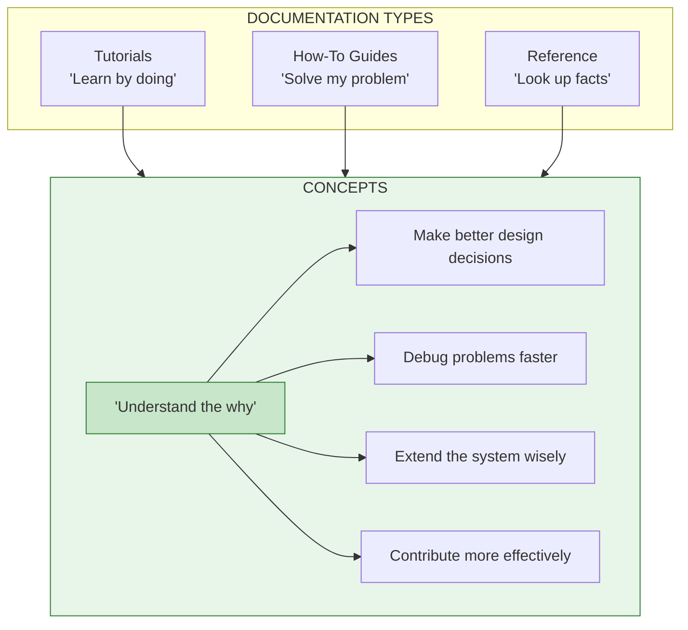
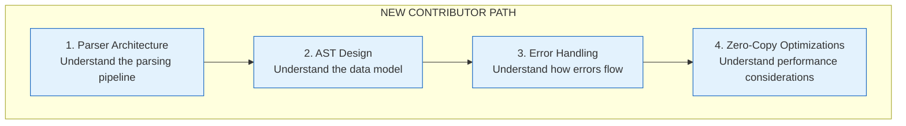
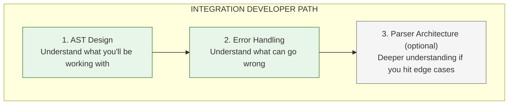
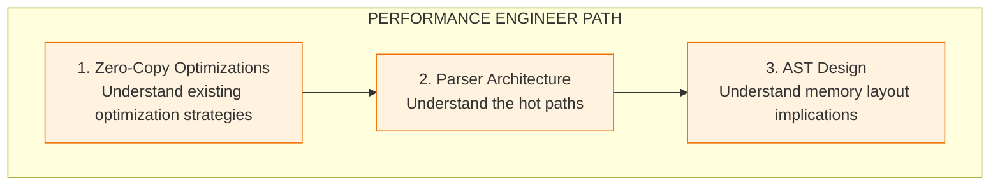
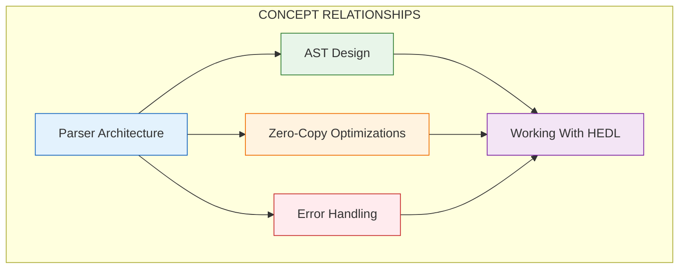

# The Ideas Behind HEDL: Core Concepts

Code is easy to write. Understanding *why* code is written a certain way is harder. This section bridges that gap.

These aren't tutorials that hold your hand through steps. They aren't reference docs you consult when stuck. These are explanations of the deep ideas that shape HEDL's design. Read them when you want to understand not just what HEDL does, but why it does it that way.



---

## The Concept Library

### Parser Architecture

**[Parser Architecture](parser-architecture.md)** explains how raw text becomes structured data. You'll understand:

- **Lexical Analysis**: How characters become tokens
- **Recursive Descent**: How tokens become a syntax tree
- **Two-Pass Resolution**: Why references work across the entire document
- **Indentation Grammar**: How whitespace creates structure

Read this first. Everything else builds on understanding the parser.

### AST Design

**[AST Design](ast-design.md)** reveals the data structures at HEDL's heart:

- **Hierarchical Structure**: How documents, items, and values relate
- **Value Types**: Why we have the specific types we have
- **Traversal Patterns**: How to walk the tree effectively
- **Memory Layout**: Why we made certain size/speed trade-offs

Read this when you need to work with parsed documents programmatically.

### Zero-Copy Optimizations

**[Zero-Copy Optimizations](zero-copy-optimizations.md)** explains HEDL's performance philosophy:

- **String Slices**: Borrowing instead of copying
- **Pre-allocation**: Knowing sizes before filling containers
- **Safety Trade-offs**: When we copy for safety, and why
- **Benchmarking Impact**: Proof that these techniques matter

Read this when you care about making HEDL faster.

### Error Handling

**[Error Handling](error-handling.md)** covers how we report problems:

- **Type-Safe Errors**: Why error types are structured, not strings
- **Location Tracking**: How we know where problems occur
- **Recovery Strategies**: Continuing after errors to report more
- **User Experience**: Making error messages actually helpful

Read this when you need to understand or extend error reporting.

---

## Learning Paths

### For New Contributors

You want to understand HEDL well enough to contribute code:



### For Integration Developers

You want to use HEDL in your application:



### For Performance Engineers

You want to make HEDL faster:



---

## Design Philosophy

Every line of HEDL code reflects these principles:

### Token Efficiency

LLMs are billed by tokens. Every character counts. HEDL achieves significant token reduction compared to JSON for equivalent data. This isn't accidental; it's a core design goal.

```
JSON:                           HEDL:
{                               users:@User
  "users": [                     |u1,Alice,alice@example.com
    {                            |u2,Bob,bob@example.com
      "id": "u1",
      "name": "Alice",
      "email": "alice@example.com"
    },
    ...
  ]
}

More bytes, more tokens,        Fewer bytes, fewer tokens,
higher cost                     lower cost
```

### Type Safety

Catch errors early. A malformed document should fail at parse time, not when you try to use it. Schema definitions enforce structure. Reference validation ensures links resolve.

### Developer Ergonomics

Machines read HEDL, but humans write it. The syntax is designed to be readable, writeable, and maintainable. Comments explain intent. Indentation shows structure. References are clear.

### Performance

Fast parsing isn't a nice-to-have. It's required. Users don't wait. HEDL parses at 30-50 MiB/s. That means a 1MB document processes in under 30ms.

### Modularity

Nineteen crates, each with a single responsibility. Need parsing without JSON conversion? Import just `hedl-core`. Need JSON but not YAML? Enable only the features you need. Compile times stay fast. Binary sizes stay small.

---

## The Concept Map

How these concepts relate:



The parser creates the AST. Zero-copy techniques make parsing fast. Error handling makes failures informative. Understanding all three enables you to work with HEDL effectively.

---

## Going Deeper

After reading these concepts, you might want to:

1. **Explore the source**: `crates/hedl-core/src/` contains the implementation
2. **Run the tests**: See how concepts translate to code
3. **Read the specification**: SPEC.md defines the authoritative behavior
4. **Profile the code**: See where time actually goes

Concepts are the foundation. But ultimately, the code is truth.
