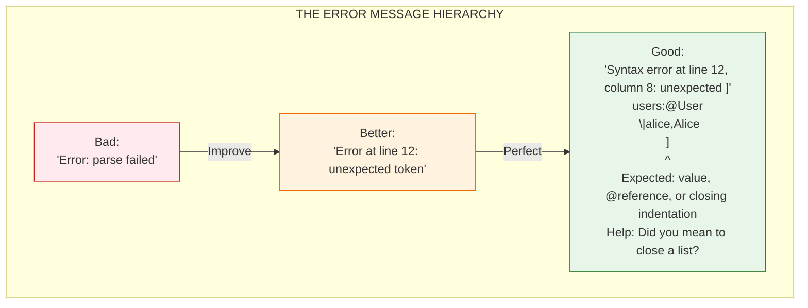
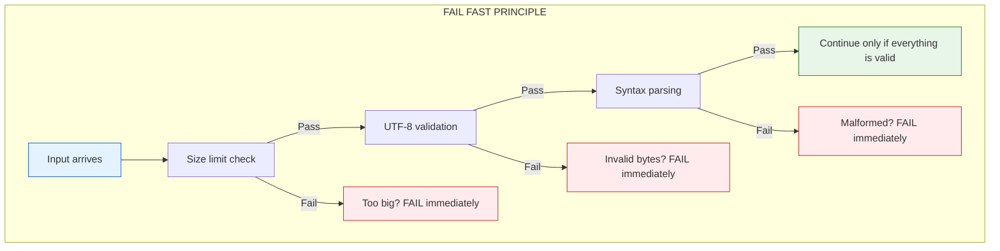
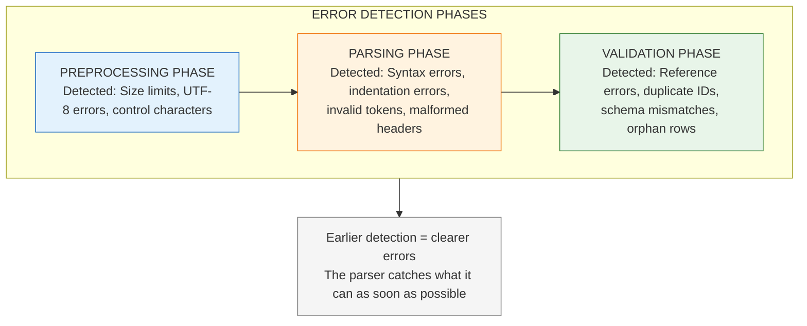

# Error Handling: Making Failures Helpful

You've all seen the error message that breaks your spirit:

```
Error: parse failed
```

That's it. No line number. No explanation. No hint about what went wrong. You stare at thousands of lines of configuration, wondering where the problem hides.

HEDL takes a different approach. When something goes wrong, the error message should be your guide, not your enemy. It should tell you what happened, where it happened, and how to fix it.



---

## The Philosophy of Errors

HEDL's error handling follows four principles:

### 1. Fail Fast

Detect errors as early as possible. Don't wait until the end of parsing to discover that line 3 was malformed. Don't process invalid data hoping it will work out.



### 2. Actionable Messages

An error message should tell users what to do, not just what's wrong. "Invalid reference" is a fact. "Reference @User:bob not found; check that bob is defined in a @User matrix" is guidance.

### 3. Source Context

Show exactly where the error occurred. Line number at minimum. Column number when possible. The problematic line with a pointer to the exact character is ideal.

### 4. Type Safety

Use Rust's type system to make error handling explicit. `Result<T, HedlError>` forces callers to handle errors. `HedlErrorKind` enables pattern matching on error types.

---

## The Error Type

All HEDL errors share a common structure:

```rust
/// The error type returned by all HEDL operations
pub struct HedlError {
    /// What category of error this is
    pub kind: HedlErrorKind,

    /// Human-readable description of what went wrong
    pub message: String,

    /// Line number where the error occurred (1-indexed)
    pub line: usize,

    /// Column number where the error occurred (1-indexed, optional)
    pub column: Option<usize>,

    /// Additional context (e.g., the problematic line content)
    pub context: Option<String>,
}
```

### Error Categories

```rust
/// Categories of errors that can occur
pub enum HedlErrorKind {
    // Lexical and structural errors
    Syntax,       // Malformed HEDL syntax

    // Header errors
    Version,      // Invalid or unsupported version
    Alias,        // Duplicate or invalid alias definition

    // Schema errors
    Schema,       // Schema violation or mismatch
    Shape,        // Wrong number of fields in a row

    // Data errors
    Semantic,     // Logical error (e.g., invalid value type)
    OrphanRow,    // Child row without %NEST directive
    Collision,    // Duplicate ID within the same type

    // Reference errors
    Reference,    // Unresolved or ambiguous reference

    // Limit errors
    Security,     // Resource limit exceeded

    // External errors
    Conversion,   // Format conversion failed
    IO,           // File system or network error
}
```

### Why These Categories?

Each category represents a different kind of problem with a different solution:

| Category | What | Example | Fix |
|----------|------|---------|-----|
| **SYNTAX** | Malformed text that can't be parsed | Unclosed string, invalid characters | Correct the syntax at the indicated location |
| **VERSION** | Document version not supported | `%V:3.0` when only 2.0 is supported | Use a supported version |
| **SCHEMA** | Type definition problems | Using `@UnknownType` before defining it | Define the type with `%S:` directive |
| **SHAPE** | Row doesn't match schema | 3 fields in row but schema has 4 columns | Add missing fields or fix schema |
| **REFERENCE** | `@reference` doesn't resolve | `@User:bob` but no User with id "bob" exists | Define the referenced entity or fix the reference |
| **COLLISION** | Duplicate IDs within same type | Two rows with id "alice" in `@User` matrix | Rename one of the duplicates |
| **SECURITY** | Resource limit exceeded | File larger than 1GB, nesting deeper than 100 | Reduce document size or adjust limits |

---

## Creating Errors

HEDL provides convenience constructors for each error kind:

```rust
use hedl_core::{HedlError, HedlErrorKind};

// Syntax error at line 12
let err = HedlError::syntax("unclosed string quote", 12);

// Schema error at line 5, column 8
let err = HedlError::schema("unknown type: @Product", 5)
    .with_column(8);

// Reference error with context
let err = HedlError::reference("@User:bob not found", 15)
    .with_context("  author: @User:bob");

// Security error for limit violation
let err = HedlError::security(
    format!("file size {} exceeds limit {}", size, limit),
    0  // Line 0 for document-level errors
);
```

---

## Handling Errors

### Basic Pattern Matching

```rust
use hedl_core::{parse, HedlError, HedlErrorKind};

fn process_document(input: &[u8]) -> Result<(), HedlError> {
    match parse(input) {
        Ok(doc) => {
            println!("Successfully parsed {} root keys", doc.root.len());
            Ok(())
        }
        Err(e) => {
            // Handle different error types differently
            match e.kind {
                HedlErrorKind::Syntax => {
                    eprintln!("Syntax error at line {}: {}", e.line, e.message);
                    eprintln!("Check your HEDL syntax at this location.");
                }
                HedlErrorKind::Schema => {
                    eprintln!("Schema error at line {}: {}", e.line, e.message);
                    eprintln!("Ensure all types are defined before use.");
                }
                HedlErrorKind::Reference => {
                    eprintln!("Reference error: {}", e.message);
                    eprintln!("Check that all referenced IDs exist.");
                }
                HedlErrorKind::Security => {
                    eprintln!("Security limit exceeded: {}", e.message);
                    eprintln!("Consider processing a smaller document.");
                }
                _ => {
                    eprintln!("Error at line {}: {}", e.line, e.message);
                }
            }
            Err(e)
        }
    }
}
```

### Lenient Mode for References

Sometimes you want to parse a document even if some references don't resolve (perhaps they'll be resolved by a later processing step):

```rust
use hedl_core::{parse, parse_with_limits, ParseOptions, ReferenceMode};

fn parse_with_fallback(input: &[u8]) -> hedl_core::HedlResult<hedl_core::Document> {
    // Try strict parsing first
    match parse(input) {
        Ok(doc) => Ok(doc),
        Err(e) if matches!(e.kind, hedl_core::HedlErrorKind::Reference) => {
            // Reference error: try lenient mode
            let options = ParseOptions::builder()
                .reference_mode(ReferenceMode::Lenient)
                .build();
            parse_with_limits(input, options)
        }
        Err(e) => Err(e),  // Other errors: propagate
    }
}
```

---

## Formatting Errors for Users

The raw `HedlError` contains the information. How you present it depends on your application:

### CLI Application

```rust
use hedl_core::HedlError;

fn format_error_for_cli(err: &HedlError, input: &str) -> String {
    let mut output = String::new();

    // Header
    output.push_str(&format!(
        "\x1b[31merror[{:?}]\x1b[0m: {}\n",
        err.kind, err.message
    ));

    // Location
    output.push_str(&format!(
        "  \x1b[34m-->\x1b[0m line {}\n",
        err.line
    ));

    // Source snippet
    if let Some(line_content) = input.lines().nth(err.line.saturating_sub(1)) {
        output.push_str(&format!("   |\n"));
        output.push_str(&format!("{:>3} | {}\n", err.line, line_content));

        // Column pointer
        if let Some(col) = err.column {
            let padding = " ".repeat(col + 4);  // 3 for line number + space
            output.push_str(&format!("   | {}\x1b[31m^\x1b[0m\n", padding));
        } else {
            output.push_str(&format!("   |\n"));
        }
    }

    output
}
```

Output:
```
error[Syntax]: unclosed string quote
  --> line 12
   |
 12 |   bio: "Developer
   |        ^
```

### JSON API Response

```rust
use hedl_core::HedlError;
use serde_json::json;

fn format_error_for_api(err: &HedlError) -> serde_json::Value {
    json!({
        "error": {
            "type": format!("{:?}", err.kind),
            "message": err.message,
            "location": {
                "line": err.line,
                "column": err.column
            },
            "context": err.context
        }
    })
}
```

### LSP Diagnostic

```rust
use hedl_core::HedlError;
use lsp_types::{Diagnostic, DiagnosticSeverity, Position, Range};

fn error_to_diagnostic(err: &HedlError) -> Diagnostic {
    let line = (err.line as u32).saturating_sub(1);  // LSP is 0-indexed
    let col = err.column.map(|c| c as u32).unwrap_or(0);

    Diagnostic {
        range: Range::new(
            Position::new(line, col),
            Position::new(line, col + 1),
        ),
        severity: Some(DiagnosticSeverity::ERROR),
        source: Some("hedl".to_string()),
        message: err.message.clone(),
        ..Default::default()
    }
}
```

---

## Validation vs Parsing Errors

Understanding when errors are detected helps you understand how to handle them:



### Parse-Time Errors

These are caught during parsing. The parser can't continue without resolving them:

- **Syntax errors**: Malformed HEDL text
- **UTF-8 errors**: Invalid byte sequences
- **Indentation errors**: Tabs, wrong spacing
- **Header errors**: Invalid directives

### Validation Errors

These are caught after the AST is built but before the document is returned:

- **Reference errors**: `@User:bob` but no `bob` in User
- **Collision errors**: Duplicate IDs within a type
- **Schema errors**: Type used but not defined
- **Shape errors**: Row field count doesn't match schema

---

## The User Experience

Great error messages are an investment in user experience. Compare:

### Before

```
Error: invalid
```

### After

```
Schema error at line 15: type "Product" not defined

This document uses @Product on line 15, but no %S:Product:[...]
directive was found in the header.

To fix this:
  1. Add a schema definition to your header:
     %S:Product:[id,name,price]

  2. Or check if you meant a different type name.

  15 |  items:@Product
           ^^^^^^^^
```

The second message:
- Names the error type (Schema)
- Explains what's wrong (type not defined)
- Provides context (which line, which type)
- Suggests solutions (add definition or check spelling)
- Shows the problematic code with highlighting

---

## Building Error Messages

When writing code that generates errors, follow these guidelines:

### Be Specific

```rust
// Bad: vague message
HedlError::syntax("invalid", line)

// Good: specific message
HedlError::syntax(
    format!("expected '}}' to close object started at line {}", start_line),
    line
)
```

### Include Context

```rust
// Bad: no context
HedlError::reference("reference not found", line)

// Good: context included
HedlError::reference(
    format!("reference @{}:{} not found in document", type_name, id),
    line
).with_context(line_content.to_string())
```

### Suggest Solutions

```rust
// Bad: just the problem
HedlError::schema("unknown type", line)

// Good: problem + solution
HedlError::schema(
    format!(
        "unknown type @{}; add %S:{}:[...] to your header or check spelling",
        type_name, type_name
    ),
    line
)
```

---

## Testing Error Handling

Errors are features. Test them:

```rust
#[test]
fn test_unclosed_string_produces_syntax_error() {
    let input = br#"%V:2.0
%NULL:~
%QUOTE:"
---
name: "Alice
"#;

    let result = hedl_core::parse(input);

    assert!(result.is_err());
    let err = result.unwrap_err();
    assert!(matches!(err.kind, HedlErrorKind::Syntax));
    assert!(err.message.contains("unclosed") || err.message.contains("unterminated"));
    assert_eq!(err.line, 5);  // The line with the unclosed string
}

#[test]
fn test_duplicate_id_produces_collision_error() {
    let input = br#"%V:2.0
%NULL:~
%QUOTE:"
%S:User:[id,name]
---
users:@User
 |alice,Alice
 |alice,Also Alice
"#;

    let result = hedl_core::parse(input);

    assert!(result.is_err());
    let err = result.unwrap_err();
    assert!(matches!(err.kind, HedlErrorKind::Collision));
    assert!(err.message.contains("alice") || err.message.contains("duplicate"));
}
```

---

## The Error Handling Mindset

Every error is an opportunity to help. Users encounter errors when they're already frustrated. A good error message transforms that moment from "this tool is broken" to "ah, I see what I did wrong."

Think of error messages as documentation that appears exactly when users need it most. Invest in them. Make them excellent.

**ERROR MESSAGE CHECKLIST**

- [ ] Does it say **WHAT** went wrong?
- [ ] Does it say **WHERE** (line, column)?
- [ ] Does it say **WHY** it's a problem?
- [ ] Does it suggest **HOW** to fix it?
- [ ] Does it show the problematic **CODE**?
- [ ] Is the language **CLEAR** and **SPECIFIC**?
- [ ] Would a tired developer at 2am understand it?

---

## Related Documentation

- [Parser Architecture](parser-architecture.md): How parsing produces errors
- [Debug Parser](../how-to/debug-parser.md): Debugging when errors occur
- [Testing Conformance](../testing-conformance.md): Error behavior in conformance tests
