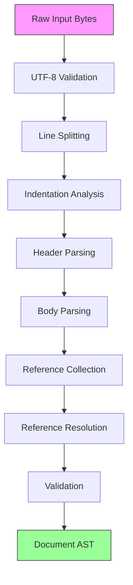

# Parser Architecture

Deep dive into HEDL's parsing architecture and design decisions.

## Overview

HEDL uses a **multi-stage parsing pipeline** with:
- Lexical analysis (tokenization)
- Indentation preprocessing
- Recursive descent parsing
- Two-pass reference resolution
- Validation and limit enforcement

## Parsing Pipeline



## Stage 1: Preprocessing

File: `crates/hedl-core/src/preprocess.rs`

### Purpose

Convert raw bytes into structured lines with indentation information.

### Implementation

The preprocessing functionality is in `crates/hedl-core/src/preprocess.rs`:

```rust
use crate::{HedlError, HedlResult, Limits};

// The preprocess module provides utility functions:
// - preprocess(input: &[u8], limits: &Limits) -> HedlResult<PreprocessedInput>
// - is_blank_line(line: &str) -> bool
// - is_comment_line(line: &str) -> bool

// Preprocessing handles:
// - UTF-8 validation
// - BOM skipping
// - CRLF normalization
// - Bare CR rejection
// - Control character validation
// - Size and line length limits
// - Line boundary identification (zero-copy)

// Example conceptual flow:
pub fn preprocess(input: &[u8], limits: &Limits) -> HedlResult<PreprocessedInput> {
    // 1. Check file size limit
    if input.len() > limits.max_file_size {
        return Err(HedlError::security("file too large", 0));
    }

    // 2. Validate and decode UTF-8
    let text = std::str::from_utf8(input)
        .map_err(|e| HedlError::syntax(format!("invalid UTF-8 encoding: {}", e), 1))?;

    // ... handle line endings, control characters, and offsets ...

    Ok(preprocessed_input)
}
```

### Design Rationale

**Why preprocess indentation?**
- Separates lexical analysis from parsing
- Simplifies recursive descent parser
- Enables better error messages (line numbers)
- Allows indentation validation upfront

**Why forbid tabs?**
- Tabs are ambiguous (width varies)
- Consistency in source files
- Clear visual indentation

## Stage 2: Header Parsing

File: `crates/hedl-core/src/header.rs`

### Purpose

Parse directives before the `---` separator.

### Grammar

```
header     ::= directive*
directive  ::= VERSION | STRUCT | ALIAS | NEST
VERSION    ::= '%VERSION:' major '.' minor
STRUCT     ::= '%STRUCT:' TypeName ':' '[' column_list ']'
ALIAS      ::= '%ALIAS:' %alias_name ':' "quoted_value"
NEST       ::= '%NEST:' ParentType '>' ChildType
```

### Implementation

The actual implementation is in `crates/hedl-core/src/header.rs`:

```rust
use crate::{Document, HedlError, HedlResult};

// Header parsing is handled by parse_header() which is called by the main parser.
// The header module contains logic for:
// - parse_header() - main entry point for header parsing
// - Directive parsing integrated with the parser

// Directive utilities are in the lex module:
// - lex::directives module for directive token handling
// - Token validation functions in lex::tokens
```

### Design Rationale

**Why separate header from body?**
- Clear separation of metadata and data
- Allows schema definition before use
- Simplifies parsing (know types upfront)
- Enables fast schema extraction without parsing body

## Stage 3: Recursive Descent Parsing

File: `crates/hedl-core/src/parser.rs`

### Algorithm

The parser implementation in `crates/hedl-core/src/parser.rs`:

```rust
// Main entry points in crates/hedl-core/src/parser.rs:
pub fn parse(input: &[u8]) -> HedlResult<Document>
pub fn parse_with_limits(input: &[u8], options: ParseOptions) -> HedlResult<Document>

// Parsing flow:
// 1. Preprocess input (UTF-8 validation, line splitting)
// 2. Parse header directives into Document metadata
// 3. Parse body into nested Item structures
// 4. Register all node IDs for reference resolution
// 5. Resolve and validate references

// Key functions from lex module (crates/hedl-core/src/lex/):
// - calculate_indent() - indentation analysis
// - parse_csv_row() - CSV/matrix row parsing (from csv or row module)
// - is_valid_key_token() - key validation
// - is_valid_type_name() - type name validation
// - strip_comment() - comment handling
```

### Recursive Descent Explained

**What is recursive descent?**

A top-down parsing technique where:
1. Each grammar rule becomes a parsing function
2. Functions call each other recursively
3. Backtracking is possible but not required

**Example**:

Input:
```hedl
%VERSION: 1.0
---
user:
  name: Alice
  profile:
    bio: Developer
```

Parse tree:
```
parse_node("user")
  ├─ parse_attribute("name", "Alice")
  └─ parse_child_node("profile")
      └─ parse_attribute("bio", "Developer")
```

### Design Rationale

**Why recursive descent?**
- Natural fit for nested structures
- Easy to understand and maintain
- Good error recovery
- Flexible for extensions

**Limitations**:
- Stack depth limited (max nesting = 100)
- Not suitable for left-recursive grammars (HEDL isn't)
- Slower than table-driven parsers (acceptable trade-off)

## Stage 4: Reference Resolution

File: `crates/hedl-core/src/reference.rs` (module exists)

### Two-Pass Algorithm

The reference resolution system uses a type registry to track IDs and validate references:

**Pass 1: Register IDs**
- Collect all node IDs from matrix lists
- Build forward index (type → id → line number)
- Build inverted index (id → list of types)
- Detect duplicate IDs within same type

**Pass 2: Resolve References**
- Validate all @Type:id qualified references
- Validate all @id unqualified references
- Check against type registry
- Report unresolved references (if strict mode)

The actual implementation uses helper functions:
- `register_node()` - register node IDs during parsing
- `resolve_references()` - validate all references post-parse

### Design Rationale

**Why two-pass?**
- Forward references allowed (`@User:bob` before `bob: {}`)
- Simpler parsing (don't need to backtrack)
- Clear error messages for missing references
- Enables validation phase

**Alternative considered**: Single-pass with forward reference placeholders
- Rejected: Complex, error-prone, harder to maintain

## Performance Characteristics

### Time Complexity

| Stage | Complexity | Notes |
|-------|-----------|-------|
| UTF-8 validation | O(n) | Where n = byte count |
| Preprocessing | O(n) | Linear scan of lines |
| Header parsing | O(h) | h = header lines (small) |
| Body parsing | O(n × d) | d = average depth (bounded) |
| Reference resolution | O(n + r) | r = reference count |
| **Overall** | **O(n)** | Linear in document size |

### Space Complexity

| Structure | Size | Notes |
|-----------|------|-------|
| Input buffer | O(n) | Original bytes |
| Line array | O(n) | Preprocessed lines |
| AST | O(n) | Parsed document |
| ID map | O(k) | k = unique IDs (k ≪ n) |
| **Peak memory** | **O(n)** | Linear in document size |

## Error Recovery

HEDL uses **fail-fast** error handling rather than error recovery:

```rust
use crate::{HedlError, HedlResult};

/// Parse with default options (strict mode)
pub fn parse(input: &[u8]) -> HedlResult<Document> {
    parse_with_limits(input, ParseOptions::default())
}

/// Parse with lenient reference validation
pub fn parse_lenient(input: &[u8]) -> HedlResult<Document> {
    let options = ParseOptions::builder()
        .strict(false)
        .build();
    parse_with_limits(input, options)
}
```

## Resource Limits

Enforced at parse time:

```rust
pub struct Limits {
    pub max_file_size: usize,         // 1 GB default
    pub max_line_length: usize,       // 1 MB default
    pub max_indent_depth: usize,      // 50 default
    pub max_nodes: usize,             // 10 million default
    pub max_aliases: usize,           // 10,000 default
    pub max_columns: usize,           // 100 default
    pub max_nest_depth: usize,        // 100 default
    pub max_block_string_size: usize, // 10 MB default
    pub max_object_keys: usize,       // 10,000 per object
    pub max_total_keys: usize,        // 10 million total
}

// Depth checking example (from parse_body function in parser.rs):
if indent_info.level > limits.max_indent_depth {
    return Err(HedlError::security(
        format!(
            "indent depth {} exceeds limit {}",
            indent_info.level, limits.max_indent_depth
        ),
        line_num,
    ));
}
```

**Why enforce limits?**
- Prevent DoS attacks (malicious deeply nested documents)
- Protect against resource exhaustion
- Fail fast with clear errors

## Comparison with Other Parsers

| Parser Type | HEDL | JSON (serde_json) | YAML (serde_yaml) |
|------------|------|-------------------|-------------------|
| Algorithm | Recursive descent | State machine | Event-based |
| Passes | 2 (parse + resolve) | 1 | 1 |
| Memory | O(n) | O(n) | O(n) |
| Speed | ~100 MB/s | ~500 MB/s | ~50 MB/s |
| Error recovery | Limited | None | Limited |
| Streaming | Optional | Yes (via serde) | Yes |

## Future Optimizations

### Considered Improvements

1. **SIMD String Scanning**: Use SIMD for whitespace skipping
   - Speedup: ~2x for large documents
   - Complexity: High (platform-specific)

2. **Arena Allocation**: Single allocation for AST
   - Speedup: ~20% (fewer allocations)
   - Trade-off: Lifetimes more complex

3. **Incremental Parsing**: Re-parse only changed nodes
   - Use case: LSP editor integration
   - Complexity: High (change tracking)

## Related

- [Zero-Copy Optimizations](zero-copy-optimizations.md)
- API documentation: `cargo doc --package hedl-core --open`
- Source code: `crates/hedl-core/src/`

---

**Key Takeaway**: HEDL's parser prioritizes clarity and error messages over raw speed, making it ideal for human-authored data files.
