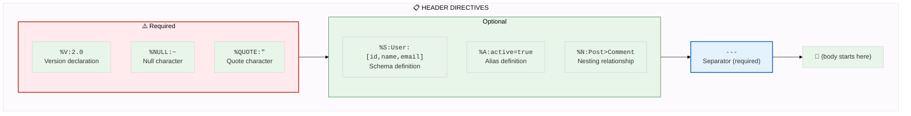

# Parser Architecture: From Text to Understanding

Imagine you're reading a book. Your eyes scan characters. Your brain groups them into words. Words become sentences. Sentences become meaning. That journey from ink to understanding mirrors what a parser does with code.

HEDL's parser takes raw bytes and transforms them into a structured document. But it doesn't happen in one magical step. It's a carefully orchestrated pipeline where each stage builds on the previous one, each with its own responsibility, each with its own design decisions.


```mermaid
%%{init: {'theme': 'base', 'themeVariables': { 'primaryColor': '#e8f5e9'}}}%%
flowchart TB
    subgraph journey["🚀 THE PARSING JOURNEY"]
        INPUT["📥 Raw Bytes"]
        UTF8["✅ UTF-8 Validation"]
        LINES["📏 Line Splitting"]
        INDENT["📐 Indentation Analysis"]
        HEADER["📋 Header Parsing"]
        BODY["🌲 Body Parsing"]
        COLLECT["🔍 Reference Collection"]
        RESOLVE["🔗 Reference Resolution"]
        VALIDATE["✔️ Validation"]
        OUTPUT["📄 Document AST"]

        INPUT --> UTF8 --> LINES --> INDENT --> HEADER --> BODY --> COLLECT --> RESOLVE --> VALIDATE --> OUTPUT
    end

    style INPUT fill:#e3f2fd,stroke:#1565c0,stroke-width:2px
    style UTF8 fill:#fff3e0,stroke:#ef6c00
    style LINES fill:#fff3e0,stroke:#ef6c00
    style INDENT fill:#fff3e0,stroke:#ef6c00
    style HEADER fill:#e8f5e9,stroke:#2e7d32
    style BODY fill:#e8f5e9,stroke:#2e7d32
    style COLLECT fill:#f3e5f5,stroke:#7b1fa2
    style RESOLVE fill:#f3e5f5,stroke:#7b1fa2
    style VALIDATE fill:#ffebee,stroke:#c62828
    style OUTPUT fill:#c8e6c9,stroke:#2e7d32,stroke-width:3px
```

---

## Stage 1: Preprocessing

**Location:** `crates/hedl-core/src/preprocess.rs`

Before we can parse, we need clean input. The preprocessing stage handles the messy reality of bytes from the outside world.

### What Preprocessing Does


```mermaid
%%{init: {'theme': 'base', 'themeVariables': { 'primaryColor': '#e8f5e9'}}}%%
flowchart TB
    subgraph preprocess["⚙️ PREPROCESSING TASKS"]
        S1["1️⃣ SIZE CHECK<br/><i>Is file too large?<br/>Default limit: 1 GB</i>"]
        S2["2️⃣ UTF-8 VALIDATION<br/><i>Are bytes valid UTF-8?</i>"]
        S3["3️⃣ BOM HANDLING<br/><i>Skip byte order mark<br/>if present</i>"]
        S4["4️⃣ LINE ENDING NORMALIZATION<br/><i>CRLF → LF<br/>Reject bare CR</i>"]
        S5["5️⃣ CONTROL CHARACTER CHECK<br/><i>Reject NUL, BEL, and<br/>other dangerous chars</i>"]
        S6["6️⃣ LINE BOUNDARY ID<br/><i>Zero-copy: just record<br/>where lines start/end</i>"]

        S1 --> S2 --> S3 --> S4 --> S5 --> S6
    end

    style S1 fill:#e3f2fd,stroke:#1565c0
    style S2 fill:#e3f2fd,stroke:#1565c0
    style S3 fill:#fff3e0,stroke:#ef6c00
    style S4 fill:#fff3e0,stroke:#ef6c00
    style S5 fill:#ffebee,stroke:#c62828
    style S6 fill:#c8e6c9,stroke:#2e7d32,stroke-width:2px
```

### Why This Design?

**Separation of concerns**: By handling all the "dirty work" upfront, the rest of the parser can assume clean input. No UTF-8 edge cases. No weird line endings. Just text.

**Fail fast**: If the input is malformed, we know immediately. No mysterious failures halfway through parsing.

**Zero-copy where possible**: We don't copy the entire file into a new buffer. We just record where lines start and end, then work with slices into the original input.

### The Tab Question

HEDL forbids tabs for indentation. Why?

Consider this code viewed in different editors:

```
# Editor with tab width 4:
name:
    value: 42

# Same file in editor with tab width 8:
name:
        value: 42
```

Same bytes, different visual appearance. Tabs are ambiguous. They cause confusion. HEDL chooses clarity: one space per indentation level. Always. Everywhere.

---

## Stage 2: Header Parsing

**Location:** `crates/hedl-core/src/header/`

The header contains metadata about the document: version, schemas, aliases, and nesting relationships. It lives above the `---` separator.

### Header Grammar


```mermaid
%%{init: {'theme': 'base', 'themeVariables': { 'primaryColor': '#e8f5e9'}}}%%
graph TB
    subgraph header["📋 HEADER DIRECTIVES"]
        subgraph required["⚠️ Required"]
            V["<code>%V:2.0</code><br/>Version declaration"]
            NULL["<code>%NULL:~</code><br/>Null character"]
            QUOTE["<code>%QUOTE:&quot;</code><br/>Quote character"]
        end

        subgraph optional["Optional"]
            S["<code>%S:User:[id,name,email]</code><br/>Schema definition"]
            A["<code>%A:active=true</code><br/>Alias definition"]
            N["<code>%N:Post&gt;Comment</code><br/>Nesting relationship"]
        end

        SEP["<code>---</code><br/>Separator (required)"]
        BODY["📄 (body starts here)"]
    end

    required --> optional --> SEP --> BODY

    style required fill:#ffebee,stroke:#c62828,stroke-width:2px
    style optional fill:#e8f5e9,stroke:#2e7d32
    style SEP fill:#e3f2fd,stroke:#1565c0,stroke-width:2px
```

### Why Separate Headers?

**Schema-first**: Types are defined before they're used. When the body parser encounters `@User`, it already knows what a User looks like.

**Fast metadata extraction**: Need to know the document's version without parsing the whole body? Just read the header.

**Clear separation**: Metadata (how to interpret data) is separate from data (the actual content). No ambiguity.

### Parsing Example

```hedl
%V:2.0
%NULL:~
%QUOTE:"
%S:User:[id,name,email]
%A:active=true
---
```

After header parsing, the document metadata looks like:

```rust
Document {
    version: (1, 3),
    null_char: '~',
    quote_char: '"',
    structs: {"User" → ["id", "name", "email"]},
    aliases: {"active" → "true"},
    nests: {},
    root: {},  // Body not yet parsed
}
```

---

## Stage 3: Recursive Descent Parsing

**Location:** `crates/hedl-core/src/parser/`

This is where the magic happens. The body of the document becomes a tree of nested objects, lists, and values.

### What Is Recursive Descent?

Imagine you're reading a nested outline:

```
user:
 name: Alice
 profile:
  bio: Developer
  skills:
   - Rust
   - Python
```

Your brain naturally processes this hierarchically:
1. "user" is an object
2. Inside it, "name" is a value, "profile" is another object
3. Inside "profile", "bio" is a value, "skills" is a list
4. And so on, recursively

Recursive descent parsing mirrors this natural process. Each type of structure (object, list, value) has a function that parses it. These functions call each other as needed.

### The Parse Tree

For this input:

```hedl
%V:2.0
%NULL:~
%QUOTE:"
---
user:
 name: Alice
 profile:
  bio: Developer
```

The parser produces:

```
┌─────────────────────────────────────────────────────────────────┐
│                    PARSE TREE                                   │
│                                                                 │
│  parse_document()                                               │
│      │                                                          │
│      └── parse_body()                                           │
│              │                                                  │
│              └── parse_object("user")                           │
│                      │                                          │
│                      ├── parse_key_value("name", "Alice")       │
│                      │                                          │
│                      └── parse_object("profile")                │
│                              │                                  │
│                              └── parse_key_value("bio",         │
│                                                "Developer")     │
│                                                                 │
└─────────────────────────────────────────────────────────────────┘
```

### How Indentation Drives Structure

In HEDL, indentation is syntax. The number of leading spaces determines nesting level.

```
Key insight: Every line's indentation tells you its relationship to surrounding lines.

Same indentation as previous  → sibling
More indentation than previous → child
Less indentation than previous → end of current object, return to parent
```

### Why Recursive Descent?

**Natural fit**: HEDL's nested structure matches recursive descent naturally. Objects contain objects contain objects. The recursion in the algorithm mirrors the recursion in the data.

**Easy to understand**: Each grammar rule becomes a function. Want to know how objects are parsed? Read `parse_object()`.

**Good error messages**: When something goes wrong, you know where you are in the structure. Error messages can say "expected value in object 'profile'" instead of just "syntax error".

**Easy to extend**: Adding new syntax? Add a new parsing function and call it from the right place.

### Limitations and Trade-offs

**Stack depth**: Recursive parsing uses the call stack. Deeply nested documents could overflow. HEDL enforces a maximum nesting depth (default: 100 levels).

**Not the fastest**: Table-driven parsers or state machines can be faster. But recursive descent is fast enough for HEDL's use cases, and the clarity is worth the small performance cost.

---

## Stage 4: Reference Resolution

**Location:** `crates/hedl-core/src/reference.rs`

References like `@User:alice` or `@alice` connect parts of the document. But when we first encounter a reference during parsing, we don't know if the target exists yet.

### The Two-Pass Solution

```
┌─────────────────────────────────────────────────────────────────┐
│                    TWO-PASS REFERENCE RESOLUTION                │
│                                                                 │
│  PASS 1: COLLECT IDs                                            │
│  ─────────────────────                                          │
│                                                                 │
│  users:@User                                                    │
│   |alice,Alice,alice@example.com   ──► Register: User:alice    │
│   |bob,Bob,bob@example.com         ──► Register: User:bob      │
│                                                                 │
│  posts:@Post                                                    │
│   |p1,Hello World,@alice           ──► Register: Post:p1       │
│                                                                 │
│  ID Registry after Pass 1:                                      │
│  ┌─────────────────────────────────────────────────────────┐   │
│  │ User:alice → line 4                                     │   │
│  │ User:bob   → line 5                                     │   │
│  │ Post:p1    → line 8                                     │   │
│  └─────────────────────────────────────────────────────────┘   │
│                                                                 │
│  PASS 2: VALIDATE REFERENCES                                    │
│  ────────────────────────────                                   │
│                                                                 │
│  For each reference found:                                      │
│    @alice in Post:p1                                           │
│      └── Is "alice" registered? No.                            │
│      └── Is "User:alice" registered? Yes!                      │
│      └── Reference resolved successfully.                      │
│                                                                 │
└─────────────────────────────────────────────────────────────────┘
```

### Why Two Passes?

**Forward references**: HEDL allows references to things defined later in the document. In a single pass, you'd encounter `@alice` before seeing where `alice` is defined.

**Cleaner error handling**: If a reference doesn't resolve, you can report exactly which references are broken, not just "something went wrong".

**Simpler parsing**: The body parser doesn't need to track state about what's been defined. It just records references and moves on.

### Unqualified vs Qualified References

```hedl
# Qualified: explicitly name the type
author: @User:alice

# Unqualified: context determines the type
# In a matrix, searches current type
posts:@Post
 |p1,Hello,@p2    # @p2 means Post:p2

# In key-value, must be unambiguous
favorite: @alice  # Error if alice exists in multiple types
```

---

## Performance Characteristics

### Time Complexity

```
┌─────────────────────────────────────────────────────────────────┐
│                    TIME COMPLEXITY                              │
│                                                                 │
│  Stage                  │ Complexity │ Notes                    │
│  ───────────────────────┼────────────┼────────────────────────  │
│  UTF-8 validation       │ O(n)       │ n = byte count           │
│  Preprocessing          │ O(n)       │ Linear scan              │
│  Header parsing         │ O(h)       │ h = header lines (small) │
│  Body parsing           │ O(n × d)   │ d = avg depth (bounded)  │
│  Reference resolution   │ O(n + r)   │ r = reference count      │
│  ───────────────────────┼────────────┼────────────────────────  │
│  OVERALL                │ O(n)       │ Linear in document size  │
│                                                                 │
│  Since d and r are bounded by limits, the parser is linear.    │
│                                                                 │
└─────────────────────────────────────────────────────────────────┘
```

### Space Complexity

```
┌─────────────────────────────────────────────────────────────────┐
│                    SPACE COMPLEXITY                             │
│                                                                 │
│  Structure          │ Size  │ Notes                             │
│  ───────────────────┼───────┼─────────────────────────────────  │
│  Input buffer       │ O(n)  │ Original bytes (not copied)       │
│  Line array         │ O(l)  │ l = line count, just offsets     │
│  AST                │ O(n)  │ Proportional to content          │
│  ID registry        │ O(k)  │ k = unique IDs (typically k ≪ n) │
│  ───────────────────┼───────┼─────────────────────────────────  │
│  PEAK MEMORY        │ O(n)  │ Linear in document size          │
│                                                                 │
└─────────────────────────────────────────────────────────────────┘
```

### Real-World Numbers

From benchmarks on typical documents:

```
Document Size    │ Parse Time    │ Throughput
─────────────────┼───────────────┼──────────────
100 keys         │ ~230 μs       │ ~33 MiB/s
500 keys         │ ~1.1 ms       │ ~34 MiB/s
Nested (5p/2c)   │ ~41 μs        │ ~48 MiB/s
```

Run `cargo bench -p hedl-bench` for current measurements on your hardware.

---

## Resource Limits

Untrusted input is dangerous. A malicious document could:
- Be gigabytes in size (memory exhaustion)
- Have thousands of nesting levels (stack overflow)
- Define millions of aliases (CPU exhaustion)

HEDL enforces configurable limits:

```rust
pub struct Limits {
    pub max_file_size: usize,         // Default: 1 GB
    pub max_line_length: usize,       // Default: 1 MB
    pub max_indent_depth: usize,      // Default: 50
    pub max_nodes: usize,             // Default: 10 million
    pub max_aliases: usize,           // Default: 10,000
    pub max_columns: usize,           // Default: 100
    pub max_nest_depth: usize,        // Default: 100
    pub max_block_string_size: usize, // Default: 10 MB
    pub max_object_keys: usize,       // Default: 10,000 per object
    pub max_total_keys: usize,        // Default: 10 million total
}
```

These limits are checked *during* parsing, not after. If a limit is exceeded, parsing stops immediately with a clear error.

---

## Error Handling Philosophy

HEDL uses **fail-fast** error handling. When something is wrong, stop and report it clearly.

```rust
// Strict mode (default): all errors are fatal
let doc = hedl::parse(input)?;

// Lenient mode: unresolved references are warnings, not errors
let options = ParseOptions::builder()
    .reference_mode(ReferenceMode::Lenient)
    .build();
let doc = hedl::parse_with_limits(input, options)?;
```

### Why Fail-Fast?

**Clarity**: When parsing fails, you get one clear error with an exact location. No cascading confusion from trying to continue after something went wrong.

**Safety**: A partially-parsed document is a dangerous document. Better to reject it entirely than to work with corrupt data.

**Debugging**: The first error is usually the root cause. Later errors often cascade from the first problem.

---

## Comparison with Other Parsers

```
┌─────────────────────────────────────────────────────────────────┐
│                    PARSER COMPARISON                            │
│                                                                 │
│                    │ HEDL        │ JSON         │ YAML          │
│  ──────────────────┼─────────────┼──────────────┼───────────────│
│  Algorithm         │ Recursive   │ State        │ Event-based   │
│                    │ descent     │ machine      │               │
│  ──────────────────┼─────────────┼──────────────┼───────────────│
│  Passes            │ 2 (parse +  │ 1            │ 1             │
│                    │ resolve)    │              │               │
│  ──────────────────┼─────────────┼──────────────┼───────────────│
│  Memory            │ O(n)        │ O(n)         │ O(n)          │
│  ──────────────────┼─────────────┼──────────────┼───────────────│
│  Speed             │ ~33-49 MiB/s│ faster       │ slower        │
│                    │             │ (simpler)    │ (complex)     │
│  ──────────────────┼─────────────┼──────────────┼───────────────│
│  Error messages    │ Excellent   │ Basic        │ Good          │
│  ──────────────────┼─────────────┼──────────────┼───────────────│
│  Streaming         │ Optional    │ Yes          │ Yes           │
│                    │ (hedl-stream│              │               │
│                                                                 │
└─────────────────────────────────────────────────────────────────┘
```

HEDL isn't the fastest parser. But it's fast enough, and the trade-offs favor clarity and error handling over raw speed.

---

## Future Optimizations

The architecture leaves room for improvement:

### SIMD String Scanning

Use SIMD instructions to find whitespace, newlines, and special characters. Could provide 2x speedup for large documents. Requires platform-specific code.

### Arena Allocation

Allocate the entire AST from a single arena. Reduces allocation overhead by ~20%. Makes lifetime management more complex.

### Incremental Parsing

Re-parse only what changed. Essential for LSP editor integration where users edit continuously. Requires significant infrastructure for change tracking.

---

## The Parser's Promise

When you call `hedl::parse()`, you're making a request: "Take these bytes and make them meaningful." The parser's job is to either fulfill that request completely or refuse clearly.

No half-parsed documents. No mysterious failures. No silent corruption.

That's the parser architecture's promise: from raw bytes to structured truth, or a clear explanation of why that's not possible.

---

## Dive Deeper

Ready to explore the code?

1. **Preprocessing**: `crates/hedl-core/src/preprocess.rs`
2. **Header parsing**: `crates/hedl-core/src/header/`
3. **Body parsing**: `crates/hedl-core/src/parser/`
4. **Reference resolution**: `crates/hedl-core/src/reference.rs`
5. **Data structures**: `crates/hedl-core/src/document.rs`

Run `cargo doc --package hedl-core --open` for API documentation.
