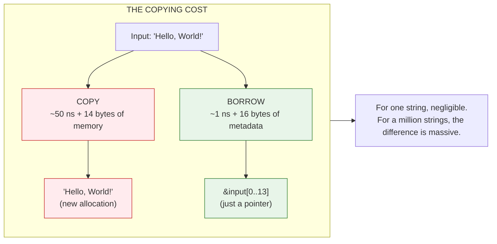
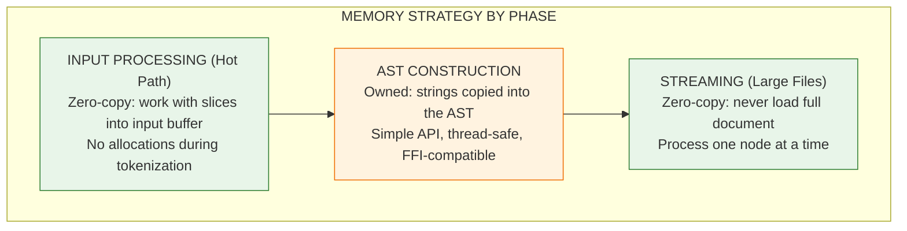
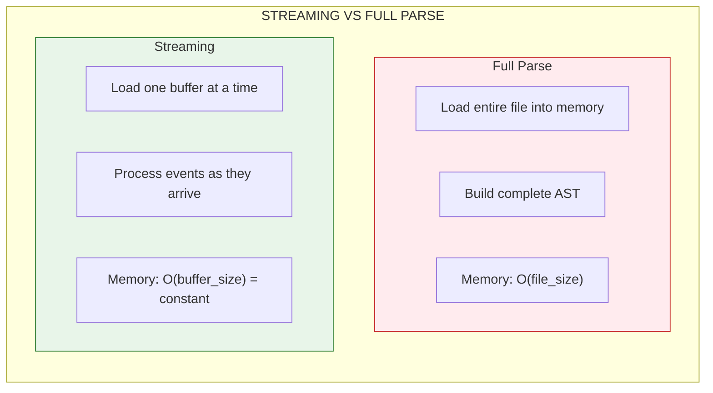

# Memory Optimization: The Art of Not Copying

Every time you copy data, you pay a price. CPU cycles to move bytes. Memory to hold the duplicate. Cache pollution that slows everything else. In a parser that processes millions of strings, these costs add up fast.

Zero-copy is the art of avoiding those copies. Instead of duplicating data, you point to the original. Instead of owning strings, you borrow slices. The result? Faster parsing, less memory, better performance.

But zero-copy isn't free. It trades simplicity for speed. This document explains HEDL's approach: where we use zero-copy, where we don't, and why.



---

## HEDL's Memory Philosophy

HEDL follows a "pay for what you use" model. The right approach depends on what you're doing:



---

## Why Not Full Zero-Copy?

You might wonder: if zero-copy is faster, why not use it everywhere?

The dream looks like this:

```rust
// Zero-copy dream: all strings are slices into the input
struct Document<'a> {
    root: BTreeMap<&'a str, Item<'a>>,
}

struct Item<'a> {
    // All string data points to input buffer
    // No allocations, maximum speed
}
```

The reality is more complex. Here's why HEDL uses owned strings in the AST:

### 1. API Simplicity

Zero-copy requires lifetime parameters everywhere:

```rust
// Zero-copy: lifetime infection
struct Document<'a> {
    root: BTreeMap<Cow<'a, str>, Item<'a>>,
}

struct Item<'a> {
    value: Value<'a>,
}

enum Value<'a> {
    String(&'a str),
    // ... every variant needs 'a
}

// Every function that uses Document needs the lifetime
fn process_document<'a>(doc: &Document<'a>) -> Result<Report<'a>, Error>
```

Compare to owned strings:

```rust
// Owned: clean, simple API
struct Document {
    root: BTreeMap<String, Item>,
}

// No lifetime parameters needed
fn process_document(doc: &Document) -> Result<Report, Error>
```

Lifetime parameters are powerful but add complexity. For most users, the owned API is easier to understand and use correctly.

### 2. Transformation Freedom

With owned strings, you can freely modify the AST:

```rust
// Owned: just add new keys
doc.root.insert("new_key".to_string(), Item::Scalar(Value::Int(42)));

// Owned: easily transform values
if let Some(item) = doc.root.get_mut("name") {
    *item = Item::Scalar(Value::String("New Name".into()));
}
```

With zero-copy, new data must either:
- Allocate anyway (defeating the purpose)
- Live in some other buffer (complex to manage)

### 3. Thread Safety

Owned data moves freely between threads:

```rust
// Owned: just move it
std::thread::spawn(move || {
    process(doc);  // doc moved into thread
});

// Zero-copy: input must outlive the thread
// Much harder to reason about
```

### 4. FFI Compatibility

C bindings and WebAssembly require owned data:

```c
// C code receives owned strings
char* value = hedl_get_string(doc, "name");
// Can use value after input buffer is freed
```

Zero-copy would require copying at the FFI boundary anyway, losing the benefit.

### 5. Real-World Performance

For typical HEDL documents:

**PERFORMANCE REALITY**

| Metric | Value |
|--------|-------|
| Document Size | 1-10 MB (typical) |
| String Count | 1,000-100,000 |
| String Avg Size | 20-50 bytes |

| Phase | Time % | Strategy |
|-------|--------|----------|
| Parsing | ~80% | Zero-copy during this phase |
| AST Construction | ~15% | Allocations happen here |
| String Allocation | ~5% | Modern allocators are FAST |

**Conclusion**: Full zero-copy would save ~5% overall. Not worth the API complexity for most users.

---

## Where HEDL Uses Zero-Copy

Even though the final AST is owned, the parsing phase uses zero-copy extensively.

### Line Processing

Lines are never copied during iteration:

```rust
// Zero-copy line iteration
for line in input.lines() {
    // `line` is a &str slice into `input`
    // No allocation per line
    process_line(line);
}
```

### Tokenization

Tokens reference the input directly:

```rust
// Token is just offsets into input
struct Token {
    start: usize,
    end: usize,
    kind: TokenKind,
}

// Get the text without copying
let text: &str = &input[token.start..token.end];
```

### Numeric Parsing

Numbers parse directly from slices:

```rust
// Direct parsing, no intermediate String
let value: i64 = input[start..end].parse()?;
let value: f64 = input[start..end].parse()?;

// NOT this (would allocate):
// let s = String::from(&input[start..end]);
// let value: i64 = s.parse()?;
```

### Comment Stripping

Comments are identified but not removed by allocation:

```rust
// Find comment position without allocating
fn find_comment_start(line: &str) -> Option<usize> {
    // Returns position, doesn't create new string
}

// Slice without the comment
let content = &line[..comment_pos];  // Still zero-copy
```

---

## Memory Optimization Techniques

Beyond zero-copy, HEDL uses several techniques to minimize memory usage.

### Box<str> Instead of String

The `Value` enum uses `Box<str>` for strings:

```rust
pub enum Value {
    String(Box<str>),   // 16 bytes: pointer + length
    // vs
    // String(String),  // 24 bytes: pointer + length + capacity
}
```

Why does this matter? The `Value` enum's size is determined by its largest variant. Saving 8 bytes per variant saves 8 bytes for *every* value, even integers and booleans.

### Pre-allocation for Collections

When the size is known, allocate once:

```rust
// CSV row parsing pre-allocates based on comma count
let comma_count = line.bytes().filter(|&b| b == b',').count();
let mut fields = Vec::with_capacity(comma_count + 1);

// One allocation, not repeated resizing
```

### Inverted Indices for References

Reference resolution uses O(1) lookups:

```rust
// Instead of scanning all nodes for @User:alice
// Build an index: id -> [types that have this id]

let types = id_index.get("alice");  // O(1)
// vs
// for node in all_nodes { if node.id == "alice" ... }  // O(n)
```

### SmallVec for Node Fields

Small collections avoid heap allocation:

```rust
// Fields usually have 1-8 items
type Fields = SmallVec<[Field; 8]>;

// Up to 8 fields stored inline (stack)
// More than 8 spills to heap
// Most nodes never heap-allocate for fields
```

---

## The Streaming Alternative

For truly large files where memory matters most, use the streaming API:

```rust
use hedl_stream::StreamingParser;

// Process nodes one at a time
// Never loads entire document into memory
let mut parser = StreamingParser::new(reader)?;

while let Some(event) = parser.next_event()? {
    match event {
        Event::StartNode(name) => { /* ... */ }
        Event::Value(key, value) => { /* ... */ }
        Event::EndNode => { /* ... */ }
        // ...
    }
}
```

Streaming is inherently zero-copy. Each event provides slices into the current buffer. Process them before advancing, and you never need more memory than one buffer's worth.



**For a 1GB file:**
- Full parse: ~2-3 GB memory
- Streaming: ~64 KB memory

---

## Measuring Memory Impact

How do you know if memory optimization matters for your use case?

### Profiling with Heaptrack

```bash
# Build with debug symbols
cargo build --release --example my_parser

# Profile memory allocation
heaptrack ./target/release/examples/my_parser test_data.hedl

# Analyze results
heaptrack_gui heaptrack.my_parser.*.gz
```

### Profiling with Valgrind

```bash
# Run with massif
valgrind --tool=massif ./target/release/examples/my_parser test_data.hedl

# Visualize
ms_print massif.out.*
```

### Key Metrics to Watch

| Metric | Description | Target |
|--------|-------------|--------|
| **Peak Memory Usage** | Maximum memory used at any point | Lower is better for memory-constrained environments |
| **Allocation Count** | Total number of allocations during parsing | Fewer allocations = faster parsing |
| **Memory Fragmentation** | Difference between allocated and used memory | High fragmentation wastes memory |
| **Memory/Input Ratio** | Peak memory / input file size | ~2x for full parse, ~0.001x for streaming |

---

## The Trade-off Summary

**MEMORY STRATEGY TRADE-OFFS**

| Aspect | ZERO-COPY | OWNED |
|--------|-----------|-------|
| Speed | Faster | Slightly slower |
| Memory | Less | More |
| API Complexity | Complex | Simple |
| Thread Safety | Requires care | Easy |
| FFI Support | Complex | Native |
| Transformation | Limited | Flexible |

**HEDL's Choice**: Zero-copy during parsing, owned AST. Best of both: fast parsing, simple API.

---

## When to Care About Memory

Not every application needs memory optimization. Here's a guide:

**Memory optimization matters when:**
- Processing files larger than available RAM
- Running in memory-constrained environments (embedded, serverless)
- Processing many documents concurrently
- Building long-running services where memory accumulates

**Memory optimization doesn't matter when:**
- Processing small config files (< 1 MB)
- Running one-off scripts
- Memory is plentiful and cost isn't a concern
- Development speed matters more than runtime performance

---

## Related Documentation

- [AST Design](ast-design.md): How the owned AST is structured
- [Parser Architecture](parser-architecture.md): Where zero-copy is used during parsing
- [Benchmarking](../benchmarking.md): Measuring the impact of optimizations
