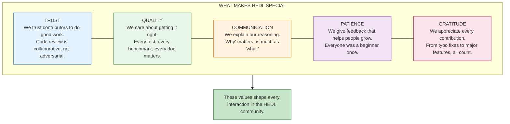

# Contributing to HEDL

Every line of code in HEDL was written by someone who decided to help.

Someone saw a bug and fixed it. Someone had an idea for a feature and built it. Someone found the documentation confusing and rewrote it. Someone ran the benchmarks and found a bottleneck.

Now you're here, ready to add your contribution to the project.

This guide will show you exactly how to do that. Not just the mechanics of opening a pull request, but the culture of how we work together. By the time you finish reading, you'll know how to find work worth doing, how to do it well, and how to get it merged.

---

## The Heart of Open Source

Before we talk about git commands and code standards, let's talk about what makes open source work.



---

## Finding Work Worth Doing

You want to contribute, but where do you start? Here's how to find meaningful work.

### Good First Issues

Look for issues labeled `good first issue` in the GitHub issue tracker. These are carefully selected problems that:

- Have clear scope and acceptance criteria
- Don't require deep knowledge of the codebase
- Have mentors available to help
- Can typically be completed in a few hours

These issues exist specifically to help new contributors get started. Don't feel like they're "too easy." They're stepping stones to bigger contributions.

### Help Wanted

Issues labeled `help wanted` need attention from the community. They might be:

- Features the core team doesn't have bandwidth for
- Problems that need a fresh perspective
- Enhancements that benefit from diverse input

These are often more substantial than "good first issues," but they're designed for community contribution.

### Finding Your Own

Sometimes the best contribution is one you discover yourself:

**While using HEDL:**
- Did something confuse you? Improve the documentation.
- Did you hit an error with a bad message? Make it clearer.
- Did you wish for a feature? Maybe you can build it.

**While reading code:**
- Did you find a TODO comment? Maybe you can address it.
- Did you notice duplicated code? Maybe you can refactor it.
- Did you spot a potential optimization? Benchmark it.

**While running tests:**
- Did you find an edge case that isn't tested? Add a test.
- Did you notice a test that's flaky? Fix it.
- Did you see missing coverage? Fill the gap.

### Areas of Contribution

HEDL has many areas where you can make an impact:

| Area | What You Can Do |
|------|-----------------|
| **Core Parser** | Optimize lexer, improve error messages, fix edge cases |
| **Format Adapters** | Add new formats, optimize conversions, fix corner cases |
| **Documentation** | Write guides, improve examples, fix typos, add diagrams |
| **Testing** | Add test coverage, write property tests, create fuzz targets |
| **Performance** | Profile bottlenecks, optimize hot paths, add benchmarks |
| **Tooling** | Enhance CLI, improve LSP, add editor integrations |
| **Community** | Answer questions, review PRs, help new contributors |

---

## The Contribution Workflow

Here's the complete journey from idea to merged PR:

```mermaid
flowchart TD
    subgraph Journey["THE CONTRIBUTION JOURNEY"]
        P["1. PREPARE<br/>Fork repo, clone, set up environment<br/>Read relevant code and documentation<br/>Understand the problem or feature"]
        B["2. BRANCH<br/>Create a feature branch from main<br/>Name it clearly: feature/add-xml-attributes"]
        D["3. DEVELOP<br/>Write failing tests first (TDD)<br/>Implement the change<br/>Make tests pass<br/>Refactor if needed"]
        Q["4. QUALITY<br/>cargo fmt<br/>cargo clippy (zero warnings)<br/>cargo test (all pass)<br/>Update documentation"]
        C["5. COMMIT<br/>Write clear commit messages<br/>Logical, atomic commits<br/>Explain the 'why' not just the 'what'"]
        PR["6. PR<br/>Push to your fork<br/>Open pull request<br/>Fill out the template<br/>Link related issues"]
        R["7. REVIEW<br/>Respond to feedback<br/>Make requested changes<br/>Discuss alternatives<br/>Be patient and collaborative"]
        M["8. MERGE!<br/>Maintainer approves and merges<br/>Your code is now part of HEDL<br/>Congratulations!"]

        P --> B --> D --> Q --> C --> PR --> R --> M
    end

    style P fill:#e3f2fd,stroke:#1565c0
    style B fill:#e3f2fd,stroke:#1565c0
    style D fill:#ffebee,stroke:#c62828
    style Q fill:#fff3e0,stroke:#ef6c00
    style C fill:#f3e5f5,stroke:#7b1fa2
    style PR fill:#e3f2fd,stroke:#1565c0
    style R fill:#fff3e0,stroke:#ef6c00
    style M fill:#e8f5e9,stroke:#2e7d32
```



### Step 1: Prepare Your Environment

If you haven't already, set up your development environment. See the [Getting Started Guide](getting-started.md) for details.

Fork the repository on GitHub, then clone your fork:

```bash
git clone https://github.com/YOUR-USERNAME/hedl.git
cd hedl
git remote add upstream https://github.com/dweve-ai/hedl.git
```

Verify your setup:

```bash
cargo build --all-features
cargo test --all-features
```

### Step 2: Create a Branch

Always work in a feature branch, not directly on `main`:

```bash
# Ensure your main is up to date
git checkout main
git pull upstream main

# Create your branch
git checkout -b feature/your-feature-name
```

Branch naming conventions:

| Prefix | Purpose | Example |
|--------|---------|---------|
| `feature/` | New functionality | `feature/add-toml-support` |
| `fix/` | Bug fixes | `fix/null-handling-in-arrays` |
| `docs/` | Documentation changes | `docs/improve-getting-started` |
| `perf/` | Performance improvements | `perf/optimize-lexer-whitespace` |
| `refactor/` | Code restructuring | `refactor/extract-common-parser` |
| `test/` | Test additions | `test/add-property-tests` |

### Step 3: Develop with TDD

We practice Test-Driven Development. This means writing tests before implementation.

**The TDD Cycle:**

```bash
# 1. Write a test that describes desired behavior
#    Run it. It should fail (red).
cargo test -p hedl-core test_new_feature

# 2. Write the minimum code to make the test pass
#    Run it. It should pass (green).
cargo test -p hedl-core test_new_feature

# 3. Refactor while keeping tests green
#    Clean up the code, improve the design.
cargo test -p hedl-core test_new_feature

# 4. Repeat for the next behavior
```

**Example: Adding a lint rule**

First, write the test:

```rust
// tests/lint_duplicate_id_test.rs
use hedl_lint::{lint, LintLevel};

#[test]
fn warns_on_duplicate_ids() {
    let input = r#"
%V:2.0
%NULL:~
%QUOTE:"
%S:User:[id,name]
---
users:@User
 |u1,Alice
 |u1,Bob
"#;

    let warnings = lint(input).unwrap();
    assert!(
        warnings.iter().any(|w| {
            w.level == LintLevel::Warning
                && w.message.contains("duplicate")
        }),
        "Expected warning about duplicate id 'u1'"
    );
}
```

Run it. It fails. Good.

Now implement the rule:

```rust
// src/rules/duplicate_id.rs
pub struct DuplicateIdRule;

impl LintRule for DuplicateIdRule {
    fn check(&self, doc: &Document) -> Vec<LintWarning> {
        let mut seen: HashMap<String, Span> = HashMap::new();
        let mut warnings = Vec::new();

        for (id, span) in self.collect_ids(doc) {
            if let Some(first) = seen.get(&id) {
                warnings.push(LintWarning {
                    level: LintLevel::Warning,
                    message: format!("Duplicate id '{}'", id),
                    span: span.clone(),
                    context: format!("First defined at line {}", first.line),
                    suggestion: Some("Use unique ids for each entity".into()),
                });
            } else {
                seen.insert(id, span);
            }
        }

        warnings
    }
}
```

Run the test again. It passes. Green.

Now refactor if needed, keeping the test green.

### Step 4: Ensure Quality

Before committing, run the full quality suite:

```bash
# Format code
cargo fmt

# Run clippy (zero warnings required)
cargo clippy --workspace --all-features -- -D warnings

# Run all tests
cargo test --all-features

# Build documentation (check for warnings)
cargo doc --workspace --all-features --no-deps
```

All four commands must succeed. CI will run the same checks and reject PRs that fail.

### Step 5: Write Good Commits

Commits should be atomic (one logical change per commit) and have clear messages.

**Commit Message Format:**

```
<type>(<scope>): <subject>

<body>

<footer>
```

**Types:**

| Type | Purpose |
|------|---------|
| `feat` | New feature |
| `fix` | Bug fix |
| `docs` | Documentation only |
| `style` | Formatting, no code change |
| `refactor` | Code change that neither fixes nor adds |
| `perf` | Performance improvement |
| `test` | Adding or fixing tests |
| `chore` | Build, tooling, dependencies |

**Examples:**

```
feat(hedl-json): add custom date format support

Allow users to specify custom date format strings when converting
to JSON. Defaults to ISO 8601 for backward compatibility.

The new DateFormat enum supports:
- Iso8601 (default)
- UnixTimestamp
- Custom(String)

Closes #234
```

```
fix(hedl-core): handle empty inline children

Previously, matrix lists with empty rows caused a panic.
Now correctly parsed as zero-column rows.

Added regression test to prevent future breakage.

Fixes #456
```

```
perf(hedl-core): optimize whitespace scanning with SIMD

Use SIMD instructions for faster whitespace detection on x86_64.
Falls back to scalar loop on other platforms.

Benchmark results on 100KB document:
- Before: 1.2 ms
- After: 0.6 ms (2x speedup)

This optimization affects all parsing operations since whitespace
scanning happens on every line.
```

### Step 6: Open a Pull Request

Push your branch and open a PR:

```bash
git push origin feature/your-feature-name
```

Then go to GitHub and click "Compare & pull request."

**Fill out the PR template:**

```markdown
## Description

Brief description of what this PR does.

## Motivation

Why is this change needed? What problem does it solve?

## Changes

- Detailed list of what changed
- Breaking changes highlighted with **BREAKING:**
- New public APIs listed

## Testing

How was this tested?
- Unit tests added in `crates/hedl-core/tests/`
- Integration tests in `tests/`
- Manual testing with: `hedl validate examples/test.hedl`

## Checklist

- [ ] Code follows project style guidelines
- [ ] All tests pass (`cargo test --all-features`)
- [ ] New code has test coverage
- [ ] Documentation updated
- [ ] No clippy warnings
- [ ] Commit messages follow conventions

## Related Issues

Fixes #123
Related to #456
```

**PR Guidelines:**

- **Keep PRs focused.** One logical change per PR. If you're fixing a bug and notice something unrelated to improve, make that a separate PR.

- **Keep PRs reviewable.** Under 500 lines is ideal. If your change is larger, consider splitting it into a series of PRs.

- **Use draft PRs for work in progress.** If you want early feedback, open a draft PR. This signals that it's not ready for merge.

### Step 7: Respond to Review

Code review is collaborative. Reviewers want to help you ship good code.

**When you receive feedback:**

- Read comments carefully. Make sure you understand what's being asked.
- If something is unclear, ask for clarification. "Could you explain what you mean by X?" is a perfectly good response.
- If you disagree, explain your reasoning. Maybe you have context the reviewer doesn't. Maybe the reviewer has context you don't.
- Make requested changes promptly. Long-running PRs are hard for everyone.
- Mark conversations as resolved when addressed.

**Making changes:**

```bash
# Make the requested changes
# Edit files...

# If fixing small issues, amend the commit
git add .
git commit --amend
git push --force-with-lease

# If making substantial changes, add a new commit
git add .
git commit -m "Address review: improve error messages"
git push
```

Use `--force-with-lease` instead of `--force`. It prevents accidentally overwriting changes if someone else pushed to your branch.

### Step 8: Get Merged!

Once your PR is approved and CI passes, a maintainer will merge it.

Congratulations! Your code is now part of HEDL. Your contribution will help users around the world process their data more efficiently.

---

## Code Standards

Good code is consistent code. Here's how we write Rust in HEDL.

### Naming Conventions

```rust
// Functions and variables: snake_case
fn parse_value(input: &str) -> Value { }
let user_count = users.len();

// Types and traits: PascalCase
struct ParseOptions { }
enum ValueType { }
trait Visitor { }

// Constants: SCREAMING_SNAKE_CASE
const MAX_DEPTH: usize = 100;
const DEFAULT_BUFFER_SIZE: usize = 4096;

// Lifetimes: short lowercase letters
fn parse<'a>(input: &'a str) -> Result<&'a str> { }
```

### Code Organization

```rust
// Imports grouped and ordered:
// 1. Standard library
use std::collections::HashMap;
use std::io::Read;

// 2. External crates
use serde::{Deserialize, Serialize};
use thiserror::Error;

// 3. Crate-internal
use crate::document::Document;
use crate::error::HedlError;

// Module structure: public items first
pub struct Parser { }
pub fn parse(input: &str) -> Result<Document> { }

// Then private helpers
fn parse_header(input: &str) -> Result<Header> { }
fn parse_body(input: &str) -> Result<Body> { }
```

### Error Handling

```rust
// Use Result for all fallible operations
pub fn parse(input: &str) -> Result<Document, HedlError> {
    let header = parse_header(input)?;
    let body = parse_body(input)?;
    Ok(Document { header, body })
}

// Use thiserror for error types
#[derive(Debug, Error)]
pub enum ParseError {
    #[error("Invalid syntax at line {line}: {message}")]
    Syntax { line: usize, message: String },

    #[error("Reference '{reference}' not found")]
    UnresolvedReference { reference: String },

    #[error("IO error: {0}")]
    Io(#[from] std::io::Error),
}

// Add context when propagating errors
let value = parse_value(input)
    .map_err(|e| HedlError::syntax(
        format!("Invalid value in field '{}': {}", field_name, e),
        line_number
    ))?;
```

### Documentation

Every public item must have documentation:

```rust
/// Parses a HEDL document from a string.
///
/// This function performs complete parsing including header directives,
/// body content, reference resolution, and validation.
///
/// # Arguments
///
/// * `input` - The HEDL document as a UTF-8 string
///
/// # Returns
///
/// Returns the parsed `Document` on success.
///
/// # Errors
///
/// Returns `HedlError` if:
/// - Syntax is invalid
/// - References cannot be resolved
/// - Schema constraints are violated
///
/// # Examples
///
/// ```
/// use hedl::parse;
///
/// let input = r#"
/// %V:2.0
/// %NULL:~
/// %QUOTE:"
/// ---
/// name: Alice
/// age: 30
/// "#;
///
/// let doc = parse(input).unwrap();
/// assert_eq!(doc.get("name").unwrap().as_str(), Some("Alice"));
/// ```
pub fn parse(input: &str) -> Result<Document, HedlError> {
    // ...
}
```

### Performance

```rust
// Prefer borrowing over cloning
fn process(input: &str) -> Result<&str> {  // Borrow input, borrow output
    // ...
}

// Pre-allocate when size is known
let mut results = Vec::with_capacity(items.len());

// Use iterators instead of index loops
let names: Vec<_> = users
    .iter()
    .filter(|u| u.active)
    .map(|u| &u.name)
    .collect();

// Avoid allocations in hot paths
fn find_key<'a>(line: &'a str) -> &'a str {  // Return slice, not String
    line.split(':').next().unwrap_or("")
}
```

---

## Testing Requirements

Every change needs tests. Here's what we expect.

### Coverage Expectations

- New features: comprehensive tests covering normal cases, edge cases, and error cases
- Bug fixes: at least one test that would have caught the bug
- Refactoring: existing tests must continue to pass
- Performance changes: benchmarks showing improvement

### Test Types

**Unit tests** live alongside the code:

```rust
#[cfg(test)]
mod tests {
    use super::*;

    #[test]
    fn test_parse_integer() {
        assert_eq!(parse_value("42"), Ok(Value::Int(42)));
    }

    #[test]
    fn test_parse_negative_integer() {
        assert_eq!(parse_value("-17"), Ok(Value::Int(-17)));
    }

    #[test]
    fn test_parse_invalid_returns_error() {
        assert!(parse_value("@#$").is_err());
    }
}
```

**Integration tests** live in `tests/`:

```rust
// tests/json_roundtrip.rs
use hedl::parse;
use hedl_json::{to_json, from_json};

#[test]
fn test_roundtrip_preserves_data() {
    let input = r#"
%V:2.0
%NULL:~
%QUOTE:"
%S:User:[id,name,email]
---
users:@User
 |u1,Alice,alice@example.com
 |u2,Bob,bob@example.com
"#;

    let doc = parse(input).unwrap();
    let json = to_json(&doc).unwrap();
    let doc2 = from_json(&json).unwrap();

    assert_eq!(doc, doc2);
}
```

**Property tests** verify invariants:

```rust
use proptest::prelude::*;

proptest! {
    #[test]
    fn parsing_never_panics(input in ".*") {
        // Parser should return Ok or Err, never panic
        let _ = hedl::parse(&input);
    }

    #[test]
    fn valid_docs_survive_roundtrip(doc in valid_document()) {
        let json = to_json(&doc).unwrap();
        let back = from_json(&json).unwrap();
        prop_assert_eq!(doc, back);
    }
}
```

### Running Tests

```bash
# All tests
cargo test --all-features

# Specific crate
cargo test -p hedl-core

# Specific test by name
cargo test test_parse_integer

# With output visible
cargo test -- --nocapture

# Show backtrace on failure
RUST_BACKTRACE=1 cargo test
```

---

## The Review Process

Code review is how we maintain quality and share knowledge. Here's how it works.

### For Contributors

When you open a PR, one or more maintainers will review it. They'll look for:

- **Correctness:** Does the code do what it claims?
- **Testing:** Are there adequate tests?
- **Style:** Does it follow project conventions?
- **Performance:** Are there obvious inefficiencies?
- **Security:** Are there potential vulnerabilities?
- **Documentation:** Is it clear how to use the new code?

Reviewers will leave comments. Some might be required changes ("please fix this before we merge"), others might be suggestions ("consider this alternative"). The comment type will usually be clear from context.

**Responding to feedback:**

- Be gracious. Reviewers are trying to help.
- Ask questions if something isn't clear.
- Explain your reasoning if you disagree.
- Make changes promptly.
- Thank reviewers for their time.

### For Reviewers

If you're reviewing PRs, remember:

**Be specific.** Don't say "this doesn't look right." Say "this could return incorrect results if the input is empty."

**Be constructive.** Don't just point out problems. Suggest solutions.

**Be kind.** Behind every PR is a person who's trying to help the project.

**Ask questions.** "Why did you choose this approach?" often leads to good discussions.

**Praise good work.** If you see something well-done, say so.

---

## Community Guidelines

HEDL is more than code. It's a community of people who believe in doing good work together.

### We Expect

- **Respect:** Treat everyone with dignity. Disagree with ideas, not people.
- **Inclusion:** Welcome newcomers. Remember that you were new once.
- **Patience:** People have different backgrounds and expertise. Take time to explain.
- **Focus:** Keep discussions on topic. We're here to build great software.
- **Gratitude:** Appreciate contributions of all sizes. Every bit helps.

### We Don't Tolerate

- Harassment of any kind
- Discrimination based on identity
- Personal attacks
- Deliberate disruption
- Violations of others' privacy

If you see unacceptable behavior, report it to opensource@dweve.com.

---

## Getting Help

Stuck? Here's where to find help:

**GitHub Discussions:** Ask questions, share ideas, get feedback. This is the best place for "how do I...?" questions.

**GitHub Issues:** Report bugs, request features. Check existing issues first to avoid duplicates.

**The Code Itself:** Read existing code to understand patterns. The codebase is its own best documentation.

**This Documentation:** The [Developer Guide](README.md), [Internals](internals.md), and [How-To Guides](how-to/) cover most common questions.

---

## Recognition

We appreciate every contribution. Contributors are recognized in:

- **CONTRIBUTORS.md:** All contributors are listed
- **Release Notes:** Significant contributions mentioned
- **Commit History:** Your name, forever in the git log

But the real reward is knowing that your code helps people around the world process their data more efficiently. That's something to be proud of.

---

## Your First Contribution

Ready to start? Here's your checklist:

1. **Set up your environment** ([Getting Started](getting-started.md))
2. **Find an issue** to work on ([Good First Issues](https://github.com/dweve-ai/hedl/labels/good%20first%20issue))
3. **Fork and branch** (`git checkout -b feature/your-feature`)
4. **Write tests first** (TDD)
5. **Implement your change**
6. **Run the quality suite** (`cargo fmt && cargo clippy && cargo test`)
7. **Commit with a clear message**
8. **Open a pull request**
9. **Respond to review**
10. **Get merged!**

Welcome to the HEDL community. We're glad you're here.
