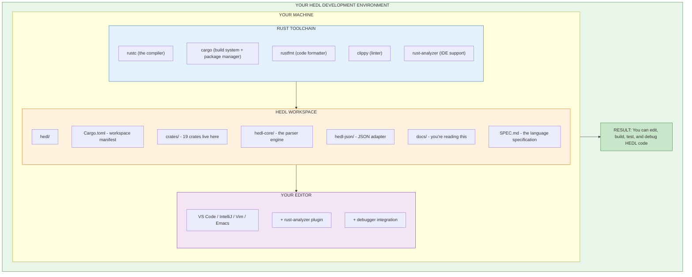

# Getting Started with HEDL Development

You're about to set up a development environment that will let you contribute to one of the most efficient data serialization systems ever built.

Think about that for a moment. The code you'll work on processes millions of documents every day. The optimizations you make will save real compute costs. The bugs you fix will unblock real teams. The features you add will change how people think about their data.

But first, you need to get the code running on your machine.

This guide will take you from zero to a fully functional HEDL development environment. By the end, you'll have compiled the entire workspace, run thousands of tests, and verified that everything works. Then you'll be ready to make your first change.

---

## What You'll Set Up

Here's the complete picture of what your development environment will look like:



---

## Phase 1: Install the Rust Toolchain

Rust is the language HEDL is written in. You need the Rust compiler (`rustc`), the build system (`cargo`), and some essential tools.

### Installing Rust (All Platforms)

The official way to install Rust is through `rustup`, the Rust toolchain installer:

```bash
curl --proto '=https' --tlsv1.2 -sSf https://sh.rustup.rs | sh
```

When the installer runs, it will ask about configuration. The defaults are fine. Press Enter to accept them.

After installation completes, either restart your terminal or run:

```bash
source $HOME/.cargo/env
```

Verify the installation:

```bash
rustc --version
cargo --version
```

You should see version numbers. The exact version doesn't matter much (Rust 1.70 or later works), but seeing output proves the installation succeeded.

### Adding Essential Components

Rust ships with its core tools, but we need a few more:

```bash
# rustfmt: Formats code to match the project style
rustup component add rustfmt

# clippy: Catches common mistakes and suggests improvements
rustup component add clippy
```

Both of these are required. CI will reject code that fails `cargo fmt --check` or produces clippy warnings.

### Platform-Specific Requirements

HEDL's core is pure Rust, but some optional features need system libraries.

**Linux (Ubuntu/Debian)**:

```bash
sudo apt-get update
sudo apt-get install build-essential pkg-config libssl-dev
```

**Linux (Fedora/RHEL)**:

```bash
sudo dnf install gcc pkg-config openssl-devel
```

**macOS**:

Install the Xcode Command Line Tools:

```bash
xcode-select --install
```

A dialog will appear. Click Install and wait for it to complete.

**Windows**:

You have two options:

Option A: Install Visual Studio Build Tools
1. Download from [Visual Studio Downloads](https://visualstudio.microsoft.com/downloads/)
2. Run the installer
3. Select "Desktop development with C++"
4. Complete the installation

Option B: Use Windows Subsystem for Linux (WSL)
1. Open PowerShell as Administrator
2. Run: `wsl --install`
3. Restart your computer
4. Open Ubuntu from the Start menu
5. Follow the Linux instructions above

WSL is often easier for Rust development. The instructions in this guide assume a Unix-like environment.

---

## Phase 2: Get the Code

Now you'll clone the HEDL repository and set up your local workspace.

### Fork and Clone

First, fork the repository on GitHub. Go to `https://github.com/dweve-ai/hedl` and click the "Fork" button. This creates your own copy where you can push changes.

Then clone your fork:

```bash
# Replace YOUR-USERNAME with your GitHub username
git clone https://github.com/YOUR-USERNAME/hedl.git
cd hedl
```

Add the upstream repository as a remote. This lets you pull updates from the main project:

```bash
git remote add upstream https://github.com/dweve-ai/hedl.git
```

Verify your remotes are set up correctly:

```bash
git remote -v
```

You should see:

```
origin    https://github.com/YOUR-USERNAME/hedl.git (fetch)
origin    https://github.com/YOUR-USERNAME/hedl.git (push)
upstream  https://github.com/dweve-ai/hedl.git (fetch)
upstream  https://github.com/dweve-ai/hedl.git (push)
```

### Explore the Structure

Take a moment to understand what you've cloned:

```
hedl/
│
├── Cargo.toml              ← Workspace manifest (lists all crates)
├── Cargo.lock              ← Exact dependency versions (committed)
│
├── crates/                 ← All 19 crates live here
│   │
│   ├── hedl/               ← Public API facade
│   │   ├── Cargo.toml      ← Crate manifest
│   │   └── src/
│   │       └── lib.rs      ← Entry point for the hedl crate
│   │
│   ├── hedl-core/          ← The parser engine
│   │   ├── Cargo.toml
│   │   ├── src/
│   │   │   ├── lib.rs      ← Public interface
│   │   │   ├── lex/        ← Lexer (tokenizer)
│   │   │   ├── parser/     ← Recursive descent parser (mod.rs + submodules)
│   │   │   ├── document.rs ← AST types
│   │   │   └── validation/ ← Semantic validation
│   │   └── tests/          ← Test files
│   │
│   ├── hedl-json/          ← JSON adapter
│   ├── hedl-yaml/          ← YAML adapter
│   ├── hedl-xml/           ← XML adapter
│   ├── hedl-csv/           ← CSV adapter
│   ├── hedl-parquet/       ← Parquet adapter
│   ├── hedl-neo4j/         ← Neo4j adapter
│   ├── hedl-toon/          ← TOON adapter
│   │
│   ├── hedl-c14n/          ← Canonical formatting
│   ├── hedl-stream/        ← Streaming parser
│   ├── hedl-lint/          ← Style checker
│   │
│   ├── hedl-cli/           ← Command-line tool
│   ├── hedl-lsp/           ← Language Server Protocol
│   ├── hedl-mcp/           ← Model Context Protocol
│   │
│   ├── hedl-ffi/           ← C bindings
│   ├── hedl-wasm/          ← WebAssembly bindings
│   │
│   ├── hedl-test/          ← Shared test utilities
│   └── hedl-bench/         ← Performance benchmarks
│
├── docs/                   ← Documentation (you're reading this)
│   ├── user/               ← For HEDL users
│   ├── developer/          ← For HEDL contributors (this guide)
│   ├── api/                ← API reference
│   ├── architecture/       ← System design docs
│   └── spec/               ← Language specification details
│
├── examples/               ← Sample HEDL documents
│
├── SPEC.md                 ← The official language specification
├── README.md               ← Project overview
└── CONTRIBUTING.md         ← How to contribute
```

---

## Phase 3: Build Everything

Time to compile. This will take a few minutes the first time as Cargo downloads and builds dependencies.

```bash
cargo build --all-features
```

Watch the output scroll. You'll see each crate compile in dependency order. First the utilities, then core, then the adapters, then the tools.

```
   Compiling proc-macro2 v1.0.70
   Compiling unicode-ident v1.0.12
   ... (many dependencies) ...
   Compiling hedl-core v2.0.0 (/path/to/hedl/crates/hedl-core)
   Compiling hedl-c14n v2.0.0 (/path/to/hedl/crates/hedl-c14n)
   ... (more crates) ...
   Compiling hedl-cli v2.0.0 (/path/to/hedl/crates/hedl-cli)
    Finished dev [unoptimized + debuginfo] target(s) in 2m 18s
```

If you see `Finished`, the build succeeded. If you see errors, check the troubleshooting section at the end of this guide.

### Build Modes

Cargo has two main build modes:

**Debug mode** (default): Fast to compile, slow to run, includes debug symbols.

```bash
cargo build                    # Debug mode
cargo build --all-features     # Debug mode with all optional features
```

**Release mode**: Slow to compile, fast to run, optimized.

```bash
cargo build --release          # Release mode
cargo build --release --all-features
```

For development, debug mode is fine. The compilation is faster, and you get better error messages when debugging. Use release mode for benchmarks and final testing.

---

## Phase 4: Run the Tests

The test suite is your safety net. It tells you immediately if something is broken.

```bash
cargo test --all-features
```

This runs thousands of tests across all crates. You'll see output like:

```
   Compiling hedl-core v2.0.0 (/path/to/hedl/crates/hedl-core)
   Compiling hedl-test v2.0.0 (/path/to/hedl/crates/hedl-test)
   ... (compilation) ...

running 247 tests
test lexer::tests::test_tokenize_simple ... ok
test lexer::tests::test_tokenize_unicode ... ok
test parser::tests::test_parse_header ... ok
... (many more) ...
test result: ok. 247 passed; 0 failed; 0 ignored; 0 measured; 0 filtered out

... (more crates) ...

     Running tests/integration_tests.rs
running 52 tests
test json_roundtrip ... ok
test yaml_roundtrip ... ok
... (more) ...
test result: ok. 52 passed; 0 failed; 0 ignored; 0 measured; 0 filtered out
```

All tests should pass. If any fail, you've found a problem with your setup (or rarely, a recently introduced bug that CI somehow missed).

### Useful Test Commands

Run tests for a specific crate:

```bash
cargo test -p hedl-core
cargo test -p hedl-json
```

Run a specific test by name:

```bash
cargo test test_parse_simple_document
cargo test lexer::tests::
```

See test output (normally hidden on success):

```bash
cargo test -- --nocapture
```

Run tests with verbose output and backtrace:

```bash
RUST_BACKTRACE=1 cargo test -- --nocapture
```

Run only ignored (slow) tests:

```bash
cargo test -- --ignored
```

---

## Phase 5: Verify with a Real Document

Let's make sure the CLI tool works by processing a real HEDL document.

Create a test file:

```bash
cat > /tmp/test.hedl << 'EOF'
%V:2.0
%NULL:~
%QUOTE:"
%S:User:[id,name,email,active]
---
users:@User
 |u1,Alice,alice@example.com,true
 |u2,Bob,bob@example.com,true
 |u3,Charlie,charlie@example.com,false
EOF
```

This document defines a schema for users and creates three user records. Let's process it:

**Validate the document:**

```bash
cargo run --bin hedl -- validate /tmp/test.hedl
```

Expected output:

```
✓ /tmp/test.hedl is valid
```

**Convert to JSON:**

```bash
cargo run --bin hedl -- to-json /tmp/test.hedl --pretty
```

Expected output:

```json
{
  "users": [
    {
      "id": "u1",
      "name": "Alice",
      "email": "alice@example.com",
      "active": true
    },
    {
      "id": "u2",
      "name": "Bob",
      "email": "bob@example.com",
      "active": true
    },
    {
      "id": "u3",
      "name": "Charlie",
      "email": "charlie@example.com",
      "active": false
    }
  ]
}
```

**Run the linter:**

```bash
cargo run --bin hedl -- lint /tmp/test.hedl
```

Expected output:

```
✓ No issues found
```

If all three commands work, your environment is fully functional.

---

## Phase 6: Set Up Your Editor

A good editor setup makes development dramatically more pleasant. Here's how to configure the most popular editors for Rust development.

### VS Code (Recommended)

VS Code with rust-analyzer is the most popular Rust development setup. It's what most HEDL contributors use.

**Install extensions:**

1. Open VS Code
2. Press Cmd+Shift+X (Mac) or Ctrl+Shift+X (Windows/Linux) to open Extensions
3. Search for and install:
   - **rust-analyzer** (by rust-lang): The essential Rust language server
   - **CodeLLDB** (by Vadim Chugunov): Debugging support
   - **crates** (by serayuzgur): Shows crate version info in Cargo.toml
   - **Even Better TOML** (by tamasfe): TOML syntax highlighting

**Configure settings:**

Create or edit `.vscode/settings.json` in the hedl directory:

```json
{
    "rust-analyzer.checkOnSave.command": "clippy",
    "rust-analyzer.cargo.allFeatures": true,
    "rust-analyzer.check.allTargets": true,
    "editor.formatOnSave": true,
    "editor.rulers": [100],
    "files.insertFinalNewline": true,
    "files.trimTrailingWhitespace": true,
    "[rust]": {
        "editor.defaultFormatter": "rust-lang.rust-analyzer"
    }
}
```

This configuration:

- Runs clippy on every save, catching issues immediately
- Enables all features so rust-analyzer understands the full codebase
- Formats code on save using rustfmt
- Shows a ruler at 100 characters (our line length limit)
- Cleans up whitespace automatically

**Set up debugging:**

Create `.vscode/launch.json`:

```json
{
    "version": "0.2.0",
    "configurations": [
        {
            "type": "lldb",
            "request": "launch",
            "name": "Debug unit tests",
            "cargo": {
                "args": [
                    "test",
                    "--no-run",
                    "--lib",
                    "-p",
                    "hedl-core"
                ],
                "filter": {
                    "name": "hedl-core",
                    "kind": "lib"
                }
            },
            "args": [],
            "cwd": "${workspaceFolder}"
        },
        {
            "type": "lldb",
            "request": "launch",
            "name": "Debug CLI",
            "cargo": {
                "args": [
                    "build",
                    "-p",
                    "hedl-cli"
                ],
                "filter": {
                    "name": "hedl",
                    "kind": "bin"
                }
            },
            "args": ["validate", "/tmp/test.hedl"],
            "cwd": "${workspaceFolder}"
        }
    ]
}
```

Now you can:
- Set breakpoints by clicking in the gutter
- Press F5 to start debugging
- Step through code, inspect variables, evaluate expressions

### IntelliJ IDEA / CLion

JetBrains IDEs have excellent Rust support through the Rust plugin.

**Install the Rust plugin:**

1. Open Settings (Cmd+, on Mac, Ctrl+Alt+S on Windows/Linux)
2. Go to Plugins
3. Search for "Rust"
4. Install the official Rust plugin by JetBrains
5. Restart the IDE

**Open the project:**

1. File → Open
2. Select the `hedl` directory
3. Wait for indexing to complete (this takes a minute on first open)

**Configure the toolchain:**

1. Settings → Languages & Frameworks → Rust
2. Ensure "Toolchain location" points to your Rust installation
3. Check "Expand declarative macros"
4. Check "Enable clippy"

### Vim / Neovim

For Vim users, coc.nvim with coc-rust-analyzer provides a great experience.

**Install coc.nvim** (if you haven't already):

```vim
" In your .vimrc or init.vim using vim-plug:
Plug 'neoclide/coc.nvim', {'branch': 'release'}
```

Then run `:PlugInstall`.

**Install coc-rust-analyzer:**

```vim
:CocInstall coc-rust-analyzer
```

**Configure coc-settings.json:**

Open with `:CocConfig` and add:

```json
{
    "rust-analyzer.checkOnSave.command": "clippy",
    "rust-analyzer.cargo.allFeatures": true
}
```

**Useful mappings** (add to your vimrc):

```vim
" Go to definition
nmap gd <Plug>(coc-definition)

" Show documentation
nmap K :call CocActionAsync('doHover')<CR>

" Rename symbol
nmap <leader>rn <Plug>(coc-rename)

" Format file
nmap <leader>f :call CocActionAsync('format')<CR>
```

### Emacs

For Emacs users, lsp-mode with rustic provides IDE features.

**Install packages:**

```elisp
;; Using use-package
(use-package rustic
  :ensure t
  :config
  (setq rustic-format-on-save t))

(use-package lsp-mode
  :ensure t
  :commands lsp
  :hook (rustic-mode . lsp))
```

Configure rust-analyzer in your `lsp-mode` settings.

---

## The Development Workflow

Now that your environment is set up, here's how you'll typically work:

```mermaid
flowchart TD
    subgraph Cycle["THE HEDL DEVELOPMENT CYCLE"]
        START["START"]
        BRANCH["Create a branch<br/><code>git checkout -b feature/my-feature</code>"]
        TEST["Write a failing test<br/>Write test that describes desired behavior<br/><code>cargo test my_new_test</code> -> FAIL"]
        IMPL["Implement the feature<br/>Write code that makes the test pass<br/><code>cargo test my_new_test</code> -> PASS"]
        LINT["Format and lint<br/><code>cargo fmt</code><br/><code>cargo clippy --workspace --all-features</code>"]
        RUNTESTS["Run all tests<br/><code>cargo test --all-features</code><br/>All green? Continue. Red? Fix."]
        COMMIT["Commit<br/><code>git add -A && git commit -m 'feat: ...'</code>"]
        PUSH["Push and create PR<br/><code>git push origin feature/my-feature</code><br/>Then open PR on GitHub"]

        START --> BRANCH --> TEST --> IMPL --> LINT --> RUNTESTS --> COMMIT --> PUSH
    end

    style START fill:#e3f2fd,stroke:#1565c0
    style BRANCH fill:#e3f2fd,stroke:#1565c0
    style TEST fill:#ffebee,stroke:#c62828
    style IMPL fill:#e8f5e9,stroke:#2e7d32
    style LINT fill:#fff3e0,stroke:#ef6c00
    style RUNTESTS fill:#e8f5e9,stroke:#2e7d32
    style COMMIT fill:#f3e5f5,stroke:#7b1fa2
    style PUSH fill:#e3f2fd,stroke:#1565c0
```



### Creating a Branch

Always work in a feature branch, not directly on `main`:

```bash
# Make sure you're up to date
git checkout main
git pull upstream main

# Create your feature branch
git checkout -b feature/my-awesome-feature
```

Branch naming conventions:
- `feature/` for new features
- `fix/` for bug fixes
- `docs/` for documentation changes
- `refactor/` for code refactoring
- `test/` for test additions

### Making Changes

Edit code in the appropriate crate under `crates/`. The modularity means you usually know exactly where to look:

- Parsing issue? `hedl-core`
- JSON conversion? `hedl-json`
- CLI command? `hedl-cli`
- Lint rule? `hedl-lint`

### The Quality Gate

Before committing, always run:

```bash
# Format your code
cargo fmt

# Check for issues
cargo clippy --workspace --all-features -- -D warnings

# Run all tests
cargo test --all-features
```

This is the same check CI runs. If it passes locally, it will pass in CI.

### Committing

Write meaningful commit messages:

```bash
git add -A
git commit -m "feat(hedl-json): add support for custom date formats

Allows users to specify custom date format strings when converting
to JSON. Defaults to ISO 8601 for backward compatibility.

Closes #123"
```

The format follows [Conventional Commits](https://www.conventionalcommits.org/):
- `feat:` for new features
- `fix:` for bug fixes
- `docs:` for documentation
- `refactor:` for refactoring
- `test:` for test changes
- `chore:` for maintenance tasks

---

## Debugging Techniques

When things don't work, you need to investigate. Here are the tools:

### Print Debugging

Sometimes the simplest approach works:

```rust
// Quick debug print (includes variable name and location)
dbg!(&value);

// Pretty-print complex structures
println!("{:#?}", document);

// Only in debug builds (compiled out in release)
#[cfg(debug_assertions)]
println!("Debug: current state is {:?}", state);
```

### Using a Debugger

**VS Code (CodeLLDB):**
1. Set breakpoints by clicking in the gutter
2. Press F5 to start debugging
3. Use the debug toolbar to step, continue, inspect

**Command line (LLDB/GDB):**

```bash
# Build with debug symbols (default in debug mode)
cargo build -p hedl-cli

# Start the debugger
rust-lldb target/debug/hedl
# or
rust-gdb target/debug/hedl

# In LLDB:
(lldb) breakpoint set --name main
(lldb) run validate /tmp/test.hedl
(lldb) bt  # backtrace
(lldb) frame variable  # show local variables
```

### Logging

For more complex debugging, use the `tracing` crate:

```rust
use tracing::{debug, info, warn, error, instrument};

#[instrument]
fn parse_header(input: &str) -> Result<Header, Error> {
    debug!("Starting header parse");

    // ... parsing code ...

    info!(header = ?result, "Header parsed successfully");
    Ok(result)
}
```

Enable logging by setting the `RUST_LOG` environment variable:

```bash
RUST_LOG=debug cargo run --bin hedl -- validate /tmp/test.hedl
RUST_LOG=hedl_core::parser=trace cargo test
```

### Test-Specific Debugging

When a test fails, get more information:

```bash
# Show test output
cargo test test_name -- --nocapture

# Show backtrace on panic
RUST_BACKTRACE=1 cargo test test_name

# Full backtrace
RUST_BACKTRACE=full cargo test test_name
```

---

## Performance Profiling

When optimizing, measure first. Here's how:

### CPU Profiling with Flamegraph

Flamegraphs show where time is spent:

```bash
# Install cargo-flamegraph
cargo install flamegraph

# Generate a flamegraph
cargo flamegraph --bin hedl -- validate /path/to/large-file.hedl

# Open flamegraph.svg in your browser
```

The flamegraph shows call stacks as rectangles. Width indicates time spent. Look for wide rectangles to find hotspots.

### Memory Profiling

Track allocations and memory usage:

```bash
# Using valgrind (Linux)
cargo build --release
valgrind --tool=massif target/release/hedl validate large-file.hedl
ms_print massif.out.*

# Using heaptrack (Linux, more detailed)
heaptrack target/release/hedl validate large-file.hedl
heaptrack_gui heaptrack.hedl.*
```

### Benchmark Comparison

Measure the impact of your changes:

```bash
# Create a baseline on main branch
git checkout main
cargo bench --bench parsing -- --save-baseline main

# Switch to your branch
git checkout your-feature-branch

# Compare against baseline
cargo bench --bench parsing -- --baseline main
```

The output shows whether your changes made things faster or slower, with statistical significance.

---

## Troubleshooting

### Build Fails: "linker `cc` not found"

You're missing a C compiler. Install build tools:

```bash
# Linux (Debian/Ubuntu)
sudo apt-get install build-essential

# Linux (Fedora)
sudo dnf install gcc

# macOS
xcode-select --install
```

### Build Fails: "failed to run custom build command"

Usually a missing system library. Check the error message for which library, then:

```bash
# Linux (Debian/Ubuntu)
sudo apt-get install pkg-config libssl-dev

# Linux (Fedora)
sudo dnf install pkg-config openssl-devel

# macOS (using Homebrew)
brew install openssl pkg-config
```

### rust-analyzer Shows Errors but cargo build Works

Try restarting rust-analyzer:

- VS Code: Cmd+Shift+P → "rust-analyzer: Restart server"
- Neovim: `:CocRestart`

If that doesn't help, delete the `target/` directory and rebuild:

```bash
rm -rf target/
cargo build --all-features
```

### Tests Fail with "Permission Denied"

On Unix systems, ensure the test files are readable:

```bash
chmod -R u+r .
```

### Out of Memory During Build

Limit parallelism:

```bash
cargo build -j 2  # Use only 2 parallel jobs
```

Or increase swap space on your system.

### Slow Build Times

Initial builds take time because Cargo compiles dependencies. Subsequent builds are much faster.

To speed up development:

```bash
# Use cargo check instead of build (faster, just type checks)
cargo check --all-features

# Build only the crate you're working on
cargo build -p hedl-core
```

---

## What's Next

Your environment is ready. You've built the code, run the tests, and verified everything works. Now you can:

**Explore the codebase:**
Start with `crates/hedl-core/src/lib.rs`. Follow the imports. Read the types. Get a feel for how things fit together.

**Understand the architecture:**
Read the [Developer README](README.md) for the big picture, then dive into [Internals](internals.md) for details.

**Make your first contribution:**
Check the [Contributing Guide](contributing.md) for PR workflow, then find an issue labeled "good first issue" and claim it.

**Learn by reading tests:**
Tests are executable documentation. The `tests/` directories in each crate show exactly how the APIs are meant to be used.

---

## Quick Reference

Keep this handy:

| Task | Command |
|------|---------|
| Build everything | `cargo build --all-features` |
| Run all tests | `cargo test --all-features` |
| Format code | `cargo fmt` |
| Run clippy | `cargo clippy --workspace --all-features -- -D warnings` |
| Build docs | `cargo doc --workspace --all-features --no-deps --open` |
| Run specific test | `cargo test -p hedl-core test_name` |
| See test output | `cargo test -- --nocapture` |
| Check without building | `cargo check --all-features` |

---

You're ready. Go build something.
