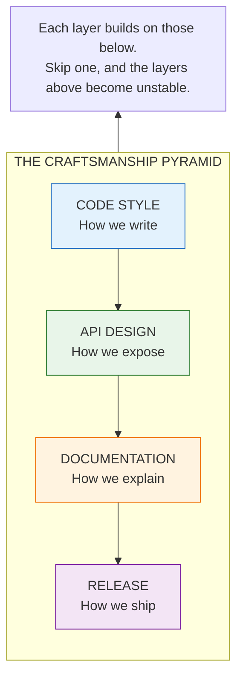

# Development Guides: The Path to Craftsmanship

Good code doesn't happen by accident. It emerges from intentional practices, shared standards, and accumulated wisdom. These guides capture what the HEDL team has learned about writing code that's not just correct, but maintainable, readable, and delightful to work with.

Think of these as your mentor's advice, distilled into documents. The patterns that prevent bugs. The conventions that make code self-documenting. The practices that help new contributors feel at home immediately.

---

## The Guide Collection

### Code Style Guide

**[Code Style](code-style.md)** establishes how we write code. Not just formatting (rustfmt handles that), but the deeper questions:

- How do we name things so they explain themselves?
- How do we organize modules so they're discoverable?
- How do we structure functions so they're testable?
- What idioms do we prefer, and why?

Read this first. Everything else assumes you're following these conventions.

### API Design Guidelines

**[API Design](api-design.md)** explains how we create public interfaces that users love:

- What makes an API intuitive?
- How do we balance flexibility with simplicity?
- When do we break compatibility, and how do we communicate it?
- What error handling patterns respect users' time?

Read this before creating any public API or changing an existing one.

### Documentation Guide

**[Documentation](documentation-guide.md)** shows how we write docs that actually help:

- What belongs in rustdoc vs. in README files?
- How do we write examples that teach, not just demonstrate?
- What makes module-level documentation effective?
- How do we keep docs in sync with code?

Read this before writing any documentation. (And yes, the meta-irony of having a guide about guides is not lost on us.)

### Release Process

**[Release Process](release-process.md)** documents how we ship:

- When do we bump major vs. minor vs. patch versions?
- What belongs in a changelog entry?
- How do we publish to crates.io safely?
- What happens when a release goes wrong?

Read this when preparing any release, no matter how small.

---

## Quick Reference

**GUIDE QUICK REFERENCE**

| Guide | Who Reads It | When |
|-------|--------------|------|
| Code Style | All contributors | Before first PR |
| API Design | Library authors | Before API changes |
| Documentation | All contributors | When writing docs |
| Release Process | Maintainers | Before publishing |

---

## The Philosophy Behind the Guides

These guides aren't arbitrary rules. Each one exists because we've felt the pain of doing things differently.

**Code Style** exists because inconsistent code is hard to review, hard to debug, and hard to onboard into.

**API Design** exists because changing public APIs hurts users. Better to get it right the first time.

**Documentation** exists because code without docs is code that only the author can use (and often, not even them after six months).

**Release Process** exists because broken releases erode trust. Users depend on us to not break their builds.

---

## Contributing to These Guides

Guides should evolve with our understanding. If you've learned something that would help others:

1. **Start with a real problem**: What pain does this address?
2. **Propose a solution**: What practice prevents that pain?
3. **Show, don't tell**: Include concrete examples
4. **Get feedback**: Submit a PR, discuss in review
5. **Keep it living**: Update guides when practices change

Good guides are written by people who've made the mistakes the guides prevent.

---

## Related Documentation

- **[Contributing Guide](../contributing.md)**: How to contribute code
- **[How-To Guides](../how-to/README.md)**: Specific task instructions
- **[Concepts](../concepts/README.md)**: Understanding HEDL's design

The guides tell you *how* to do things well. The concepts tell you *why* things are the way they are. Together, they make you effective.
