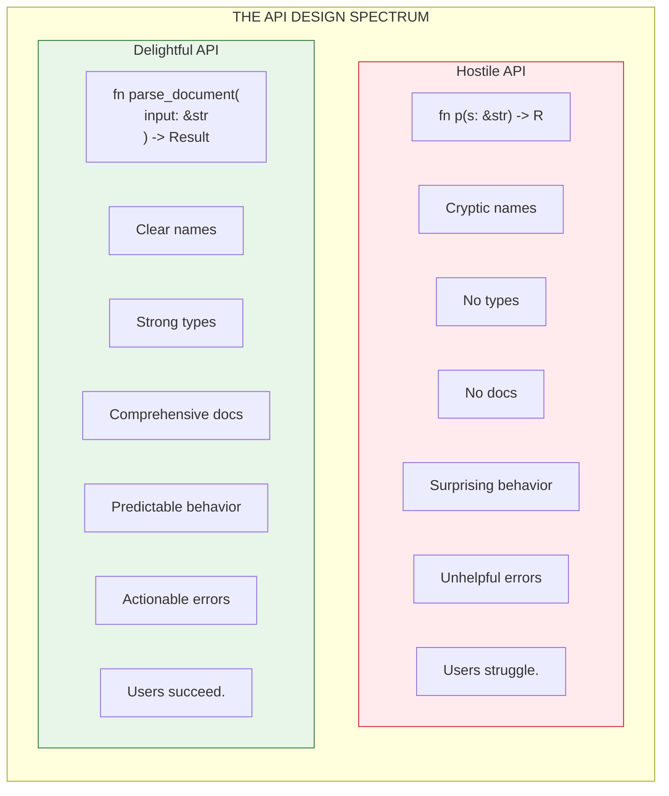

# API Design: Building Interfaces That Users Love

An API is a promise. Every function signature, every type definition, every error message: they're all promises to your users about how your code will behave. Break those promises, and you break trust.

Great APIs feel inevitable. Users guess the function name and get it right. They expect certain behavior and find exactly that. They make mistakes and receive helpful guidance. These APIs don't happen by accident. They're designed.

This guide explains how to design APIs that users love, APIs that feel so natural that users forget they're using an API at all.



---

## The Five Principles

### 1. Minimize Surprises

The principle of least astonishment: when a user guesses how something works, they should be right.

```rust
// Surprising: parse modifies state
let mut parser = Parser::new();
parser.parse(input);  // Where's the result?
let doc = parser.take_result();  // Oh, it's hidden here

// Unsurprising: parse returns the result
let doc = parse(input)?;  // Result is where you expect it
```

```rust
// Surprising: order matters but isn't obvious
config.set_timeout(30);  // Must call this first!
config.enable_validation();  // This resets timeout to 0!

// Unsurprising: builder makes order irrelevant
let config = Config::builder()
    .timeout(30)
    .validation(true)
    .build();  // Order doesn't matter
```

### 2. Consistent Naming

If `parse_json` parses JSON, then `parse_yaml` should parse YAML. If `to_json` converts to JSON, then `from_json` should convert from JSON.

```rust
// Consistent: predictable prefixes
parse(input)              // Parse HEDL
parse_with_limits(input, options)

to_json(&doc)             // Convert to JSON
from_json(json)           // Convert from JSON

to_yaml(&doc)             // Same pattern
from_yaml(yaml)

// Inconsistent: users must memorize each function
parse(input)
deserialize_from_yaml(yaml)
json_convert(&doc)
yaml_in(yaml)
```

### 3. Type Safety

Use Rust's type system to make invalid states unrepresentable. If something can't be null, don't use `Option`. If two operations are mutually exclusive, use an enum.

```rust
// Type-safe: compiler enforces correctness
pub enum ReferenceMode {
    /// All references must resolve
    Strict,
    /// Unresolved references become warnings
    Lenient,
}

pub fn parse_with_mode(input: &[u8], mode: ReferenceMode) -> Result<Document>

// Usage: can't pass invalid mode
parse_with_mode(input, ReferenceMode::Strict)?;

// Not type-safe: runtime errors for invalid values
pub fn parse_with_mode(input: &[u8], mode: &str) -> Result<Document>

// Usage: typo compiles but fails at runtime
parse_with_mode(input, "strick")?;  // Oops
```

### 4. Error Clarity

Errors should tell users what went wrong, where it went wrong, and how to fix it.

```rust
// Clear error
HedlError {
    kind: HedlErrorKind::Reference,
    message: "reference @User:bob not found".to_string(),
    line: 15,
    column: Some(12),
    context: Some("  author: @User:bob".to_string()),
}

// Displayed as:
// Reference error at line 15, column 12: reference @User:bob not found
//   author: @User:bob
//           ^^^^^^^^
// Help: Ensure 'bob' is defined in a @User matrix, or check the spelling.

// Unclear error
HedlError {
    kind: HedlErrorKind::Reference,
    message: "invalid reference".to_string(),
    line: 0,
    column: None,
    context: None,
}

// Displayed as:
// Reference error: invalid reference
// (User has no idea what to do)
```

### 5. Future-Proof Design

Design APIs that can evolve without breaking users. Add fields with defaults. Use builders instead of positional arguments. Hide implementation details behind abstractions.

---

## The Builder Pattern: Configuration Done Right

When a function needs many options, use a builder. Builders are self-documenting, order-independent, and extensible.

```rust
/// Options for parsing HEDL documents.
pub struct ParseOptions {
    limits: Limits,
    reference_mode: ReferenceMode,
}

/// Builder for ParseOptions.
pub struct ParseOptionsBuilder {
    limits: Limits,
    reference_mode: ReferenceMode,
}

impl ParseOptions {
    /// Create a builder with default options.
    pub fn builder() -> ParseOptionsBuilder {
        ParseOptionsBuilder::default()
    }
}

impl ParseOptionsBuilder {
    /// Set the reference resolution mode.
    ///
    /// # Arguments
    ///
    /// * `mode` - How to handle unresolved references:
    ///   - `Strict`: Fail on any unresolved reference (default)
    ///   - `Lenient`: Silently ignore unresolved references
    pub fn reference_mode(mut self, mode: ReferenceMode) -> Self {
        self.reference_mode = mode;
        self
    }

    /// Set the maximum nesting depth.
    ///
    /// Documents nested deeper than this will fail to parse.
    /// Default: 100.
    pub fn max_depth(mut self, depth: usize) -> Self {
        self.limits.max_indent_depth = depth;
        self
    }

    /// Set the maximum file size in bytes.
    ///
    /// Documents larger than this will fail to parse.
    /// Default: 1 GB.
    pub fn max_file_size(mut self, size: usize) -> Self {
        self.limits.max_file_size = size;
        self
    }

    /// Set the maximum number of nodes.
    ///
    /// Documents with more nodes than this will fail to parse.
    /// Default: 10 million.
    pub fn max_nodes(mut self, count: usize) -> Self {
        self.limits.max_nodes = count;
        self
    }

    /// Build the final ParseOptions.
    pub fn build(self) -> ParseOptions {
        ParseOptions {
            limits: self.limits,
            reference_mode: self.reference_mode,
        }
    }
}
```

Usage is clean and readable:

```rust
// Simple case: mostly defaults
let options = ParseOptions::builder()
    .max_depth(50)
    .build();

// Complex case: everything customized
let options = ParseOptions::builder()
    .max_depth(100)
    .max_file_size(10 * 1024 * 1024)  // 10 MB
    .max_nodes(100_000)
    .reference_mode(ReferenceMode::Lenient)
    .build();

// Compare to positional arguments (don't do this):
let options = ParseOptions::new(
    100,    // What's this? max_depth?
    10485760,  // And this? file size?
    100000,    // Nodes? Keys?
    true,      // What boolean?
);
```

---

## Error Handling: Be Honest and Helpful

### The Error Type

```rust
/// Error returned by all HEDL operations.
pub struct HedlError {
    /// The category of error
    pub kind: HedlErrorKind,

    /// Human-readable error message
    pub message: String,

    /// Line number where the error occurred (1-indexed)
    pub line: usize,

    /// Column number (1-indexed, optional)
    pub column: Option<usize>,

    /// Additional context (e.g., the problematic line)
    pub context: Option<String>,
}

/// Categories of errors.
pub enum HedlErrorKind {
    Syntax,       // Malformed HEDL
    Version,      // Unsupported version
    Schema,       // Schema-related error
    Alias,        // Alias-related error
    Shape,        // Row/schema mismatch
    Semantic,     // Logical error
    OrphanRow,    // Child without %NEST
    Collision,    // Duplicate ID
    Reference,    // Unresolved reference
    Security,     // Limit exceeded
    Conversion,   // Format conversion
    IO,           // File system error
}
```

### Creating Helpful Errors

```rust
// Good: specific, located, actionable
HedlError::schema(
    format!(
        "type '{}' not found; add '%S:{}:[...]' to your header or check spelling",
        type_name, type_name
    ),
    line
).with_column(column)
 .with_context(line_content.to_string())

// Bad: vague, unlotated, unhelpful
HedlError::schema("type error", 0)
```

### Result Type Alias

```rust
/// Result type for HEDL operations.
pub type HedlResult<T> = Result<T, HedlError>;

// Usage
pub fn parse(input: &[u8]) -> HedlResult<Document> {
    // ...
}
```

---

## Version Stability: The Promise of Semver

HEDL follows Semantic Versioning. This is a contract with users about what changes they can expect.

**SEMANTIC VERSIONING: MAJOR.MINOR.PATCH**

| Version Type | Example | Changes Allowed |
|--------------|---------|-----------------|
| **MAJOR** | 1.0.0 -> 2.0.0 | Breaking changes: removed public functions, changed function signatures, changed type definitions, changed behavior that breaks existing code |
| **MINOR** | 1.0.0 -> 1.1.0 | New features (backward compatible): new public functions, new types, new optional parameters with defaults, performance improvements |
| **PATCH** | 1.0.0 -> 1.0.1 | Bug fixes only: fixes that don't change documented behavior, security patches, documentation fixes |

### What Counts as Breaking?

**Breaking** (requires major version bump):
- Removing a public function, type, or module
- Changing a function's parameter types
- Changing a function's return type
- Adding required parameters
- Changing behavior users depend on

**Not breaking** (minor version is sufficient):
- Adding new functions
- Adding new types
- Adding optional parameters with defaults
- Deprecating (not removing) existing APIs
- Performance improvements
- Internal refactoring

### Deprecation Process

```rust
// 1. Mark as deprecated with migration path
#[deprecated(since = "1.2.0", note = "Use parse_with_options instead")]
pub fn parse_legacy(input: &str) -> Result<Document> {
    parse_with_options(input.as_bytes(), &ParseOptions::default())
}

// 2. Keep it working for at least one minor version

// 3. Remove in the next major version
```

---

## Design Patterns for HEDL APIs

### The Simple Case Should Be Simple

```rust
// Most users just want to parse
let doc = parse(input)?;

// Power users can customize
let doc = parse_with_limits(input, options)?;

// Don't make everyone pay for complexity:
// BAD: force all users to create options
let options = ParseOptions::new();  // Required even for defaults
let doc = parse(input, options)?;   // Can't just parse!
```

### Make Illegal States Unrepresentable

```rust
// Good: type ensures validity
pub struct PositiveInt(u32);

impl PositiveInt {
    pub fn new(value: u32) -> Option<Self> {
        if value > 0 { Some(Self(value)) } else { None }
    }
}

// Usage: can't have zero depth
pub fn set_max_depth(&mut self, depth: PositiveInt) {
    self.max_depth = depth.0;
}

// Bad: runtime check for invariant
pub fn set_max_depth(&mut self, depth: u32) {
    assert!(depth > 0, "depth must be positive");  // Panic!
    self.max_depth = depth;
}
```

### Return Useful Information

```rust
// Good: caller knows what happened
pub fn parse(input: &[u8]) -> Result<Document, HedlError> {
    // On error: detailed information about what went wrong
    // On success: the parsed document
}

// Good: caller knows how many were processed
pub fn validate_all(docs: &[Document]) -> (Vec<()>, Vec<HedlError>) {
    // Returns both successes and failures
}

// Bad: caller loses information
pub fn validate_all(docs: &[Document]) -> bool {
    // Which ones failed? What were the errors?
}
```

---

## Checklist for New APIs

Before shipping a new public API, verify:

**API REVIEW CHECKLIST**

**NAMING**
- [ ] Function name describes what it does
- [ ] Name is consistent with similar functions
- [ ] Types and parameters have descriptive names

**TYPES**
- [ ] Uses appropriate types (not just String everywhere)
- [ ] Invalid states are unrepresentable
- [ ] Enums used for finite choices

**ERRORS**
- [ ] Returns Result for fallible operations
- [ ] Error type includes location information
- [ ] Error messages suggest fixes

**DOCUMENTATION**
- [ ] Doc comment explains purpose
- [ ] All parameters documented
- [ ] Error conditions documented
- [ ] At least one example included

**EVOLUTION**
- [ ] Can add features without breaking changes
- [ ] Uses builder pattern if > 2 options
- [ ] Defaults are sensible

---

## The Golden Rule

Design APIs as if you'll use them every day (because you will). Make them so pleasant that using them is a joy, not a chore. Your users, your teammates, and your future self will thank you.

---

## Related Documentation

- **[Code Style Guide](code-style.md)**: How to write the implementation
- **[Documentation Guide](documentation-guide.md)**: How to document your APIs
- **[Release Process](release-process.md)**: How to ship API changes
