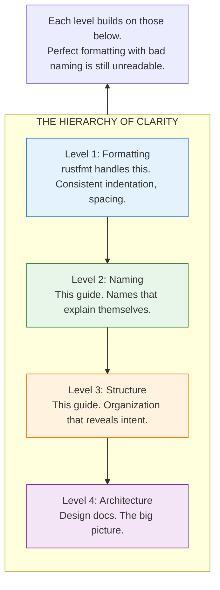

# Code Style: Writing Code That Speaks

Code is read far more often than it's written. That line you dashed off in five minutes? Someone will puzzle over it for an hour, trying to understand what you meant. That someone might be a new contributor. A maintainer debugging at 2am. Or you, six months from now, having forgotten everything.

Good style isn't about aesthetics. It's about communication. Every naming choice, every organization decision, every pattern you follow tells the reader something. Bad style forces readers to decode your intent. Good style makes intent obvious.

This guide captures the HEDL team's accumulated wisdom about writing code that communicates clearly.



---

## Naming: The Art of Self-Documenting Code

Names are the most important documentation. Get them right, and the code explains itself. Get them wrong, and readers drown in confusion.

### Functions and Variables: Tell a Story

Use `snake_case`. But more importantly, choose names that describe what happens:

```rust
// Names that tell stories
fn parse_document(input: &str) -> Result<Document> { }
fn validate_references(doc: &Document) -> Result<()> { }
fn extract_schema_from_header(header: &Header) -> Option<Schema> { }

// Names that keep secrets
fn process(s: &str) -> Result<Document> { }  // Process how?
fn do_thing(d: &Document) -> Result<()> { }  // What thing?
fn get(h: &Header) -> Option<Schema> { }     // Get what?
```

For variables, describe what they hold:

```rust
// Clear purpose
let user_count = users.len();
let remaining_bytes = input.len() - position;
let is_valid = validate(input).is_ok();

// Cryptic abbreviations
let uc = users.len();    // What's uc?
let rb = input.len() - position;  // rb?
let v = validate(input).is_ok();  // v for what?
```

### Types: Nouns That Describe

Use `PascalCase`. Types are nouns. They describe what something *is*:

```rust
// Types that describe
struct DocumentParser { }      // Parses documents
struct ReferenceResolver { }   // Resolves references
struct ValidationError { }     // An error from validation

// Types that confuse
struct Parser { }              // Parser of what?
struct Resolver { }            // Resolves what?
struct Error { }               // What kind?
```

### Constants: ALL CAPS for Global Truths

Use `SCREAMING_SNAKE_CASE` for constants. The caps signal "this is fixed, configured, unchanging":

```rust
const MAX_NESTING_DEPTH: usize = 100;
const DEFAULT_TIMEOUT: Duration = Duration::from_secs(30);
const INITIAL_BUFFER_SIZE: usize = 4096;
```

### Modules: Lower Snake, Descriptive Names

```rust
mod parser;           // Contains parsing logic
mod error_handling;   // Contains error types and helpers
mod reference;        // Contains reference-related code
mod validation;       // Contains validation rules
```

---

## Documentation: Comments That Help

Comments explain *why*, not *what*. The code shows what. Comments show why that choice was made.

### Documenting Public Functions

Every public function needs documentation. Not just *what* it does, but *how to use it*:

```rust
/// Parses a HEDL document from UTF-8 bytes.
///
/// This function performs complete parsing including header directives,
/// body parsing, and reference resolution. For streaming parsing of
/// large documents, see [`StreamingParser`].
///
/// # Arguments
///
/// * `input` - UTF-8 encoded HEDL document bytes
///
/// # Returns
///
/// A fully parsed `Document` with all references resolved.
///
/// # Errors
///
/// Returns `HedlError` if:
/// - Input is not valid UTF-8 (`HedlErrorKind::Syntax`)
/// - Document has syntax errors (`HedlErrorKind::Syntax`)
/// - References don't resolve (`HedlErrorKind::Reference`)
/// - Resource limits exceeded (`HedlErrorKind::Security`)
///
/// # Examples
///
/// Basic parsing:
///
/// ```
/// use hedl_core::parse;
///
/// let input = br#"%V:2.0
/// %NULL:~
/// %QUOTE:"
/// ---
/// name: Alice
/// age: 30
/// "#;
///
/// let doc = parse(input)?;
/// assert_eq!(doc.root.len(), 2);
/// # Ok::<(), hedl_core::HedlError>(())
/// ```
///
/// Handling errors:
///
/// ```
/// use hedl_core::{parse, HedlErrorKind};
///
/// let result = parse(b"invalid: {");
/// assert!(result.is_err());
/// # Ok::<(), hedl_core::HedlError>(())
/// ```
pub fn parse(input: &[u8]) -> Result<Document, HedlError> {
    // Implementation
}
```

### Documenting Modules

Module docs explain the module's purpose and how its pieces fit together:

```rust
//! Parser module for HEDL documents.
//!
//! This module provides the core parsing functionality, converting
//! HEDL text into an Abstract Syntax Tree (AST). It's the foundation
//! that all other crates build upon.
//!
//! # Architecture
//!
//! Parsing happens in multiple stages:
//!
//! 1. **Preprocessing**: Line splitting and indentation analysis
//! 2. **Header parsing**: Processing directives like `%V:2.0` and `%S:User:[...]`
//! 3. **Body parsing**: Recursive descent through document structure
//! 4. **Reference resolution**: Two-pass ID collection and validation
//!
//! # Quick Start
//!
//! For most use cases, just call [`parse`]:
//!
//! ```
//! use hedl_core::parse;
//!
//! let doc = parse(b"%V:2.0\n%NULL:~\n%QUOTE:\"\n---\nkey: value")?;
//! # Ok::<(), hedl_core::HedlError>(())
//! ```
//!
//! For custom options, use [`parse_with_limits`] with [`ParseOptions`].
```

### Inline Comments: Explain the Non-Obvious

```rust
// Good: explains WHY
// We use BTreeMap instead of HashMap for deterministic iteration,
// which is required for canonicalization.
pub root: BTreeMap<String, Item>,

// Good: explains tricky code
// Skip the BOM if present (3 bytes: EF BB BF)
let text = if input.starts_with(&[0xEF, 0xBB, 0xBF]) {
    &input[3..]
} else {
    input
};

// Bad: explains what the code obviously does
// Increment i by 1
i += 1;

// Bad: comments that lie
// Sort the list
list.reverse();  // This doesn't sort!
```

---

## File Organization: Everything in Its Place

A well-organized file is like a well-organized desk. You can find what you need without searching.

```rust
// 1. License header (if applicable)
// Dweve HEDL - Hierarchical Entity Data Language
// Copyright (c) 2025 Dweve Corporation

// 2. Module documentation
//! Parser for HEDL documents.
//!
//! This module provides...

// 3. Imports, grouped and sorted
// Standard library first
use std::collections::BTreeMap;
use std::fmt;

// External crates second
use smallvec::SmallVec;
use thiserror::Error;

// Workspace crates third
use hedl_core::{Document, HedlError};

// Current crate last
use crate::config::ParseOptions;
use crate::error::InternalError;

// 4. Constants
const MAX_NESTING_DEPTH: usize = 100;
const INITIAL_CAPACITY: usize = 64;

// 5. Type definitions (structs, enums, traits)
pub struct Parser { /* ... */ }

pub enum ParseState { /* ... */ }

pub trait Parseable { /* ... */ }

// 6. Implementations
impl Parser {
    pub fn new() -> Self { /* ... */ }
    pub fn parse(&mut self, input: &[u8]) -> Result<Document> { /* ... */ }
}

impl Default for Parser {
    fn default() -> Self { /* ... */ }
}

// 7. Tests at the end
#[cfg(test)]
mod tests {
    use super::*;

    #[test]
    fn test_parse_simple() { /* ... */ }
}
```

---

## Error Handling: Be Honest About Failure

Functions that can fail should return `Result`. Functions that panic are lying about their contract.

### The Right Way

```rust
/// Parses a value from the input string.
///
/// # Errors
///
/// Returns `ParseError` if the input is malformed.
pub fn parse_value(input: &str) -> Result<Value, ParseError> {
    if input.is_empty() {
        return Err(ParseError::EmptyInput);
    }
    // Parse logic...
    Ok(value)
}

// Caller decides how to handle errors
match parse_value(input) {
    Ok(value) => use_value(value),
    Err(e) => {
        log::warn!("Parse failed: {}", e);
        use_default()
    }
}
```

### The Wrong Way

```rust
// Don't do this: panic hides failure modes
pub fn parse_value(input: &str) -> Value {
    assert!(!input.is_empty(), "Input cannot be empty!");
    // Parse logic...
    value
}

// Don't do this: unwrap spreads like a virus
pub fn process(input: &str) -> Value {
    let validated = validate(input).unwrap();  // Panic waiting to happen
    let parsed = parse(validated).unwrap();    // Another panic
    parsed
}
```

### Propagate with `?`

```rust
// Clean error propagation
pub fn process_document(input: &[u8]) -> Result<Output, HedlError> {
    let text = std::str::from_utf8(input)?;
    let doc = parse(text)?;
    let validated = validate(&doc)?;
    let output = convert(&validated)?;
    Ok(output)
}

// Instead of this mess
pub fn process_document(input: &[u8]) -> Result<Output, HedlError> {
    let text = match std::str::from_utf8(input) {
        Ok(t) => t,
        Err(e) => return Err(HedlError::from(e)),
    };
    let doc = match parse(text) {
        Ok(d) => d,
        Err(e) => return Err(e),
    };
    // ... you get the idea
}
```

---

## Testing: Prove Your Code Works

### Test Names Tell Stories

```rust
#[test]
fn parse_succeeds_with_valid_document() { }

#[test]
fn parse_fails_when_input_is_empty() { }

#[test]
fn parse_fails_when_utf8_is_invalid() { }

#[test]
fn references_resolve_when_target_exists() { }

#[test]
fn references_fail_when_target_missing() { }
```

The test name should describe:
1. What operation is being tested
2. Under what conditions
3. What the expected outcome is

### Arrange, Act, Assert

```rust
#[test]
fn parse_extracts_all_root_keys() {
    // Arrange: Set up test data
    let input = br#"%V:2.0
%NULL:~
%QUOTE:"
---
name: Alice
age: 30
active: true
"#;

    // Act: Perform the operation
    let result = parse(input);

    // Assert: Verify expectations
    assert!(result.is_ok());
    let doc = result.unwrap();
    assert_eq!(doc.root.len(), 3);
    assert!(doc.root.contains_key("name"));
    assert!(doc.root.contains_key("age"));
    assert!(doc.root.contains_key("active"));
}
```

### Organize Tests Logically

```rust
#[cfg(test)]
mod tests {
    use super::*;

    mod parsing {
        use super::*;

        mod valid_input {
            use super::*;

            #[test]
            fn simple_document() { }

            #[test]
            fn nested_objects() { }

            #[test]
            fn matrix_lists() { }
        }

        mod invalid_input {
            use super::*;

            #[test]
            fn empty_input() { }

            #[test]
            fn invalid_utf8() { }

            #[test]
            fn syntax_error() { }
        }
    }

    mod validation {
        use super::*;

        #[test]
        fn duplicate_ids_rejected() { }

        #[test]
        fn missing_references_rejected() { }
    }
}
```

---

## Performance: Don't Waste

### Avoid Unnecessary Clones

```rust
// Return a reference when possible
pub fn get_value(&self, key: &str) -> Option<&Value> {
    self.map.get(key)
}

// Instead of cloning
pub fn get_value(&self, key: &str) -> Option<Value> {
    self.map.get(key).cloned()  // Unnecessary allocation
}
```

### Pre-allocate When Possible

```rust
// Know the size? Allocate once.
let mut results = Vec::with_capacity(items.len());
for item in items {
    results.push(process(item));
}

// Don't grow incrementally
let mut results = Vec::new();  // Starts empty
for item in items {
    results.push(process(item));  // May reallocate multiple times
}
```

### Use Iterators, Not Loops

```rust
// Idiomatic: iterator chain
let valid_items: Vec<_> = items
    .iter()
    .filter(|item| item.is_valid())
    .map(|item| item.process())
    .collect();

// Less idiomatic: manual loop with push
let mut valid_items = Vec::new();
for item in items {
    if item.is_valid() {
        valid_items.push(item.process());
    }
}
```

---

## Tools: Let Machines Help

### Clippy: Your Helpful Critic

Run clippy on all code:

```bash
cargo clippy --all -- -D warnings
```

Clippy catches patterns that work but could be better:

```rust
// Clippy says: "use option.unwrap_or(default)"
let value = if let Some(x) = option {
    x
} else {
    default
};

// After:
let value = option.unwrap_or(default);

// Clippy says: "use result.ok()"
let maybe = match result {
    Ok(v) => Some(v),
    Err(_) => None,
};

// After:
let maybe = result.ok();
```

### Rustfmt: Consistent Formatting

Run rustfmt on all code:

```bash
cargo fmt --all
```

Our `rustfmt.toml` settings:

```toml
max_width = 100
tab_spaces = 4
edition = "2021"
```

Don't argue about formatting. Let the tool decide and move on.

---

## The Golden Rule

When in doubt, optimize for the reader. Write code as if the person who will maintain it is a violent psychopath who knows where you live.

Actually, that person is probably you, six months from now, debugging at midnight. Be kind to future you.

---

## Related Documentation

- **[API Design Guidelines](api-design.md)**: How to design public interfaces
- **[Documentation Guide](documentation-guide.md)**: Writing effective documentation
- **[Contributing Guide](../contributing.md)**: How to contribute to HEDL
