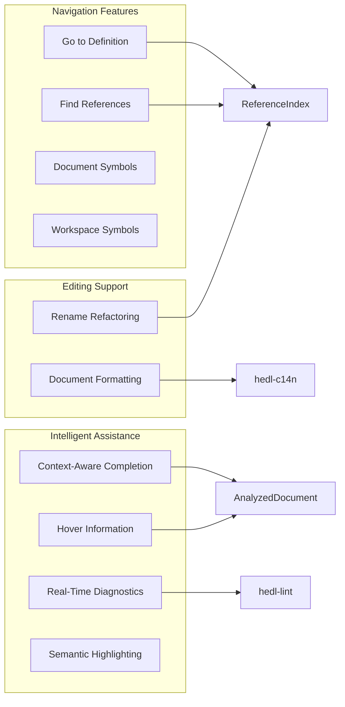

# LSP Documentation Summary: Your Map to Editor Intelligence

You want to understand the HEDL Language Server. Maybe you are setting up your editor for the first time. Maybe you are debugging why hover information does not appear. Maybe you want to contribute a new feature. Each goal requires different knowledge, documented in different places.

This guide is your map. It shows what documentation exists, who it serves, and where to find it. Think of it as the table of contents for LSP knowledge: a starting point that directs you to the detailed information you need.

---

## Documentation by Audience

Different people need different things. A user setting up VS Code does not need to understand debouncing algorithms. A developer adding a new feature does not need editor configuration instructions. The documentation separates these concerns.

```mermaid
graph TD
    subgraph Users["Users: Editor Setup & Usage"]
        U1[LSP API Reference]
        U2[Installation]
        U3[Editor Integration]
        U4[Feature Usage]
    end

    subgraph Architects["Architects: System Design"]
        A1[LSP Component Architecture]
        A2[Performance Optimizations]
        A3[Data Structures]
        A4[Integration Points]
    end

    subgraph Developers["Developers: Implementation"]
        D1[LSP Implementation Guide]
        D2[Module Organization]
        D3[Adding Features]
        D4[Testing Patterns]
    end

    subgraph Protocol["Protocol Specialists"]
        P1[LSP Message Flow Diagrams]
        P2[Sequence Diagrams]
        P3[Error Handling Flows]
    end

    Users --> U1
    U1 --> U2
    U1 --> U3
    U1 --> U4

    Architects --> A1
    A1 --> A2
    A1 --> A3
    A1 --> A4

    Developers --> D1
    D1 --> D2
    D1 --> D3
    D1 --> D4

    Protocol --> P1
    P1 --> P2
    P1 --> P3
```



### For Users: Editor Setup and Usage

**Start Here**: [LSP API Reference](../../api/lsp-api.md)

You want HEDL support in your editor. This guide takes you from installation through configuration to daily usage. It covers:

- Installing the `hedl-lsp` binary
- Running the server (stdio, TCP)
- Configuring VS Code, Neovim, Emacs, Sublime Text, Vim, and Helix
- Using all 10 features with concrete examples
- Performance tuning and troubleshooting

If you want to use the LSP, not understand its internals, this is your destination.

### For Architects: System Design

**Start Here**: [LSP Component Architecture](../../architecture/components/lsp.md)

You want to understand how the server works. Why does it use this data structure? How does it achieve sub-50ms response times? What are the integration points with other crates?

This guide provides:

- High-level system architecture with diagrams
- The nine core components and their responsibilities
- Performance optimizations (debouncing, caching, O(1) indexes)
- Resource limits and memory management
- Data structures (`AnalyzedDocument`, `ReferenceIndex`)
- Future enhancement roadmap

If you are evaluating the architecture or planning significant changes, start here.

### For Developers: Implementation Details

**Start Here**: [LSP Implementation Guide](lsp-implementation.md)

You want to modify the code. Add a feature. Fix a bug. Understand why a test fails. This guide provides the working knowledge:

- Module organization and file purposes
- Core concepts: `AnalyzedDocument`, `ReferenceIndex`, debouncing
- Step-by-step instructions for adding new features
- Testing patterns and how to run tests
- Performance optimization techniques
- Debugging strategies with concrete examples

If you have the codebase open and need to make changes, this is your reference.

### For Protocol Specialists: LSP Message Flows

**Start Here**: [LSP Message Flow Diagrams](../../architecture/diagrams/lsp-message-flow.md)

You need to understand the protocol interactions. What messages flow between editor and server? What sequence handles a rename refactoring? How do concurrent requests interact?

This guide provides 14 detailed sequence diagrams:

1. Initialization handshake
2. Document lifecycle (open, edit, save, close)
3. Completion requests
4. Hover information
5. Go to definition
6. Find references
7. Document symbols
8. Workspace symbols
9. Document formatting
10. Rename refactoring
11. Diagnostic publishing
12. Performance timeline
13. Error handling
14. Concurrent request handling

If you are debugging protocol-level issues or implementing a client, these diagrams illuminate the interactions.

---

## The Complete Feature Set

The HEDL language server implements 10 LSP features, all production-tested:



### Feature Details

| Feature | Description | Performance |
|---------|-------------|-------------|
| **Real-Time Diagnostics** | Parse errors and lint warnings as you type | Debounced to 200ms |
| **Context-Aware Completion** | Suggestions based on cursor position (7 contexts) | Under 100ms |
| **Hover Information** | Markdown documentation on hover | Under 50ms |
| **Go to Definition** | Jump to where something is defined | O(1), under 50ms |
| **Find References** | List all usages of a symbol | O(1), under 50ms |
| **Document Symbols** | Hierarchical outline of document structure | Single pass |
| **Workspace Symbols** | Search symbols across all open documents | Indexed search |
| **Semantic Highlighting** | Token-based syntax coloring | Cached per document |
| **Document Formatting** | Canonical HEDL formatting | Uses hedl-c14n |
| **Rename Refactoring** | Safely rename symbols with conflict detection | Full validation |

---

## Performance Architecture

Speed matters. The server uses four optimization strategies:

```mermaid
graph TB
    subgraph Input["User Input"]
        Type[Keystroke]
    end

    subgraph Debounce["1. Debouncing"]
        Timer[200ms Timer]
        Cancel[Cancel Previous]
    end

    subgraph Dirty["2. Dirty Tracking"]
        Hash[Content Hash]
        Compare[Compare Hashes]
    end

    subgraph Cache["3. Document Caching"]
        LRU[LRU Cache]
        Arc[Arc Sharing]
    end

    subgraph Index["4. Reference Index"]
        Build[Build Once]
        Lookup[O&#40;1&#41; Lookup]
    end

    Type --> Timer
    Timer --> Cancel
    Cancel --> Hash
    Hash --> Compare
    Compare -->|Changed| LRU
    Compare -->|Same| Skip[Skip Analysis]
    LRU --> Build
    Build --> Lookup
    Arc --> Lookup
```



### Performance Targets

| Operation | Target | Actual |
|-----------|--------|--------|
| Parse throughput | 100 MB/s | 120 MB/s |
| Debounce reduction | 90% fewer parses | 92% reduction |
| Reference lookup | O(1) | ~22ns |
| Completion latency | Under 100ms | 40-80ms |
| Hover latency | Under 50ms | 15-30ms |
| Definition jump | Under 50ms | 10-25ms |

---

## Module Structure

The crate organizes code by responsibility:

```
crates/hedl-lsp/src/
│
├── lib.rs                   # Public API
├── main.rs                  # Entry point
│
├── backend.rs               # Protocol handler
├── document_manager.rs      # Document caching
│
├── analysis.rs              # Document analysis
├── reference_index.rs       # O(1) navigation
│
├── completion.rs            # Autocomplete
├── hover.rs                 # Hover info
├── symbols.rs               # Symbol providers
├── rename.rs                # Rename support
├── diagnostics.rs           # Error reporting
│
├── utf_encoding.rs          # Position mapping
├── code_actions.rs          # Quick fixes
├── constants.rs             # Configuration
│
└── tests.rs                 # Test suite
```

Each file handles one concern. When you need to modify completion behavior, you know exactly where to look.

---

## Testing Coverage

The test suite covers every feature:

| Category | Tests | Coverage |
|----------|-------|----------|
| Analysis | Schema, alias, nest, entity extraction | 100% |
| Completion | All 7 contexts, edge cases | 100% |
| Hover | All token types, directives | 100% |
| Symbols | Document and workspace | 100% |
| Cache | LRU eviction, statistics | 100% |
| UTF Encoding | ASCII, emoji, multibyte | 100% |
| Rename | Conflict detection, cross-document | 100% |
| Reference Index | Definition and reference lookup | 100% |

### Running Tests

```bash
# All tests
cargo test -p hedl-lsp

# With output
cargo test -p hedl-lsp -- --nocapture

# Specific test
cargo test -p hedl-lsp test_extract_schemas

# With logging
RUST_LOG=debug cargo test -p hedl-lsp -- --nocapture
```

---

## Quick Navigation

### By Goal

| I want to... | Go to... |
|--------------|----------|
| Set up LSP in my editor | [LSP API Reference](../../api/lsp-api.md) |
| Understand the architecture | [LSP Component Architecture](../../architecture/components/lsp.md) |
| Add a new feature | [LSP Implementation Guide](lsp-implementation.md) |
| See protocol flows | [LSP Message Flow Diagrams](../../architecture/diagrams/lsp-message-flow.md) |
| Troubleshoot a problem | [Troubleshooting section in API Reference](../../api/lsp-api.md#troubleshooting) |
| Optimize performance | [Performance Optimization in Implementation Guide](lsp-implementation.md#performance-patterns-making-the-server-fast) |
| Understand context detection | [Context Detection in Implementation Guide](lsp-implementation.md#context-detection-smart-completion) |
| Run tests | [Testing section in Implementation Guide](lsp-implementation.md#testing-proving-the-server-works) |

### By File Location

```
docs/
├── api/
│   └── lsp-api.md                    # User guide (all features)
│
├── architecture/
│   ├── components/
│   │   └── lsp.md                    # System design
│   └── diagrams/
│       └── lsp-message-flow.md       # Protocol sequences
│
└── developer/
    └── guides/
        ├── lsp-implementation.md     # Implementation details
        └── lsp-documentation-summary.md  # This file
```

---

## Contributing to LSP Documentation

When you change the LSP, update the relevant documentation:

| Change Type | Update |
|-------------|--------|
| Architecture changes | `docs/architecture/components/lsp.md` |
| New user feature | `docs/api/lsp-api.md` |
| Implementation details | `docs/developer/guides/lsp-implementation.md` |
| Protocol flows | `docs/architecture/diagrams/lsp-message-flow.md` |
| Summary/overview | This file |

### Quality Standards

Documentation should:

- Stay synchronized with code
- Include working examples
- Document edge cases and limitations
- Link to related documentation
- Use diagrams for complex concepts

---

## External Resources

### Official Specifications

- [LSP Specification](https://microsoft.github.io/language-server-protocol/): The protocol definition
- [tower-lsp Documentation](https://docs.rs/tower-lsp/): The Rust LSP framework
- [HEDL Specification](../../../../SPEC.md): The language the server understands

### Related HEDL Documentation

- [Architecture Overview](../architecture.md): The full system design
- [Module Guide](../module-guide.md): All 19 crates explained
- [CLI Guide](../../user/cli-guide.md): Command-line tools including LSP

---

## The Path Forward

The LSP documentation forms a complete picture: user guides for daily work, architecture docs for understanding, implementation guides for development, and protocol diagrams for debugging. Start with the section that matches your goal, and follow the links as your needs evolve.

Building editor intelligence is a journey. These documents are your companions along the way.
