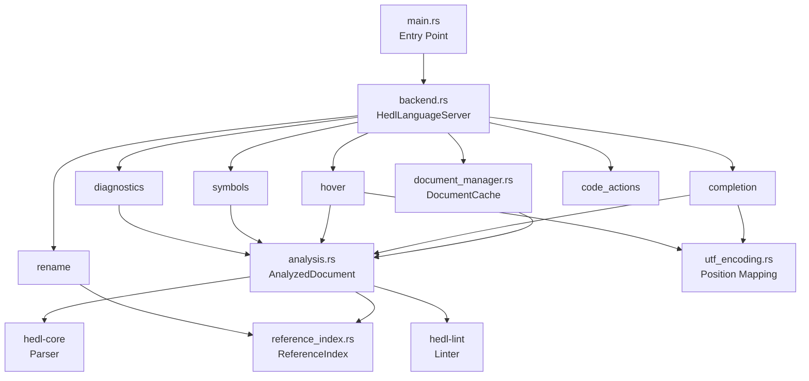
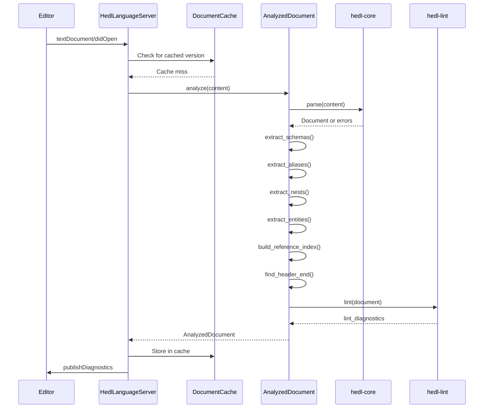
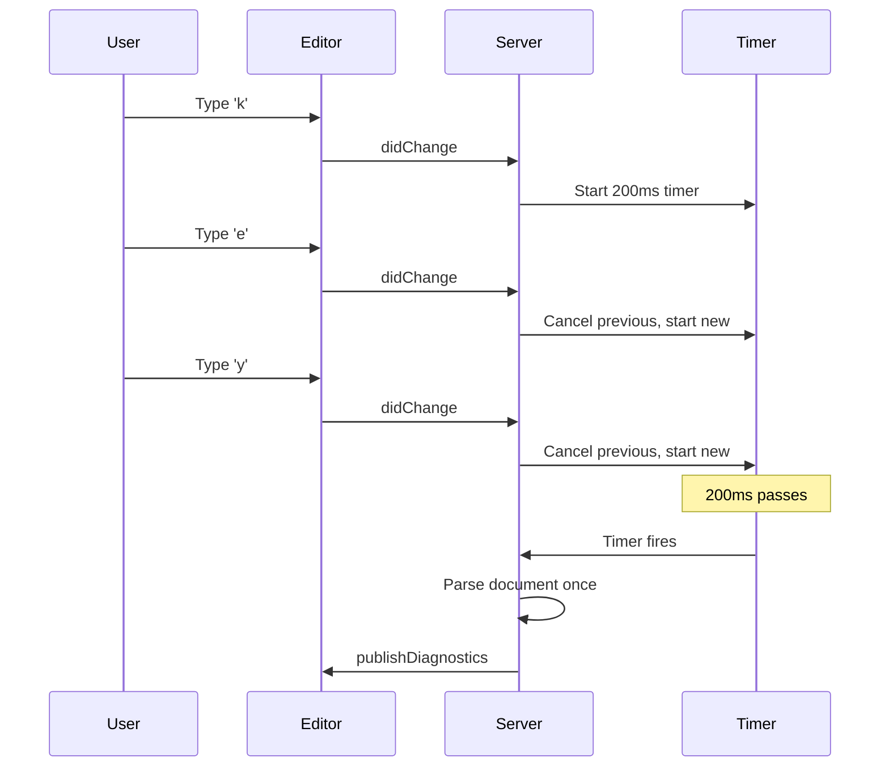

# LSP Implementation Guide: Building Intelligence Into Editors

You open your favorite editor. You start typing HEDL. Before you finish a word, suggestions appear. You hover over a reference, and documentation unfolds. You press a key combination, and you teleport to a definition across your workspace.

This magic does not happen by accident. It requires a language server: a program that speaks the Language Server Protocol (LSP), understanding your code deeply enough to provide instant, accurate assistance. Building such a server demands understanding both the protocol and the language it serves.

This guide takes you inside the `hedl-lsp` crate. You will learn how every module fits together, how documents flow through the analysis pipeline, and how to extend the server with new features. By the end, you will understand not just how to use the LSP server, but how to make it smarter.

---

## The Architecture at a Glance

Every LSP interaction follows a simple pattern: the editor sends a request, the server processes it, and sends back a response. But underneath that simplicity lies sophisticated machinery.

```mermaid
graph TB
    subgraph Editor["Editor (VS Code, Neovim, Emacs)"]
        E1[User Action]
        E2[LSP Client]
    end

    subgraph Server["hedl-lsp Server"]
        S1[Backend<br/>HedlLanguageServer]
        S2[Document Cache<br/>LRU Storage]
        S3[Analysis Engine<br/>AnalyzedDocument]
        S4[Reference Index<br/>O&#40;1&#41; Lookups]
        S5[Feature Handlers<br/>Completion, Hover, etc.]
    end

    subgraph Core["hedl-core & hedl-lint"]
        C1[Parser]
        C2[Linter]
    end

    E1 --> E2
    E2 -->|JSON-RPC| S1
    S1 --> S2
    S2 --> S3
    S3 --> S4
    S3 --> C1
    S3 --> C2
    S5 --> S3
    S1 --> S5
    S1 -->|JSON-RPC| E2
```



The server receives requests through JSON-RPC, processes them using cached analysis data, and returns responses. The trick is doing this fast enough that users never notice the computation happening.

---

## Module Organization: The Geography of the Codebase

Understanding where code lives is the first step to working with it. The `hedl-lsp` crate organizes its modules by responsibility, each file handling one aspect of language server functionality.

```
crates/hedl-lsp/src/
├── lib.rs                   # Public API, module re-exports
├── main.rs                  # Binary entry point, stdio transport
├── backend.rs               # HedlLanguageServer: the protocol handler
├── document_manager.rs      # DocumentCache: LRU document storage
├── analysis.rs              # AnalyzedDocument: parsing + metadata extraction
├── reference_index.rs       # ReferenceIndex: O(1) definition/reference lookup
├── completion.rs            # Context-aware autocompletion
├── hover.rs                 # Hover information provider
├── symbols.rs               # Document and workspace symbols
├── rename.rs                # Rename refactoring with validation
├── diagnostics.rs           # Error and warning reporting
├── utf_encoding.rs          # UTF-8 to UTF-16 position mapping
├── code_actions.rs          # Quick fixes and refactoring
├── constants.rs             # Configuration constants
└── tests.rs                 # Comprehensive test suite
```

Each module has a clear purpose. When you want to change completion behavior, you know to look in `completion.rs`. When debugging position calculations, `utf_encoding.rs` is your destination.

### Module Dependencies

The modules form a dependency graph that flows from the backend down to specialized handlers.



This architecture ensures that common functionality lives in shared modules. The `AnalyzedDocument` structure, for instance, serves completion, hover, symbols, and diagnostics. Changes to analysis logic automatically benefit all features.

---

## The Heart of the Server: AnalyzedDocument

When a user opens a HEDL file, raw text transforms into rich, queryable data. The `AnalyzedDocument` structure holds this transformation, containing everything the server needs to answer questions about the document.

### What Gets Analyzed

```rust
pub struct AnalyzedDocument {
    // The parsed AST from hedl-core
    document: Option<Document>,

    // Parse errors and warnings
    errors: Vec<HedlError>,
    lint_diagnostics: Vec<Diagnostic>,

    // Extracted metadata for fast lookups
    // Map: type_name -> (id -> line_number)
    entities: HashMap<String, HashMap<String, usize>>,

    // Map: schema_name -> (column_names, definition_line)
    schemas: HashMap<String, (Vec<String>, usize)>,

    // Map: alias_name -> (expansion, definition_line)
    aliases: HashMap<String, (String, usize)>,

    // Map: type_name -> (parent_type, definition_line)
    nests: HashMap<String, (String, usize)>,

    // Performance indexes for O(1) lookups
    reference_index: ReferenceIndex,

    // Header boundary for context detection
    header_end_line: Option<usize>,
}
```

### The Analysis Pipeline

Analysis happens in a specific order, each step building on the previous.



### Implementing the Analysis

The `analyze` function orchestrates the entire pipeline:

```rust
impl AnalyzedDocument {
    pub fn analyze(content: &str) -> Self {
        // Step 1: Parse the document
        let (document, errors) = match hedl_core::parse(content.as_bytes()) {
            Ok(doc) => (Some(doc), Vec::new()),
            Err(errs) => (None, errs),
        };

        // Step 2: Extract metadata from successful parse
        let (entities, schemas, aliases, nests) = if let Some(ref doc) = document {
            (
                extract_entities(doc),
                extract_schemas(doc),
                extract_aliases(doc),
                extract_nests(doc),
            )
        } else {
            (HashMap::new(), HashMap::new(), HashMap::new(), HashMap::new())
        };

        // Step 3: Build reference index for O(1) lookups
        let reference_index = document
            .as_ref()
            .map(ReferenceIndex::build)
            .unwrap_or_default();

        // Step 4: Find header boundary for context detection
        let header_end_line = find_header_end(content);

        // Step 5: Run linter on valid documents
        let lint_diagnostics = document
            .as_ref()
            .map(|doc| hedl_lint::lint(doc))
            .unwrap_or_default();

        AnalyzedDocument {
            document,
            errors,
            lint_diagnostics,
            entities,
            schemas,
            aliases,
            nests,
            reference_index,
            header_end_line,
        }
    }
}
```

---

## The Reference Index: O(1) Navigation

Finding definitions and references is the most common navigation operation. Users expect it to be instant. Linear search would make the server feel sluggish. The `ReferenceIndex` solves this by pre-computing all reference relationships during analysis.

### The Data Structure

```rust
pub struct ReferenceIndex {
    // Map: (type_name, id) -> definition location
    definitions: HashMap<(String, String), RefLocation>,

    // Map: reference_text -> all usage locations
    references: HashMap<String, Vec<RefLocation>>,

    // Map: (line, column) -> reference at that position
    location_to_ref: HashMap<(usize, usize), RefLocation>,
}

pub struct RefLocation {
    pub line: usize,
    pub column: usize,
    pub end_column: usize,
    pub text: String,
}
```

### Building the Index

The index builds in a single pass over the document:

```rust
impl ReferenceIndex {
    pub fn build(doc: &Document) -> Self {
        let mut definitions = HashMap::new();
        let mut references = HashMap::new();
        let mut location_to_ref = HashMap::new();

        // Walk the document collecting all references
        for node in doc.walk() {
            if let Some(ref_text) = node.as_reference() {
                let (type_name, id) = parse_reference(ref_text);
                let loc = RefLocation {
                    line: node.line,
                    column: node.column,
                    end_column: node.column + ref_text.len(),
                    text: ref_text.to_string(),
                };

                // Track definition (first occurrence in matrix)
                if node.is_definition() {
                    definitions.insert((type_name.clone(), id.clone()), loc.clone());
                }

                // Track all usages
                references
                    .entry(ref_text.to_string())
                    .or_insert_with(Vec::new)
                    .push(loc.clone());

                // Enable position lookup
                location_to_ref.insert((node.line, node.column), loc);
            }
        }

        ReferenceIndex {
            definitions,
            references,
            location_to_ref,
        }
    }
}
```

### Using the Index

With the index built, lookups become trivial:

```rust
// Go to Definition: O(1) lookup
fn go_to_definition(
    index: &ReferenceIndex,
    type_name: &str,
    id: &str,
) -> Option<Location> {
    index.definitions
        .get(&(type_name.to_string(), id.to_string()))
        .map(|loc| loc.to_lsp_location())
}

// Find All References: O(1) lookup
fn find_references(
    index: &ReferenceIndex,
    ref_text: &str,
) -> Vec<Location> {
    index.references
        .get(ref_text)
        .map(|locs| locs.iter().map(|l| l.to_lsp_location()).collect())
        .unwrap_or_default()
}
```

---

## Performance Patterns: Making the Server Fast

A slow language server is worse than no language server. Users develop muscle memory for instant responses. Introduce latency, and that muscle memory becomes frustration. These patterns keep the server responsive.

### Pattern 1: Debouncing

Users type continuously. Parsing after every keystroke would flood the server with work. Debouncing batches rapid changes into single parse operations.



Implementation:

```rust
pub struct HedlLanguageServer {
    debounce_tasks: Arc<Mutex<HashMap<Url, JoinHandle<()>>>>,
    // ...
}

async fn on_change(&self, uri: Url, content: String) {
    // Cancel any pending debounce for this document
    if let Ok(mut tasks) = self.debounce_tasks.lock() {
        if let Some(task) = tasks.remove(&uri) {
            task.abort();
        }
    }

    // Spawn new debounce timer
    let server = self.clone();
    let task = tokio::spawn(async move {
        tokio::time::sleep(Duration::from_millis(200)).await;
        server.reanalyze_and_publish(&uri).await;
    });

    self.debounce_tasks.lock().unwrap().insert(uri, task);
}
```

### Pattern 2: Dirty Tracking

Sometimes the editor sends change notifications when nothing changed (cursor movement, for instance). Parsing unchanged content wastes cycles. Content hashing catches this.

```rust
pub struct DocumentCache {
    documents: DashMap<Url, CachedDocument>,
}

struct CachedDocument {
    content_hash: u64,
    analyzed: Arc<AnalyzedDocument>,
}

impl DocumentCache {
    fn update(&self, uri: &Url, content: &str) -> bool {
        let new_hash = hash_content(content);

        if let Some(existing) = self.documents.get(uri) {
            if existing.content_hash == new_hash {
                return false; // No change, skip analysis
            }
        }

        let analyzed = Arc::new(AnalyzedDocument::analyze(content));
        self.documents.insert(uri.clone(), CachedDocument {
            content_hash: new_hash,
            analyzed,
        });
        true // Changed, analysis performed
    }
}
```

### Pattern 3: Shared Ownership with Arc

Multiple concurrent requests might need the same document. Cloning the entire `AnalyzedDocument` would be expensive. `Arc` provides shared ownership without copying.

```rust
// Multiple handlers can share the same document
async fn handle_completion(&self, uri: &Url) -> Vec<CompletionItem> {
    let doc = self.cache.get(uri); // Returns Arc<AnalyzedDocument>
    generate_completions(&doc)     // No clone needed
}

async fn handle_hover(&self, uri: &Url) -> Option<Hover> {
    let doc = self.cache.get(uri); // Same Arc, different handler
    generate_hover(&doc)
}
```

### Pattern 4: Pre-computed Header Boundary

Many operations need to know whether a position is in the header or body. Instead of scanning for `---` on every request, cache the boundary line during analysis.

```rust
// During analysis
let header_end_line = content
    .lines()
    .enumerate()
    .find(|(_, line)| line.trim() == "---")
    .map(|(i, _)| i);

// During completion (O(1) instead of O(n))
fn is_in_header(doc: &AnalyzedDocument, line: usize) -> bool {
    doc.header_end_line
        .map(|end| line <= end)
        .unwrap_or(false)
}
```

---

## Context Detection: Smart Completion

Completion depends on context. After `@`, you want type names. After `@User:`, you want user IDs. Inside a matrix row, you want field values. Context detection determines what to suggest.

### Completion Contexts

```rust
pub enum CompletionContext {
    Header,        // In header section before ---
    Directive,     // After % in header
    Reference,     // After @
    ReferenceId,   // After @Type:
    ListType,      // After : on list declaration
    MatrixCell,    // Inside matrix row (after |)
    Key,           // Start of line in data section
    Value,         // After : on data line
}
```

### Detection Algorithm

```mermaid
graph TD
    Start[Cursor Position] --> Header{In Header?}
    Header -->|Yes| CheckChar[Check Previous Char]
    Header -->|No| Body[Body Context]

    CheckChar -->|%| Directive[CompletionContext::Directive]
    CheckChar -->|@| RefStart{Has Colon?}
    CheckChar -->|Other| HeaderGen[CompletionContext::Header]

    RefStart -->|Yes| RefId[CompletionContext::ReferenceId]
    RefStart -->|No| RefType[CompletionContext::Reference]

    Body --> CheckLine[Check Line Content]
    CheckLine -->|Starts with pipe| MatrixCell[CompletionContext::MatrixCell]
    CheckLine -->|After colon| Value[CompletionContext::Value]
    CheckLine -->|Line start| Key[CompletionContext::Key]
```

Implementation:

```rust
fn detect_context(
    doc: &AnalyzedDocument,
    line: usize,
    col: usize,
    content: &str,
) -> CompletionContext {
    // Check if in header
    let in_header = doc.header_end_line
        .map(|end| line <= end)
        .unwrap_or(true);

    let line_text = content.lines().nth(line).unwrap_or("");
    let before_cursor = &line_text[..col.min(line_text.len())];

    if in_header {
        if before_cursor.ends_with('%') {
            return CompletionContext::Directive;
        }
        if let Some(at_pos) = before_cursor.rfind('@') {
            let after_at = &before_cursor[at_pos + 1..];
            if after_at.contains(':') {
                return CompletionContext::ReferenceId;
            }
            return CompletionContext::Reference;
        }
        return CompletionContext::Header;
    }

    // Body context detection
    if line_text.trim_start().starts_with('|') {
        return CompletionContext::MatrixCell;
    }

    if before_cursor.contains(':') {
        return CompletionContext::Value;
    }

    CompletionContext::Key
}
```

---

## Adding New Features: A Step-by-Step Guide

The LSP specification defines many capabilities. Adding a new one follows a consistent pattern.

### Step 1: Understand the Protocol

Consult the [LSP Specification](https://microsoft.github.io/language-server-protocol/). Find the request type, its parameters, and expected response. For example, `textDocument/foldingRange` returns regions that can be collapsed.

### Step 2: Implement the Handler

Add a method to `HedlLanguageServer` in `backend.rs`:

```rust
async fn text_document_folding_range(
    &self,
    params: FoldingRangeParams,
) -> Result<Option<Vec<FoldingRange>>> {
    // Get the cached document
    let doc = self.get_document(&params.text_document.uri)?;

    // Compute folding ranges
    let ranges = compute_folding_ranges(&doc);

    Ok(Some(ranges))
}

fn compute_folding_ranges(doc: &AnalyzedDocument) -> Vec<FoldingRange> {
    let mut ranges = Vec::new();

    // Header is foldable
    if let Some(header_end) = doc.header_end_line {
        ranges.push(FoldingRange {
            start_line: 0,
            end_line: header_end as u32,
            kind: Some(FoldingRangeKind::Region),
            ..Default::default()
        });
    }

    // Each matrix is foldable
    for (type_name, entities) in &doc.entities {
        // Find start and end lines of each matrix
        // Add FoldingRange for each
    }

    ranges
}
```

### Step 3: Advertise the Capability

Update the `initialize` method to tell editors what you support:

```rust
async fn initialize(
    &self,
    _params: InitializeParams,
) -> Result<InitializeResult> {
    let capabilities = ServerCapabilities {
        // Existing capabilities...

        // Add folding range support
        folding_range_provider: Some(FoldingRangeProviderCapability::Simple(true)),

        ..Default::default()
    };

    Ok(InitializeResult {
        capabilities,
        ..Default::default()
    })
}
```

### Step 4: Write Tests

Add comprehensive tests in `tests.rs`:

```rust
#[test]
fn test_folding_range_header() {
    let analyzed = AnalyzedDocument::analyze(r#"%V:2.0
%NULL:~
%QUOTE:"
%S:User:[id,name,email]
---
users: @User
 |u1,Alice,alice@example.com
 |u2,Bob,bob@example.com
"#);

    let ranges = compute_folding_ranges(&analyzed);

    // Header should be foldable (lines 0-4)
    assert!(ranges.iter().any(|r| r.start_line == 0 && r.end_line == 4));

    // Matrix should be foldable
    assert!(ranges.iter().any(|r| r.kind == Some(FoldingRangeKind::Region)));
}

#[test]
fn test_folding_range_nested() {
    let analyzed = AnalyzedDocument::analyze(r#"%V:2.0
%NULL:~
%QUOTE:"
---
config:
  database:
    host: localhost
    port: 5432
  cache:
    enabled: true
"#);

    let ranges = compute_folding_ranges(&analyzed);

    // Nested objects should be foldable
    assert!(ranges.len() >= 2);
}
```

---

## Testing: Proving the Server Works

Tests catch bugs before users do. The `hedl-lsp` test suite covers every feature.

### Test Organization

Tests group by feature:

```rust
#[cfg(test)]
mod tests {
    mod analysis {
        // Test metadata extraction
        #[test]
        fn test_extract_schemas() { /* ... */ }
        #[test]
        fn test_extract_entities() { /* ... */ }
        #[test]
        fn test_extract_aliases() { /* ... */ }
    }

    mod completion {
        // Test each context
        #[test]
        fn test_completion_in_header() { /* ... */ }
        #[test]
        fn test_completion_after_at() { /* ... */ }
        #[test]
        fn test_completion_in_matrix() { /* ... */ }
    }

    mod reference_index {
        // Test O(1) lookups
        #[test]
        fn test_definition_lookup() { /* ... */ }
        #[test]
        fn test_reference_lookup() { /* ... */ }
    }

    mod utf_encoding {
        // Test position mapping
        #[test]
        fn test_ascii_positions() { /* ... */ }
        #[test]
        fn test_emoji_positions() { /* ... */ }
        #[test]
        fn test_multibyte_characters() { /* ... */ }
    }
}
```

### Writing Effective Tests

A good test has clear setup, action, and verification:

```rust
#[test]
fn test_schema_extraction_captures_columns() {
    // Setup: Create a document with multiple schemas
    let content = r#"%V:2.0
%NULL:~
%QUOTE:"
%S:User:[id,name,email]
%S:Post:[id,title,author,published]
---
data: value
"#;

    // Action: Analyze the document
    let analyzed = AnalyzedDocument::analyze(content);

    // Verify: Check extracted schemas
    assert_eq!(analyzed.schemas.len(), 2);

    let (user_cols, user_line) = &analyzed.schemas["User"];
    assert_eq!(user_cols, &vec!["id", "name", "email"]);
    assert_eq!(*user_line, 3); // 0-indexed

    let (post_cols, _) = &analyzed.schemas["Post"];
    assert_eq!(post_cols, &vec!["id", "title", "author", "published"]);
}
```

### Running Tests

```bash
# Run all LSP tests
cargo test -p hedl-lsp

# Run with output visible
cargo test -p hedl-lsp -- --nocapture

# Run specific test
cargo test -p hedl-lsp test_schema_extraction

# Run with debug logging
RUST_LOG=debug cargo test -p hedl-lsp -- --nocapture
```

---

## Debugging: Finding What Went Wrong

When the server misbehaves, systematic debugging finds the cause.

### Enable Logging

The server uses `tracing` for structured logging:

```bash
# Debug level shows important events
RUST_LOG=debug hedl-lsp 2> lsp.log

# Trace level shows everything
RUST_LOG=trace hedl-lsp 2> lsp.log

# Filter to specific module
RUST_LOG=hedl_lsp::completion=debug hedl-lsp 2> lsp.log
```

### Inspect Logs

```bash
# Watch logs in real time
tail -f lsp.log

# Find errors
grep -i "error\|ERROR" lsp.log

# Count diagnostic publications
grep "publishDiagnostics" lsp.log | wc -l

# See completion requests
grep "textDocument/completion" lsp.log
```

### Create Minimal Reproductions

When a bug appears, create the smallest possible test case:

```rust
#[test]
fn test_bug_reproduction() {
    // Exact document that triggers the bug
    let content = r#"%V:2.0
%NULL:~
%QUOTE:"
%S:User:[id,name]
---
broken: @User:
"#;

    let analyzed = AnalyzedDocument::analyze(content);

    // Print diagnostic information
    println!("Schemas: {:?}", analyzed.schemas);
    println!("Entities: {:?}", analyzed.entities);
    println!("Errors: {:?}", analyzed.errors);

    // Test the specific behavior
    let completions = complete_at_position(&analyzed, 5, 14);
    println!("Completions: {:?}", completions);

    // Assert expected behavior
    assert!(!completions.is_empty(), "Should suggest user IDs");
}
```

Run with output:

```bash
cargo test -p hedl-lsp test_bug_reproduction -- --nocapture
```

---

## Best Practices: Lessons Learned

These patterns emerged from real development experience.

### Use Arc for Shared Data

Document analysis is expensive. Share results instead of cloning:

```rust
// Efficient: shared ownership
let doc: Arc<AnalyzedDocument> = cache.get(&uri);
let doc_clone = Arc::clone(&doc);

// Wasteful: full copy
let doc: AnalyzedDocument = cache.get(&uri).clone();
```

### Validate User Input

Editors can send invalid positions. Handle them gracefully:

```rust
fn get_line(content: &str, line: usize) -> Option<&str> {
    content.lines().nth(line)
}

// Not this:
fn get_line(content: &str, line: usize) -> &str {
    content.lines().nth(line).unwrap() // Panics on invalid line
}
```

### Use DashMap for Concurrency

Multiple requests arrive simultaneously. DashMap handles this safely:

```rust
// Thread-safe concurrent access
let cache: DashMap<Url, Arc<AnalyzedDocument>> = DashMap::new();

// Not thread-safe without explicit locking
let cache: HashMap<Url, Arc<AnalyzedDocument>> = HashMap::new();
```

### Debounce Expensive Operations

Rapid operations should batch:

```rust
// Debounced: one parse after typing stops
spawn(async {
    sleep(Duration::from_millis(200)).await;
    parse_and_publish();
});

// Not debounced: parse on every keystroke
parse_and_publish(); // Called on every didChange
```

---

## Troubleshooting Common Issues

### Completion Not Working

Check these in order:

1. **Position calculation**: Are you using UTF-16 offsets? LSP uses UTF-16.
2. **Context detection**: Log the detected context. Is it what you expect?
3. **Document cached**: Is the document in the cache? Check for cache misses.
4. **Header boundary**: Is `header_end_line` correct?

Debug with logging:

```rust
eprintln!("Position: line={}, col={}", line, col);
eprintln!("Context: {:?}", detect_context(&doc, line, col));
eprintln!("Header end: {:?}", doc.header_end_line);
```

### High Memory Usage

Check:

1. **Document size limits**: Are you enforcing them?
2. **Cache eviction**: Is LRU working? Check cache size.
3. **Circular references**: Are there reference cycles in your data structures?

Profile memory:

```bash
# Use heaptrack
heaptrack hedl-lsp

# Analyze results
heaptrack --analyze heaptrack.hedl-lsp.*.gz
```

### Slow Definition Lookup

Check:

1. **Reference index populated**: Log the index size after building.
2. **Hash performance**: Profile HashMap operations.
3. **Document size**: Very large documents may need different strategies.

Profile performance:

```rust
let start = std::time::Instant::now();
let index = ReferenceIndex::build(&document);
eprintln!("Index build: {:?}", start.elapsed());
eprintln!("Definitions: {}", index.definitions.len());
eprintln!("References: {}", index.references.len());
```

---

## The Journey Continues

Building a language server is an ongoing process. Users discover new needs. The language evolves. Performance requirements grow. But with a solid architecture, clear module boundaries, and comprehensive tests, changes become tractable.

The patterns in this guide apply beyond HEDL. Any language server benefits from debouncing, caching, and pre-computed indexes. The specific implementation details change, but the principles remain.

Go forth and build intelligence into editors. Your users will thank you.

---

## Related Documentation

- **[LSP API Reference](../../api/lsp-api.md)**: User guide for all features
- **[LSP Component Architecture](../../architecture/components/lsp.md)**: System design overview
- **[LSP Message Flow Diagrams](../../architecture/diagrams/lsp-message-flow.md)**: Protocol sequences
- **[Module Guide](../module-guide.md)**: All 19 crates in the workspace
