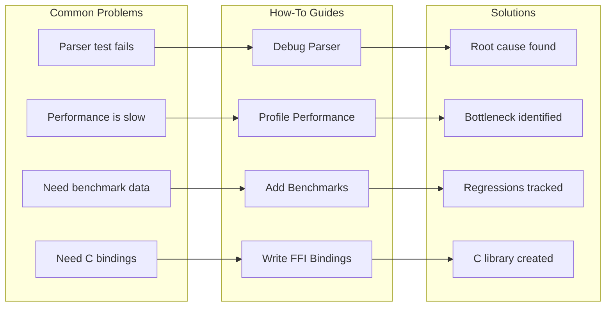
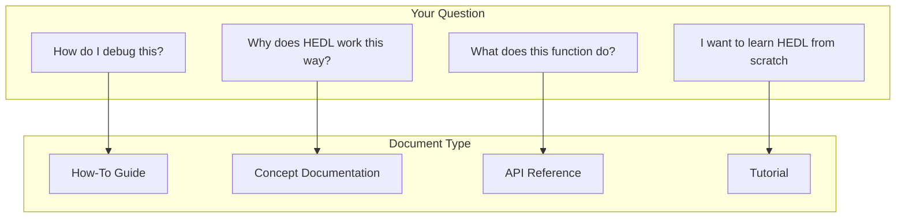

# How-To Guides: Solving Real Problems

You have a specific problem. Your parser test fails, and you need to find out why. Performance is sluggish, and you need to identify the bottleneck. You want to add benchmarks to track a new feature. You do not need a tutorial explaining concepts from scratch. You need actionable steps that solve your problem now.

That is what how-to guides provide: targeted solutions to common tasks. Each guide assumes you understand the basics and gets straight to the point. Follow the steps, verify the result, move on.



---

## Available Guides

### Debugging and Troubleshooting

**[Debug Parser Issues](debug-parser.md)**

Your test fails with a cryptic parse error. The document looks correct to your eyes, but the parser disagrees. This guide shows you how to:

- Enable tracing to see what the parser sees
- Isolate the failing input to a minimal reproduction
- Distinguish lexer errors from parser errors
- Understand error messages and their causes
- Fix common parsing problems

### Performance Analysis

**[Profile Performance](profile-performance.md)**

Your code works, but it works slowly. Users complain about latency. Benchmarks show regressions. This guide helps you:

- Generate flame graphs to visualize where time goes
- Use criterion benchmarks to measure precisely
- Identify hot paths and cache misses
- Compare performance across git commits
- Fix common performance problems

### Development Tasks

**[Add Benchmarks](add-benchmarks.md)**

You wrote a new feature. Now you need to ensure it stays fast. This guide teaches you to:

- Create benchmark suites with criterion
- Design meaningful benchmarks that catch regressions
- Generate reports and track trends
- Integrate benchmarks with CI

**[Write FFI Bindings](write-ffi-bindings.md)**

You need to use HEDL from C, Python, or another language. This guide walks through:

- Designing a C-compatible API
- Using cbindgen to generate headers
- Building and linking the library
- Testing from foreign languages
- Handling errors across FFI boundaries

---

## Guide Structure

Every guide follows the same pattern, making them predictable and easy to use:

```
┌────────────────────────────────────────────────────────┐
│  1. GOAL                                               │
│     What you want to accomplish                        │
│                                                        │
│  2. PREREQUISITES                                      │
│     What you need before starting                      │
│                                                        │
│  3. STEPS                                              │
│     Numbered, actionable instructions                  │
│     Each step has a single, verifiable outcome         │
│                                                        │
│  4. VERIFICATION                                       │
│     How to confirm you succeeded                       │
│                                                        │
│  5. TROUBLESHOOTING                                    │
│     Common problems and their solutions                │
│                                                        │
│  6. RELATED                                            │
│     Links to deeper documentation                      │
└────────────────────────────────────────────────────────┘
```

---

## Quick Reference

Find the guide for your task:

| I need to... | Guide | Time |
|--------------|-------|------|
| Fix a parsing error | [Debug Parser](debug-parser.md) | 10 min |
| Find a performance bottleneck | [Profile Performance](profile-performance.md) | 20 min |
| Add a performance test | [Add Benchmarks](add-benchmarks.md) | 15 min |
| Create C bindings | [Write FFI Bindings](write-ffi-bindings.md) | 30 min |

---

## When to Use How-To Guides

How-to guides answer "How do I X?" questions. They differ from other documentation types:



Use how-to guides when you:

- Have a specific task to accomplish
- Already understand the basics
- Want step-by-step instructions
- Need to solve a problem quickly

Use other documentation when you:

- Want to understand why something works (Concepts)
- Need detailed API information (Reference)
- Are learning from scratch (Tutorials)

---

## Contributing New Guides

Solved a tricky problem? Help others avoid the struggle. Write a how-to guide:

1. **Create a file**: `docs/developer/how-to/your-guide.md`

2. **Follow the structure**:
   ```markdown
   # How to [Accomplish Task]

   [One paragraph explaining the problem this guide solves]

   ## Goal

   [What the reader will accomplish]

   ## Prerequisites

   - [What they need]
   - [Tools required]
   - [Knowledge assumed]

   ## Steps

   ### Step 1: [First Action]

   [Instructions with code examples]

   ### Step 2: [Second Action]

   [More instructions]

   ## Verification

   [How to confirm success]

   ## Troubleshooting

   ### Problem: [Something went wrong]

   [How to fix it]

   ## Related

   - [Link to related docs]
   ```

3. **Update this README**: Add your guide to the list.

4. **Test your guide**: Follow your own instructions on a fresh setup.

---

## Related Documentation

Different documentation serves different purposes:

- **[Tutorials](../tutorials/README.md)**: Learn by building, from basics up
- **[Concepts](../concepts/README.md)**: Understand the why behind the what
- **[Reference](../reference/README.md)**: Look up specific API details
- **[Operations](../operations/README.md)**: Run HEDL in production

---

## Get Help

Stuck on something not covered here?

- Search existing guides first
- Check the [Concepts documentation](../concepts/README.md) for background
- Ask in [GitHub Discussions](https://github.com/dweve-ai/hedl/discussions)
- File an issue if you think a guide is missing

Every question is a potential new how-to guide.
