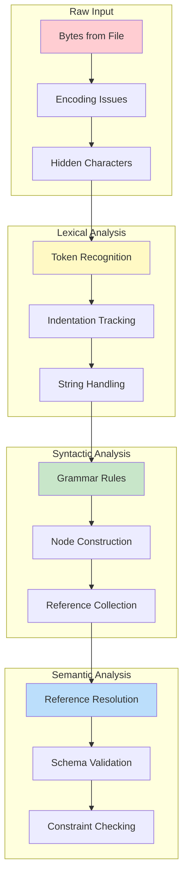

# How to Debug Parser Issues: Finding the Truth in Broken Text

The test fails. The document looks perfect to your eyes: every bracket balanced, every colon in place. Yet the parser refuses it. The error message mentions line 47, but line 47 looks fine. You scroll up and down, squinting at whitespace, wondering if you have gone mad.

You have not. Parsers see what humans miss. An invisible tab character hiding among spaces. A smart quote that looks like a regular quote but is not. A reference to an entity that almost exists but has a subtle typo in its name.

This guide teaches you to see what the parser sees. When parsing fails, you will know how to find the real cause, not the symptom, and fix it with confidence.

---

## Goal

Successfully diagnose why HEDL text fails to parse and fix the underlying issue.

## Prerequisites

- HEDL source code cloned
- Rust toolchain installed
- Basic understanding of what parsers do

---

## The Debugging Mindset

Before diving into techniques, understand the layers where problems can occur:



Each layer can fail for different reasons. Your first task is identifying which layer has the problem.

---

## Scenario 1: Generic Error Messages

**Symptoms**: `parse()` returns an error, but the message does not tell you enough.

**Solution**: Extract every detail the error contains.

```rust
use hedl_core::{parse, HedlError, HedlErrorKind};

fn diagnose_parse_error(input: &[u8]) {
    match parse(input) {
        Ok(doc) => {
            println!("Parse succeeded: {} root keys", doc.root.len());
        }
        Err(e) => {
            // Extract all available information
            println!("Error kind: {:?}", e.kind);
            println!("Message: {}", e.message);
            println!("Line: {}", e.line);

            if let Some(col) = e.column {
                println!("Column: {}", col);
            }

            if let Some(context) = &e.context {
                println!("Context: {}", context);
            }

            // Show what kind of problem this is
            match e.kind {
                HedlErrorKind::Syntax => println!("This is a syntax error in the HEDL text"),
                HedlErrorKind::Reference => println!("A reference could not be resolved"),
                HedlErrorKind::Schema => println!("A schema definition or usage is wrong"),
                HedlErrorKind::Shape => println!("Matrix row does not match schema columns"),
                HedlErrorKind::Security => println!("Resource limit exceeded"),
                _ => println!("Other error type"),
            }
        }
    }
}
```

Run your diagnosis:

```rust
let problematic_input = br#"%V:2.0
%NULL:~
%QUOTE:"
---
users: @User
 |alice,Alice,alice@example.com
"#;

diagnose_parse_error(problematic_input);
```

---

## Scenario 2: Distinguishing Lexer from Parser Errors

**Problem**: You need to know if the error is in tokenization (lexer) or structure (parser).

The lexer turns characters into tokens. The parser assembles tokens into structure. Problems in each layer manifest differently:

| Symptom | Likely Layer |
|---------|--------------|
| "Invalid character" | Lexer (encoding or character issue) |
| "Unexpected token" | Parser (structure problem) |
| "Indentation error" | Lexer (whitespace handling) |
| "Unresolved reference" | Semantic (reference resolution) |

**Test incrementally**:

```bash
# Create a minimal test file
cat > test.hedl << 'EOF'
%V:2.0
%NULL:~
%QUOTE:"
---
key: value
EOF

# Try parsing
cargo run -p hedl-cli -- validate test.hedl

# If that works, add complexity
cat > test.hedl << 'EOF'
%V:2.0
%NULL:~
%QUOTE:"
%S:User:[id,name]
---
users: @User
 |u1,Alice
EOF

cargo run -p hedl-cli -- validate test.hedl
```

---

## Scenario 3: Indentation Issues

**Symptoms**: Nested structures are not recognized. Children appear at the wrong level.

Indentation in HEDL is significant. The parser uses it to determine hierarchy. Problems arise from:

1. **Mixed tabs and spaces**: HEDL uses spaces
2. **Inconsistent indentation depth**: Child nodes need exactly 1 more space than parent
3. **Invisible characters**: Zero-width spaces, non-breaking spaces

**Reveal hidden characters**:

```bash
# Show tabs (^I) and line endings ($)
cat -A problematic.hedl

# Look for tabs
cat -A problematic.hedl | grep $'\t'

# Show all whitespace with hexdump
hexdump -C problematic.hedl | head -20
```

**Example of correct indentation**:

```hedl
%V:2.0
%NULL:~
%QUOTE:"
---
parent:                    # Column 0
 child1: value             # Column 1 (1 space indent)
 child2:                   # Column 1
  grandchild: value        # Column 2 (2 spaces indent)
 child3: value             # Back to Column 1
```

**Common mistake** (tabs look like spaces but are not):

```hedl
%V:2.0
%NULL:~
%QUOTE:"
---
parent:
	child: value           # This is a TAB, not spaces!
```

**Programmatic check**:

```rust
fn check_indentation(content: &str) {
    for (line_num, line) in content.lines().enumerate() {
        let leading: String = line.chars().take_while(|c| c.is_whitespace()).collect();

        // Check for tabs
        if leading.contains('\t') {
            println!("Line {}: Contains tab character", line_num + 1);
        }

        // Check for unusual whitespace
        for (i, c) in leading.chars().enumerate() {
            if c != ' ' && c != '\t' {
                println!(
                    "Line {}: Position {} has unusual whitespace: U+{:04X}",
                    line_num + 1,
                    i,
                    c as u32
                );
            }
        }
    }
}
```

---

## Scenario 4: Reference Resolution Failures

**Symptoms**: References like `@User:alice` do not resolve. The error says the target does not exist, but you can see it in the document.

References connect entities. Resolution can fail because:

1. **The type does not exist**: No schema defined for `User`
2. **The ID does not exist**: No entity with ID `alice` in a `User` matrix
3. **Typo in type or ID**: `@Usr:alice` vs `@User:alice`
4. **Forward reference issues**: Referencing before definition

**Debug step by step**:

```rust
use hedl_core::{parse, Document, Item, Value};

fn debug_references(content: &[u8]) {
    match parse(content) {
        Ok(doc) => {
            println!("Parse succeeded. Analyzing structure...\n");

            // List all schemas (types)
            println!("Schemas defined in headers:");
            for directive in &doc.header.directives {
                if directive.starts_with("%S:") {
                    println!("  {}", directive);
                }
            }

            // Find all matrix definitions (where entities live)
            println!("\nMatrix entities found:");
            find_matrices(&doc.root, "");

            // Find all references
            println!("\nReferences found:");
            find_references(&doc.root, "");
        }
        Err(e) => {
            println!("Parse failed: {}", e.message);
            println!("Line {}", e.line);
        }
    }
}

fn find_matrices(items: &std::collections::BTreeMap<String, Item>, path: &str) {
    for (key, item) in items {
        let full_path = if path.is_empty() {
            key.clone()
        } else {
            format!("{}.{}", path, key)
        };

        match item {
            Item::List(matrix) => {
                println!("  {} -> {} rows", full_path, matrix.rows.len());
                for row in &matrix.rows {
                    if let Some(id) = row.values.first() {
                        println!("    ID: {:?}", id);
                    }
                }
            }
            Item::Object(nested) => {
                find_matrices(nested, &full_path);
            }
            _ => {}
        }
    }
}

fn find_references(items: &std::collections::BTreeMap<String, Item>, path: &str) {
    for (key, item) in items {
        let full_path = if path.is_empty() {
            key.clone()
        } else {
            format!("{}.{}", path, key)
        };

        match item {
            Item::Scalar(Value::Reference(r)) => {
                println!("  {} -> @{}:{}", full_path, r.type_name, r.id);
            }
            Item::Object(nested) => {
                find_references(nested, &full_path);
            }
            _ => {}
        }
    }
}
```

**Example output**:

```
Schemas defined in headers:
  %S:User:[id,name,email]

Matrix entities found:
  users -> 2 rows
    ID: String("alice")
    ID: String("bob")

References found:
  post.author -> @User:alicee    # Typo! Should be "alice"
```

---

## Scenario 5: Schema Mismatch

**Symptoms**: "Shape error" or "Schema mismatch" when parsing matrix rows.

Each matrix row must have exactly as many values as the schema has columns:

```hedl
%V:2.0
%NULL:~
%QUOTE:"
%S:User:[id,name,email]         # 3 columns
---
users: @User
 |alice,Alice,alice@example.com  # 3 values: OK
 |bob,Bob                        # 2 values: ERROR!
```

**Debug by counting**:

```rust
fn check_schema_match(content: &str) {
    let lines: Vec<&str> = content.lines().collect();

    // Find schemas
    let schemas: Vec<(String, usize)> = lines
        .iter()
        .filter(|l| l.starts_with("%S:"))
        .filter_map(|l| {
            let name_end = l[3..].find(':')?;
            let name = l[3..3 + name_end].to_string();
            let bracket_start = l.find('[')?;
            let bracket_end = l.find(']')?;
            let columns = l[bracket_start + 1..bracket_end]
                .split(',')
                .count();
            Some((name, columns))
        })
        .collect();

    println!("Schemas:");
    for (name, cols) in &schemas {
        println!("  {}: {} columns", name, cols);
    }

    // Find matrix rows and check
    let in_body = lines.iter().position(|l| l.trim() == "---").unwrap_or(0);
    let mut current_type: Option<&str> = None;

    for (i, line) in lines.iter().enumerate().skip(in_body + 1) {
        if line.contains(": @") {
            // Matrix declaration
            if let Some(at_pos) = line.find('@') {
                current_type = Some(line[at_pos + 1..].trim());
            }
        } else if line.trim().starts_with('|') {
            // Matrix row
            let values = line.trim()[1..].split(',').count();
            if let Some(type_name) = current_type {
                if let Some((_, expected)) = schemas.iter().find(|(n, _)| n == type_name) {
                    if values != *expected {
                        println!(
                            "Line {}: Expected {} values for {}, found {}",
                            i + 1,
                            expected,
                            type_name,
                            values
                        );
                    }
                }
            }
        }
    }
}
```

---

## Advanced Techniques

### Enable Tracing

Add detailed logging to see exactly what the parser does:

```rust
use tracing::{debug, info, trace, Level};
use tracing_subscriber::FmtSubscriber;

fn parse_with_tracing(input: &[u8]) {
    // Set up tracing
    let subscriber = FmtSubscriber::builder()
        .with_max_level(Level::TRACE)
        .finish();
    tracing::subscriber::set_global_default(subscriber).unwrap();

    info!("Starting parse, input length: {}", input.len());

    match hedl_core::parse(input) {
        Ok(doc) => {
            info!("Parse succeeded");
            debug!("Root keys: {:?}", doc.root.keys().collect::<Vec<_>>());
        }
        Err(e) => {
            info!("Parse failed at line {}", e.line);
            debug!("Error details: {:?}", e);
        }
    }
}
```

Run with environment variable:

```bash
RUST_LOG=trace cargo run --example my_debug
```

### Create Minimal Reproduction

When you find a bug, reduce it to the smallest possible example:

```rust
#[test]
fn test_minimal_failure() {
    // Start with the full failing input
    let full = br#"%V:2.0
%NULL:~
%QUOTE:"
%S:User:[id,name,email]
%S:Post:[id,title,author]
---
users: @User
 |u1,Alice,alice@example.com
 |u2,Bob,bob@example.com
posts: @Post
 |p1,Hello World,@User:u1
 |p2,Goodbye,@User:u3
"#;

    // Binary search: remove half, see if still fails
    let half = br#"%V:2.0
%NULL:~
%QUOTE:"
%S:User:[id,name,email]
---
users: @User
 |u1,Alice,alice@example.com
post_author: @User:u3
"#;

    // Keep reducing until minimal
    let minimal = br#"%V:2.0
%NULL:~
%QUOTE:"
%S:User:[id,name,email]
---
users: @User
 |u1,Alice,alice@example.com
ref: @User:u3
"#;

    // This is the minimal case: reference to non-existent ID
    let result = hedl_core::parse(minimal);
    assert!(result.is_err(), "Should fail: u3 does not exist");
}
```

### Use a Debugger

For complex issues, step through the code:

**VS Code launch configuration**:

```json
{
    "version": "0.2.0",
    "configurations": [
        {
            "type": "lldb",
            "request": "launch",
            "name": "Debug Parser Test",
            "cargo": {
                "args": ["test", "--no-run", "-p", "hedl-core", "--lib"],
                "filter": {
                    "name": "test_minimal_failure",
                    "kind": "test"
                }
            },
            "args": [],
            "cwd": "${workspaceFolder}"
        }
    ]
}
```

Set breakpoints in `crates/hedl-core/src/parser/` and step through.

---

## Debugging Checklist

When parsing fails, check these in order:

- [ ] **UTF-8 validity**: Is the input valid UTF-8?
- [ ] **Required headers**: Does it have `%V:2.0`, `%NULL:~`, `%QUOTE:"`?
- [ ] **Header separator**: Is there a `---` line?
- [ ] **Indentation**: Spaces only, consistent depth?
- [ ] **Schema syntax**: `%S:Name:[col1,col2]` with no spaces after commas?
- [ ] **Matrix rows**: Start with ` |`, values match schema count?
- [ ] **References**: Target type and ID exist?
- [ ] **No duplicate IDs**: Each ID unique within its type?
- [ ] **Resource limits**: Document not too deep or large?

---

## Common Error Messages

| Error | Cause | Solution |
|-------|-------|----------|
| "Invalid UTF-8" | Non-UTF-8 bytes | Convert file to UTF-8 |
| "Missing required header" | Header `%V:`, `%NULL:`, or `%QUOTE:` missing | Add all three headers |
| "Max depth exceeded" | Too deeply nested | Flatten structure or increase limit |
| "Unexpected token" | Syntax error | Check line indicated in error |
| "Unresolved reference" | Referenced ID does not exist | Add target or fix typo |
| "Schema mismatch" | Row has wrong number of values | Match values to schema columns |
| "Duplicate ID" | Same ID used twice in same type | Use unique IDs |

---

## Verification

After fixing the issue, verify it works:

```bash
# Run specific test
cargo test -p hedl-core test_that_was_failing

# Run all parser tests
cargo test -p hedl-core

# Validate your actual file
cargo run -p hedl-cli -- validate your_file.hedl
```

---

## Still Stuck?

If none of these techniques reveal the problem:

1. **Create a minimal reproduction** (smallest failing input)
2. **Include the exact error message**
3. **Post to GitHub Discussions** with your test case

```rust
// Include this in your issue:
#[test]
fn reproduction_for_issue() {
    let input = br#"...your minimal failing case..."#;
    let result = hedl_core::parse(input);

    // What you expect vs what happens
    assert!(result.is_ok(), "Expected success but got: {:?}", result);
}
```

---

## Related Documentation

- **[Parser Architecture](../concepts/parser-architecture.md)**: How the parser works internally
- **[Error Handling](../concepts/error-handling.md)**: Understanding error types
- **[HEDL Specification](../../../SPEC.md)**: The authoritative syntax rules
