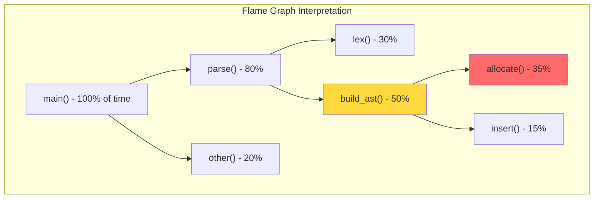

# How to Profile Performance: Finding Where Time Goes

Your code works. It passes all tests. But users report slowness. Benchmarks show regressions. Something changed, somewhere, and now parsing takes twice as long as it used to.

You cannot fix what you cannot measure. Performance problems hide in unexpected places: a function you thought was cheap turns out to dominate runtime. An allocation you never noticed happens millions of times. A cache miss in a tight loop destroys throughput.

This guide teaches you to find those hidden costs. You will learn to generate flame graphs that visualize where time goes, run benchmarks that measure with statistical rigor, and profile memory to find allocation hotspots. By the end, you will transform vague "it feels slow" into precise "this function takes 40% of runtime."

---

## Goal

Find performance bottlenecks and measure the impact of optimizations.

## Prerequisites

- HEDL codebase compiled
- Basic command-line proficiency
- A slow code path to investigate (or curiosity about where time goes)

---

## The Performance Investigation Workflow

Performance work follows a cycle: measure, analyze, optimize, verify.

```mermaid
graph LR
    subgraph Measure["1. Measure"]
        M1[Run Benchmark]
        M2[Generate Profile]
        M3[Record Baseline]
    end

    subgraph Analyze["2. Analyze"]
        A1[Find Hot Functions]
        A2[Check Allocations]
        A3[Identify Patterns]
    end

    subgraph Optimize["3. Optimize"]
        O1[Change Code]
        O2[Reduce Allocations]
        O3[Improve Algorithms]
    end

    subgraph Verify["4. Verify"]
        V1[Run Benchmark Again]
        V2[Compare to Baseline]
        V3[Check for Regressions]
    end

    M1 --> M2 --> M3
    M3 --> A1 --> A2 --> A3
    A3 --> O1 --> O2 --> O3
    O3 --> V1 --> V2 --> V3
    V3 -->|Not fast enough| M1
```



Never optimize without measuring first. Intuition about performance is often wrong.

---

## Tools Overview

Different tools answer different questions:

| Tool | Question It Answers | When to Use |
|------|---------------------|-------------|
| **criterion** | "How fast is this function?" | Precise microbenchmarks |
| **flamegraph** | "Where does time go?" | CPU profiling, finding hot paths |
| **valgrind/massif** | "Where do allocations happen?" | Memory profiling |
| **perf** | "What is the system doing?" | Low-level Linux profiling |

---

## Method 1: Flame Graphs with flamegraph

Flame graphs visualize call stacks. Width shows time: wider functions take longer. Height shows depth: taller stacks have more nested calls.

### Install

```bash
cargo install flamegraph
```

### Profile a Binary

```bash
# Build release binary
cargo build --release -p hedl-cli

# Profile with flamegraph (needs root on Linux)
sudo flamegraph -o flame.svg target/release/hedl parse large_file.hedl

# Open in browser
firefox flame.svg
```

### Profile a Benchmark

```bash
# Profile specific benchmark
cd crates/hedl-bench
cargo flamegraph --bench parsing -- --bench

# The output flamegraph.svg shows where benchmark time goes
```

### Reading Flame Graphs



In this example:
- `parse()` takes 80% of total time
- Within `parse()`, `build_ast()` takes 50%
- Within `build_ast()`, `allocate()` takes 35%

The widest red box (`allocate()`) is your optimization target.

---

## Method 2: Criterion Benchmarks

Criterion provides statistically rigorous benchmarks. It measures multiple times, calculates confidence intervals, and detects performance changes.

### Run Existing Benchmarks

```bash
# Run all benchmarks
cargo bench

# Run specific benchmark
cargo bench --bench parsing

# View HTML report
open target/criterion/report/index.html
```

### Create a Focused Benchmark

```rust
use criterion::{black_box, criterion_group, criterion_main, Criterion, BenchmarkId};
use hedl_core::parse;

fn benchmark_parse_sizes(c: &mut Criterion) {
    let mut group = c.benchmark_group("parse_by_size");

    for size in [100, 1_000, 10_000, 100_000] {
        let input = generate_document(size);

        group.bench_with_input(
            BenchmarkId::from_parameter(size),
            &input,
            |b, input| {
                b.iter(|| parse(black_box(input.as_bytes())));
            },
        );
    }

    group.finish();
}

fn generate_document(lines: usize) -> String {
    let mut doc = String::from("%V:2.0\n%NULL:~\n%QUOTE:\"\n---\n");
    for i in 0..lines {
        doc.push_str(&format!("key{}: value{}\n", i, i));
    }
    doc
}

criterion_group!(benches, benchmark_parse_sizes);
criterion_main!(benches);
```

### Compare Before and After

```bash
# Save baseline before changes
cargo bench --bench parsing -- --save-baseline before

# Make your optimization changes...

# Compare against baseline
cargo bench --bench parsing -- --baseline before
```

Output shows statistical comparison:

```
parse_by_size/1000     time:   [45.2 µs 46.1 µs 47.0 µs]
                       change: [-56.8% -54.1% -51.3%] (p < 0.001)
                       Performance improved significantly!
```

---

## Method 3: Memory Profiling with Valgrind

Memory allocations can dominate runtime. Each allocation requires finding free space, updating bookkeeping, and potentially triggering garbage collection.

### Install Valgrind

```bash
# Linux
sudo apt install valgrind

# macOS (limited support)
brew install valgrind
```

### Profile Heap Usage

```bash
# Build with debug symbols but optimizations
cargo build --release

# Profile with massif
valgrind --tool=massif \
    --massif-out-file=massif.out \
    target/release/hedl parse test.hedl

# View results
ms_print massif.out | less
```

### Track Allocation Count

Add a counting allocator to your test:

```rust
use std::alloc::{GlobalAlloc, Layout, System};
use std::sync::atomic::{AtomicUsize, Ordering};

struct CountingAllocator;

static ALLOCATION_COUNT: AtomicUsize = AtomicUsize::new(0);
static ALLOCATED_BYTES: AtomicUsize = AtomicUsize::new(0);

unsafe impl GlobalAlloc for CountingAllocator {
    unsafe fn alloc(&self, layout: Layout) -> *mut u8 {
        ALLOCATION_COUNT.fetch_add(1, Ordering::SeqCst);
        ALLOCATED_BYTES.fetch_add(layout.size(), Ordering::SeqCst);
        System.alloc(layout)
    }

    unsafe fn dealloc(&self, ptr: *mut u8, layout: Layout) {
        System.dealloc(ptr, layout)
    }
}

#[global_allocator]
static ALLOCATOR: CountingAllocator = CountingAllocator;

#[test]
fn measure_allocations() {
    // Reset counters
    ALLOCATION_COUNT.store(0, Ordering::SeqCst);
    ALLOCATED_BYTES.store(0, Ordering::SeqCst);

    // Run the code under test
    let input = br#"%V:2.0
%NULL:~
%QUOTE:"
---
key: value
"#;
    let _doc = hedl_core::parse(input).unwrap();

    // Check results
    let count = ALLOCATION_COUNT.load(Ordering::SeqCst);
    let bytes = ALLOCATED_BYTES.load(Ordering::SeqCst);

    println!("Allocations: {}", count);
    println!("Total bytes: {}", bytes);

    // Set performance budgets
    assert!(count < 100, "Too many allocations: {}", count);
    assert!(bytes < 10_000, "Too many bytes allocated: {}", bytes);
}
```

---

## Method 4: Linux perf

The `perf` tool provides low-level system profiling on Linux, including cache misses, branch mispredictions, and CPU cycles.

### Basic Profiling

```bash
# Record performance data
cargo build --release
perf record --call-graph dwarf target/release/hedl parse large.hedl

# Interactive report
perf report

# Generate flame graph from perf data
perf script | stackcollapse-perf.pl | flamegraph.pl > perf.svg
```

### Check Cache Performance

```bash
# Count cache misses
perf stat -e cache-references,cache-misses \
    target/release/hedl parse large.hedl
```

Output:

```
 1,234,567      cache-references
    12,345      cache-misses      #    1.00% of all cache refs
```

High cache miss rates (>5%) suggest data locality problems.

---

## Analyzing Results

### Finding Bottlenecks

Look for these patterns in profiling data:

1. **Hot functions** (>5% of total time)
   ```
   parse_value: 35%     <- Optimize this!
   allocate: 20%        <- Too many allocations
   hash_insert: 15%     <- Consider faster hash
   ```

2. **Allocation patterns**
   ```
   String::from: 1,000 calls   <- Use string slices?
   Vec::push: 10,000 calls     <- Pre-allocate?
   clone: 5,000 calls          <- Share with Arc?
   ```

3. **Unexpected hot spots**
   ```
   drop: 10%                   <- Cleanup is expensive
   fmt::Display: 8%            <- Too much formatting
   ```

### Common Optimizations

**Replace allocations with borrowing**:

```rust
// Before: allocates new String
fn parse_key(input: &str) -> String {
    input.trim().to_string()
}

// After: borrows from input
fn parse_key(input: &str) -> &str {
    input.trim()
}
```

**Pre-allocate collections**:

```rust
// Before: many reallocations
let mut items = Vec::new();
for i in 0..1000 {
    items.push(compute(i));
}

// After: single allocation
let mut items = Vec::with_capacity(1000);
for i in 0..1000 {
    items.push(compute(i));
}
```

**Use faster data structures**:

```rust
// Before: cryptographic hash (slow)
use std::collections::HashMap;

// After: fast hash for non-security use
use rustc_hash::FxHashMap as HashMap;
```

**Avoid redundant work**:

```rust
// Before: parse same data multiple times
let is_int = input.parse::<i64>().is_ok();
let is_float = input.parse::<f64>().is_ok();

// After: parse once
if let Ok(i) = input.parse::<i64>() {
    return Value::Int(i);
}
if let Ok(f) = input.parse::<f64>() {
    return Value::Float(f);
}
```

---

## Example Optimization

Here is a real optimization workflow:

### Step 1: Measure Baseline

```bash
cargo bench --bench parsing -- parse_value --save-baseline before
```

Result: `parse_value: 100 µs per call`

### Step 2: Profile

```bash
cargo flamegraph --bench parsing
```

Finding: `String::from` takes 40% of time in `parse_value`.

### Step 3: Analyze Code

```rust
// Before: three potential allocations
pub fn parse_value(input: &str) -> Result<Value, HedlError> {
    let trimmed = input.trim().to_string();  // Allocation 1

    if trimmed.starts_with('"') {
        let unquoted = trimmed[1..trimmed.len()-1].to_string();  // Allocation 2
        Ok(Value::String(unquoted))
    } else if let Ok(i) = trimmed.parse::<i64>() {
        Ok(Value::Int(i))
    } else {
        Err(HedlError::syntax("Invalid value", 0))
    }
}
```

### Step 4: Optimize

```rust
// After: one allocation only when needed
pub fn parse_value(input: &str) -> Result<Value, HedlError> {
    let trimmed = input.trim();  // No allocation

    if let Some(unquoted) = trimmed.strip_prefix('"').and_then(|s| s.strip_suffix('"')) {
        Ok(Value::String(unquoted.into()))  // Allocation only for strings
    } else if let Ok(i) = trimmed.parse::<i64>() {
        Ok(Value::Int(i))
    } else {
        Err(HedlError::syntax("Invalid value", 0))
    }
}
```

### Step 5: Verify

```bash
cargo bench --bench parsing -- parse_value --baseline before
```

Result:

```
parse_value            time:   [45.2 µs 46.1 µs 47.0 µs]
                       change: [-56.8% -54.1% -51.3%] (p < 0.001)
                       Performance improved significantly!
```

---

## Benchmarking Best Practices

### Use `black_box` to Prevent Optimization

```rust
use criterion::black_box;

// Prevents compiler from optimizing away the computation
b.iter(|| parse(black_box(input)));
```

### Configure Statistical Rigor

```rust
use std::time::Duration;

group.measurement_time(Duration::from_secs(10));  // More measurement time
group.warm_up_time(Duration::from_secs(3));       // Warm up caches
group.sample_size(100);                            // More samples
group.significance_level(0.05);                    // Statistical significance
```

### Measure Throughput, Not Just Time

```rust
use criterion::Throughput;

let input_size = input.len() as u64;
group.throughput(Throughput::Bytes(input_size));

// Results show "123 MB/s" instead of just "8.1 ms"
```

---

## Regression Detection

### Set Up Automated Benchmarks

In CI, track performance over time:

```yaml
# .github/workflows/benchmarks.yml
name: Benchmarks

on:
  push:
    branches: [main]
  pull_request:

jobs:
  benchmark:
    runs-on: ubuntu-latest
    steps:
      - uses: actions/checkout@v4
      - uses: dtolnay/rust-toolchain@stable

      - name: Run benchmarks
        run: cargo bench --bench parsing -- --save-baseline pr

      - name: Compare to main
        if: github.event_name == 'pull_request'
        run: |
          git checkout main
          cargo bench --bench parsing -- --baseline pr --noplot
```

### Performance Budgets

Define acceptable performance in tests:

```rust
#[test]
fn performance_budget() {
    let input = generate_large_document(10_000);

    let start = std::time::Instant::now();
    let _doc = hedl_core::parse(input.as_bytes()).unwrap();
    let duration = start.elapsed();

    // Performance budget: parse 10K lines in under 100ms
    assert!(
        duration < std::time::Duration::from_millis(100),
        "Parsing took too long: {:?}",
        duration
    );
}
```

---

## Verification

After optimizing, verify comprehensively:

```bash
# Run benchmarks to confirm improvement
cargo bench --bench parsing -- --baseline before

# Run all tests to ensure correctness
cargo test --all

# Run with address sanitizer to check memory
RUSTFLAGS="-Z sanitizer=address" cargo test --all
```

---

## Related Documentation

- **[Add Benchmarks](add-benchmarks.md)**: Create new benchmark suites
- **[Zero-Copy Optimizations](../concepts/zero-copy-optimizations.md)**: Memory optimization strategies
- **[Benchmarking Guide](../benchmarking.md)**: Comprehensive benchmarking documentation
