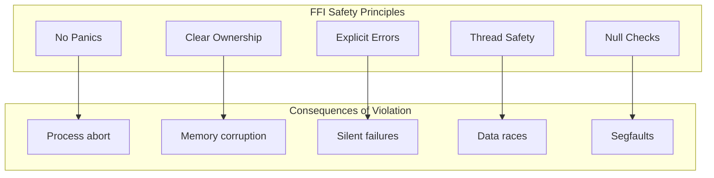
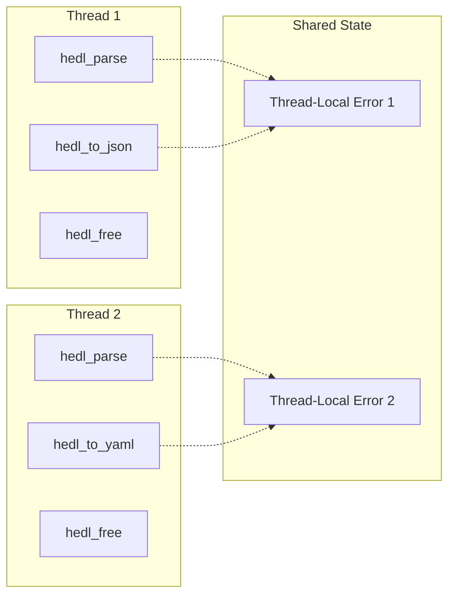

# How to Write FFI Bindings: Bridging Rust and the World

Your library is written in Rust. It is fast, safe, and elegant. But your users write C. Or Python. Or C++. They cannot call your Rust functions directly. Between your code and theirs lies the FFI boundary: a treacherous zone where Rust's safety guarantees vanish and a single mistake can corrupt memory.

Writing FFI bindings is an exercise in translation. You must express Rust concepts in a language that predates ownership, lifetimes, and Result types. The challenge is preserving safety while exposing functionality. Get it right, and your library becomes accessible to every language that can call C. Get it wrong, and you create segfaults waiting to happen.

This guide teaches you to cross that boundary safely. You will learn to design C-compatible APIs, handle errors without panicking, and manage memory explicitly. By the end, you will have bindings that are both safe and ergonomic.

---

## Goal

Create safe, idiomatic C-compatible FFI bindings that expose HEDL functionality to C, C++, and other FFI-compatible languages.

## Prerequisites

- Understanding of HEDL's Rust API
- Basic knowledge of C memory management
- Familiarity with `unsafe` Rust

---

## Core Principles

FFI is inherently unsafe. Every function crosses the boundary where Rust cannot protect you. These principles minimize risk:



1. **No panics across FFI**: A panic in FFI is undefined behavior. Catch all panics.
2. **Clear ownership**: Every pointer is either borrowed (caller frees) or owned (provide free function).
3. **Explicit errors**: Return error codes. Set retrievable error messages.
4. **Thread safety**: Document thread safety. Use thread-local storage for errors.
5. **Null checks**: Every pointer parameter must be validated before use.

---

## The HEDL FFI Architecture

HEDL's FFI lives in `crates/hedl-ffi/`:

```
crates/hedl-ffi/
├── src/
│   ├── lib.rs                 # FFI entry points
│   ├── parsing.rs             # Parse functions
│   ├── operations.rs          # Document operations
│   ├── conversions/           # Format conversion
│   │   ├── mod.rs
│   │   ├── to_formats.rs      # HEDL to JSON/YAML/etc.
│   │   └── to_formats_callback.rs
│   ├── error.rs               # Error handling
│   ├── memory.rs              # Memory management
│   └── types.rs               # Type definitions
├── hedl.h                     # C header
└── tests/
    └── ffi_tests.rs           # FFI tests
```

---

## The FFI Function Pattern

Every FFI function follows the same structure:

```rust
use std::ffi::{c_char, c_int};
use std::ptr;

/// Parse a HEDL document from UTF-8 text.
///
/// # Safety
///
/// - `input` must be a valid pointer to UTF-8 text
/// - `input_len` must be -1 (null-terminated) or exact byte length
/// - `out_doc` must be a valid pointer to receive the result
///
/// # Returns
///
/// - `HEDL_OK` (0) on success, `*out_doc` contains valid handle
/// - Negative error code on failure, error retrievable via `hedl_get_last_error`
#[no_mangle]
pub unsafe extern "C" fn hedl_parse(
    input: *const c_char,
    input_len: c_int,
    strict: c_int,
    out_doc: *mut *mut HedlDocument,
) -> c_int {
    // 1. Validate pointers
    if input.is_null() {
        set_error("input pointer is null");
        return HEDL_ERR_NULL_PTR;
    }
    if out_doc.is_null() {
        set_error("output pointer is null");
        return HEDL_ERR_NULL_PTR;
    }

    // 2. Catch panics
    let result = std::panic::catch_unwind(|| {
        // 3. Convert C types to Rust types
        let input_slice = if input_len < 0 {
            std::ffi::CStr::from_ptr(input).to_bytes()
        } else {
            std::slice::from_raw_parts(input as *const u8, input_len as usize)
        };

        // 4. Call Rust implementation
        hedl_core::parse(input_slice)
    });

    // 5. Handle result
    match result {
        Ok(Ok(doc)) => {
            // Success: box and return pointer
            let boxed = Box::new(HedlDocument { inner: doc });
            *out_doc = Box::into_raw(boxed);
            HEDL_OK
        }
        Ok(Err(e)) => {
            // Parse error: set message
            *out_doc = ptr::null_mut();
            set_error(&e.to_string());
            HEDL_ERR_PARSE
        }
        Err(_) => {
            // Panic caught
            *out_doc = ptr::null_mut();
            set_error("internal panic during parsing");
            HEDL_ERR_INTERNAL
        }
    }
}
```

---

## Error Handling

Errors in FFI use two mechanisms: return codes and retrievable messages.

### Error Codes

Define error codes in both Rust and C:

```rust
// Rust (types.rs)
pub const HEDL_OK: c_int = 0;
pub const HEDL_ERR_NULL_PTR: c_int = -1;
pub const HEDL_ERR_INVALID_UTF8: c_int = -2;
pub const HEDL_ERR_PARSE: c_int = -3;
pub const HEDL_ERR_INTERNAL: c_int = -4;
pub const HEDL_ERR_JSON: c_int = -5;
pub const HEDL_ERR_YAML: c_int = -6;
pub const HEDL_ERR_XML: c_int = -7;
pub const HEDL_ERR_CSV: c_int = -8;
```

```c
// C (hedl.h)
#define HEDL_OK               0
#define HEDL_ERR_NULL_PTR    -1
#define HEDL_ERR_INVALID_UTF8 -2
#define HEDL_ERR_PARSE       -3
#define HEDL_ERR_INTERNAL    -4
#define HEDL_ERR_JSON        -5
#define HEDL_ERR_YAML        -6
#define HEDL_ERR_XML         -7
#define HEDL_ERR_CSV         -8
```

### Thread-Local Error Messages

Use thread-local storage for error messages:

```rust
// error.rs
use std::cell::RefCell;
use std::ffi::{c_char, CString};

thread_local! {
    static LAST_ERROR: RefCell<Option<CString>> = RefCell::new(None);
}

pub fn set_error(msg: &str) {
    LAST_ERROR.with(|e| {
        *e.borrow_mut() = CString::new(msg).ok();
    });
}

pub fn clear_error() {
    LAST_ERROR.with(|e| {
        *e.borrow_mut() = None;
    });
}

/// Get the last error message.
///
/// Returns null if no error. The pointer is valid until the next
/// FFI call on this thread.
#[no_mangle]
pub extern "C" fn hedl_get_last_error() -> *const c_char {
    LAST_ERROR.with(|e| {
        e.borrow()
            .as_ref()
            .map(|s| s.as_ptr())
            .unwrap_or(std::ptr::null())
    })
}
```

---

## Memory Management

Memory in FFI requires explicit management. Every allocation needs a corresponding free function.

### Opaque Types

Hide Rust implementation details behind opaque types:

```rust
// Rust
#[repr(C)]
pub struct HedlDocument {
    inner: hedl_core::Document,
}
```

```c
// C header (only forward declaration)
typedef struct HedlDocument HedlDocument;
```

C code cannot access `inner`. It can only hold pointers and pass them to your functions.

### Ownership Transfer

Use `Box` for heap-allocated values:

```rust
/// Allocate: Rust creates, caller owns
fn allocate_document(doc: Document) -> *mut HedlDocument {
    let boxed = Box::new(HedlDocument { inner: doc });
    Box::into_raw(boxed)
}

/// Free: caller returns ownership, Rust destroys
#[no_mangle]
pub unsafe extern "C" fn hedl_free_document(doc: *mut HedlDocument) {
    if !doc.is_null() {
        drop(Box::from_raw(doc));
    }
}
```

### String Allocation

Strings require careful handling:

```rust
/// Allocate: create C string from Rust string
fn allocate_string(s: &str) -> *mut c_char {
    match CString::new(s) {
        Ok(cs) => cs.into_raw(),
        Err(_) => std::ptr::null_mut(),
    }
}

/// Free: caller returns C string for deallocation
#[no_mangle]
pub unsafe extern "C" fn hedl_free_string(s: *mut c_char) {
    if !s.is_null() {
        drop(CString::from_raw(s));
    }
}
```

---

## The C Header

The header declares your API to C code:

```c
// hedl.h
#ifndef HEDL_H
#define HEDL_H

#include <stdint.h>

#ifdef __cplusplus
extern "C" {
#endif

// Error codes
#define HEDL_OK               0
#define HEDL_ERR_NULL_PTR    -1
#define HEDL_ERR_INVALID_UTF8 -2
#define HEDL_ERR_PARSE       -3
#define HEDL_ERR_INTERNAL    -4
#define HEDL_ERR_JSON        -5
#define HEDL_ERR_YAML        -6
#define HEDL_ERR_XML         -7
#define HEDL_ERR_CSV         -8

// Opaque types
typedef struct HedlDocument HedlDocument;

// Error handling
const char* hedl_get_last_error(void);

// Parsing
int hedl_parse(
    const char* input,
    int input_len,          // -1 for null-terminated
    int strict,             // non-zero for strict mode
    HedlDocument** out_doc
);

// Conversion
int hedl_to_json(
    HedlDocument* doc,
    int include_metadata,
    char** out_json
);

int hedl_to_yaml(HedlDocument* doc, char** out_yaml);
int hedl_to_xml(HedlDocument* doc, int include_metadata, char** out_xml);
int hedl_to_csv(HedlDocument* doc, char** out_csv);

// Memory management
void hedl_free_document(HedlDocument* doc);
void hedl_free_string(char* str);

#ifdef __cplusplus
}
#endif

#endif // HEDL_H
```

---

## Using the FFI from C

Here is complete C code using the FFI:

```c
#include "hedl.h"
#include <stdio.h>
#include <stdlib.h>

int main() {
    // HEDL document to parse
    const char* hedl_text =
        "%V:2.0\n"
        "%NULL:~\n"
        "%QUOTE:\"\n"
        "%S:User:[id,name,email]\n"
        "---\n"
        "users: @User\n"
        " |u1,Alice,alice@example.com\n"
        " |u2,Bob,bob@example.com\n";

    HedlDocument* doc = NULL;
    char* json = NULL;

    // Parse the document
    int result = hedl_parse(hedl_text, -1, 1, &doc);
    if (result != HEDL_OK) {
        fprintf(stderr, "Parse error: %s\n", hedl_get_last_error());
        return 1;
    }

    printf("Parsed successfully!\n");

    // Convert to JSON
    result = hedl_to_json(doc, 0, &json);
    if (result != HEDL_OK) {
        fprintf(stderr, "JSON conversion error: %s\n", hedl_get_last_error());
        hedl_free_document(doc);
        return 1;
    }

    printf("JSON output:\n%s\n", json);

    // Clean up (order matters!)
    hedl_free_string(json);
    hedl_free_document(doc);

    return 0;
}
```

Compile and link:

```bash
# Build the Rust library
cd crates/hedl-ffi
cargo build --release

# Compile C program
gcc -o example example.c \
    -I. \
    -L../../target/release \
    -lhedl_ffi \
    -lpthread -ldl -lm

# Run (set library path on Linux)
LD_LIBRARY_PATH=../../target/release ./example
```

---

## Thread Safety

FFI functions can be called from multiple threads. Design accordingly:



### Thread-Local Errors

Each thread has independent error state:

```c
#include <pthread.h>

void* worker(void* arg) {
    const char* input = (const char*)arg;
    HedlDocument* doc = NULL;

    int result = hedl_parse(input, -1, 1, &doc);
    if (result != HEDL_OK) {
        // This error is for THIS thread only
        fprintf(stderr, "[Thread %ld] Error: %s\n",
                pthread_self(), hedl_get_last_error());
        return NULL;
    }

    // Process document...
    hedl_free_document(doc);
    return (void*)1;
}

int main() {
    pthread_t threads[4];
    const char* inputs[4] = { /* ... */ };

    for (int i = 0; i < 4; i++) {
        pthread_create(&threads[i], NULL, worker, (void*)inputs[i]);
    }

    for (int i = 0; i < 4; i++) {
        pthread_join(threads[i], NULL);
    }

    return 0;
}
```

### Document Handle Safety

Document handles are NOT thread-safe. Each thread must manage its own:

```c
// WRONG: sharing document between threads
HedlDocument* shared_doc;
// Thread 1: hedl_to_json(shared_doc, ...) // Race condition!
// Thread 2: hedl_to_yaml(shared_doc, ...) // Race condition!

// CORRECT: each thread has own document
void* worker(void* arg) {
    HedlDocument* my_doc = NULL;
    hedl_parse(arg, -1, 1, &my_doc);  // Thread-local document
    // ... use my_doc safely ...
    hedl_free_document(my_doc);
}
```

---

## Testing FFI Bindings

Test from Rust using raw FFI calls:

```rust
#[cfg(test)]
mod tests {
    use super::*;
    use std::ffi::{CStr, CString};
    use std::ptr;

    #[test]
    fn test_parse_valid_document() {
        unsafe {
            let input = CString::new(
                "%V:2.0\n%NULL:~\n%QUOTE:\"\n---\nname: Alice\nage: 30"
            ).unwrap();
            let mut doc: *mut HedlDocument = ptr::null_mut();

            let result = hedl_parse(input.as_ptr(), -1, 1, &mut doc);

            assert_eq!(result, HEDL_OK);
            assert!(!doc.is_null());

            hedl_free_document(doc);
        }
    }

    #[test]
    fn test_parse_invalid_returns_error() {
        unsafe {
            let input = CString::new("not valid hedl").unwrap();
            let mut doc: *mut HedlDocument = ptr::null_mut();

            let result = hedl_parse(input.as_ptr(), -1, 1, &mut doc);

            assert_eq!(result, HEDL_ERR_PARSE);
            assert!(doc.is_null());

            // Error message should be available
            let error = hedl_get_last_error();
            assert!(!error.is_null());
            let error_str = CStr::from_ptr(error).to_string_lossy();
            assert!(!error_str.is_empty());
        }
    }

    #[test]
    fn test_null_pointer_handling() {
        unsafe {
            let mut doc: *mut HedlDocument = ptr::null_mut();

            // Null input should fail gracefully
            let result = hedl_parse(ptr::null(), -1, 1, &mut doc);
            assert_eq!(result, HEDL_ERR_NULL_PTR);

            // Null output should fail gracefully
            let input = CString::new("test").unwrap();
            let result = hedl_parse(input.as_ptr(), -1, 1, ptr::null_mut());
            assert_eq!(result, HEDL_ERR_NULL_PTR);
        }
    }

    #[test]
    fn test_conversion_to_json() {
        unsafe {
            let input = CString::new(
                "%V:2.0\n%NULL:~\n%QUOTE:\"\n---\nname: Alice"
            ).unwrap();
            let mut doc: *mut HedlDocument = ptr::null_mut();
            let mut json: *mut c_char = ptr::null_mut();

            hedl_parse(input.as_ptr(), -1, 1, &mut doc);
            let result = hedl_to_json(doc, 0, &mut json);

            assert_eq!(result, HEDL_OK);
            assert!(!json.is_null());

            let json_str = CStr::from_ptr(json).to_string_lossy();
            assert!(json_str.contains("Alice"));

            hedl_free_string(json);
            hedl_free_document(doc);
        }
    }
}
```

Run tests:

```bash
cargo test -p hedl-ffi
```

---

## Common Pitfalls

### Forgetting to Free Memory

Every allocation needs a free:

```c
// Memory leak!
char* json;
hedl_to_json(doc, 0, &json);
// ... use json ...
// Forgot: hedl_free_string(json);

// Correct
char* json;
hedl_to_json(doc, 0, &json);
// ... use json ...
hedl_free_string(json);
```

### Using Freed Memory

Access after free is undefined behavior:

```c
// Use after free!
hedl_free_document(doc);
hedl_to_json(doc, 0, &json);  // doc is invalid!

// Correct: use before free
hedl_to_json(doc, 0, &json);
hedl_free_document(doc);
```

### Ignoring Error Codes

Always check return values:

```c
// Dangerous: ignoring error
hedl_parse(input, -1, 1, &doc);
hedl_to_json(doc, 0, &json);  // doc might be NULL!

// Correct: check errors
if (hedl_parse(input, -1, 1, &doc) != HEDL_OK) {
    // Handle error
    return;
}
```

---

## Verification

Ensure your bindings work correctly:

```bash
# Run Rust tests
cargo test -p hedl-ffi

# Build the library
cargo build -p hedl-ffi --release

# Run with AddressSanitizer (catches memory errors)
RUSTFLAGS="-Z sanitizer=address" cargo test -p hedl-ffi

# Generate and verify the header
cbindgen --config cbindgen.toml --crate hedl-ffi --output hedl_generated.h
diff hedl.h hedl_generated.h
```

---

## Related Documentation

- **[API Design Guidelines](../guides/api-design.md)**: Design principles
- **[hedl-ffi README](../../../crates/hedl-ffi/README.md)**: Crate documentation
- **[C bindings documentation](../../bindings/c/README.md)**: User guide for C developers
