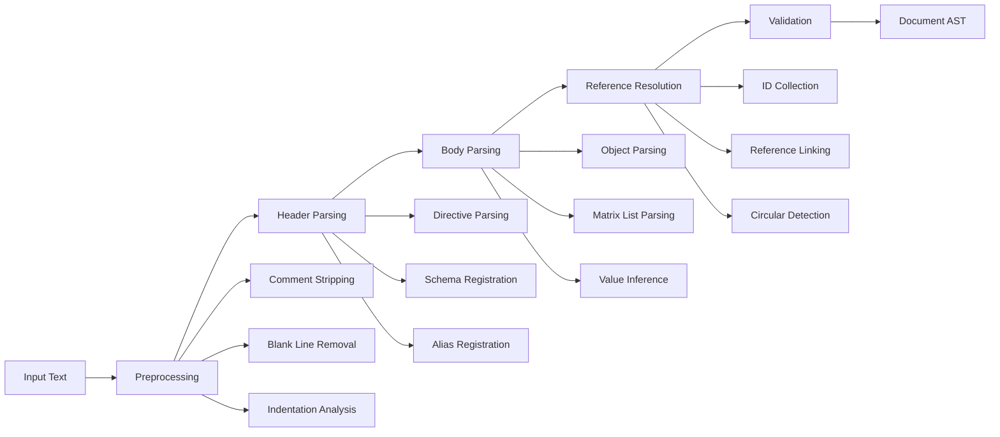

# HEDL Internals

Deep dive into the core concepts, algorithms, and implementation details of HEDL.

## Table of Contents

1. [Parsing Pipeline](#parsing-pipeline)
2. [Abstract Syntax Tree (AST)](#abstract-syntax-tree-ast)
3. [Lexical Analysis](#lexical-analysis)
4. [Type Inference](#type-inference)
5. [Reference Resolution](#reference-resolution)
6. [Schema System](#schema-system)
7. [Memory Management](#memory-management)
8. [Error Handling](#error-handling)
9. [Security & Resource Limits](#security--resource-limits)
10. [Performance Optimizations](#performance-optimizations)

---

## Parsing Pipeline

HEDL parsing follows a multi-stage pipeline:



### Stage 1: Preprocessing

**Purpose**: Normalize input and prepare for parsing

```rust
fn preprocess(input: &str) -> Vec<&str> {
    input
        .lines()
        .filter(|line| !is_blank_line(line) && !is_comment_line(line))
        .map(|line| strip_comment(line))
        .collect()
}
```

**Operations**:
1. Remove blank lines (whitespace only)
2. Remove comment lines (lines starting with `#`)
3. Strip inline comments (everything after `#` on a line)
4. Preserve original line numbers for error reporting

### Stage 2: Header Parsing

**Purpose**: Process directives and build registries

```rust
struct HeaderParser {
    schemas: HashMap<String, Schema>,      // Type definitions
    aliases: HashMap<String, String>,      // Constant substitutions
    version: Option<String>,               // Document version
    metadata: HashMap<String, String>,     // Custom metadata
}
```

**Directives**:
- `%VERSION: 1.0` - Document version
- `%STRUCT: Type: [col1, col2, ...]` - Schema definition
- `%ALIAS: %name: "value"` - Constant definition
- `%NEST: Parent > Child` - Hierarchy definition

### Stage 3: Body Parsing

**Purpose**: Parse hierarchical data structures

```rust
fn parse_body(
    lines: &[(usize, &str)],
    header: &Header,
    limits: &Limits,
) -> HedlResult<BTreeMap<String, Item>> {
    // Parse root items
    let mut root = BTreeMap::new();

    // Parse recursively based on indentation
    parse_items(&mut root, lines, 0, header, limits)?;

    Ok(root)
}
```

**Parsing Logic**:
1. Track current indentation level
2. Detect object vs. matrix list entries
3. Parse key-value pairs
4. Recursively parse children at deeper indentation
5. Build AST nodes

### Stage 4: Reference Resolution

**Purpose**: Link references to their target nodes

```rust
fn resolve_references(doc: &Document, strict: bool) -> HedlResult<()> {
    // Phase 1: Collect all IDs from matrix lists
    let registry = collect_ids(&doc)?;

    // Phase 2: Validate references
    for item in doc.root.values() {
        validate_references_in_item(item, &registry, strict)?;
    }

    Ok(())
}
```

**Algorithm**:
1. **ID Collection**: Walk AST, collect all IDs with their type names
2. **Reference Parsing**: Parse `@id` or `@Type:id` references
3. **Lookup**: Find target node in registry
4. **Linking**: Store reference to target node
5. **Validation**: Detect circular references, dangling references

### Stage 5: Validation

**Purpose**: Enforce schema and semantic rules

```rust
fn validate(doc: &Document, options: &ParseOptions) -> HedlResult<()> {
    // Reference validation
    resolve_references(doc, options.strict_refs)?;

    // Limit validation happens during parsing
    // Additional semantic validation can be added here

    Ok(())
}
```

---

## Abstract Syntax Tree (AST)

The AST represents a parsed HEDL document in memory.

### Core Data Structures

```rust
/// Top-level document
pub struct Document {
    pub version: (u32, u32),
    pub aliases: BTreeMap<String, String>,
    pub structs: BTreeMap<String, Vec<String>>,
    pub nests: BTreeMap<String, String>,
    pub root: BTreeMap<String, Item>,
}

/// An item in the document body
pub enum Item {
    Scalar(Value),
    Object(BTreeMap<String, Item>),
    List(MatrixList),
}

/// Typed matrix list
pub struct MatrixList {
    pub type_name: String,
    pub schema: Vec<String>,
    pub rows: Vec<Node>,
}

/// A row/entity in a matrix list
pub struct Node {
    pub type_name: String,
    pub id: String,
    pub fields: Vec<Value>,
    pub children: BTreeMap<String, Vec<Node>>,
}
```

### Value Types

```rust
pub enum Value {
    Null,
    Bool(bool),
    Int(i64),
    Float(f64),
    String(String),
    Tensor(Tensor),
    Reference(Reference),
    Expression(Expression),
}
```

### AST Invariants

**Guaranteed Properties**:
1. All IDs are unique within their type namespace
2. All references point to existing nodes
3. Matrix lists conform to their schema
4. Indentation correctly represents hierarchy
5. No circular references (configurable)

---

## Lexical Analysis

Lexical analysis converts text into tokens and validates syntax.

### Token Types

```rust
pub enum Token<'a> {
    /// Key token (alphanumeric + underscore)
    Key(&'a str),

    /// Type name (PascalCase)
    TypeName(&'a str),

    /// ID token (unique identifier)
    Id(&'a str),

    /// Reference (@id or @Type:id)
    Reference { type_name: Option<&'a str>, id: &'a str },

    /// CSV row (| val1, val2, ...)
    CsvRow(Vec<CsvField<'a>>),

    /// Tensor literal ([1, 2, 3])
    Tensor(Tensor),

    /// Expression ($(expr))
    Expression(&'a str),
}
```

### Validation Rules

**Key Tokens**:
```rust
fn is_valid_key_token(s: &str) -> bool {
    if s.is_empty() {
        return false;
    }

    // First char: letter or underscore
    let first = s.chars().next().unwrap();
    if !first.is_alphabetic() && first != '_' {
        return false;
    }

    // Remaining: alphanumeric or underscore
    s.chars().skip(1).all(|c| c.is_alphanumeric() || c == '_')
}
```

**Type Names**:
```rust
fn is_valid_type_name(s: &str) -> bool {
    if s.is_empty() {
        return false;
    }

    // Must start with uppercase letter
    let first = s.chars().next().unwrap();
    if !first.is_uppercase() {
        return false;
    }

    // PascalCase: alphanumeric only
    s.chars().all(|c| c.is_alphanumeric())
}
```

**References**:
```rust
fn parse_reference(s: &str) -> Result<Reference, LexError> {
    if !s.starts_with('@') {
        return Err(LexError::InvalidReference);
    }

    let rest = &s[1..];

    // Check for @Type:id format
    if let Some(colon_pos) = rest.find(':') {
        let type_name = &rest[..colon_pos];
        let id = &rest[colon_pos + 1..];

        if !is_valid_type_name(type_name) {
            return Err(LexError::InvalidTypeName);
        }

        Ok(Reference {
            type_name: Some(type_name),
            id,
        })
    } else {
        // Unqualified reference @id
        Ok(Reference {
            type_name: None,
            id: rest,
        })
    }
}
```

### Indentation Handling

HEDL uses strict 2-space indentation:

```rust
fn calculate_indent(line: &str) -> usize {
    line.chars().take_while(|&c| c == ' ').count()
}

fn validate_indent(indent: usize) -> Result<(), LexError> {
    // Must be multiple of 2
    if indent % 2 != 0 {
        return Err(LexError::InvalidIndentation {
            found: indent,
            expected: "multiple of 2",
        });
    }

    Ok(())
}
```

### CSV Row Parsing

Matrix list rows use CSV-like syntax:

```rust
fn parse_csv_row(s: &str) -> Result<Vec<CsvField>, LexError> {
    if !s.starts_with('|') {
        return Err(LexError::InvalidCsvRow);
    }

    let rest = s[1..].trim();
    let mut fields = Vec::new();
    let mut current = String::new();
    let mut in_quotes = false;

    for ch in rest.chars() {
        match ch {
            '"' => in_quotes = !in_quotes,
            ',' if !in_quotes => {
                fields.push(parse_field(&current)?);
                current.clear();
            }
            _ => current.push(ch),
        }
    }

    if !current.is_empty() {
        fields.push(parse_field(&current)?);
    }

    Ok(fields)
}
```

---

## Type Inference

HEDL automatically infers types for scalar values.

### Inference Ladder

Values are inferred in this order:

```rust
fn infer_value(s: &str) -> Value {
    let trimmed = s.trim();

    // 1. Null
    if trimmed == "null" || trimmed.is_empty() {
        return Value::Null;
    }

    // 2. Boolean
    if trimmed == "true" {
        return Value::Bool(true);
    }
    if trimmed == "false" {
        return Value::Bool(false);
    }

    // 3. Integer
    if let Ok(i) = trimmed.parse::<i64>() {
        return Value::Int(i);
    }

    // 4. Float
    if let Ok(f) = trimmed.parse::<f64>() {
        return Value::Float(f);
    }

    // 5. Reference
    if trimmed.starts_with('@') {
        if let Ok(r) = parse_reference(trimmed) {
            return Value::Reference(r);
        }
    }

    // 6. Tensor
    if trimmed.starts_with('[') && trimmed.ends_with(']') {
        if let Ok(t) = parse_tensor(trimmed) {
            return Value::Tensor(t);
        }
    }

    // 7. Expression
    if trimmed.starts_with("$(") && trimmed.ends_with(')') {
        return Value::Expression(trimmed[2..trimmed.len()-1].to_string());
    }

    // 8. String (fallback)
    Value::String(trimmed.to_string())
}
```

### Quoted Values

Quoted values are always strings:

```rust
fn infer_quoted_value(s: &str) -> Value {
    // Strip quotes
    if s.starts_with('"') && s.ends_with('"') {
        let content = &s[1..s.len() - 1];
        return Value::String(unescape(content));
    }

    // Not quoted, use normal inference
    infer_value(s)
}

fn unescape(s: &str) -> String {
    s.replace("\\\"", "\"")
     .replace("\\n", "\n")
     .replace("\\t", "\t")
     .replace("\\\\", "\\")
}
```

---

## Reference Resolution

References create a graph structure.

### Two-Phase Algorithm

**Phase 1: Collect IDs**

```rust
struct TypeRegistry {
    // Type name -> (ID -> Node)
    types: HashMap<String, HashMap<String, NodeRef>>,
}

fn collect_ids(node: &Node, registry: &mut TypeRegistry) {
    if let (Some(id), Some(type_name)) = (&node.id, &node.type_name) {
        registry.register(type_name.clone(), id.clone(), node);
    }

    for child in &node.children {
        collect_ids(child, registry);
    }
}
```

**Phase 2: Resolve References**

```rust
fn resolve_references(
    node: &mut Node,
    registry: &TypeRegistry
) -> Result<()> {
    for value in node.values_mut() {
        if let Value::Reference(ref_str) = value {
            let target = registry.lookup(ref_str)?;
            // Store resolved reference
            *value = Value::Reference(Reference::Resolved(target));
        }
    }

    for child in node.children_mut() {
        resolve_references(child, registry)?;
    }

    Ok(())
}
```

### Reference Lookup

```rust
impl TypeRegistry {
    fn lookup(&self, reference: &Reference) -> Result<&Node> {
        match &reference.type_name {
            // Qualified: @Type:id
            Some(type_name) => {
                let type_map = self.types.get(type_name)
                    .ok_or(ReferenceError::UnknownType)?;

                type_map.get(&reference.id)
                    .ok_or(ReferenceError::UnknownId)
            }

            // Unqualified: @id
            None => {
                // Search all types for matching ID
                let mut matches = Vec::new();

                for type_map in self.types.values() {
                    if let Some(node) = type_map.get(&reference.id) {
                        matches.push(node);
                    }
                }

                match matches.len() {
                    0 => Err(ReferenceError::UnknownId),
                    1 => Ok(matches[0]),
                    _ => Err(ReferenceError::AmbiguousReference),
                }
            }
        }
    }
}
```

### Circular Reference Detection

```rust
fn detect_cycles(
    doc: &Document,
    visited: &mut HashSet<String>,
) -> HedlResult<()> {
    // Walk all matrix lists
    for item in doc.root.values() {
        if let Item::List(list) = item {
            for node in &list.rows {
                check_reference_cycle(node, &node.id, visited)?;
            }
        }
    }
    Ok(())
}
```

---

## Schema System

Schemas define structure for matrix lists.

### Schema Definition

```rust
pub struct Schema {
    /// Type name
    pub name: String,

    /// Ordered column names
    pub columns: Vec<String>,

    /// Optional column types (for validation)
    pub column_types: Option<Vec<Type>>,
}
```

### Schema Registration

```hedl
%VERSION: 1.0
%STRUCT: User: [id, name, email, age]
---
```

Parsed as:
```rust
Schema {
    name: "User".to_string(),
    columns: vec![
        "id".to_string(),
        "name".to_string(),
        "email".to_string(),
        "age".to_string(),
    ],
    column_types: None,
}
```

### Schema Validation

```rust
fn validate_matrix_row(
    row: &[Value],
    schema: &Schema
) -> Result<()> {
    // Check column count
    if row.len() != schema.columns.len() {
        return Err(SchemaError::ColumnMismatch {
            expected: schema.columns.len(),
            found: row.len(),
        });
    }

    // Check column types (if specified)
    if let Some(types) = &schema.column_types {
        for (i, (value, expected_type)) in row.iter().zip(types).enumerate() {
            let actual_type = value.type_of();
            if actual_type != *expected_type {
                return Err(SchemaError::TypeMismatch {
                    column: schema.columns[i].clone(),
                    expected: expected_type.clone(),
                    actual: actual_type,
                });
            }
        }
    }

    Ok(())
}
```

---

## Memory Management

HEDL uses various strategies to minimize memory usage and optimize allocation patterns.

### Efficient String Handling

The AST currently uses owned `String` types for simplicity and safety across thread boundaries and format conversions. 

### Pre-allocation

HEDL optimizes collection growth by pre-allocating capacity where possible:

```rust
// Pre-allocate fields vector with exact schema size
let mut fields = Vec::with_capacity(schema.len());
```

### Efficient Data Structures

- `BTreeMap` for sorted keys (ensures deterministic output for canonicalization)
- `Vec` for children and rows (contiguous memory for efficient iteration)

---

## Error Handling

Comprehensive error types with source locations.

### Error Types

```rust
/// Main error type for all HEDL operations.
pub struct HedlError {
    pub kind: HedlErrorKind,
    pub message: String,
    pub line: usize,
    pub column: Option<usize>,
    pub context: Option<String>,
}

/// Error category enumeration.
pub enum HedlErrorKind {
    Syntax,       // Lexical or structural violation
    Version,      // Unsupported version
    Schema,       // Schema violation or mismatch
    Alias,        // Duplicate or invalid alias
    Shape,        // Wrong number of cells in row
    Semantic,     // Logical error
    OrphanRow,    // Child row without NEST rule
    Collision,    // Duplicate ID within type
    Reference,    // Unresolved reference
    Security,     // Security limit exceeded
    Conversion,   // Format conversion error
    IO,           // I/O error
}
```

---

## Performance Optimizations

### SIMD for String Scanning

HEDL utilizes the `memchr` crate for SIMD-optimized byte searching in critical paths like comment stripping and delimiter detection.

### Parallel Processing

Independent documents and files can be processed in parallel using the `rayon` crate.

### Caching

Format converters use caching strategies, such as schema inference caching in `hedl-json`, to avoid redundant computations across large datasets.

---

**Next**: Apply this knowledge in [Testing](testing.md) and [Benchmarking](benchmarking.md)
